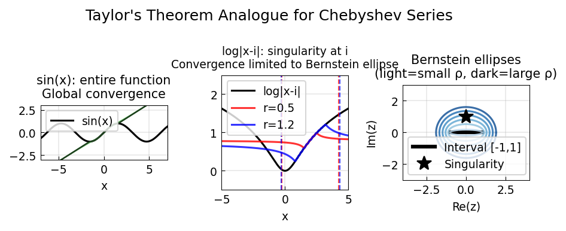

# Taylor's Theorem Analogue for Chebyshev Series

**Original:** [approx/TaylorsTheorem](https://www.chebfun.org/examples/temp/TaylorsTheorem.html)
**Author(s):** Hrothgar and Anthony Austin, February 2015

---

Taylor's theorem gives a polynomial approximation to a function in terms of
its derivatives at a point. For entire functions the Taylor series converges
everywhere; for a function analytic only near a point $x_0$, the series
converges in the disc of radius equal to the distance from $x_0$ to the
nearest singularity. Chebyshev series have an elegant analogue.

## Bernstein ellipses and the Joukowski map

For a function $f$ analytic on $[-1,1]$, the Chebyshev series converges in
the largest **Bernstein ellipse** in which $f$ is analytic. A Bernstein
ellipse is the image of a circle of radius $\rho$ under the Joukowski map

$$z \mapsto \frac{z + 1/z}{2}.$$

The inverse Joukowski map $z \mapsto z + \sqrt{z^2 - 1}$ converts ellipses
back to circles, making it easy to compute the ellipse parameter $\rho$.

## Convergence for an entire function

The function $f(x) = \sin(x)$ is entire, so its Chebyshev series converges
everywhere. Approximating $\sin$ on $[-\pi/2, \pi/2]$ with Chebyshev grids
of increasing density and extrapolating outside the interval shows that
the approximation improves uniformly over the whole real line as the grid
is refined.

## Convergence for a non-entire analytic function

The function $f(z) = \log|z - i|$ has a branch point at $z = i$. Chebyshev
approximation on the interval $[x_0 - r, x_0 + r]$ can only converge in
the corresponding Bernstein ellipse, whose extent depends on the distance
from the singularity to the (transplanted) interval.

A key observation is that **expanding the interval does not necessarily
improve extrapolation**. Increasing $r$ brings the singularity (after the
linear transplant to $[-1,1]$) closer to the interval, shrinking the
Bernstein ellipse. In the limit of extremely large intervals, the
singularity lies very close to $[-1,1]$, and the Chebyshev approximation
is useless outside the interval.

## Shrinking ellipses

Visualising the Bernstein ellipses for a series of increasingly large
intervals centred at $x_0 = 2$ confirms the phenomenon: darker ellipses
(larger intervals) are *smaller*, not larger. This is because the linear
rescaling $x \mapsto (x - x_0)/r$ moves the singularity at $z = i$ to
$(i - x_0)/r$, which approaches the real axis as $r \to \infty$.

## Code

```python
from examples.temp.taylors_theorem import run
run()
```

## Output



## References

1. L. N. Trefethen, *Approximation Theory and Approximation Practice*, SIAM, 2013.
