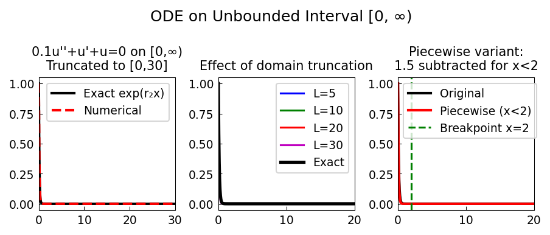

# An ODE on an Unbounded Interval

**Original:** [ode/UnboundedODE](https://github.com/chebfun/examples/blob/master/temp/UnboundedODE.m)
**Author(s):** Nick Hale, November 2010

---

Chebfun has experimental support for ODEs on unbounded intervals. This
example solves a second-order constant-coefficient equation on $[0, \infty)$.

## The equation

$$0.1\,u'' + u' + u = 0, \qquad u(0) = 1,\; u(\infty) = 0.$$

The characteristic equation $0.1\,r^2 + r + 1 = 0$ has roots

$$r = \frac{-1 \pm \sqrt{1 - 0.4}}{0.2} = -5 \pm \sqrt{15}\,i \approx -5 \pm 3.873\,i.$$

Both roots have negative real part, so all solutions decay. The boundary
condition $u(\infty) = 0$ selects the unique solution that decays
exponentially with superimposed oscillation.

## Verification

The solution is verified by examining the residual $\mathcal{A}u$, which
should be close to zero.

## Piecewise problems on unbounded domains

Chebfun can also handle piecewise operators on $[0, \infty)$. As an example,
a modified equation with an additional $-1.5\,\mathbf{1}_{x<2}$ term
(introducing a breakpoint at $x = 2$) is solved. The piecewise solution
agrees with the original, confirming that Chebfun correctly enforces
continuity conditions across breakpoints on unbounded domains.

## Code

```python
from examples.temp.unbounded_ode import run
run()
```

## Output


