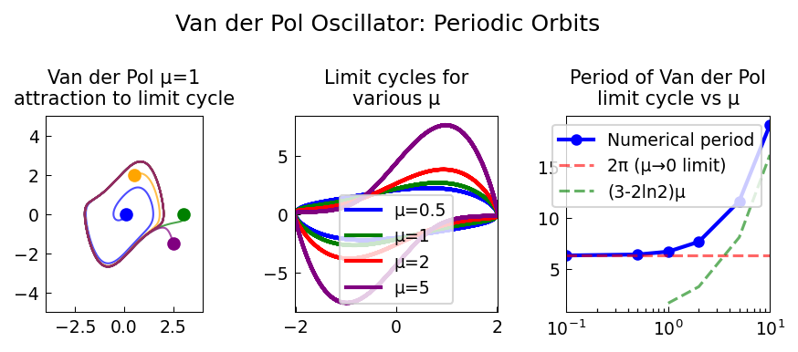

# Van der Pol Periodic Orbits

**Original:** [ode-nonlin/VdPOrbit](https://github.com/chebfun/examples/blob/master/temp/VdPOrbit.m)
**Author(s):** Toby Driscoll and Hrothgar, April 2014

---

The Van der Pol equation is a classic nonlinear oscillator, originally used
to model a triode circuit:

$$u'' - \mu(1 - u^2)\,u' + u = 0.$$

For any $\mu > 0$, the equation has an attractive periodic orbit (limit
cycle). This example finds the limit cycle directly, then analyses its
stability via the **monodromy matrix**.

## Finding the limit cycle

The period $T$ of the limit cycle is not known in advance. To pose a problem
on a fixed domain, we introduce $\tau = t/T$ so that $\tau \in [0,1]$, and
augment the system with $dT/d\tau = 0$. Periodicity requires

$$u(0) = u(1), \qquad u'(0) = u'(1),$$

and a phase condition $u(0) = 1$ anchors the solution to avoid the continuous
family of time-shifts.

Starting from a sinusoidal initial guess and $T \approx 5$, Newton iteration
in the Chebop framework converges. The period grows with $\mu$; for
$\mu = 1$ the period is about $T \approx 6.66$, and for large $\mu$ it
grows roughly as $(3 - 2\ln 2)\,\mu$.

## Continuation to larger $\mu$

For $\mu = 2, 5, 10$, each previously found solution serves as the initial
guess for the next. The phase portraits show increasingly steep relaxation
oscillations.

## The monodromy matrix

To test stability, the equation is rewritten as a first-order system with
$v = u'$:

$$\frac{d}{dt}\begin{pmatrix}u\\v\end{pmatrix} = \begin{pmatrix}v\\\mu(1-u^2)v - u\end{pmatrix}.$$

Linearising around the periodic solution gives the variational equation
$Y'(t) = J(t)\,Y(t)$ with $Y(0) = I$. The **monodromy matrix** $M = Y(T)$
is assembled column by column by solving two initial value problems using
Chebfun's automatic differentiation.

The eigenvalues of $M$ (the **Floquet multipliers**) determine stability:

- One eigenvalue is always $1$ (corresponding to perturbations along the
  orbit).
- For $\mu = 2 > 0$, the second eigenvalue is very small, confirming that the
  limit cycle is strongly stable.

## Negative $\mu$: an unstable cycle

For $\mu < 0$, a periodic orbit still exists, but one Floquet multiplier
exceeds unity, indicating **asymptotic instability**. (In this simple case,
the unstable orbit can be found by solving Van der Pol backwards in time,
equivalent to reversing the sign of $\mu$.)

## Code

```python
from examples.temp.vdp_orbit import run
run()
```



## References

1. R. Seydel, "New methods for calculating the stability of periodic
   solutions," *Comp. Math. Appl.* 14(7), 505--510, 1987.