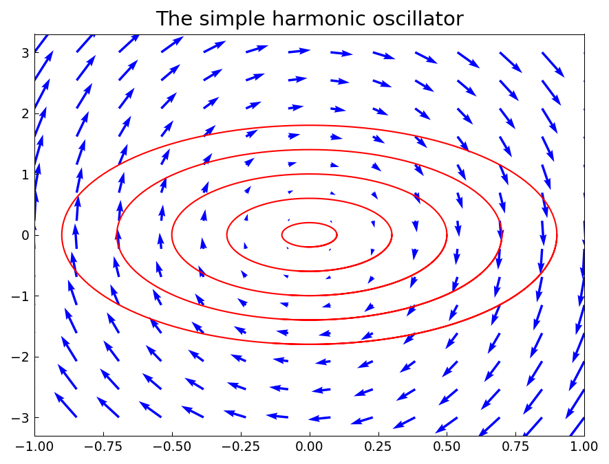
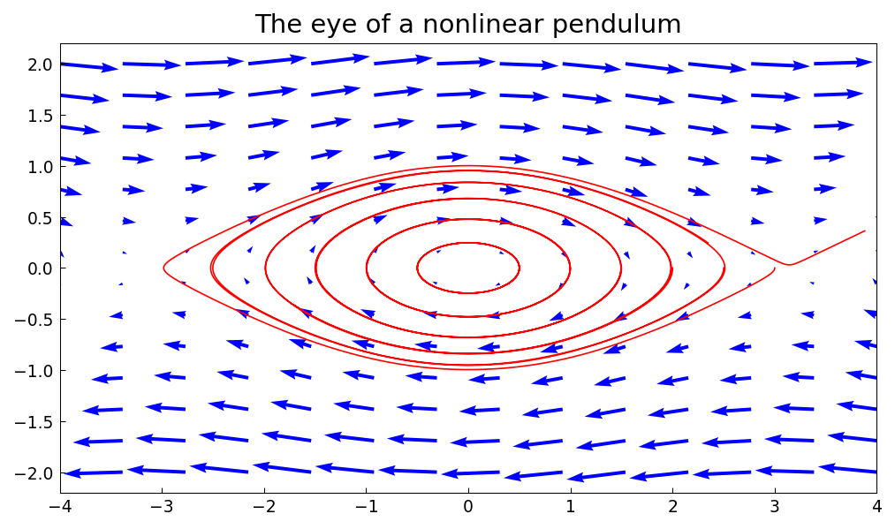
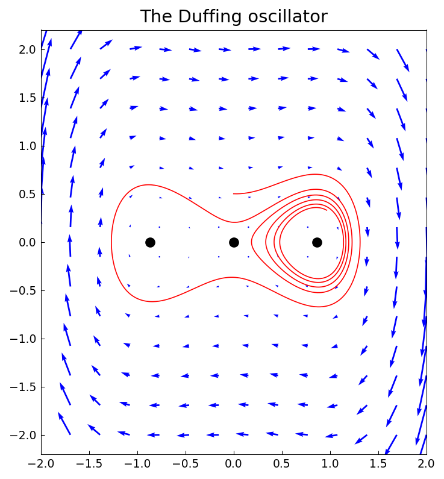

# Phase portraits and trajectories

*Alex Townsend, March 2013*

[Original MATLAB Chebfun example](https://www.chebfun.org/examples/veccalc/AutonomousSystems.html)

(Chebfun example veccalc/AutonomousSystems.m)

A chebfun2v is a natural representation of the right-hand side of an
autonomous system $\dot{x} = F_1(x,y),\ \dot{y} = F_2(x,y)$: the phase
portrait is drawn with `quiver` and trajectories are computed by RK45
integration of the field.  First, the simple harmonic oscillator
$\ddot{x} = -\omega^2 x$:

```python
import jax.numpy as jnp
import numpy as np
from scipy.integrate import solve_ivp
from chebfunjax.chebfun2d.chebfun2v import Chebfun2v

w = 2
F = Chebfun2v.from_functions(lambda x, y: y, lambda x, y: -w**2 * x,
                             domain=(-1, 1, -3, 3))
```



The nonlinear pendulum $\ddot{x} = -\sin(x)/4$ shows the classic "eye":



The damped Duffing oscillator
$\ddot{x} = -\delta \dot{x} - \beta x - \alpha x^3$ spirals into one of
its stable equilibria.  The critical points are the roots of the vector
field, computed with `roots`:

```python
d, a, b = 0.04, 1, -0.75
F = Chebfun2v.from_functions(
    lambda x, y: y, lambda x, y: -d*y - b*x - a*x**3,
    domain=(-2, 2, -2, 2))
r = F.roots()
```
```
r =
  -0.866025403784439                   0
   0.000000000000000                   0
   0.866025403784439                   0
```


