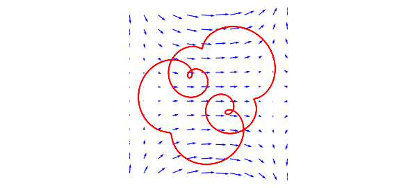

# Checking vector calculus

*Alex Townsend, March 2013*

[Original MATLAB Chebfun example](https://www.chebfun.org/examples/veccalc/CheckingVectorCalculus.html)

Python translation: [`examples/veccalc/checking_vector_calculus.py`](https://github.com/ma-gilles/chebfunjax/blob/main/examples/veccalc/checking_vector_calculus.py)

## Introduction

Chebfun2 is designed to work with vector valued functions defined on rectangles, as well as scalar valued ones. Our convention is to use a lower case letter for a scalar function, $f$, and an upper case letter for a vector function, $F = \left(f_1,f_2\right)^T$. Vector valued functions can be approximated by objects of type chebfun2v. There are two standard ways to make a chebfun2v:

```matlab
F = chebfun2v(@(x,y) sin(x), @(x,y) sin(y));     % direct construction

f = chebfun2(@(x,y) sin(x)); g = chebfun2(@(x,y) sin(y));
G = [f;g];                         % Concatenation of two chebfun2 objects
```

## The parallelogram Law

Vector addition, denoted $F + G$, yields another chebfun2v and is computed by adding the two scalar components together. It satisfies the parallelogram law, which can be verified numerically, as in this example:

```matlab
F = chebfun2v(@(x,y)cos(x.*y),@(x,y)sin(x.*y));
G = chebfun2v(@(x,y)x+y,@(x,y)1+x+y);
abs((2*norm(F)^2 + 2*norm(G)^2) - (norm(F+G)^2 + norm(F-G)^2))
```

```text
ans =
     7.105427357601002e-15
```

## The gradient theorem

The gradient of a chebfun2 is represented by a chebfun2v and is a vector that points in the direction of steepest ascent of $f$. The gradient theorem says that the integral of $\mathrm{grad}(f)$ over a curve only depends on the values of $f$ at the endpoints of that curve. We can check this numerically by using the Chebfun2v command `integral`. This command computes the line integral of a vector valued function. Here we check one example to confirm that the gradient theorem holds:

```matlab
f = chebfun2(@(x,y)sin(2*x)+x.*y.^2);        % chebfun2 object
F = grad(f);                                 % gradient (chebfun2v)
C = chebfun(@(t) t.*exp(100i*t),[0 pi/10]);  % spiral curve
v = integral(F,C); ends = f(pi/10,0)-f(0,0); % line integral
abs(v-ends)                                  % gradient theorem
```

```text
ans =
     1.110223024625157e-16
```

Another consequence of the gradient theorem is that the integral of $\mathrm{grad}(f)$ over any closed curve is zero. For example, here is an exotic closed curve, which we plot superimposed on the vector field $\mathrm{grad}(f)$.

```matlab
circ = @(p) chebfun(@(x) exp(2i*p*pi*x + 0.8i));
C = (circ(1) + circ(3)/1.5 + circ(8)/3.5) / 2;
figure('position', [0 0 600 400])
quiver(F,0.5,'numpts',12), hold on
plot(C, 'r'), axis equal off
```



Its integral should be zero.

```matlab
v = integral(F,C)
```

```text
v =
    -7.658402030891214e-16
```

## Curl of the gradient

If the chebfun2v $F$ describes a vector velocity field of fluid flow, then $\mathrm{curl}(F)$ is a scalar function equal to twice the angular speed of a particle in the flow at each point. A particle moving in a gradient field has zero angular speed and hence, $\mathrm{curl}(\mathrm{grad}(f))=0$, a well known identity that can also be checked numerically. For example,

```matlab
norm(curl(grad(f)))
```

```text
ans =
     2.510093227154464e-15
```

## More information

The code found in this Example can also be found in [1] along with additional information about vector calculus in Chebfun2.

## References

1. A. Townsend and L. N. Trefethen, An extension of Chebfun to two dimensions, *SIAM Journal on Scientific Computing*, 35 (2013), C495-C518.

---

*Translated with [chebfunjax](https://github.com/ma-gilles/chebfunjax); prose and MATLAB code from the original example, copyright The University of Oxford and The Chebfun Developers.  Printed outputs and figures are chebfunjax's.*
