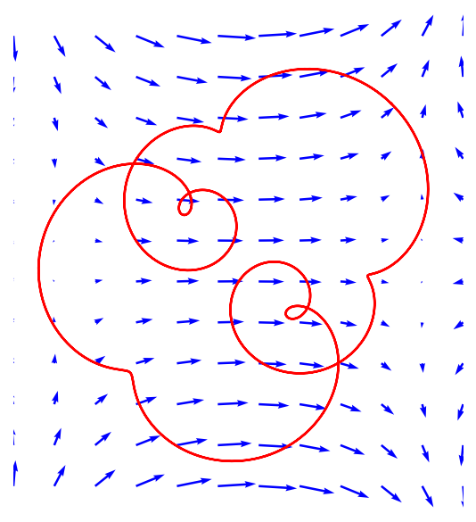

# Checking vector calculus

*Alex Townsend, March 2013*

[Original MATLAB Chebfun example](https://www.chebfun.org/examples/veccalc/CheckingVectorCalculus.html)

(Chebfun example veccalc/CheckingVectorCalculus.m)

Chebfun2v objects make it easy to check the identities of vector
calculus numerically.  First, the parallelogram law
$2\|F\|^2 + 2\|G\|^2 = \|F+G\|^2 + \|F-G\|^2$:

```python
import jax.numpy as jnp
import numpy as np
import chebfunjax as cj
from chebfunjax.chebfun2d.chebfun2 import chebfun2
from chebfunjax.chebfun2d.chebfun2v import Chebfun2v

F = Chebfun2v.from_functions(lambda x, y: jnp.cos(x * y),
                             lambda x, y: jnp.sin(x * y))
G = Chebfun2v.from_functions(lambda x, y: x + y,
                             lambda x, y: 1 + x + y)
abs((2 * F.norm()**2 + 2 * G.norm()**2)
    - ((F + G).norm()**2 + (F - G).norm()**2))
```
```
ans =
     0.000000000000000e+00
```

The gradient theorem says the line integral of $\nabla f$ along a curve
depends only on the endpoints.  We take a spiral curve represented as a
complex chebfun:

```python
f = chebfun2(lambda x, y: jnp.sin(2 * x) + x * y**2)
F = f.gradient()
C = cj.chebfun(lambda t: t * jnp.exp(100j * t), domain=[0, np.pi / 10])
v = F.integral(C)
abs(v - (f(np.pi / 10, 0) - f(0, 0)))
```
```
ans =
     8.881784197001252e-16
```

Around a closed curve, the integral of a gradient field vanishes:

```python
circ = lambda p: cj.chebfun(
    lambda x: jnp.exp(2j * p * np.pi * x + 0.8j))
C = (circ(1) + circ(3) / 1.5 + circ(8) / 3.5) / 2
v = F.integral(C)
```
```
v =
    4.648516706770933e-16
```



Finally, the curl of a gradient field is identically zero:

```python
F.curl()
```
```
ans =
     2.510093227154464e-15
```
