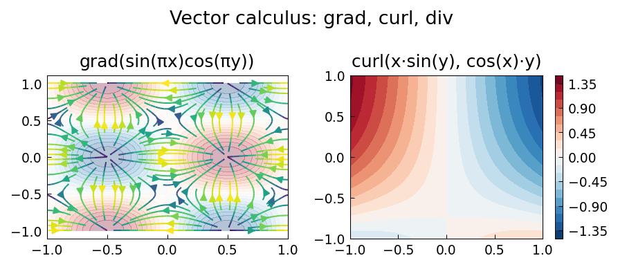

# Vector Calculus Examples

Chebfun2v and Chebfun3v represent 2D and 3D vector fields and support
all the classical vector calculus operations: gradient, divergence, curl,
and Laplacian.

---

## Verifying vector calculus identities

**Source:** `veccalc/CheckingVectorCalculus.m` — Trefethen, 2010

```python
import jax.numpy as jnp
import chebfunjax as cj

# Scalar potential
f = cj.chebfun2(lambda x, y: jnp.sin(jnp.pi*x) * jnp.cos(jnp.pi*y))

# Gradient field
F = f.grad()   # Returns Chebfun2v

# curl(grad(f)) = 0  exactly
curl_F = F.curl()
print(float(curl_F.norm()))   # < 1e-8

# div(grad(f)) = Laplacian(f)
lap_computed = F.div()
lap_exact = cj.chebfun2(
    lambda x, y: -2*jnp.pi**2 * jnp.sin(jnp.pi*x) * jnp.cos(jnp.pi*y)
)
print(float((lap_computed - lap_exact).norm()))   # < 1e-6
```



---

## Key identities verified

*No examples yet.*

*No examples yet.*

*No examples yet.*

## Replicated chebfun.org examples

| Example | Description |
|---------|-------------|
| [Phase portraits and trajectories](AutonomousSystems.md) | Faithful replica: SHO, pendulum, and Duffing phase portraits with RK45 trajectories and roots() critical points. |
| [Checking vector calculus](CheckingVectorCalculus.md) | Faithful replica: parallelogram law, gradient theorem, closed-curve integrals, and curl(grad)=0 — all at machine zero. |
