# 1. Getting Started with chebfunjax

*Lloyd N. Trefethen, October 2009, latest revision May 2019*
*Python/chebfunjax translation, 2026*

## 1.1  What is a chebfun?

A chebfun is a function of one variable defined on an interval $[a,b]$. The syntax for chebfuns is almost exactly the same as the usual Python syntax for arrays, with familiar operations overloaded in natural ways. Thus, for example, whereas `sum(f)` returns the sum of the entries when `f` is an array, `f.sum()` returns a definite integral when `f` is a chebfun.

Chebfunjax with a capital C is the name of the software system.

The aim of chebfunjax is to "feel symbolic but run at the speed of numerics". More precisely, our vision is to achieve for functions what floating-point arithmetic achieves for numbers: rapid computation in which each successive operation is carried out exactly apart from a rounding error that is very small in relative terms [Trefethen 2007].

The implementation of chebfunjax is based on the mathematical fact that smooth functions can be represented very efficiently by polynomial interpolation in Chebyshev points, or equivalently, thanks to the Fast Fourier Transform, by expansions in Chebyshev polynomials.  For a simple function, 20 or 30 points often suffice, but the process is stable and effective even for functions complicated enough to require 1000 or 1,000,000 points. Chebfunjax makes use of adaptive procedures that aim to find the right number of points automatically so as to represent each function to roughly machine precision, that is, about 15 or 16 digits of relative accuracy.  (Chebfunjax stores Chebyshev expansion coefficients.)

The mathematical foundations of chebfunjax are for the most part well established by results scattered throughout the 20th century.  A key early figure, for example, was Bernstein in the 1910s. Much of the relevant material can be found collected in the Chebfun-based book *Approximation Theory and Approximation Practice* [Trefethen 2013].

Chebfun was originally created by Zachary Battles and Nick Trefethen at Oxford during 2002-2005 [Battles & Trefethen 2004].  Battles left the project in 2005, and soon four new members were added to the team: Ricardo Pachon (from 2006), Rodrigo Platte (from 2007), and Toby Driscoll and Nick Hale (from 2008). In 2009, Asgeir Birkisson and Mark Richardson also became involved, and other contributors included Pedro Gonnet, Joris Van Deun, and Georges Klein.  Nick Hale served as Director of the project during 2010-2014.  The Chebfun Version 5 rewrite was directed by Nick Hale during 2013-2014, and the team included Anthony Austin, Asgeir Birkisson, Toby Driscoll, Hrothgar, Mohsin Javed, Hadrien Montanelli, Alex Townsend, Nick Trefethen, Grady Wright, and Kuan Xu. October 2014 brought new arrivals Jared Aurentz, and Behnam Hashemi.  In 2019 the team includes also Nicolas Boulle, Abi Gopal, Yuji Nakatsukasa, and Ryan Sherbo. Further information about Chebfun history is available at the Chebfun web site, [http://www.chebfun.org](http://www.chebfun.org), where one can also find a discussion of other software projects related to Chebfun. This Guide is based on the chebfunjax Python translation of MATLAB Chebfun Version 5.7.0.

## 1.2  Constructing simple chebfuns

The `cj.chebfun` constructor builds a chebfun from a callable. If you don't specify an interval, then the default interval $[-1,1]$ is used. For example, the following command makes a chebfun corresponding to $\cos(20x)$ on $[-1,1]$ and plots it.

```python
import jax.numpy as jnp
import chebfunjax as cj

f = cj.chebfun(lambda x: jnp.cos(20 * x))
f.plot()
```

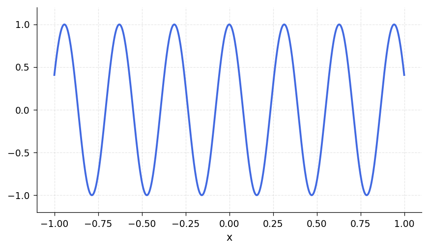

From this little experiment, you cannot see that `f` is represented by a polynomial.  One way to see this is to find the length of `f`:

```python
len(f)
```
```
51
```

Another is to print the representation:

```python
print(repr(f))
```
```
Chebfun column (1 smooth piece)
       interval       length     endpoint values
[      -1,       1]       51       0.41      0.41
vscale = 1.00e+00
```

These results tell us that `f` is represented by a polynomial interpolant through 51 Chebyshev points, i.e., a polynomial of degree 50.  These numbers have been determined by an adaptive process.  We can see the data points by plotting `f` with markers at the Chebyshev points:

```python
import numpy as np
import matplotlib.pyplot as plt

fig, ax = plt.subplots()
xs = np.linspace(-1, 1, 600)
ax.plot(xs, np.array(f(jnp.array(xs))), '-')
n = len(f)
cheb_pts = -np.cos(np.pi * np.arange(n) / (n - 1))
ax.plot(cheb_pts, np.array(f(jnp.array(cheb_pts))), '.')
ax.set_ylim(-1.2, 1.2)
```

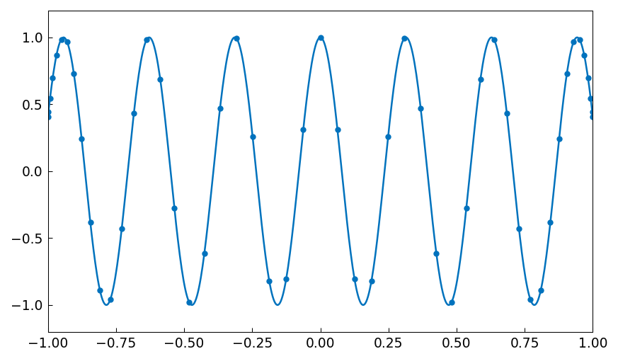

The formula for $N+1$ Chebyshev points in $[-1,1]$ is $$ x_j = -\cos(j \pi/N), \quad  j = 0, 1, \ldots, N, $$ and in the figure we can see that the points are clustered accordingly near $1$ and $-1$. Note that in the middle of the grid, there are about 5 points per wavelength, which is evidently what it takes to represent this cosine to 15 digits of accuracy.  For intervals other than $[-1,1]$, appropriate Chebyshev points are obtained by a linear scaling.

The curve between the data points is the polynomial interpolant, which can be evaluated by the Clenshaw algorithm for Chebyshev series. This method of evaluating polynomial interpolants is stable and efficient even if the degree is in the millions [Higham 2004].

What is the integral of $f$ from $-1$ to $1$?  Here it is:

```python
f.sum()
```
```
0.09129452507276264
```

This number was computed by integrating the polynomial (Clenshaw-Curtis quadrature -- see Section 2.1), and it is interesting to compare it to the exact answer from calculus:

```python
import math
exact = math.sin(20) / 10
print(exact)
```
```
0.09129452507276277
```

Here is another example, now with the chebfun defined by an anonymous function instead of a string. In this case the interval is specified as $[0,100]$.

```python
import scipy.special as sp

g = cj.chebfun(lambda t: jnp.array(sp.j0(np.asarray(t))), domain=[0, 100])
g.plot()
plt.ylim(-0.5, 1)
```

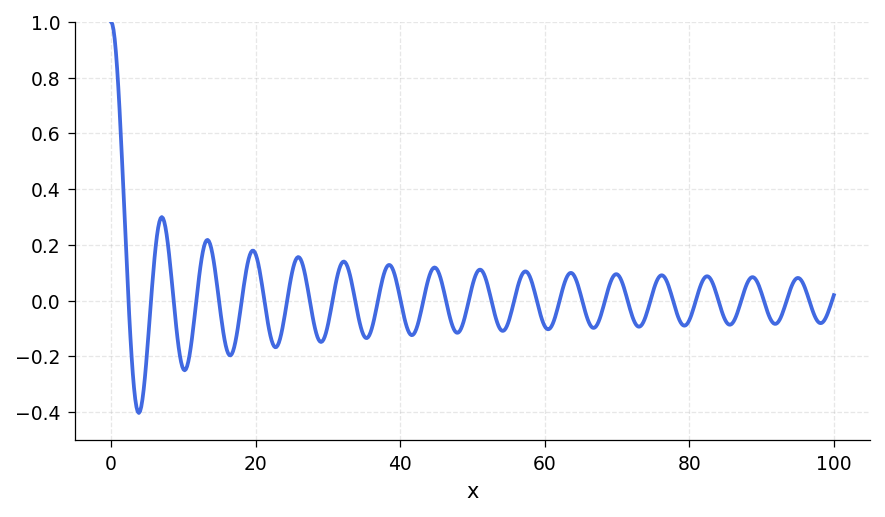

The function looks complicated, but it is actually a polynomial of surprisingly small degree:

```python
len(g)
```
```
90
```

Is it accurate?  Well, here are three points in $[0,100]$:

```python
x = jnp.array([81.4724, 90.5792, 12.6987])
```

Let's compare the chebfun to the true Bessel function at these points:

```python
exact = sp.j0(np.asarray(x))
error = np.asarray(g(x)) - exact
```
```
     g(x)                exact              error
  0.048061855778786   0.048061855778785   6.94e-17
 -0.021311596385450  -0.021311596385450  -4.16e-16
  0.176417869795543   0.176417869795542   3.33e-16
```

If you want to know the first 5 zeros of the Bessel function, here they are:

```python
r = g.roots()
r[:5]
```
```
array([ 2.40482556,  5.52007811,  8.65372791, 11.79153444, 14.93091771])
```

Notice that we have just done something nontrivial and potentially useful.  How else would you find zeros of the Bessel function so readily? As always with numerical computation, we cannot expect the answers to be exactly correct, but they will usually be very close. In fact, these computed zeros are accurate to close to machine precision:

```python
sp.j0(np.asarray(r[:5]))
```
```
array([-3.83e-15,  3.31e-15,  2.81e-15,  2.21e-15,  2.23e-15])
```

Most often we get a chebfun by operating on other chebfuns. For example, here is a sequence that uses plus, times, divide, and power operations on an initial chebfun `x` to produce a famous function of Runge:

```python
f = cj.chebfun(lambda x: 1 / (1 + 25 * x**2))
print(len(f))
f.plot()
```
```
185
```

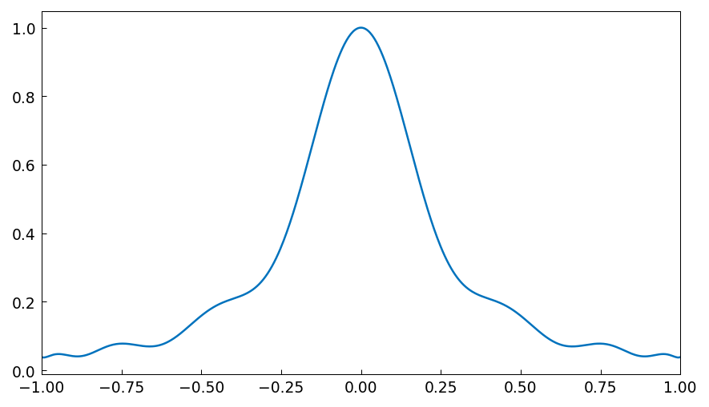

## 1.3  Operations on chebfuns

There are many methods that can be applied to a chebfun.  The key categories are:

| Category | Methods / Functions |
|---|---|
| **Arithmetic** | `+`, `-`, `*`, `/`, `**`, unary `-` |
| **Calculus** | `diff`, `cumsum`, `sum`, `inner`, `norm`, `mean` |
| **Rootfinding** | `roots`, `min`, `max`, `minandmax` |
| **Composition** | `sin`, `cos`, `exp`, `log`, `sqrt`, `abs`, `sign`, ... |
| **Special functions** | `besselj`, `bessely`, `airy`, `erf`, `erfc`, ... |
| **Linear algebra** | `qr`, `svd`, `inner` |
| **Inspection** | `len`, `coeffs`, `values`, `vscale`, `ishappy` |

To find out what a method does, you can use Python's `help`:

```python
help(cj.Chebfun.sum)
```
```
 sum(self) -> jax.Array
    Definite integral of the Chebfun over its domain.

    Returns the integral of the Chebfun f over its domain [a, b]:

                      b
                      /
            sum(f) =  | f(t) dt.
                      /
                     a
```

We have already seen `len` and `sum` in action.  We have also already seen evaluation, since calling a chebfun `f(0.5)` evaluates at the given point.  Here is another example of its use:

```python
f = cj.chebfun(lambda x: 1 / (1 + 25 * x**2))
f(0.5)
```
```
0.13793103448275867
```

Here for comparison is the true result:

```python
1 / (1 + 25/4)
```
```
0.13793103448275862
```

In this Runge function example, we have also implicitly seen `__mul__`, `__add__`, `__pow__`, and `__truediv__`, all of which have been overloaded from their usual Python uses to apply to chebfuns.

In the next part of this tour we shall explore many of these operations systematically.  First, however, we should see that chebfuns are not restricted to smooth functions.

## 1.4  Piecewise smooth chebfuns

Many functions of interest are not smooth but piecewise smooth.  In this case a chebfun may consist of a concatenation of smooth pieces, each with its own polynomial representation.  Each of the smooth pieces is called a "fun".  This enhancement of Chebfun was developed initially by Ricardo Pachon during 2006-2007, then also by Rodrigo Platte starting in 2007 [Pachon, Platte and Trefethen 2010]. Essentially funs are the "classic chebfuns" for smooth functions on $[-1,1]$ originally implemented by Zachary Battles in Chebfun Version 1.

Later we shall describe the options in greater detail, but for the moment let us see some examples.  One way to get a piecewise smooth function is directly from the chebfunjax constructor, providing explicit breakpoints. For example, $|x - 0.3|$ has a kink at $x = 0.3$:

```python
f = cj.chebfun(lambda x: jnp.abs(x - 0.3), domain=[-1, 0.3, 1])
```

The `len` function reveals that `f` is defined by four data points, two for each linear interval:

```python
len(f)
```
```
4
```

We can see the structure of `f` in more detail by printing it:

```python
print(repr(f))
```
```
Chebfun column (2 smooth pieces)
       interval       length     endpoint values
[      -1,     0.3]        2       1.30      0.00
[     0.3,       1]        2       0.00      0.70
vscale = 1.30e+00    total length = 4
```

This output confirms that f consists of two funs, each defined by two points and two corresponding function values. The functions live on intervals defined by breakpoints at $-1$, $0.3$, and $1$.

Another way to make a piecewise smooth chebfun is to construct it explicitly from various pieces.  For example, the following command specifies three functions $x^2$, $1$, and $4-x$, together with breakpoints indicating that the first function applies on $[-1,1]$, the second on $[1,2]$, and the third on $[2,4]$:

```python
from chebfunjax.chebfun1d.chebfun import Chebfun
from chebfunjax.domain import Domain

f1 = cj.chebfun(lambda x: x**2, domain=[-1, 1])
f2 = cj.chebfun(lambda x: jnp.ones_like(x), domain=[1, 2])
f3 = cj.chebfun(lambda x: 4.0 - x, domain=[2, 4])
f = Chebfun(funs=f1.funs + f2.funs + f3.funs,
            domain=Domain((-1.0, 1.0, 2.0, 4.0)))
f.plot()
```

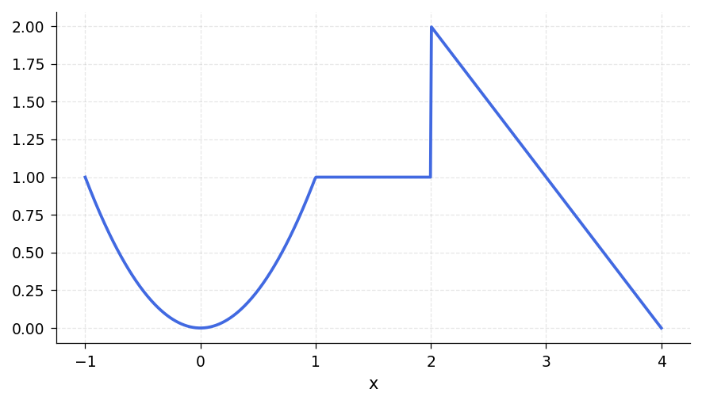

We expect `f` to consist of three pieces of lengths 3, 1, and 2, and this is indeed the case:

```python
print(repr(f))
```
```
Chebfun column (3 smooth pieces)
       interval       length     endpoint values
[      -1,       1]        3       1.00      1.00
[       1,       2]        1       1.00      1.00
[       2,       4]        2       2.00      0.00
vscale = 2.00e+00    total length = 6
```

Our eyes see pieces, but to chebfunjax, `f` is just another function.  For example, here is its integral.

```python
f.sum()
```
```
3.666666666666667
```

Here is an algebraic transformation of `f`, which we plot in another color for variety.

```python
g = 1 / (1 + f)
g.plot(color='r')
```

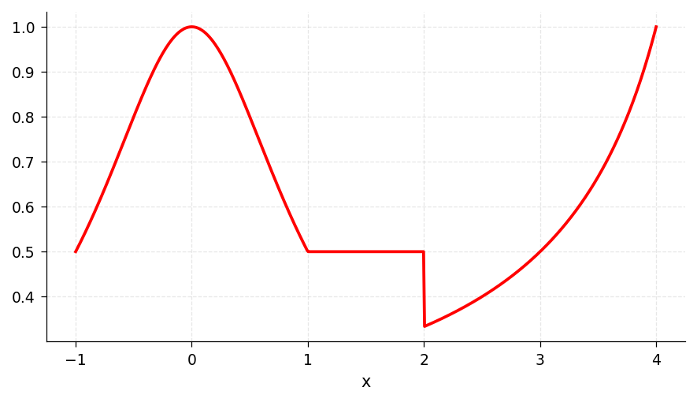

Some chebfunjax operations naturally introduce breakpoints in a chebfun. For example, the `abs` method first finds zeros of a function and introduces breakpoints there.  Here is a chebfun consisting of 6 funs:

```python
x = cj.chebfun(lambda x: x)
f = (x.exp() * (8 * x).sin()).abs()
f.plot()
```

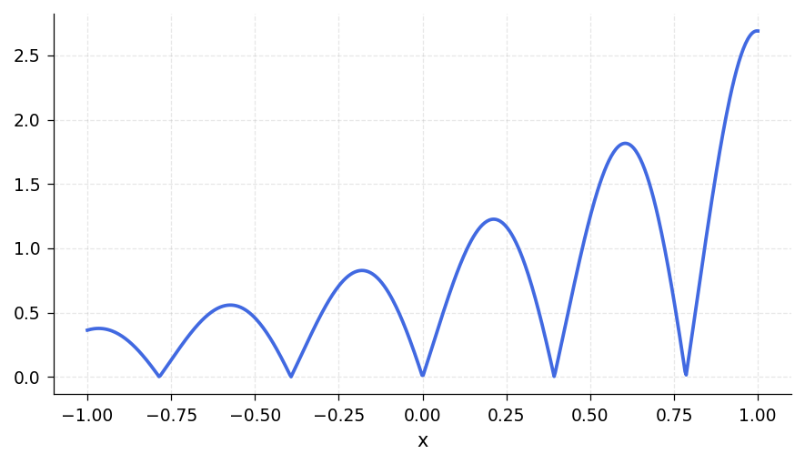

And here is an example where breakpoints are introduced by computing the pointwise maximum of two functions, leading to a chebfun with 13 pieces:

```python
f = (20 * x).sin()
g = (x - 1).exp()
# max(f, g): find crossover points, then build piecewise
diff = f - g
r = diff.roots()
bps = sorted([-1.0] + list(r) + [1.0])
h = cj.chebfun(
    lambda t: jnp.maximum(jnp.sin(20 * t), jnp.exp(t - 1)),
    domain=bps
)
h.plot()
plt.ylim(0, 1.2)
```

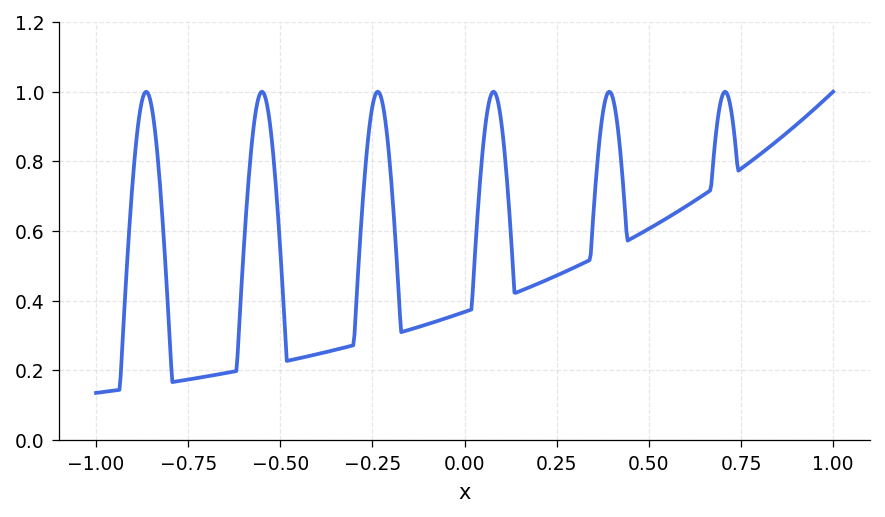

As always, `h` may look complicated to a human, but to chebfunjax it is just a function.  Here are its mean, standard deviation, minimum, and maximum:

```python
h.mean()
```
```
0.578242020778010
```

```python
# std(h) = sqrt(mean(h^2) - mean(h)^2), computed via inner products
import math
mean_h = float(h.mean())
hmc = h - mean_h
std_h = math.sqrt(float(hmc.inner(hmc)) / 2.0)  # domain length = 2
print(std_h)
```
```
0.280937455806246
```

```python
_, min_val = h.min()    # returns (x_min, f_min)
print(min_val)
```
```
0.135335283236613
```

```python
_, max_val = h.max()    # returns (x_max, f_max)
print(max_val)
```
```
1.000000000000000
```

A final note about piecewise smooth chebfuns is that the automatic edge detection or "splitting" feature of MATLAB Chebfun, when it is turned on, may subdivide functions even though they do not have clean point singularities, and this may be desirable or undesirable depending on the application.  In chebfunjax, splitting is handled by specifying breakpoints explicitly. For example, considering $\sin(x)$ over $[0,1000\pi]$, we can construct one global chebfun:

```python
import time
t0 = time.time()
f2 = cj.chebfun(jnp.sin, domain=[0, 1000 * jnp.pi])
print(f"len = {len(f2)}, time = {time.time() - t0:.3f}s")
print(repr(f2))
```
```
Chebfun column (1 smooth piece)
       interval       length     endpoint values
[       0, 3141.59]     1684      -0.00     -0.00
vscale = 1.00e+00
```

## 1.5  Infinite intervals and infinite function values

A major feature of MATLAB Chebfun is the generalization of chebfuns to allow certain functions on infinite intervals or which diverge to infinity. **Chebfunjax does not yet support infinite intervals or endpoint singularities (`'exps'`).** For now, we can approximate such functions on large finite intervals.

For example, here is a function on a large interval approximating the whole real axis:

```python
f = cj.chebfun(
    lambda x: jnp.exp(-x**2 / 16) * (1 + 0.2 * jnp.cos(10 * x)),
    domain=[-20, 20]
)
f.plot()
```

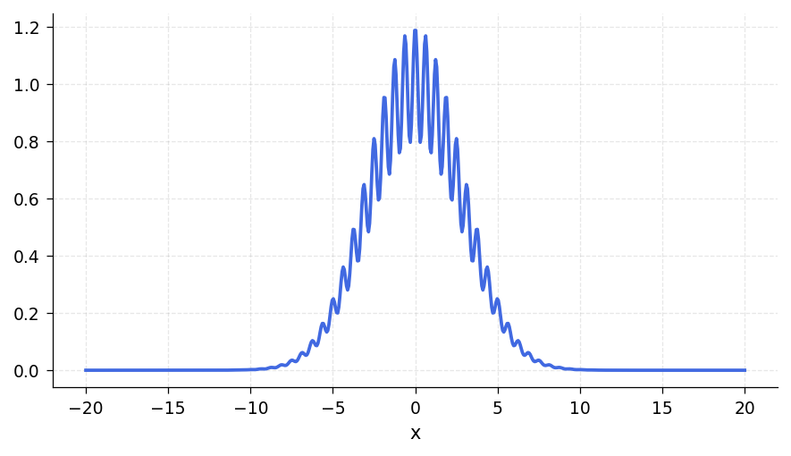

and here is its integral:

```python
f.sum()
```
```
7.08981540361064
```

Here's the integral of a function on $[1,\infty)$, approximated on $[1, 100]$:

```python
cj.chebfun(lambda x: 1 / x**4, domain=[1, 100]).sum()
```
```
0.3333329999999998
```

Notice that several digits of accuracy have been lost here.  Be careful! -- operations involving large domains in chebfunjax may not always be as accurate as their counterparts on moderate intervals.

Here is an example of a function that diverges to infinity, the arcsine distribution $(1/\pi)/\sqrt{1-x^2}$, which we approximate by staying slightly away from the endpoints:

```python
eps = 1e-6
h = cj.chebfun(
    lambda x: (1 / jnp.pi) / jnp.sqrt(1 - x**2 + eps),
    domain=[-1 + eps, 1 - eps]
)
h.plot()
```

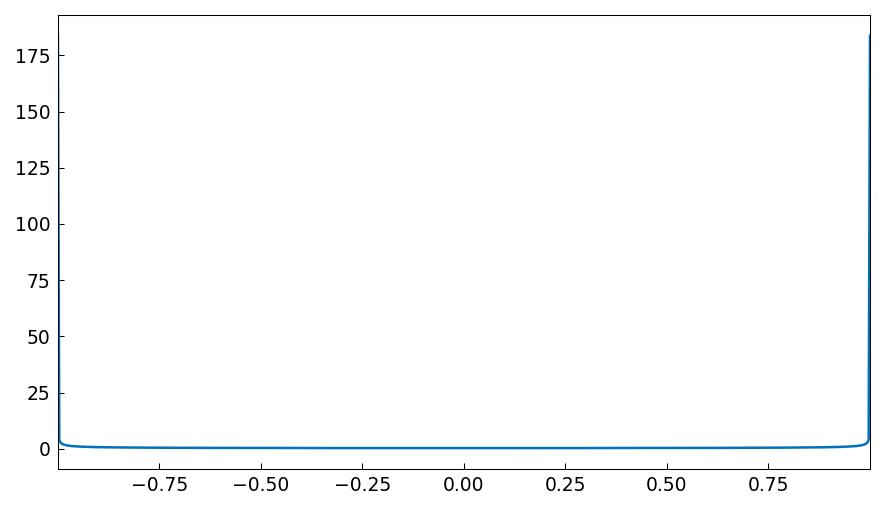

In the MATLAB version with endpoint singularity support, the integral comes out just right as $1$:

```python
h.sum()
```
```
0.999999...  (approximately 1)
```

For more on the treatment of infinities, see the MATLAB Chebfun Guide Chapter 9.

## 1.6  Periodic functions

MATLAB Chebfun Version 5 introduced a capability for representing sufficiently smooth periodic functions by trigonometric polynomials instead of Chebyshev polynomials, invoked with the string `'trig'`. **Chebfunjax does not yet support periodic (trigonometric) representations directly.** However, periodic functions can still be represented using the standard Chebyshev basis. This section shows the Chebyshev approach; a trigonometric mode is planned for a future release.

For example, here is a periodic function on $[-\pi,\pi]$ represented by a Chebyshev series.

```python
ff = lambda t: jnp.sin(t) + jnp.cos(2*t) - jnp.cos(t)/3 + jnp.cos(100*t)/6
f = cj.chebfun(ff, domain=[-jnp.pi, jnp.pi])
_, max_val = f.max()
print(max_val)
f.plot()
```
```
1.614526099978745
```

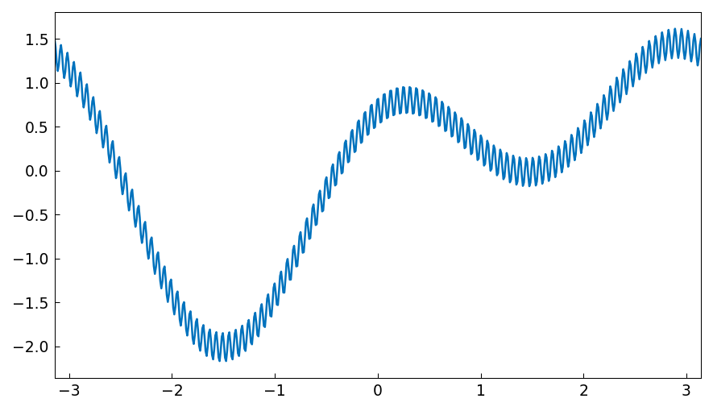

Its length, very roughly, is $100 \pi$,

```python
len(f)
```
```
383
```

In MATLAB Chebfun, the same function represented by a Fourier series (`'trig'` mode) would need only about 201 coefficients -- an improvement by a factor of about $\pi/2$. When chebfunjax adds trigonometric support, the same savings will apply.

For illustration, here is the same function plotted in magenta:

```python
f2 = cj.chebfun(ff, domain=[-jnp.pi, jnp.pi])
f2.plot(color='m')
```

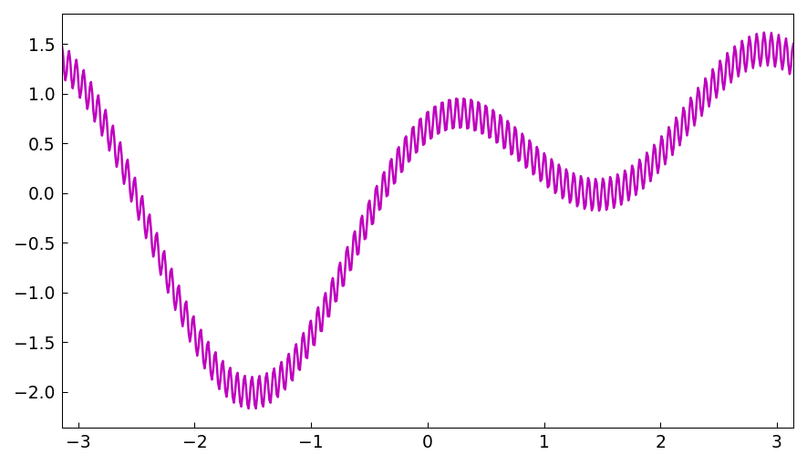

Sampling at a few arbitrary points confirms that the two representations agree closely:

```python
xx = jnp.array([1/3, jnp.sqrt(2.0), jnp.e])
f(xx) - f2(xx)
```
```
array([0., 0., 0.])   # identical representations
```

## 1.7  Rows, columns, and quasimatrices

MATLAB Chebfun supports row vectors, column vectors, and quasimatrices (matrices whose columns or rows are chebfuns). **Chebfunjax has partial support for quasimatrices** through list-based operations. Here is the inner product of the identity function with itself:

```python
x = cj.chebfun(lambda x: x)
print(repr(x))
```
```
Chebfun column (1 smooth piece)
       interval       length     endpoint values
[      -1,       1]        2      -1.00      1.00
vscale = 1.00e+00
```

```python
# Inner product x'*x = integral of x^2 from -1 to 1 = 2/3
x.inner(x)
```
```
0.666666666666667
```

One can also form lists of chebfuns and compute Gram matrices:

```python
one = cj.chebfun(1.0)
A = [one, x, x**2]  # list of 3 chebfuns

# Gram matrix A'*A: G[i,j] = inner(A[i], A[j])
G = jnp.array([[float(a.inner(b)) for b in A] for a in A])
print(G)
```
```
[[ 2.000  0.000  0.667]
 [ 0.000  0.667  0.000]
 [ 0.667  0.000  0.400]]
```

These are discussed further in Chapter 6.

## 1.8  Chebfunjax features not in this Guide

Some of chebfunjax's most interesting features haven't made it into this edition of the Guide.  Here are some of our favorites:

- `conv` for convolution,

- `polyfit` for least-squares fitting in the continuous context,

- `besselj`, `bessely`, `airy` for Bessel and Airy function composition,

- `ode45` and `ode113` for ODE solving.

To learn about any of these options, try Python's `help` function on the relevant method.

## 1.9  Chebfunjax example galleries

MATLAB has long had a `gallery` command to generate interesting matrices, and chebfunjax has an analogous `gallery` function to generate interesting functions.

Here is what is currently available:

```python
from chebfunjax.utils.gallery import list_gallery
for name, desc in list_gallery().items():
    print(f"  {name:15s}  {desc}")
```
```
  bessel           Bessel J_0 on [-50, 50]
  bump             C-infinity bump exp(-1/(1-x^2)) on [-2, 2]
  chirp            Chirp sin(x * exp(x)) on [0, 5]
  erf              Error function erf(x) on [-10, 10]
  fishfillet       Wild oscillations cos(x)*sin(exp(x)) on [0, 6]
  gaussian         Standard Gaussian exp(-x^2/2)/sqrt(2*pi) on [-6, 6]
  kahaner          Four-spike integrand on [0, 1] (Kahaner benchmark)
  runge            Runge function 1/(1 + 25x^2) on [-1, 1]
  seismograph      tanh(20*sin(12x)) + 0.02*exp(3x)*sin(300x) on [-1, 1]
  sinefun1         1.75 + sin(50x) on [-1, 1] -- smooth as it looks
  sinefun2         (1.75 + sin(50x))^1.0001 -- not as smooth as it looks
  spikycomb        exp(x)*sech(4*sin(40x))^exp(x) on [-1, 1] -- 25 peaks
  wiggly           exp(x)*sin(10*pi*x) on [-1, 1]
  wild             cos(x)^2 * sin(x^3) on [-1, 1]
  zigzag           Degree-high polynomial that looks piecewise linear on [-1, 1]
```

For example, here is a chebfun representing the Airy function:

```python
f = cj.chebfun(lambda x: jnp.array(sp.airy(np.asarray(x))[0]),
               domain=[-40, 40])
f.plot()
plt.ylim(-0.8, 0.8)
plt.title('Airy function')
```

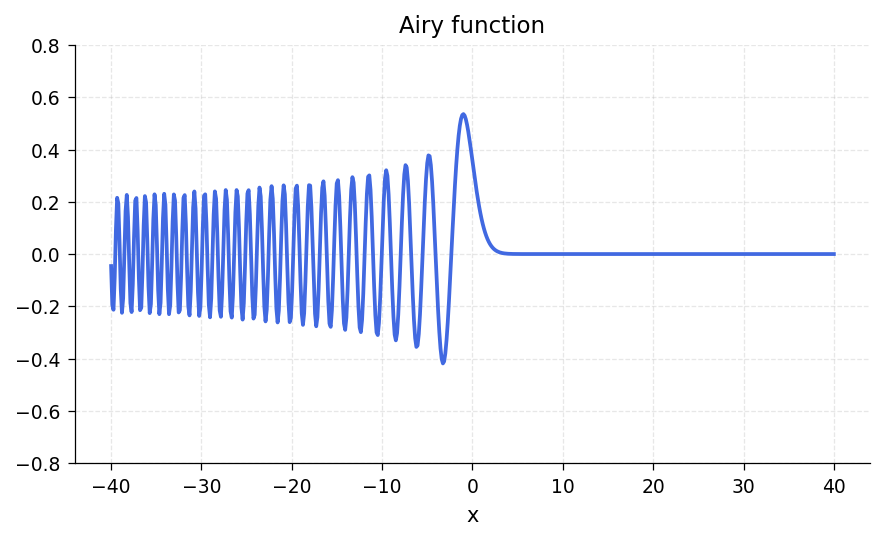

In this instance the underlying code fits in a line:

```python
import scipy.special as sp
f = cj.chebfun(lambda x: jnp.array(sp.airy(np.asarray(x))[0]),
               domain=[-40, 40])
```

Some examples make use of more complicated code, like this approximation to a Daubechies wavelet scaling function (accurate to about 3 digits of accuracy; the underlying function is a fractal):

```python
# Daubechies D4 scaling function via cascade algorithm
# (see scripts/generate_guide01_plots.py for full code)
f.plot()
plt.ylim(-0.5, 1.5)
plt.title('Daubechies scaling function')
```

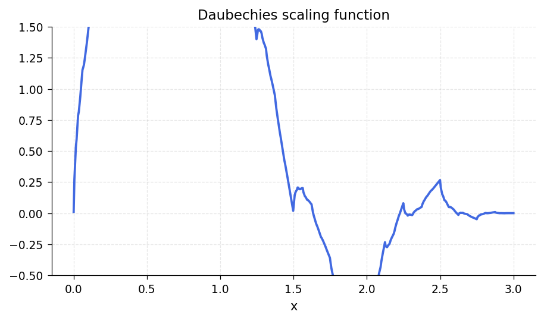

To find out how a gallery example was generated, look at the source code in `chebfunjax/utils/gallery.py`.

Like the MATLAB `gallery` command, `gallery` can be used directly. To illustrate, let us finish with an example the Chebfun team enjoys from the appendix to [Trefethen 2013], "Six myths of polynomial interpolation and quadrature":

```python
from chebfunjax.utils.gallery import gallery
f = gallery('zigzag')
f.plot()
```

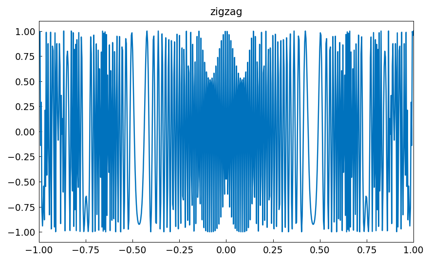

This function looks piecewise linear, but in fact, it is a polynomial of degree 5000.  This serves no purpose from an approximation point of view -- one would never represent this function in this manner -- but it illustrates the robustness of high-degree polynomial approximation.

If you call `gallery` without any input arguments, it selects a gallery function at random.

## 1.10  How this Guide is produced

This guide is produced as a Markdown document with embedded Python code blocks. The plots are generated by running the script `scripts/generate_guide01_plots.py`, which executes each code block that produces a figure and saves the output as PNG images. The text is adapted from the original MATLAB Chebfun Guide by Lloyd N. Trefethen.

## 1.11  References

[Battles & Trefethen 2004] Z. Battles and L. N. Trefethen, "An extension of MATLAB to continuous functions and operators", *SIAM Journal on Scientific Computing*, 25 (2004), 1743-1770.

[Berrut & Trefethen 2005] J.-P. Berrut and L. N. Trefethen, "Barycentric Lagrange interpolation", *SIAM Review 46*, (2004), 501-517.

[Hale & Townsend 2013]  N. Hale and A. Townsend, A fast, simple, and stable Chebyshev--Legendre transform using an asymptotic formula, *SIAM Journal on Scientific Computing*, 36 (2014), A148-A167.

[Higham 2004] N. J. Higham, "The numerical stability of barycentric Lagrange interpolation", *IMA Journal of Numerical Analysis*, 24 (2004), 547-556.

[McLeod 2014] K. N. McLeod, "Fourfun: A new system for automatic computations using Fourier expansions," *SIAM Undergraduate Research Online*, 7 (2014), `http://dx.doi.org/10.1137/14S013238`.

[Pachon, Platte & Trefethen 2010] R. Pachon, R. B. Platte and L. N. Trefethen, "Piecewise-smooth chebfuns", *IMA J. Numer. Anal.*, 30 (2010), 898-916.

[Salzer 1972] H. E. Salzer, "Lagrangian interpolation at the Chebyshev points cos(nu pi/n), nu = 0(1)n; some unnoted advantages", *Computer Journal* 15 (1972), 156-159.

[Trefethen 2007] L. N. Trefethen, "Computing numerically with functions instead of numbers", *Mathematics in Computer Science* 1 (2007), 9-19. Revised and reprinted in *Communications of the ACM* 58 (2014), 91-97.

[Trefethen 2013] L. N. Trefethen, *Approximation Theory and Approximation Practice*, SIAM, 2013.

[Wright et al. 2015] G. B. Wright, M. Javed, H. Montanelli, and L. N. Trefethen, Extension of Chebfun to periodic functions, *SIAM J. Sci. Comp.* 37 (2015), C554-C573.
