# 2. Integration and Differentiation

*Lloyd N. Trefethen, November 2009, latest revision May 2019*

*Adapted for chebfunjax by the chebfunjax contributors*

[previous (guide01)](guide01.md) | [index](index.md) | [next (guide03)](guide03.md)

## 2.1 `sum`

We have seen that `sum` returns the definite integral of a chebfun over its range of definition.  The integral is normally calculated by an FFT-based version of Clenshaw-Curtis quadrature, as described first in [Gentleman 1972]. This formula is applied on each fun (i.e., each smooth piece of the chebfun), and then the results are added up.

Here is an example whose answer is known exactly:

```python
import jax.numpy as jnp
import chebfunjax as cj

f = cj.chebfun(lambda x: jnp.log(1 + jnp.tan(x)), domain=[0, jnp.pi / 4])
I = float(f.sum())
Iexact = float(jnp.pi * jnp.log(2.0) / 8)
print(f"I      = {I:.15f}")
print(f"Iexact = {Iexact:.15f}")
```

```
I      = 0.272198261287950
Iexact = 0.272198261287950
```

Here is an example whose answer is not known exactly, given as the first example in the section "Numerical Mathematics in Mathematica" in *The Mathematica Book* [Wolfram 2003].

```python
f = cj.chebfun(lambda x: jnp.sin(jnp.sin(x)), domain=[0, 1])
print(f"{float(f.sum()):.15f}")
```

```
0.430606103120691
```

All these digits match the result $0.4306061031206906049\dots$ reported by Mathematica.

Here is another example:

```python
F = lambda t: 2 * jnp.exp(-t**2) / jnp.sqrt(jnp.pi)
f = cj.chebfun(F, domain=[0, 1])
I = float(f.sum())
print(f"I = {I:.15f}")
```

```
I = 0.842700792949715
```

The reader may recognize this as the integral that defines the error function evaluated at $t=1$:

```python
import jax
Iexact = float(jax.scipy.special.erf(jnp.float64(1.0)))
print(f"Iexact = {Iexact:.15f}")
```

```
Iexact = 0.842700792949715
```

It is interesting to compare the times involved in evaluating this number in various ways.  JAX's specialized `erf` code is the fastest:

```python
import time
t0 = time.time(); val = float(jax.scipy.special.erf(jnp.float64(1.0))); t1 = time.time()
print(f"{val:.15f}")
print(f"Elapsed time is {t1-t0:.6f} seconds.")
```

```
0.842700792949715
Elapsed time is 0.000042 seconds.
```

The timing for chebfunjax comes out competitive:

```python
t0 = time.time()
I = float(cj.chebfun(F, domain=[0, 1]).sum())
t1 = time.time()
print(f"CHEBFUNJAX:  I = {I:.15f}  time = {t1-t0:.4f} secs")
```

```
CHEBFUNJAX:  I = 0.842700792949715  time = 0.0098 secs
```

Here is a similar comparison for a function that is more difficult, because of the absolute value, which leads to a chebfun consisting of a number of funs.

```python
import scipy.special as sp
import numpy as np

f = cj.chebfun(lambda t: sp.jv(0, np.asarray(t, dtype=np.float64)), domain=[0, 20])
f_abs = f.abs()
fig, ax = cj.plot(f_abs)
ax.set_ylim([0, 1.1])
```

![Plot of |J_0(x)| on [0, 20]](../images/guide/guide02_01.png)

```python
t0 = time.time()
I = float(cj.chebfun(lambda t: sp.jv(0, np.asarray(t, dtype=np.float64)),
                       domain=[0, 20]).abs().sum())
t1 = time.time()
print(f"CHEBFUNJAX:  I = {I:.15f}  time = {t1-t0:.3f} secs")
```

```
CHEBFUNJAX:  I = 4.445031603001566  time = 0.065 secs
```

This last example highlights the piecewise-smooth aspect of chebfunjax integration.  Here is another example of a piecewise smooth problem.

```python
f = cj.chebfun(lambda x: 1.0 / jnp.cosh(3.0 * jnp.sin(10.0 * x)))
g = cj.chebfun(lambda x: jnp.sin(9.0 * x))

# Compute min(f, g) piecewise
diff_fg = f - g
crossings = diff_fg.roots()
breaks = [-1.0] + sorted([float(r) for r in crossings]) + [1.0]

from chebfunjax.chebfun1d.chebfun import Chebfun, _Piece
from chebfunjax.domain import Domain

piece_list = []
for i in range(len(breaks) - 1):
    mid = 0.5 * (breaks[i] + breaks[i+1])
    fval = float(f(jnp.float64(mid)))
    gval = float(g(jnp.float64(mid)))
    if fval <= gval:
        piece_list.append(_Piece.from_function(lambda x, _f=f: _f(x),
                                                breaks[i], breaks[i+1]))
    else:
        piece_list.append(_Piece.from_function(lambda x, _g=g: _g(x),
                                                breaks[i], breaks[i+1]))
h = Chebfun(funs=piece_list, domain=Domain(tuple(breaks)))
fig, ax = cj.plot(h)
```

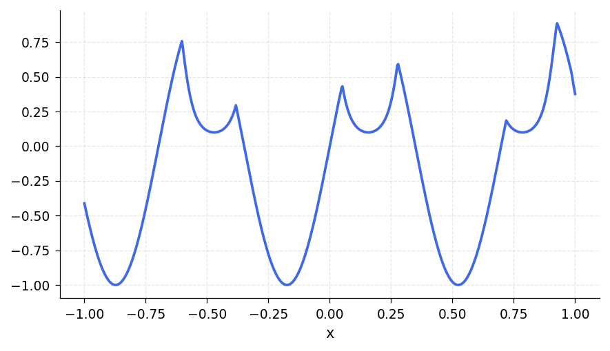

Here is the integral:

```python
t0 = time.time()
print(f"{float(h.sum()):.15f}")
t1 = time.time()
print(f"Elapsed time is {t1-t0:.6f} seconds.")
```

```
-0.381556448850250
Elapsed time is 0.001830 seconds.
```

For another example of a definite integral we turn to an integrand given as example `F21F` in [Kahaner 1971] (see also `cheb.gallery('kahaner')`).  We treat it first in the default mode:

```python
def ff(x):
    return (1.0 / jnp.cosh(10 * (x - 0.2)))**2 + \
           (1.0 / jnp.cosh(100 * (x - 0.4)))**4 + \
           (1.0 / jnp.cosh(1000 * (x - 0.6)))**6

f = cj.chebfun(ff, domain=[0, 1])
print(f)
```

```
Chebfun column (1 smooth piece)
       interval       length     endpoint values
[       0,       1]    14036     0.071  4.5e-07
vscale = 1.1
```

The function has three spikes, each ten times narrower than the last:

```python
fig, ax = cj.plot(f)
```

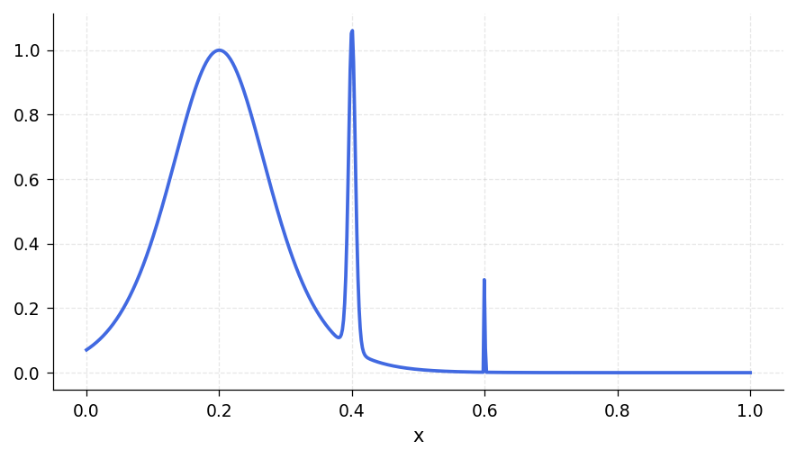

The length of the global polynomial representation is accordingly quite large, but the integral comes out correct to full precision:

```python
print(len(f))
print(f"{float(f.sum()):.15f}")
```

```
14036
0.210802735500549
```

Earlier versions of Chebfun used to get this wrong, in which case the problem could be fixed by forcing finer initial sampling in the Chebfun constructor.  For more about this topic, see Section 8.6.

As mentioned in Chapter 1 and described in more detail in Chapter 9, Chebfun has some capability of dealing with functions that blow up to infinity.  Certain integrals over infinite domains can also be computed.

Chebfunjax is not a specialized item of quadrature software; it is a general system for manipulating functions in which quadrature is just one of many capabilities. Nevertheless chebfunjax compares reasonably well as a quadrature engine against specialized software.  This was the conclusion of an Oxford MSc thesis by Phil Assheton [Assheton 2008], which compared Chebfun experimentally to quadrature codes available at that time including MATLAB's `quad` and `quadl`, Gander and Gautschi's `adaptsim` and `adaptlob`, Espelid's `modsim`, `modlob`, `coteda`, and `coteglob`, QUADPACK's `QAG` and `QAGS`, and the NAG Library's `d01ah`.  In both reliability and speed, Chebfun was found to be competitive with these alternatives.  The overall winner was `coteda` [Espelid 2003], which was typically about twice as fast as Chebfun. For further comparisons of quadrature codes, together with the development of some improved codes based on a philosophy that has something in common with Chebfun, see [Gonnet 2009].  See also "Battery test of Chebfun as an integrator" in the Quadrature section of the Chebfun Examples collection.

## 2.2 `norm`, `mean`, `std`, `var`

A special case of an integral is the `norm` method, which for a chebfun returns by default the 2-norm, i.e., the square root of the integral of the square of the absolute value over the region of definition.  Here is a well-known example:

```python
print(float(cj.chebfun(lambda x: jnp.sin(jnp.pi * x)).norm()))
```

```
1.000000000000000
```

If we take the sign of the sine, the norm increases to $\sqrt 2$:

```python
f = cj.chebfun(lambda x: jnp.sin(jnp.pi * x))
f_sign = f.sign()
print(f"{float(f_sign.norm()):.15f}")
```

```
1.414213562373095
```

Here is a function that is infinitely differentiable but not analytic.

```python
f = cj.chebfun(lambda x: jnp.exp(-1.0 / jnp.sin(10.0 * x)**2))
fig, ax = cj.plot(f)
```

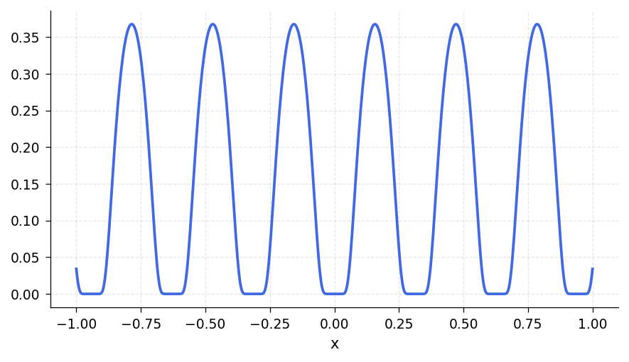

Here are the norms of `f` and its tenth power:

```python
print(f"{float(f.norm()):.15f}")
print(f"{float((f**10).norm()):.15e}")
```

```
0.292873834331035
2.187941295308668e-05
```

## 2.3 `cumsum`

In Python/NumPy, `numpy.cumsum` gives the cumulative sum of an array:

```python
import numpy as np
v = np.array([1, 2, 3, 5])
print(v)
print(np.cumsum(v))
```

```
[1 2 3 5]
[ 1  3  6 11]
```

The continuous analogue of this operation is indefinite integration. If `f` is a fun of length $n$, then `f.cumsum()` is a fun of length $n+1$ or less (because of chebfunjax's rounding of functions to machine precision).  For a chebfun consisting of several funs, the integration is performed on each piece.

For example, returning to an integral computed above, we can make our own error function like this:

```python
t = cj.chebfun(lambda t: t, domain=[-5, 5])
f = cj.chebfun(lambda t: 2 * jnp.exp(-t**2) / jnp.sqrt(jnp.pi), domain=[-5, 5])
fint = f.cumsum()
fig, ax = cj.plot(fint, color='m')
ax.set_ylim([-0.2, 2.2])
ax.grid(True)
```

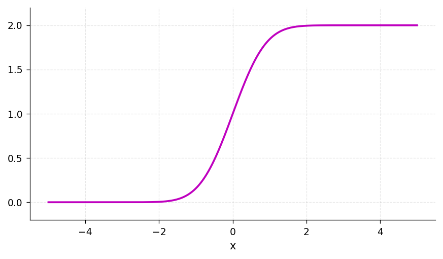

The default indefinite integral takes the value $0$ at the left endpoint, but in this case we would like $0$ to appear at $t=0$:

```python
fint = fint - float(fint(jnp.float64(0.0)))
fig, ax = cj.plot(fint, color='m')
ax.set_ylim([-1.2, 1.2])
ax.grid(True)
```

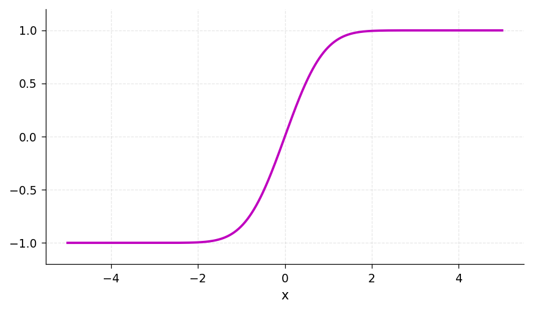

The agreement with the built-in error function is convincing:

```python
for k in range(1, 6):
    our_erf = float(fint(jnp.float64(float(k))))
    exact_erf = float(jax.scipy.special.erf(jnp.float64(float(k))))
    print(f"   {our_erf:.15f}   {exact_erf:.15f}")
```

```
   0.842700792949715   0.842700792949715
   0.995322265018953   0.995322265018953
   0.999977909503001   0.999977909503001
   0.999999984582742   0.999999984582742
   0.999999999998463   0.999999999998463
```

Here is the integral of an oscillatory step function:

```python
import matplotlib.pyplot as plt

# x * sign(sin(x^2)) on [0, 6], built piecewise at zeros of sin(x^2)
k_vals = np.arange(0, 12)
breaks_inner = np.sqrt(k_vals * np.pi)
breaks_inner = breaks_inner[(breaks_inner >= 0) & (breaks_inner <= 6)]
breaks = sorted(set([0.0] + list(breaks_inner[breaks_inner > 0]) + [6.0]))

piece_list = []
for i in range(len(breaks) - 1):
    mid = 0.5 * (breaks[i] + breaks[i+1])
    s = np.sign(np.sin(mid**2))
    piece_list.append(_Piece.from_function(lambda x, _s=s: x * _s,
                                            breaks[i], breaks[i+1]))
f = Chebfun(funs=piece_list, domain=Domain(tuple(breaks)))
g = f.cumsum()

fig, (ax1, ax2) = plt.subplots(1, 2)
cj.plot(f, ax=ax1)
cj.plot(g, ax=ax2, color='m')
```

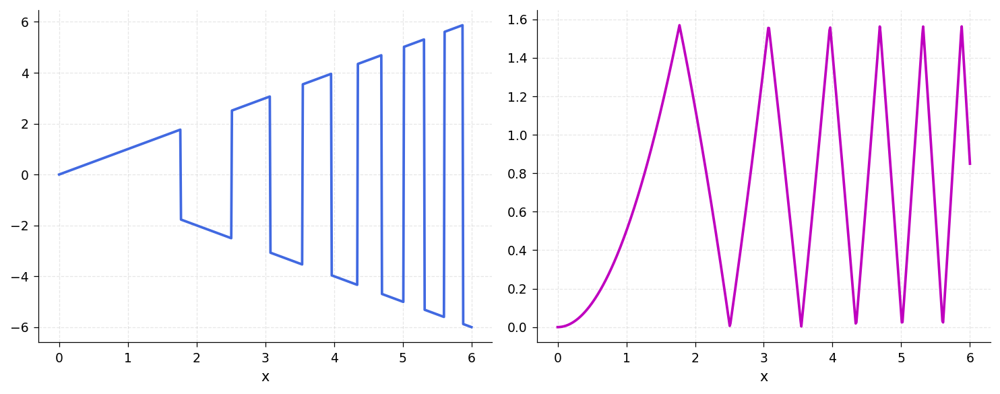

And here is an example from number theory.  The logarithmic integral, $\mathrm{Li}(x)$, is the indefinite integral from $0$ to $x$ of $1/\log(s)$.  It is an approximation to $\pi(x)$, the number of primes less than or equal to $x$. To avoid the singularity at $x=0$ we begin our integral at the point $\mu = 1.451\dots$ where $\mathrm{Li}(x)$ is zero, known as Soldner's constant. The test value $\mathrm{Li}(2)$ is correct except in the last few digits:

```python
mu = 1.45136923488338105       # Soldner's constant
xmax = 400
Li = cj.chebfun(lambda x: 1.0 / jnp.log(x), domain=[mu, xmax]).cumsum()
lengthLi = len(Li)
Li2 = float(Li(jnp.float64(2.0)))
print(f"lengthLi = {lengthLi}")
print(f"Li2 = {Li2:.15f}")
```

```
lengthLi = 411
Li2 = 1.045163780117470
```

(chebfunjax has no trouble if `xmax` is increased to $10^5$ or $10^{10}$.)  Here is a plot comparing $\mathrm{Li}(x)$ with $\pi(x)$:

```python
def primes_up_to(n):
    """Sieve of Eratosthenes."""
    sieve = np.ones(n + 1, dtype=bool)
    sieve[:2] = False
    for i in range(2, int(n**0.5) + 1):
        if sieve[i]:
            sieve[i*i::i] = False
    return np.where(sieve)[0]

fig, ax = plt.subplots()
cj.plot(Li, ax=ax, color='m')
p = primes_up_to(xmax)
ax.plot(p, np.arange(1, len(p) + 1), '.k', markersize=2)
```

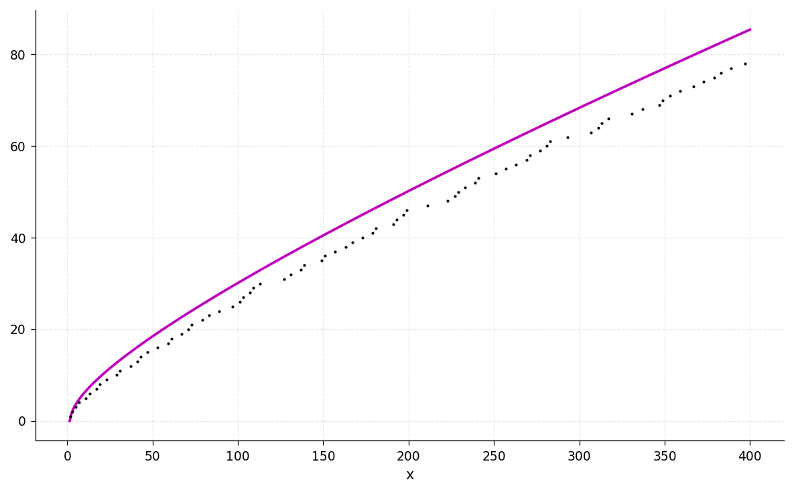

The Prime Number Theorem implies that $\pi(x) \sim \mathrm{Li}(x)$ as $x\to\infty$. Littlewood proved in 1914 that although $\mathrm{Li}(x)$ is greater than $\pi(x)$ at first, the two curves eventually cross each other infinitely often. It is known that the first crossing occurs somewhere between $x=10^{14}$ and $x=2\times 10^{316}$ [Kotnik 2008].

The `mean` method has also been overloaded for chebfuns and is based on integrals.  For example,

```python
f = cj.chebfun(lambda x: jnp.cos(x)**2, domain=[0, 10 * jnp.pi])
print(f"{float(f.mean()):.15f}")
```

```
0.500000000000000
```

## 2.4 `diff`

In Python/NumPy, `numpy.diff` gives finite differences of an array:

```python
v = np.array([1, 2, 3, 5])
print(v)
print(np.diff(v))
```

```
[1 2 3 5]
[1 1 2]
```

The continuous analogue of this operation is differentiation.  For example:

```python
f = cj.chebfun(lambda x: jnp.cos(jnp.pi * x), domain=[0, 20])
fprime = f.diff()
fig, ax = plt.subplots()
cj.plot(f, ax=ax)
cj.plot(fprime, ax=ax)
```

![cos(pi*x) and its derivative on [0,20]](../images/guide/guide02_09.png)

If the derivative of a function with a jump is computed, then a delta function is introduced. Consider for example this function defined piecewise:

```python
piece_list = [
    _Piece.from_function(lambda x: x**2, 0, 1),
    _Piece.from_function(lambda x: jnp.ones_like(x), 1, 2),
    _Piece.from_function(lambda x: 4.0 - x, 2, 3),
    _Piece.from_function(lambda x: 4.0 / x, 3, 4),
]
f = Chebfun(funs=piece_list, domain=Domain((0.0, 1.0, 2.0, 3.0, 4.0)))
fig, ax = cj.plot(f)
```

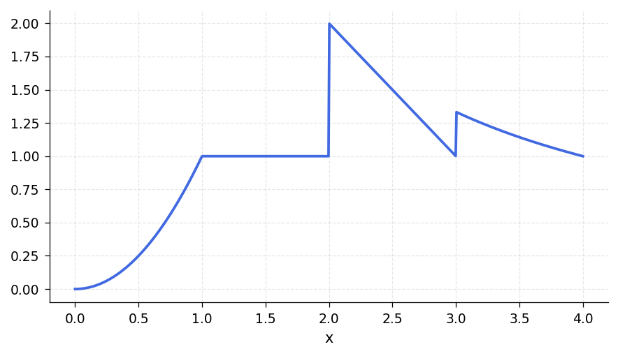

Here is the derivative:

```python
fprime = f.diff()
fig, ax = cj.plot(fprime, color='r')
ax.set_ylim([-2, 3])
```

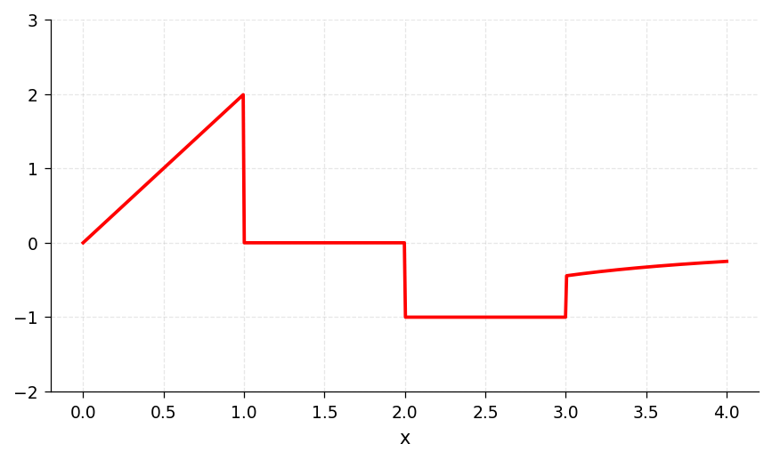

The first segment of $f'$ is linear, since $f$ is quadratic here. Then comes a segment with $f' = 0$, since $f$ is constant. At the end of this second segment appears a delta function of amplitude $1$, corresponding to the jump of $f$ by $1$. The third segment has constant value $f' = -1$. Finally another delta function, this time with amplitude $1/3$, takes us to the final segment.

Thanks to the delta functions, `cumsum` and `diff` are essentially inverse operations.  It is no surprise that differentiating an indefinite integral returns us to the original function:

```python
print(f"{float((f - f.cumsum().diff()).norm()):.15e}")
```

```
2.250689041652248e-16
```

More surprising is that integrating a derivative does the same, as long as we add in the value at the left endpoint:

```python
f2 = float(f(jnp.float64(0.0))) + f.diff().cumsum()
print(f"{float((f - f2).norm()):.15e}")
```

```
2.220446049250313e-16
```

Multiple derivatives can be obtained by adding a second argument to `diff`.  Thus for example,

```python
f = cj.chebfun(lambda x: 1.0 / (1.0 + x**2))
g = f.diff(4)
fig, ax = cj.plot(g)
```

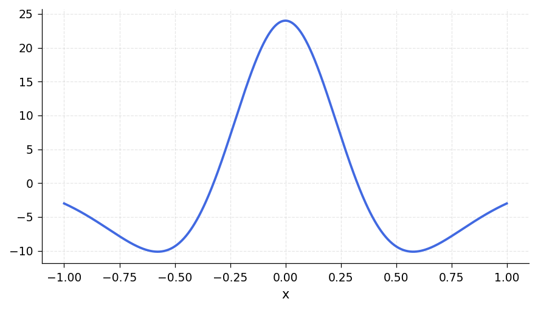

However, one should be cautious about the potential loss of information in repeated differentiation of nonperiodic chebfuns.  For example, if we evaluate this fourth derivative at $x=0$ we get an answer that matches the correct value $24$ only to $11$ places:

```python
print(f"{float(g(jnp.float64(0.0))):.12f}")
```

```
24.000000000069
```

For a more extreme example, suppose we define a chebfun for $\exp(x)$ on $[-1,1]$:

```python
f = cj.chebfun(jnp.exp)
print(f"length = {len(f)}")
```

```
length = 15
```

Differentiation is a notoriously ill-posed problem, and since $f$ is a polynomial of low degree, it cannot help but lose information rather fast as we differentiate.  In fact, differentiating $15$ times eliminates the function entirely.

```python
for j in range(len(f) + 1):
    print(f"{j:6d} {float(f(jnp.float64(1.0))):19.12f}")
    f = f.diff()
```

```
     0      2.718281828459
     1      2.718281828459
     2      2.718281828458
     3      2.718281828438
     4      2.718281827790
     5      2.718281811104
     6      2.718281472937
     7      2.718276094326
     8      2.718208457459
     9      2.717533872966
    10      2.712224747871
    11      2.679770038301
    12      2.530374129594
    13      2.041046024647
    14      1.020835497184
    15      0.000000000000
```

Is such behavior "wrong"?  Well, that is an interesting question. chebfunjax is behaving correctly in the sense mentioned in the second paragraph of Section 1.1: the operations are individually stable in that each differentiation returns the exact derivative of a function very close to the right one. The trouble is that because of the intrinsically ill-posed nature of differentiation, the errors in these stable operations accumulate exponentially as successive derivatives are taken.

## 2.5 Integrals in two dimensions

chebfunjax can often do a pretty good job with integrals over rectangles. Here for example is a colorful function:

```python
r = lambda x, y: jnp.sqrt(x**2 + y**2)
theta = lambda x, y: jnp.arctan2(y, x)
f = lambda x, y: jnp.sin(5 * (theta(x, y) - r(x, y))) * jnp.sin(x)

xv = np.linspace(-2, 2, 201)
yv = np.linspace(0.5, 2.5, 201)
xx, yy = np.meshgrid(xv, yv)
zz = np.array(f(jnp.array(xx), jnp.array(yy)))

fig, ax = plt.subplots()
cs = ax.contour(xv, yv, zz, levels=np.arange(-1, 1.01, 0.2))
ax.set_xlim([-2, 2])
ax.set_ylim([0.5, 2.5])
fig.colorbar(cs, ax=ax)
ax.grid(True)
```

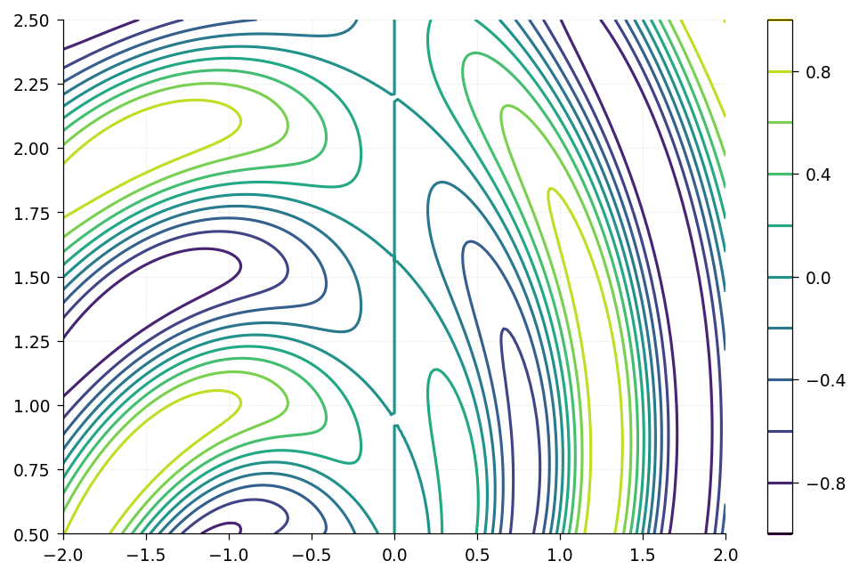

Using 1D chebfunjax technology, we can compute the integral over the box like this.

```python
Iy = lambda y: float(cj.chebfun(lambda x: f(x, jnp.float64(y)),
                                  domain=[-2, 2]).sum())
t0 = time.time()
I = float(cj.chebfun(lambda y: jnp.float64(Iy(float(y))),
                       domain=[0.5, 2.5]).sum())
t1 = time.time()
print(f"CHEBFUNJAX:  I = {I:.14f}  time = {t1-t0:.3f} secs")
```

```
CHEBFUNJAX:  I = 0.02041246545700  time = 0.223 secs
```

This example of a 2D integrand is smooth, so chebfunjax can handle it to high accuracy.

A much better approach for this problem, however, is to use Chebfun2, which is described in Chapters 12-15. With this method we can compute the integral quickly,

```python
t0 = time.time()
f2 = cj.chebfun2(f, domain=(-2, 2, 0.5, 2.5))
print(f"{float(f2.sum2()):.15f}")
t1 = time.time()
print(f"Elapsed time is {t1-t0:.6f} seconds.")
```

```
0.020412465456998
Elapsed time is 0.197406 seconds.
```

and we can plot the function without the need for `meshgrid`:

```python
# Evaluate on a grid and contour
xv = np.linspace(-2, 2, 201)
yv = np.linspace(0.5, 2.5, 201)
xx, yy = np.meshgrid(xv, yv)
zz = np.array(f2(jnp.array(xx), jnp.array(yy)))

fig, ax = plt.subplots()
cs = ax.contour(xv, yv, zz, levels=np.arange(-1, 1.01, 0.2))
fig.colorbar(cs, ax=ax)
ax.grid(True)
```

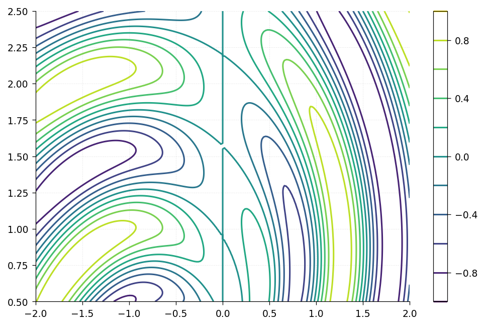

## 2.6 Gauss and Gauss-Jacobi quadrature

For quadrature experts, chebfunjax contains some powerful capabilities due to Nick Hale and Alex Townsend [Hale & Townsend 2013] and Ignace Bogaert [Bogaert, Michiels & Fostier 2012, Bogaert 2014]. To start with, suppose we wish to carry out $4$-point Gauss quadrature over $[-1,1]$.  The quadrature nodes are the zeros of the degree $4$ Legendre polynomial, which can be obtained from the chebfunjax command `legpts`, and if two output arguments are requested, `legpts` provides weights also:

```python
from chebfunjax.utils.quadrature import legpts

s, w = legpts(4)
print(f"s = {s}")
print(f"w = {w}")
```

```
s = [-0.86113631 -0.33998104  0.33998104  0.86113631]
w = [0.34785485 0.65214515 0.65214515 0.34785485]
```

To compute the $4$-point Gauss quadrature approximation to the integral of $\exp(x)$ from $-1$ to $1$, for example, we could now do this:

```python
f = cj.chebfun(jnp.exp)
Igauss = float(jnp.dot(w, f(s)))
Iexact = float(jnp.exp(1.0) - jnp.exp(-1.0))
print(f"Igauss = {Igauss:.15f}")
print(f"Iexact = {Iexact:.15f}")
```

```
Igauss = 2.350402092156377
Iexact = 2.350402387287603
```

There is no need to stop at $4$ points, however. Here we use $1000$ Gauss quadrature points:

```python
t0 = time.time()
s, w = legpts(1000)
Igauss = float(jnp.dot(w, jnp.exp(s)))
t1 = time.time()
print(f"Igauss = {Igauss:.15f}")
print(f"Elapsed time is {t1-t0:.6f} seconds.")
```

```
Igauss = 2.350402387287602
Elapsed time is 0.013837 seconds.
```

Even a million points doesn't take very long:

```python
t0 = time.time()
s, w = legpts(1_000_000)
Igauss = float(jnp.dot(w, jnp.exp(s)))
t1 = time.time()
print(f"Igauss = {Igauss:.15f}")
print(f"Elapsed time is {t1-t0:.6f} seconds.")
```

```
Igauss = 2.350402387287601
Elapsed time is 0.084822 seconds.
```

Traditionally, numerical analysts computed Gauss quadrature nodes and weights by the eigenvalue algorithm of Golub and Welsch [Golub & Welsch 1969]. However, the Hale-Townsend and Bogaert algorithms are both more accurate and much faster [Hale & Townsend 2013, Bogaert, Michiels & Fostier 2012, Bogaert 2014].

For Legendre polynomials, Legendre points, and Gauss quadrature, use `legpoly` and `legpts`. For Chebyshev polynomials, Chebyshev points, and Clenshaw-Curtis quadrature, use `chebpoly` and `chebpts` and the built-in chebfunjax commands such as `sum`.  A third variant is also available: for Jacobi polynomials, Gauss-Jacobi points, and Gauss-Jacobi quadrature, see `jacpoly` and `jacpts`. These arise in integration of functions with singularities at one or both endpoints, and are used internally by chebfunjax for integration of chebfuns with singularities (Chapter 9). See also `hermpts` and `lagpts`.

As explained in the help texts, all of these operators work on general intervals $[a,b]$, not just on $[-1,1]$.

## 2.7 References

[Assheton 2008] P. Assheton, *Comparing Chebfun to Adaptive Quadrature Software*, dissertation, MSc in Mathematical Modelling and Scientific Computing, Oxford University, 2008.

[Bogaert 2014] I. Bogaert, "Iteration-free computation of Gauss-Legendre quadrature nodes and weights", *SIAM Journal on Scientific Computing*, 36 (2014), A1008--A1026.

[Bogaert, Michiels, & Fostier 2012] I. Bogaert, B. Michiels, and J. Fostier, "O(1) computation of Legendre polynomials and Legendre nodes and weights for parallel computing", *SIAM Journal on Scientific Computing*, 34 (2012), C83-C101.

[Espelid 2003] T. O. Espelid, "Doubly adaptive quadrature routines based on Newton-Cotes rules", *BIT Numerical Mathematics*, 43 (2003), 319-337.

[Gentleman 1972] W. M. Gentleman, "Implementing Clenshaw-Curtis quadrature I and II", *Journal of the ACM*, 15 (1972), 337-346 and 353.

[Golub & Welsch 1969] G. H. Golub and J. H. Welsch, "Calculation of Gauss quadrature rules", *Mathematics of Computation*, 23 (1969), 221-230.

[Gonnet 2009] P. Gonnet, *Adaptive Quadrature Re-Revisited*, ETH dissertation no. 18347, Swiss Federal Institute of Technology, 2009.

[Hale & Townsend 2013] N. Hale and A. Townsend, Fast and accurate computation of Gauss-Legendre and Gauss-Jacobi quadrature nodes and weights, *SIAM Journal on Scientific Computing*, 35 (2013), A652-A674.

[Hale & Trefethen 2012] N. Hale and L. N. Trefethen, Chebfun and numerical quadrature, *Science in China*, 55 (2012), 1749-1760.

[Kahaner 1971] D. K. Kahaner, "Comparison of numerical quadrature formulas", in J. R. Rice, ed., *Mathematical Software*, Academic Press, 1971, 229-259.

[Kotnik 2008] T. Kotnik, "The prime-counting function and its analytic approximations", *Advances in Computational Mathematics*, 29 (2008), 55-70.

[Wolfram 2003] S. Wolfram, *The Mathematica Book*, 5th ed., Wolfram Media, 2003.
