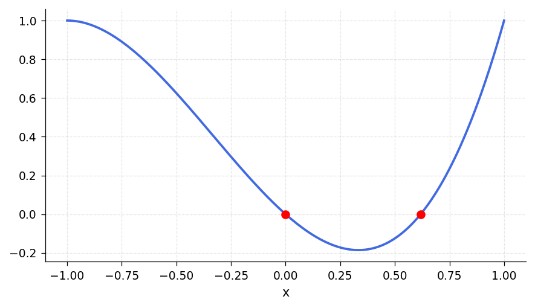
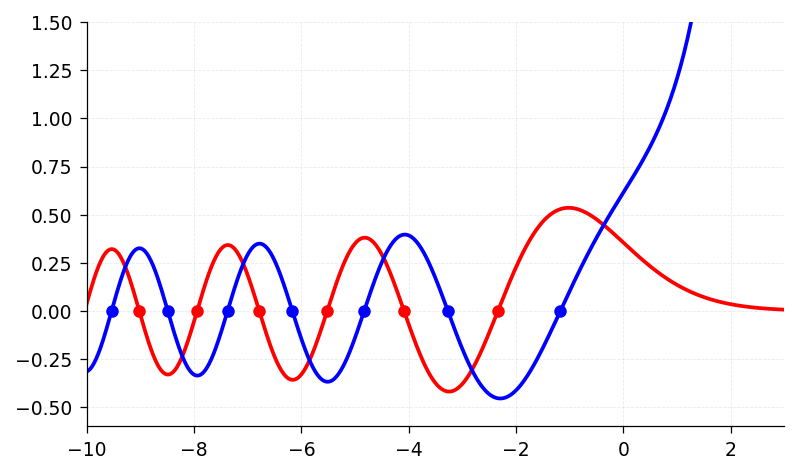
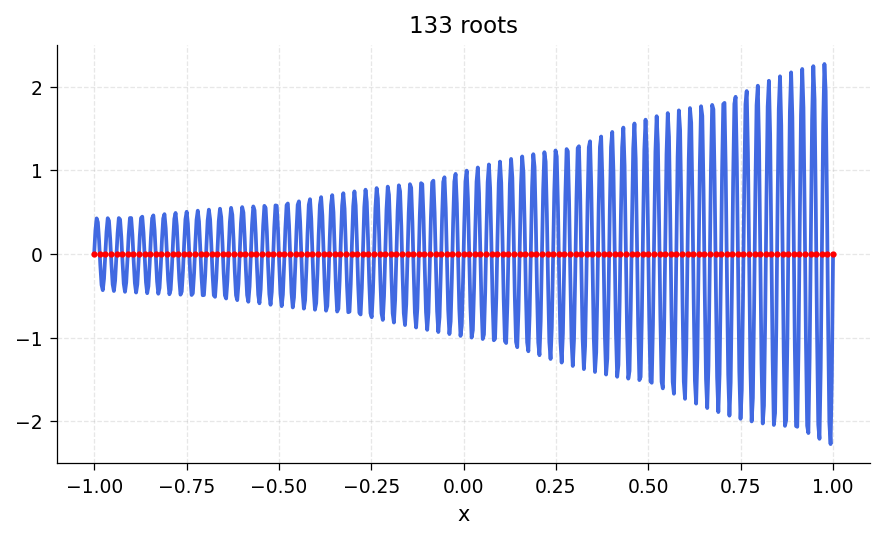
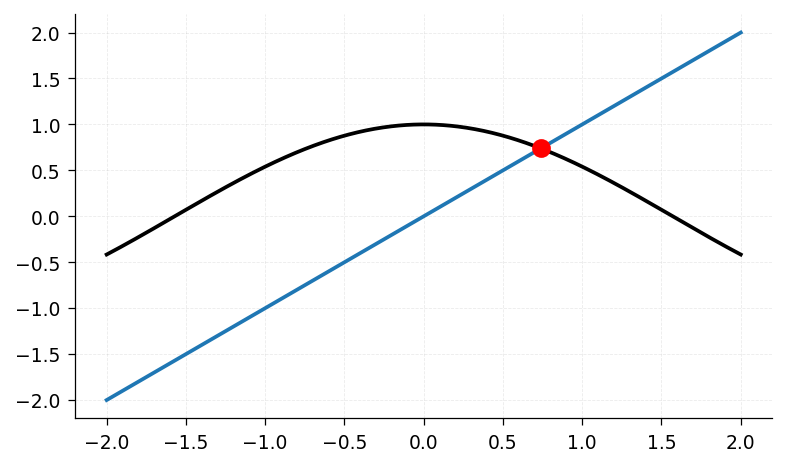
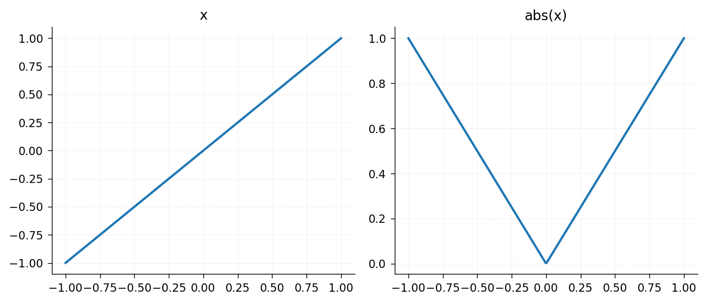
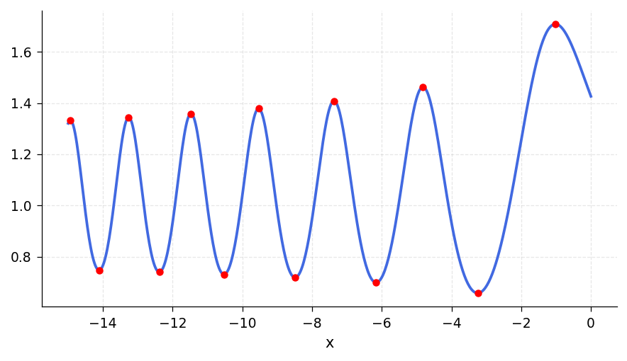
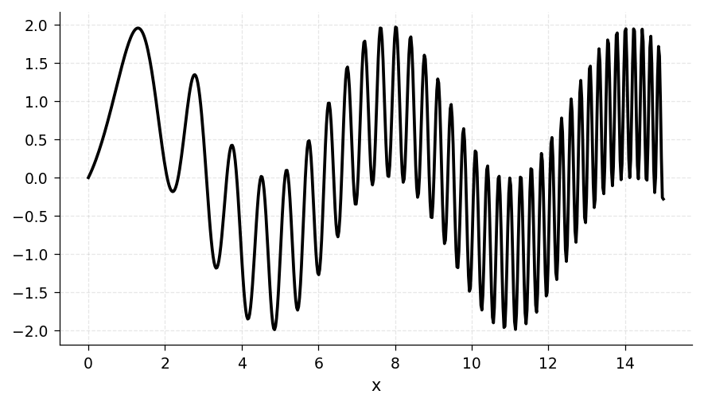
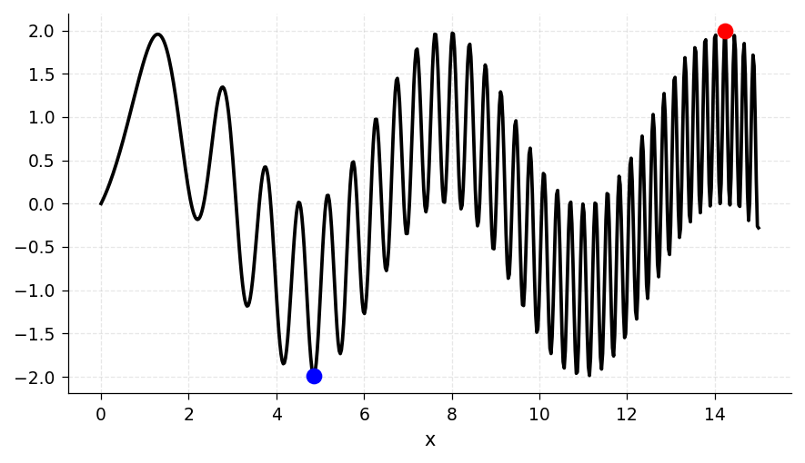

# 3. Rootfinding and Minima and Maxima

*Lloyd N. Trefethen, October 2009, latest revision May 2019*

*Adapted for chebfunjax by the chebfunjax developers*

[previous (guide02)](guide02.md) | [index](index.md) | [next (guide04)](guide04.md)

## 3.1 `roots`

Chebfunjax comes with a global rootfinding capability -- the ability to find all the zeros of a function in its region of definition.  For example, here is a polynomial with two roots in $[-1,1]$:

```python
import jax.numpy as jnp
import chebfunjax as cj

x = cj.chebfun(lambda x: x)
p = x**3 + x**2 - x
r = p.roots()
print(r)
```

```
[ 0.          0.61803399]
```

We can plot $p$ and its roots like this:

```python
fig, ax = cj.plot(p)
ax.plot(r, [float(p(ri)) for ri in r], '.r', markersize=12)
ax.grid(True)
```



Of course, one does not need chebfunjax to find roots of a polynomial. NumPy's `numpy.roots` command works from a polynomial's coefficients and computes estimates of all the roots, not just those in a particular interval.

```python
import numpy as np
print(np.roots([1, 1, -1, 0]))
```

```
[ 0.          -1.61803399   0.61803399]
```

A more substantial example of rootfinding involving a Bessel function was considered in Sections 1.2 and 2.4.  Here is a similar calculation for the Airy functions Ai and Bi, modeled after the page on Airy functions at WolframMathWorld.

```python
import scipy.special as sp

def airy_ai(x):
    x_np = np.asarray(x)
    return jnp.array(sp.airy(x_np)[0])

def airy_bi(x):
    x_np = np.asarray(x)
    return jnp.array(sp.airy(x_np)[2])

Ai = cj.chebfun(airy_ai, domain=[-10, 3])
Bi = cj.chebfun(airy_bi, domain=[-10, 3])

fig, ax = plt.subplots(figsize=(6, 3.5))
xs = np.linspace(-10, 3, 600)
ax.plot(xs, [float(Ai(xi)) for xi in xs], 'r', linewidth=1.8)
ax.plot(xs, [float(Bi(xi)) for xi in xs], 'b', linewidth=1.8)
rA = Ai.roots()
rB = Bi.roots()
ax.plot(np.asarray(rA), [float(Ai(ri)) for ri in rA], '.r', markersize=10)
ax.plot(np.asarray(rB), [float(Bi(ri)) for ri in rB], '.b', markersize=10)
ax.set_xlim(-10, 3)
ax.set_ylim(-0.6, 1.5)
ax.grid(True)
```



Here for example are the three roots of Ai and Bi closest to 0:

```python
print(rA[-3:])
print(rB[-3:])
```

```
[-5.52055983 -4.08794944 -2.33810741]
[-4.83073784 -3.2710933  -1.17371322]
```

Chebfunjax finds roots by a method due to Boyd and Battles [Boyd 2002, Boyd 2014, Battles 2006].  If the chebfun is of degree greater than about $50$, it is broken into smaller pieces recursively.  On each small piece zeros are then found as eigenvalues of a "colleague matrix", the analogue for Chebyshev polynomials of a companion matrix for monomials [Specht 1960, Good 1961]. This method can be startlingly fast and accurate.  For example, here is a sine function with $11$ zeros:

```python
import time

f = cj.chebfun(lambda x: jnp.sin(jnp.pi * x), domain=[0, 10])
lengthf = len(f)
print(f"lengthf = {lengthf}")

t0 = time.time()
r = f.roots()
elapsed = time.time() - t0
print(f"Elapsed time is {elapsed:.6f} seconds.")
print(r)
```

```
lengthf = 44
Elapsed time is 0.004055 seconds.
[ 0.  1.  2.  3.  4.  5.  6.  7.  8.  9. 10.]
```

A similar computation with 101 zeros comes out equally well:

```python
f = cj.chebfun(lambda x: jnp.sin(jnp.pi * x), domain=[0, 100])
lengthf = len(f)
print(f"lengthf = {lengthf}")

t0 = time.time()
r = f.roots()
elapsed = time.time() - t0
print(f"Elapsed time is {elapsed:.6f} seconds.")
for ri in r[-5:]:
    print(f"     {float(ri):22.14f}")
```

```
lengthf = 212
Elapsed time is 0.038469 seconds.
      96.00000000000001
      97.00000000000000
      98.00000000000001
      99.00000000000000
     100.00000000000000
```

And here is the same on an interval with 1001 zeros.

```python
f = cj.chebfun(lambda x: jnp.sin(jnp.pi * x), domain=[0, 1000])
lengthf = len(f)
print(f"lengthf = {lengthf}")

t0 = time.time()
r = f.roots()
elapsed = time.time() - t0
print(f"Elapsed time is {elapsed:.6f} seconds.")
for ri in r[-5:]:
    print(f"     {float(ri):22.13f}")
```

```
lengthf = 1684
Elapsed time is 0.096928 seconds.
      996.0000000000000
      997.0000000000000
      998.0000000000000
      999.0000000000000
     1000.0000000000000
```

Here is an oscillatory function with many roots, analogous to the "fish fillet" example in the Chebfun gallery:

```python
f = cj.chebfun(lambda x: jnp.sin(66 * jnp.pi * x) * jnp.exp(jnp.sin(x)),
                domain=[-1, 1])
t0 = time.time()
r = f.roots()
elapsed = time.time() - t0
print(f"Elapsed time is {elapsed:.6f} seconds.")

fig, ax = cj.plot(f)
ax.plot(np.asarray(r), [float(f(ri)) for ri in r], '.r', markersize=4)
```



With the ability to find zeros, we can solve a variety of nonlinear problems.  For example, where do the curves $x$ and $\cos(x)$ intersect?  Here is the answer.

```python
x = cj.chebfun(lambda x: x, domain=[-2, 2])
f = cj.cos(x)
r = (f - x).roots()
print(r)

fig, ax = plt.subplots(figsize=(6, 3.5))
xs = np.linspace(-2, 2, 600)
ax.plot(xs, [float(x(xi)) for xi in xs], linewidth=1.8)
ax.plot(xs, [float(f(xi)) for xi in xs], 'k', linewidth=1.8)
ax.plot(np.asarray(r), [float(f(ri)) for ri in r], 'or', markersize=8)
```

```
[0.73908513]
```



All of the examples above concern chebfuns consisting of a single fun. If there are several funs, then roots are included at jumps as necessary.

> **Note (chebfunjax):** The MATLAB Chebfun `roots` command supports a `'nojump'` flag to omit roots at discontinuities, and piecewise functions can be constructed from `sign(sin(20*x))`.  These piecewise-construction features are not yet fully supported in chebfunjax.  The `abs` and `sign` methods do introduce breakpoints at roots (see Section 3.2), and `roots` correctly finds zeros across all pieces.

## 3.2 `min`, `max`, `abs`, `sign`, `round`, `floor`, `ceil`

Rootfinding is more central to chebfunjax than one might at first imagine, because a number of commands, when applied to smooth chebfuns, must produce non-smooth results, and it is rootfinding that tells us where to put the discontinuities. For example, the `abs` method introduces breakpoints wherever the argument goes through zero.  Here we see that `x` consists of a single piece, whereas `abs(x)` consists of two pieces.

```python
x = cj.chebfun(lambda x: x)
absx = cj.abs(x)
print(repr(x))
print()
print(repr(absx))
```

```
Chebfun column (1 smooth piece)
       interval       length     endpoint values
[      -1,       1]        2      -1.00      1.00
vscale = 1.00e+00

Chebfun column (2 smooth pieces)
       interval       length     endpoint values
[      -1,       0]        2       1.00      0.00
[       0,       1]        2       0.00      1.00
vscale = 1.00e+00    total length = 4
```

```python
fig, (ax1, ax2) = plt.subplots(1, 2, figsize=(8, 3.5))
xs = np.linspace(-1, 1, 300)
ax1.plot(xs, [float(x(xi)) for xi in xs], linewidth=1.8)
ax1.set_title('x')
ax2.plot(xs, [float(absx(xi)) for xi in xs], linewidth=1.8)
ax2.set_title('abs(x)')
```



We saw this effect already in Section 1.4. Another similar effect shown in that section occurs with the pointwise minimum or maximum of two functions.  In MATLAB Chebfun, breakpoints are introduced at points where `f-g` is zero.

> **Note (chebfunjax):** The two-argument pointwise `min(f, g)` and `max(f, g)` operations, as well as `round`, `floor`, and `ceil`, are not yet implemented in chebfunjax. The `abs` and `sign` methods are fully supported and correctly introduce breakpoints at roots.  These additional operations will be added in a future release.

## 3.3 Local extrema

Local extrema of smooth functions can be located by finding zeros of the derivative.  For example, here is a variant of the Airy function again, with all its extrema in its range of definition located and plotted.

```python
def exp_airy(x):
    x_np = np.asarray(x)
    return jnp.array(np.exp(np.real(sp.airy(x_np)[0])))

f = cj.chebfun(exp_airy, domain=[-15, 0])
fig, ax = cj.plot(f)
r = f.diff().roots()
ax.plot(np.asarray(r), [float(f(ri)) for ri in r], '.r', markersize=8)
ax.grid(True)
```



Chebfunjax users don't have to compute the derivative explicitly to find extrema, however.  The `minandmax` method returns the global minimum and maximum:

```python
(x_min, f_min), (x_max, f_max) = f.minandmax()
print(f"Global min at x = {x_min:.6f}, f(x) = {f_min:.6f}")
print(f"Global max at x = {x_max:.6f}, f(x) = {f_max:.6f}")
```

> **Note (chebfunjax):** MATLAB Chebfun's `minandmax(f, 'local')` returns all local extrema including endpoints, and `min(f, 'local')` and `max(f, 'local')` return local minima and maxima respectively.  In chebfunjax, local extrema can be found by computing `f.diff().roots()` and evaluating `f` at those critical points plus the endpoints.

These methods will find smooth extrema.  For non-smooth extrema (at breakpoints of piecewise functions), one can check the function values at breakpoints directly.  Here is an example showing how to find all critical points:

```python
x = cj.chebfun(lambda x: x)
f = cj.exp(x) * cj.sin(30 * x)
fp = f.diff()
critical_pts = fp.roots()
print(f"Number of critical points: {len(critical_pts)}")
```

Suppose we want to pick out the local extrema that are actually local minima.  We can do that by checking for the second derivative to be positive:

```python
fpp = f.diff(2)
for cp in critical_pts:
    if float(fpp(cp)) > 0:
        print(f"  local min at x = {float(cp):.6f}, f(x) = {float(f(cp)):.6f}")
```

## 3.4 Global extrema: max and min

If `min` or `max` is applied to a single chebfun, it returns its global minimum or maximum.  For example:

```python
f = cj.chebfun(lambda x: 1 - x**2 / 2)
x_min, f_min = f.min()
x_max, f_max = f.max()
print(f"min = {f_min:.15f}   max = {f_max:.15f}")
```

```
min = 0.500000000000000   max = 1.000000000000000
```

Chebfunjax computes such a result by checking the values of `f` at endpoints and at zeros of the derivative.

The `min` and `max` methods return both the location and the value of the extreme point:

```python
x_min, f_min = f.min()
print(f"minval = {f_min:.15f}")
print(f"minpos = {x_min}")
```

```
minval = 0.500000000000000
minpos = -1.0
```

Note that just one position is returned even though the minimum is attained at two points.  This is consistent with the behavior of standard MATLAB and NumPy.

This ability to do global 1D optimization in chebfunjax is rather remarkable.  Here is a nontrivial example.

```python
f = cj.chebfun(lambda x: jnp.sin(x) + jnp.sin(x**2), domain=[0, 15])
fig, ax = cj.plot(f, color='k')
```



The length of this chebfun is not as great as one might imagine:

```python
print(len(f))
```

```
216
```

Here are its global minimum and maximum:

```python
minpos, minval = f.min()
maxpos, maxval = f.max()
print(f"minval = {minval:.15f}")
print(f"minpos = {minpos:.15f}")
print(f"maxval = {maxval:.15f}")
print(f"maxpos = {maxpos:.15f}")

fig, ax = cj.plot(f, color='k')
ax.plot(minpos, minval, '.b', markersize=15)
ax.plot(maxpos, maxval, '.r', markersize=15)
```

```
minval = -1.990085468159407
minpos =  4.852581429906174
maxval =  1.995232599437866
maxpos = 14.234791972306912
```



For larger chebfuns, it is inefficient to compute the global minimum and maximum separately like this -- each one must compute the derivative and find all its zeros. The alternative `minandmax` method mentioned above provides a faster alternative:

```python
(x_min, f_min), (x_max, f_max) = f.minandmax()
print(f"extreme values: [{f_min:.15f}, {f_max:.15f}]")
print(f"extreme positions: [{x_min:.15f}, {x_max:.15f}]")
```

```
extreme values: [-1.990085468159407, 1.995232599437866]
extreme positions: [4.852581429906174, 14.234791972306912]
```

## 3.5 `norm(f, 1)` and `norm(f, jnp.inf)`

The default, $2$-norm form of the `norm` method was considered in Section 2.2. In standard Python one can also compute $1$- and $\infty$-norms with `f.norm(1)` and `f.norm(jnp.inf)`.  These have been implemented in chebfunjax, and in both cases, rootfinding is part of the implementation.  The $1$-norm `f.norm(1)` is the integral of the absolute value, and chebfunjax computes this by adding up segments between zeros, at which $|f(x)|$ will typically have a discontinuous slope. The $\infty$-norm is computed from the formula $\|f\|_\infty = \max(\max(f),-\min(f))$.

For example:

```python
f = cj.chebfun(lambda x: jnp.sin(x), domain=[103, 103 + 4 * jnp.pi])
print(float(f.norm(jnp.inf)))
print(float(f.norm(1)))
```

```
1.000000000000002
7.999999999999992
```

## 3.6 Roots in the complex plane

Chebfuns live on real intervals, and the funs from which they are made live on real subintervals.  But a polynomial representing a fun may have roots outside the interval of definition, which may be complex. Sometimes we may want to get our hands on these roots, and in MATLAB Chebfun the `roots` command makes this possible in various ways through the flags `'all'`, `'complex'`, and `'norecursion'`.

The simplest example is a chebfun that is truly intended to correspond to a polynomial.  For example, the chebfun

```python
x = cj.chebfun(lambda x: x)
f = 1 + 16 * x**2
```

has no roots in $[-1,1]$:

```python
print(f.roots())
```

```
[]
```

> **Note (chebfunjax):** The `'all'`, `'complex'`, and `'norecursion'` flags for roots are not yet implemented in chebfunjax.  The `roots` method currently finds only real roots within the chebfun's domain of definition.  Complex rootfinding capabilities may be added in a future release.

In MATLAB Chebfun, one can extract the complex roots with `roots(f, 'all')`, which for $1 + 16x^2$ gives the pure imaginary roots $\pm i/4$.  The `'complex'` flag filters to return only those complex roots lying inside a "Chebfun ellipse" associated with the function, which tends to select genuine roots near the interval of definition while discarding spurious roots of the polynomial approximation.

One must expect complex roots of chebfuns to lose accuracy as one moves away from the interval of definition.

Here is a more complicated example from MATLAB Chebfun that illustrates the structure of complex roots:

```python
def F(x):
    return 4 + jnp.sin(x) + jnp.sin(jnp.sqrt(2) * x) + jnp.sin(jnp.pi * x)

f = cj.chebfun(F, domain=[-100, 100])
```

This function has a lot of complex roots lying in strips on either side of the real axis.  In MATLAB Chebfun, `roots(f, 'complex')` reveals this beautiful structure.

To find poles in the complex plane as opposed to zeros, see Section 4.8 and also [Austin, Kravanja & Trefethen 2015]. More advanced methods of rootfinding and polefinding are based on rational approximations rather than polynomials, an area where Chebfun has significant capabilities; see the next chapter of this guide, Chapter 28 of [Trefethen 2013], and [Webb 2013].

## 3.7 References

[Austin, Kravanja & Trefethen 2015] A. P. Austin, P. Kravanja, and L. N. Trefethen, "Numerical algorithms based on analytic function values at roots of unity", *SIAM Journal on Numerical Analysis*, to appear.

[Battles 2006] Z. Battles, *Numerical Linear Algebra for Continuous Functions*, DPhil thesis, Oxford University Computing Laboratory, 2006.

[Boyd 2002] J. A. Boyd, "Computing zeros on a real interval through Chebyshev expansion and polynomial rootfinding", *SIAM Journal on Numerical Analysis*, 40 (2002), 1666-1682.

[Boyd 2014] J. A. Boyd, *Solving Transcendental Equations: The Chebyshev Polynomial Proxy and Other Numerical Rootfinders, Perturbation Series, and Oracles*, SIAM, 2014.

[Good 1961] I. J. Good, "The colleague matrix, a Chebyshev analogue of the companion matrix", *Quarterly Journal of Mathematics*, 12 (1961), 61-68.

[Specht 1960] W. Specht, "Die Lage der Nullstellen eines Polynoms. IV", *Mathematische Nachrichten*, 21 (1960), 201-222.

[Trefethen 2013] L. N. Trefethen, *Approximation Theory and Approximation Practice*, SIAM, 2013.

[Webb 2013] M. Webb, "Computing complex singularities of differential equations with Chebfun", *SIAM Undergraduate Research Online*, 6 (2013), [http://dx.doi.org/10.1137/12S011520](http://dx.doi.org/10.1137/12S011520).
