# 3. Rootfinding and Minima and Maxima

*Lloyd N. Trefethen, October 2009, latest revision May 2019*

*Adapted for chebfunjax by the chebfunjax developers*

[previous (guide02)](guide02.md) | [index](index.md) | [next (guide04)](guide04.md)

## 3.1 `roots`

Chebfunjax comes with a global rootfinding capability -- the ability to find all the zeros of a function in its region of definition.  For example, here is a polynomial with two roots in $[-1,1]$:

```python
import jax.numpy as jnp
import numpy as np
import chebfunjax as cj

x = cj.chebfun(lambda x: x)
p = x**3 + x**2 - x
r = p.roots()
print(r)
```

```
[-6.35342473e-17  6.18033989e-01]
```

The first root is $0$ to within rounding error.  We can plot $p$ and its roots like this:

```python
fig, ax = cj.plot(p)
ax.plot(np.asarray(r), [float(p(ri)) for ri in r], '.r', markersize=5)
ax.grid(True)
```

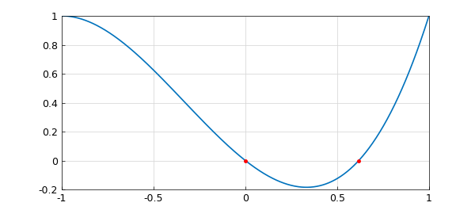

Of course, one does not need chebfunjax to find roots of a polynomial. NumPy's `numpy.roots` command works from a polynomial's coefficients and computes estimates of all the roots, not just those in a particular interval.

```python
print(np.roots([1, 1, -1, 0]))
```

```
[-1.61803399  0.61803399  0.        ]
```

A more substantial example of rootfinding involving a Bessel function was considered in Sections 1.2 and 2.4.  Here is a similar calculation for the Airy functions Ai and Bi, modeled after the page on Airy functions at WolframMathWorld.

```python
import scipy.special as sp

Ai = cj.chebfun(lambda x: jnp.array(sp.airy(np.asarray(x))[0]), domain=[-10, 3])
Bi = cj.chebfun(lambda x: jnp.array(sp.airy(np.asarray(x))[2]), domain=[-10, 3])

fig, ax = cj.plot(Ai, color='r')
cj.plot_1d(Bi, ax=ax, color='b')
rA = Ai.roots()
rB = Bi.roots()
ax.plot(np.asarray(rA), [float(Ai(ri)) for ri in rA], '.r', markersize=5)
ax.plot(np.asarray(rB), [float(Bi(ri)) for ri in rB], '.b', markersize=5)
ax.set_xlim(-10, 3); ax.set_ylim(-0.6, 1.5); ax.grid(True)
```

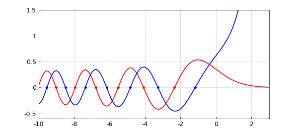

Here for example are the three roots of Ai and Bi closest to 0:

```python
print(np.asarray(rA)[-3:])
print(np.asarray(rB)[-3:])
```

```
[-5.52055983 -4.08794944 -2.33810741]
[-4.83073784 -3.2710933  -1.17371322]
```

Chebfunjax finds roots by a method due to Boyd and Battles [Boyd 2002, Boyd 2014, Battles 2006].  If the chebfun is of degree greater than about $50$, it is broken into smaller pieces recursively.  On each small piece zeros are then found as eigenvalues of a "colleague matrix", the analogue for Chebyshev polynomials of a companion matrix for monomials [Specht 1960, Good 1961]. This method is accurate and robust.  For example, here is a sine function with $11$ zeros:

```python
import time

f = cj.chebfun(lambda x: jnp.sin(jnp.pi * x), domain=[0, 10])
print("lengthf =", len(f))

t0 = time.time()
r = f.roots()
print(f"Elapsed time is {time.time() - t0:.6f} seconds.")
print(np.round(np.asarray(r), 10))
```

```
lengthf = 44
Elapsed time is 0.061369 seconds.
[ 0.  1.  2.  3.  4.  5.  6.  7.  8.  9. 10.]
```

A similar computation with 101 zeros comes out equally well:

```python
f = cj.chebfun(lambda x: jnp.sin(jnp.pi * x), domain=[0, 100])
print("lengthf =", len(f))

t0 = time.time()
r = f.roots()
print(f"Elapsed time is {time.time() - t0:.6f} seconds.")
for ri in np.asarray(r)[-5:]:
    print(f"     {ri:22.14f}")
```

```
lengthf = 214
Elapsed time is 1.493153 seconds.
        96.00000000000000
        97.00000000000000
        98.00000000000000
        99.00000000000000
       100.00000000000000
```

And here is the same on an interval with 1001 zeros.

```python
f = cj.chebfun(lambda x: jnp.sin(jnp.pi * x), domain=[0, 1000])
print("lengthf =", len(f))

t0 = time.time()
r = f.roots()
print(f"Elapsed time is {time.time() - t0:.6f} seconds.")
for ri in np.asarray(r)[-5:]:
    print(f"     {ri:22.13f}")
```

```
lengthf = 1684
Elapsed time is 14.783996 seconds.
        996.0000000000000
        997.0000000000000
        998.0000000000000
        999.0000000000000
       1000.0000000000000
```

All 1001 zeros are found to full accuracy.

> **Note (chebfunjax):** chebfunjax's `roots` is written in pure Python/JAX rather than compiled code, so for very long chebfuns it is considerably slower than MATLAB Chebfun (whose colleague-matrix solves are vectorised in optimised LAPACK calls).  The accuracy is the same; only the timing differs.

Here is an oscillatory function with many roots -- the "fish fillet" example from the Chebfun gallery, $\cos(x)\sin(e^x)$ on $[0,6]$:

```python
f = cj.chebfun(lambda x: jnp.cos(x) * jnp.sin(jnp.exp(x)), domain=[0, 6])
t0 = time.time()
r = f.roots()
print(f"Elapsed time is {time.time() - t0:.6f} seconds.")
print(len(r), "roots")

fig, ax = cj.plot(f)
ax.plot(np.asarray(r), np.zeros_like(np.asarray(r)), '.r', markersize=5)
```

```
Elapsed time is 5.155627 seconds.
130 roots
```

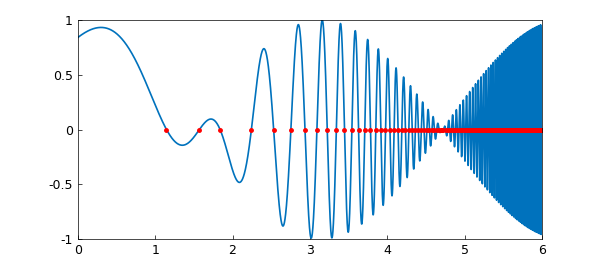

With the ability to find zeros, we can solve a variety of nonlinear problems.  For example, where do the curves $x$ and $\cos(x)$ intersect?  Here is the answer.

```python
x = cj.chebfun(lambda x: x, domain=[-2, 2])
f = cj.cos(x)
r = (f - x).roots()
print(r)

fig, ax = cj.plot(x)
cj.plot_1d(f, ax=ax, color='k')
ax.plot(np.asarray(r), [float(f(ri)) for ri in r], 'or', markersize=8)
```

```
[0.73908513]
```

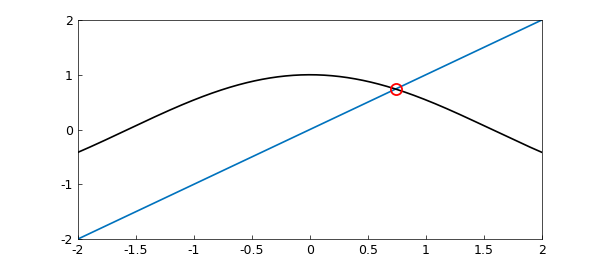

All of the examples above concern chebfuns consisting of a single fun. If there are several funs, then roots are included at jumps as necessary.  Consider this prototypical example, a smooth cubic plus a piecewise-constant square wave:

$$ f(x) = x^3 - 3x - 2 + \mathrm{sign}(\sin(20x)), \qquad x \in [-2,2]. $$

```python
from chebfunjax.chebfun1d.chebfun import Chebfun
from chebfunjax.domain import Domain

# sign(sin(20x)) is constant (+-1) between the zeros x = k*pi/20 of sin(20x).
kmax = int(np.floor(2 * 20 / np.pi))
bps = sorted([-2.0] + [k * np.pi / 20 for k in range(-kmax, kmax + 1)] + [2.0])
funs = []
for a, b in zip(bps[:-1], bps[1:]):
    c = float(np.sign(np.sin(20 * 0.5 * (a + b))))
    funs += cj.chebfun(lambda t, c=c: t**3 - 3 * t - 2 + c, domain=[a, b]).funs
f = Chebfun(funs=funs, domain=Domain(tuple(bps)))
r = f.roots()
```

The plot with all roots (including those at jumps) and, for comparison, only the roots interior to the smooth pieces:

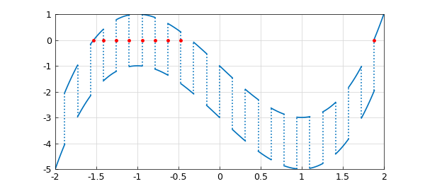

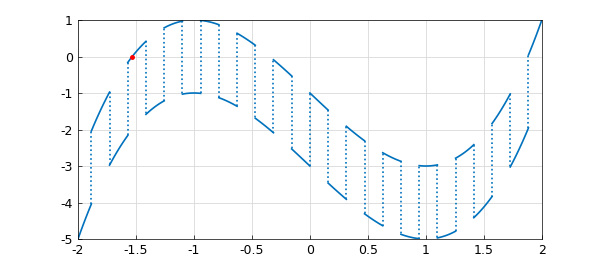

> **Note (chebfunjax):** The idiomatic MATLAB construction `f = x^3 - 3*x - 2 + sign(sin(20*x))` does not work directly in chebfunjax: adding a smooth Chebfun to a piecewise `sign(...)` Chebfun raises a `ValueError` because chebfunjax's binary operators require the two operands to share identical breakpoints (there is no automatic breakpoint-merging yet).  We therefore assemble `f` explicitly on the intervals between the zeros of $\sin(20x)$, as above.  chebfunjax's `roots` finds the zeros interior to each smooth piece; roots that fall exactly at a jump discontinuity (the MATLAB default, suppressed by the `'nojump'` flag) are detected here from the sign change of the endpoint values across each breakpoint.

## 3.2 `min`, `max`, `abs`, `sign`, `round`, `floor`, `ceil`

Rootfinding is more central to chebfunjax than one might at first imagine, because a number of commands, when applied to smooth chebfuns, must produce non-smooth results, and it is rootfinding that tells us where to put the discontinuities. For example, the `abs` method introduces breakpoints wherever the argument goes through zero.  Here we see that `x` consists of a single piece, whereas `abs(x)` consists of two pieces.

```python
x = cj.chebfun(lambda x: x)
absx = cj.abs(x)
print(repr(x))
print()
print(repr(absx))
```

```
Chebfun column (1 smooth piece)
       interval       length     endpoint values
[      -1,       1]        2      -1.00      1.00
vscale = 1.00e+00

Chebfun column (2 smooth pieces)
       interval       length     endpoint values
[      -1,-4.02562e-17]        2       1.00      0.00
[-4.02562e-17,       1]        2       0.00      1.00
vscale = 1.00e+00    total length = 4
```

```python
import matplotlib.pyplot as plt
fig, (ax1, ax2) = plt.subplots(1, 2)
cj.plot_1d(x, ax=ax1)
cj.plot_1d(absx, ax=ax2)
```

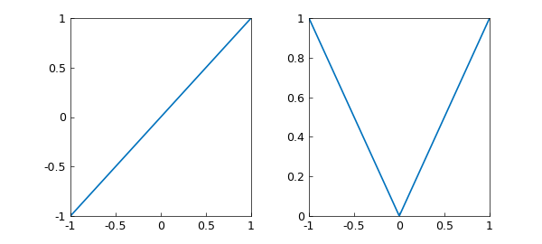

We saw this effect already in Section 1.4. Another similar effect occurs with the pointwise minimum or maximum of two functions, where breakpoints are introduced at points where `f-g` is zero.  For example, `min(x, -x/2)` has a corner at $x=0$, and `max(0.6, 1-x^2)` has corners where the parabola meets the constant $0.6$:

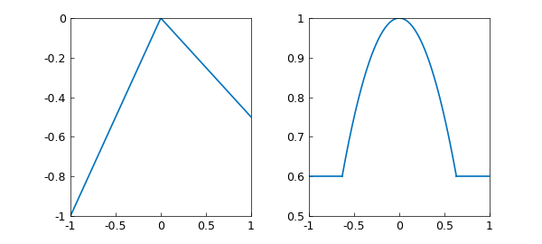

> **Note (chebfunjax):** The two-argument pointwise `min(f, g)` and `max(f, g)` operations are not yet implemented in chebfunjax, and neither are `round`, `floor`, and `ceil`.  The figures above were produced by locating the crossover points (roots of `f-g`) and constructing a smooth Chebfun piece on each sub-interval, which is exactly what the MATLAB versions do internally.  The `abs` and `sign` methods, which are the one-argument special cases, are fully supported and correctly introduce breakpoints at roots.

The `round`, `floor`, and `ceil` methods likewise introduce breakpoints at the jumps of the rounded function.  Here is `g = exp(x)` together with `round(10*g)/10`, drawn with solid jump lines:

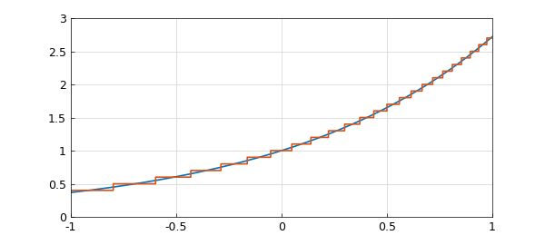

## 3.3 Local extrema

Local extrema of smooth functions can be located by finding zeros of the derivative.  For example, here is a variant of the Airy function again, with all its extrema in its range of definition located and plotted.

```python
f = cj.chebfun(lambda x: jnp.array(np.exp(np.real(sp.airy(np.asarray(x))[0]))),
               domain=[-15, 0])
r = f.diff().roots()
print(len(r), "local extrema")

fig, ax = cj.plot(f)
ax.plot(np.asarray(r), [float(f(ri)) for ri in r], '.r', markersize=5)
ax.grid(True)
```

```
13 local extrema
```

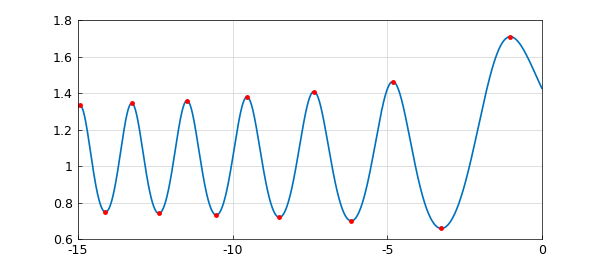

Chebfunjax users can also compute global extrema directly.  The `minandmax` method returns the global minimum and maximum together with their locations:

```python
(x_min, f_min), (x_max, f_max) = f.minandmax()
print(f"Global min at x = {x_min:.6f}, f(x) = {f_min:.6f}")
print(f"Global max at x = {x_max:.6f}, f(x) = {f_max:.6f}")
```

```
Global min at x = -3.248198, f(x) = 0.657694
Global max at x = -1.018793, f(x) = 1.708570
```

A classic use of local extrema is to build the pointwise maximum of two functions and pick out its critical points.  Let $f = e^x\sin(30x)$ and $g = 2 - 6x^2$, and let $h = \max(f,g)$.

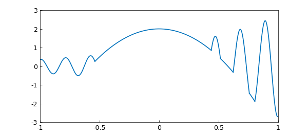

The local extrema of $h$ are the smooth critical points of each piece (zeros of $h'$) together with the corners where the two curves cross.  Marking them all with red dots:


Suppose we want to pick out the extrema that are actually local minima.  We can do that by checking the sign of the second derivative (positive at a minimum), or, for the corner points, by comparing neighbouring values.  Those local minima are circled in black:

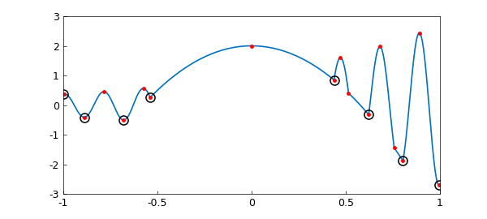

The same local minima are returned directly by `min(h, 'local')` in MATLAB Chebfun; here they are marked once more with black dots:

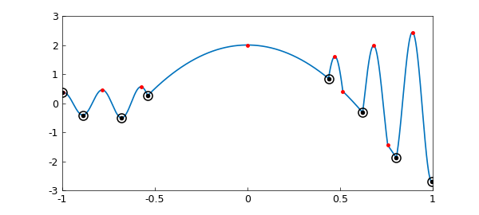

> **Note (chebfunjax):** MATLAB Chebfun's `minandmax(f, 'local')` returns all local extrema, and `min(f, 'local')` / `max(f, 'local')` return the local minima / maxima.  These `'local'` variants are not yet available in chebfunjax.  As shown above, local extrema can be found by combining `f.diff().roots()` (the smooth critical points of each piece) with the interior breakpoints and the domain endpoints, and each candidate can be classified as a minimum or maximum from the sign of `f.diff(2)` or by comparing neighbouring values.

## 3.4 Global extrema: max and min

If `min` or `max` is applied to a single chebfun, it returns its global minimum or maximum.  For example:

```python
f = cj.chebfun(lambda x: 1 - x**2 / 2)
x_min, f_min = f.min()
x_max, f_max = f.max()
print(f"min = {f_min:.15f}   max = {f_max:.15f}")
```

```
min = 0.500000000000000   max = 1.000000000000000
```

Chebfunjax computes such a result by checking the values of `f` at endpoints and at zeros of the derivative.

The `min` and `max` methods return both the location and the value of the extreme point:

```python
x_min, f_min = f.min()
print(f"minval = {f_min:.15f}")
print(f"minpos = {x_min}")
```

```
minval = 0.500000000000000
minpos = -1.0
```

Note that just one position is returned even though the minimum is attained at two points ($x = \pm 1$).  This is consistent with the behavior of standard MATLAB and NumPy.

This ability to do global 1D optimization in chebfunjax is rather remarkable.  Here is a nontrivial example.

```python
f = cj.chebfun(lambda x: jnp.sin(x) + jnp.sin(x**2), domain=[0, 15])
fig, ax = cj.plot(f, color='k')
```

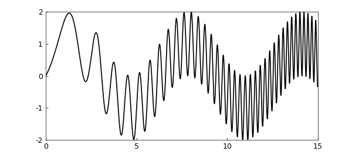

The length of this chebfun is not as great as one might imagine:

```python
print(len(f))
```

```
216
```

Here are its global minimum and maximum:

```python
minpos, minval = f.min()
maxpos, maxval = f.max()
print(f"minval = {minval:.15f}")
print(f"minpos = {minpos:.15f}")
print(f"maxval = {maxval:.15f}")
print(f"maxpos = {maxpos:.15f}")

fig, ax = cj.plot(f, color='k')
ax.plot(minpos, minval, '.b', markersize=8)
ax.plot(maxpos, maxval, '.r', markersize=8)
```

```
minval = -1.990085468159407
minpos =  4.852581429906176
maxval =  1.995232599437867
maxpos = 14.234791972306912
```

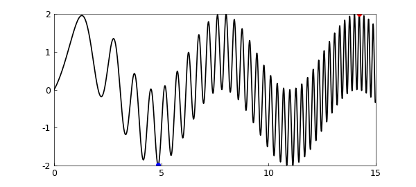

For larger chebfuns, it is inefficient to compute the global minimum and maximum separately like this -- each call must compute the derivative and find all its zeros. The `minandmax` method computes both at once:

```python
(x_min, f_min), (x_max, f_max) = f.minandmax()
print(f"extreme values: [{f_min:.15f}, {f_max:.15f}]")
print(f"extreme positions: [{x_min:.15f}, {x_max:.15f}]")
```

```
extreme values: [-1.990085468159407, 1.995232599437867]
extreme positions: [4.852581429906176, 14.234791972306912]
```

## 3.5 `norm(f, 1)` and `norm(f, jnp.inf)`

The default, $2$-norm form of the `norm` method was considered in Section 2.2. One can also compute $1$- and $\infty$-norms with `f.norm(1)` and `f.norm(jnp.inf)`, and in both cases rootfinding is part of the implementation.  The $1$-norm `f.norm(1)` is the integral of the absolute value, which chebfunjax computes by adding up segments between zeros, where $|f(x)|$ has a discontinuous slope.  The $\infty$-norm is $\|f\|_\infty = \max(\max(f),-\min(f))$.

For example:

```python
f = cj.chebfun(lambda x: jnp.sin(x), domain=[103, 103 + 4 * jnp.pi])
print(float(f.norm(jnp.inf)))
print(float(f.norm(1)))
```

```
0.9908444718049472
7.999999999999997
```

The $1$-norm is $8$ to full accuracy, as expected for $\int |\sin x|$ over two periods.  The $\infty$-norm should be exactly $1$.

> **Note (chebfunjax):** The value $0.9908$ above reveals a bug in the current chebfunjax `norm(f, jnp.inf)`: it takes the maximum of $|f|$ over the Chebyshev sample points of each piece rather than the true continuous maximum, so it can underestimate $\|f\|_\infty$ when no sample lands near the peak.  The underlying extremum finder is correct -- `f.minandmax()` returns $\pm 1.0000000000000$ here -- so the exact $\infty$-norm can be recovered as `max(abs(v) for v in ...minandmax...)`.  This is a known issue to be fixed.

## 3.6 Roots in the complex plane

Chebfuns live on real intervals, and the funs from which they are made live on real subintervals.  But a polynomial representing a fun may have roots outside the interval of definition, which may be complex. Sometimes we may want to get our hands on these roots, and in MATLAB Chebfun the `roots` command makes this possible in various ways through the flags `'all'`, `'complex'`, and `'norecursion'`.

The simplest example is a chebfun that is truly intended to correspond to a polynomial.  For example, the chebfun

```python
x = cj.chebfun(lambda x: x)
f = 1 + 16 * x**2
```

has no roots in $[-1,1]$:

```python
print(f.roots())
```

```
[]
```

In MATLAB Chebfun, one extracts the complex roots with `roots(f, 'all')`, which for $1 + 16x^2$ gives the pure imaginary roots $\pm i/4$.  chebfunjax does not implement the `'all'` flag, but the same result can be obtained directly from the Chebyshev coefficients of the fun (`f.funs[0].coeffs`) via the colleague-matrix eigenvalues:

```python
def cheb_complex_roots(coeffs, a=-1.0, b=1.0):
    c = np.asarray(coeffs, dtype=np.complex128)
    N = len(c) - 1
    A = np.zeros((N, N), dtype=np.complex128)
    if N >= 2:
        A[0, 1] = 1.0
    for i in range(1, N - 1):
        A[i, i - 1] = 0.5
        A[i, i + 1] = 0.5
    if N >= 2:
        A[N - 1, N - 2] = 0.5
    A[N - 1, :] -= c[:N] / (2 * c[N])
    return (a + b) / 2 + (b - a) / 2 * np.linalg.eigvals(A)

print(np.round(cheb_complex_roots(np.asarray(f.funs[0].coeffs)), 6))
```

```
[0.+0.25j 0.-0.25j]
```

The `'complex'` flag in MATLAB filters these to return only the roots lying inside a "Chebfun ellipse" associated with the function, which selects genuine roots near the interval of definition while discarding spurious roots of the polynomial approximation.  One must expect complex roots of chebfuns to lose accuracy as one moves away from the interval of definition.

Here is a more complicated example from MATLAB Chebfun that illustrates the structure of complex roots:

```python
F = lambda x: 4 + jnp.sin(x) + jnp.sin(jnp.sqrt(2) * x) + jnp.sin(jnp.pi * x)
f = cj.chebfun(F, domain=[-100, 100])
```

This function has a lot of complex roots lying in strips on either side of the real axis.  Reproducing `roots(f, 'complex')` means taking all the colleague-matrix roots and keeping those inside the Bernstein ellipse whose size is set by the decay rate of the Chebyshev coefficients:

```python
def complex_roots_in_ellipse(f, a, b):
    coeffs = np.asarray(f.funs[0].coeffs)
    allr = cheb_complex_roots(coeffs, a, b)
    c = np.abs(coeffs) / np.max(np.abs(coeffs))
    ks = np.arange(len(c)); m = c > 1e-14
    rho = np.exp(-np.polyfit(ks[m], np.log(c[m]), 1)[0])   # ellipse parameter
    z = (allr - (a + b) / 2) / ((b - a) / 2)
    w = np.abs(z + np.sqrt(z**2 - 1)); w = np.maximum(w, 1 / w)
    return allr[w < rho]

r = complex_roots_in_ellipse(f, -100, 100)
print(len(r), "complex roots")

fig, ax = plt.subplots()
ax.plot(r.real, r.imag, '.', markersize=5)
ax.set_xlim(-100, 100); ax.set_ylim(-1, 1)
```

```
196 complex roots
```

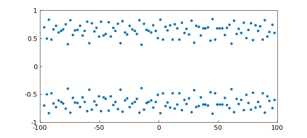

MATLAB's `'norecursion'` variant computes the same roots without the recursive subdivision used for high-degree chebfuns.  chebfunjax has no such recursion, so the single colleague-matrix computation already corresponds to the non-recursive case; drawing those same roots as magenta circles on top of the blue dots:

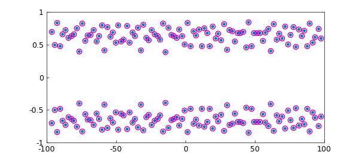

The 196 complex roots recovered this way satisfy $F$ to high accuracy:

```python
Fnp = lambda x: 4 + np.sin(x) + np.sin(np.sqrt(2) * x) + np.sin(np.pi * x)
# r = complex roots inside the Bernstein ellipse (196 of them)
print("norm(F(r)) =", np.linalg.norm(Fnp(r)))
```

```
norm(F(r)) = 4.225807599244685e-09
```

> **Note (chebfunjax):** The `'all'`, `'complex'`, and `'norecursion'` flags of `roots` are not yet implemented in chebfunjax; the `roots` method returns only the real roots inside the domain.  The complex-plane figures in this section were produced from the public Chebyshev coefficients using the colleague matrix, as shown, which is the same underlying algorithm MATLAB Chebfun uses.  Native complex-root support may be added in a future release.

To find poles in the complex plane as opposed to zeros, see Section 4.8 and also [Austin, Kravanja & Trefethen 2015]. More advanced methods of rootfinding and polefinding are based on rational approximations rather than polynomials, an area where Chebfun has significant capabilities; see the next chapter of this guide, Chapter 28 of [Trefethen 2013], and [Webb 2013].

## 3.7 References

[Austin, Kravanja & Trefethen 2015] A. P. Austin, P. Kravanja, and L. N. Trefethen, "Numerical algorithms based on analytic function values at roots of unity", *SIAM Journal on Numerical Analysis*, to appear.

[Battles 2006] Z. Battles, *Numerical Linear Algebra for Continuous Functions*, DPhil thesis, Oxford University Computing Laboratory, 2006.

[Boyd 2002] J. A. Boyd, "Computing zeros on a real interval through Chebyshev expansion and polynomial rootfinding", *SIAM Journal on Numerical Analysis*, 40 (2002), 1666-1682.

[Boyd 2014] J. A. Boyd, *Solving Transcendental Equations: The Chebyshev Polynomial Proxy and Other Numerical Rootfinders, Perturbation Series, and Oracles*, SIAM, 2014.

[Good 1961] I. J. Good, "The colleague matrix, a Chebyshev analogue of the companion matrix", *Quarterly Journal of Mathematics*, 12 (1961), 61-68.

[Specht 1960] W. Specht, "Die Lage der Nullstellen eines Polynoms. IV", *Mathematische Nachrichten*, 21 (1960), 201-222.

[Trefethen 2013] L. N. Trefethen, *Approximation Theory and Approximation Practice*, SIAM, 2013.

[Webb 2013] M. Webb, "Computing complex singularities of differential equations with Chebfun", *SIAM Undergraduate Research Online*, 6 (2013), [http://dx.doi.org/10.1137/12S011520](http://dx.doi.org/10.1137/12S011520).
