# Chapter 4: Chebfun and Approximation Theory

*Based on [Chebfun Guide Chapter 4](https://www.chebfun.org/docs/guide/guide04.html) by Lloyd N. Trefethen*

## 4.1 Chebyshev Points and Interpolants

Chebfunjax is built on polynomial interpolation at Chebyshev points.  The
$n$ Chebyshev points of the second kind on $[-1, 1]$ are

$$x_j = -\cos\!\left(\frac{j\pi}{n-1}\right), \qquad j = 0, 1, \ldots, n-1.$$

These are the extrema (plus endpoints) of the Chebyshev polynomial $T_{n-1}(x)$,
and they cluster near the endpoints of the interval.  You can compute them with:

```python
import jax.numpy as jnp
import chebfunjax as cj
from chebfunjax.utils.quadrature import chebpts

pts = chebpts(10)
print(pts)
```

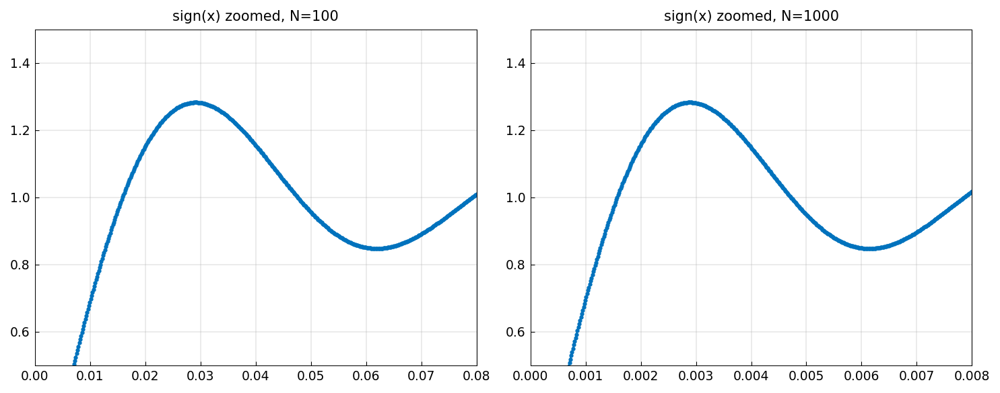


A chebfun of length $n$ is the unique polynomial of degree $\leq n-1$ that
interpolates the function values at these $n$ Chebyshev points.  Equivalently,
it is a truncated Chebyshev series:

$$p(x) = \sum_{k=0}^{n-1} c_k\, T_k(x),$$

where $T_k(x) = \cos(k \arccos x)$ is the $k$-th Chebyshev polynomial of the
first kind.

## 4.2 Chebyshev Coefficients

The Chebyshev coefficients $c_0, c_1, \ldots, c_{n-1}$ of a chebfun are
accessible via the `coeffs` property:

```python
f = cj.chebfun(jnp.exp)
c = f.coeffs
print(f"Number of coefficients: {len(c)}")
for k in range(min(8, len(c))):
    print(f"  c[{k}] = {float(c[k]):.15e}")
```

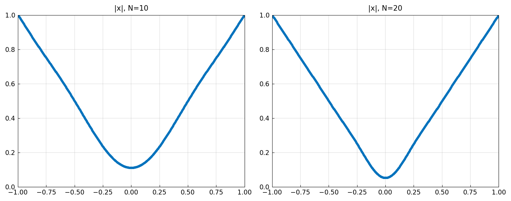


For the exponential function on $[-1, 1]$, the Chebyshev coefficients are
related to modified Bessel functions: $c_k = 2 I_k(1)$ for $k \geq 1$ (and
$c_0 = I_0(1)$).

### Plotting coefficients

The `plotcoeffs` function produces a semilog plot of the absolute values of
the Chebyshev coefficients:

```python
f = cj.chebfun(jnp.exp)
cj.plotcoeffs(f)
```

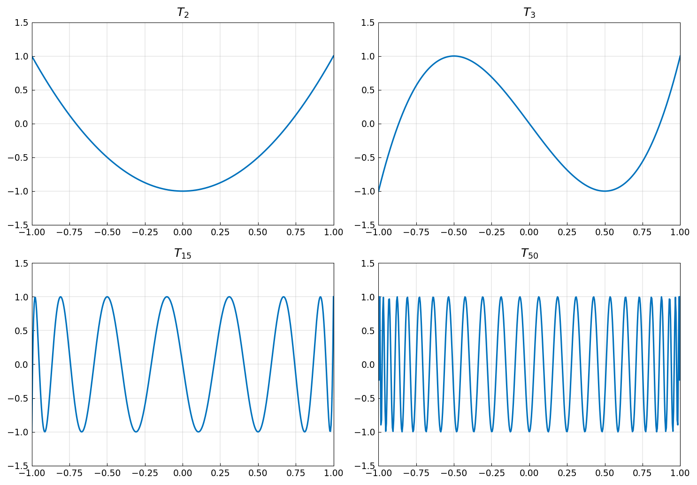

For an *analytic* function (one that can be continued analytically to a region
in the complex plane), the coefficients decay geometrically -- the semilog
plot is approximately a straight line.  For functions with limited smoothness,
the decay is algebraic -- the semilog plot curves downward more slowly.

## 4.3 Chebyshev Polynomials

The Chebyshev polynomials themselves are available via:

```python
from chebfunjax.utils.polynomials import chebpoly

# T_5(x) as a coefficient array
T5_coeffs = chebpoly(5)
print(T5_coeffs)
# [0. 0. 0. 0. 0. 1.]  -- only the degree-5 coefficient is nonzero

# Build a chebfun representing T_5:
T5 = cj.Chebfun.from_coeffs(T5_coeffs)
print(float(T5(0.5)))  # T_5(0.5) = cos(5 * arccos(0.5))
```

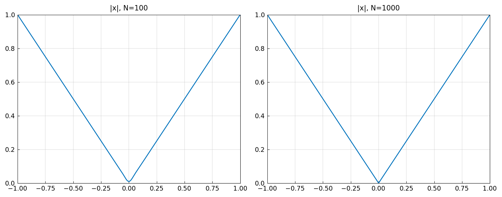


The Chebyshev polynomials satisfy the three-term recurrence

$$T_0(x) = 1, \quad T_1(x) = x, \quad T_{k+1}(x) = 2x\,T_k(x) - T_{k-1}(x),$$

and the trigonometric identity $T_k(\cos\theta) = \cos(k\theta)$.

## 4.4 Five Theorems of Approximation Theory

The power of Chebyshev interpolation rests on several key theorems.  Here we
state them informally and illustrate each with chebfunjax.

### Theorem 1: Near-best approximation

*Chebyshev interpolants are near-best polynomial approximants.*

If $p_n^*$ is the best (minimax) polynomial approximation of degree $n$ to a
continuous function $f$ on $[-1, 1]$, and $p_n$ is the Chebyshev interpolant
of degree $n$, then

$$\|f - p_n\|_\infty \leq \left(2 + \frac{2}{\pi}\log(n+1)\right) \|f - p_n^*\|_\infty.$$

The logarithmic factor grows so slowly that, in practice, Chebyshev
interpolants are within a small constant factor of optimal.

```python
# Demonstrate near-optimality: compare truncated Chebyshev series
# with the function for various degrees
f = cj.chebfun(lambda x: 1.0 / (1 + 25 * x**2))
for n in [10, 20, 40, 80]:
    fn = f.polyfit(n)
    err = (f - fn).norm(jnp.inf)
    print(f"  degree {n:3d}: ||f - p_n||_inf = {float(err):.6e}")
```

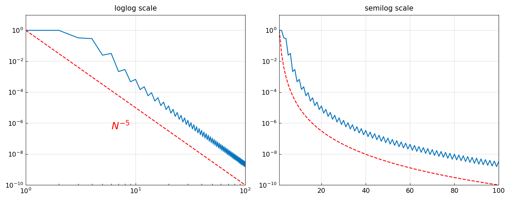


### Theorem 2: Algebraic convergence for smooth functions

*If $f$ has $k$ continuous derivatives with the $k$-th derivative of bounded
variation, then the Chebyshev interpolant converges at rate $O(n^{-k})$.*

This means: the smoother the function, the faster the convergence.

```python
# |x| has a kink at x=0: convergence is O(n^{-1})
f = cj.chebfun(lambda x: jnp.abs(x))
for n in [10, 20, 40, 80, 160]:
    fn = cj.chebfun(lambda x: jnp.abs(x), n=n)
    err_coeffs = f.coeffs
    # Approximate the error by looking at the tail of the Chebyshev series
    print(f"  n = {n:4d}: last |coeff| = {float(jnp.abs(fn.coeffs[-1])):.6e}")
```

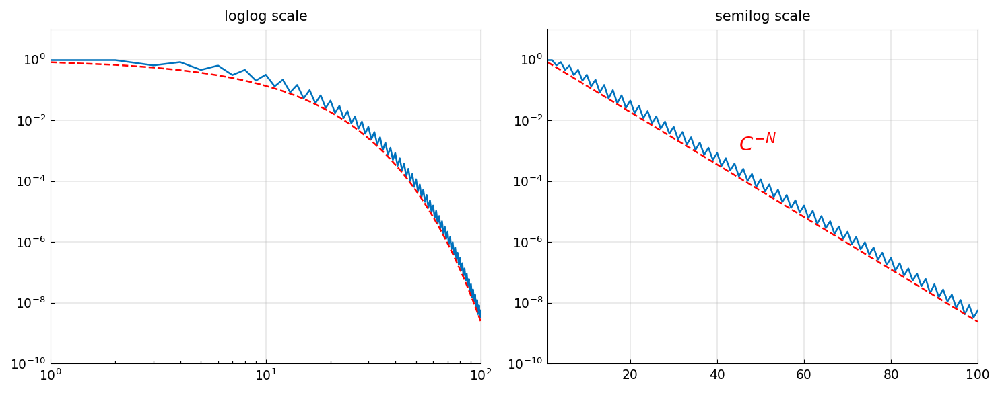


### Theorem 3: Geometric convergence for analytic functions

*If $f$ is analytic in a neighborhood of $[-1, 1]$, then the Chebyshev
interpolant converges geometrically: the error decays as $O(\rho^{-n})$ for
some $\rho > 1$.*

The constant $\rho$ is determined by the *Bernstein ellipse* -- the largest
ellipse with foci at $\pm 1$ in which $f$ is analytic.  For entire functions
like $e^x$ or $\sin(x)$, the convergence is faster than geometric
(supergeometric).

```python
# exp(x) is entire: super-geometric convergence
f = cj.chebfun(jnp.exp)
c = f.coeffs
print("Coefficients of exp(x):")
for k in range(len(c)):
    print(f"  c[{k}] = {float(jnp.abs(c[k])):.6e}")
# Note: the coefficients decay faster than any geometric rate
```

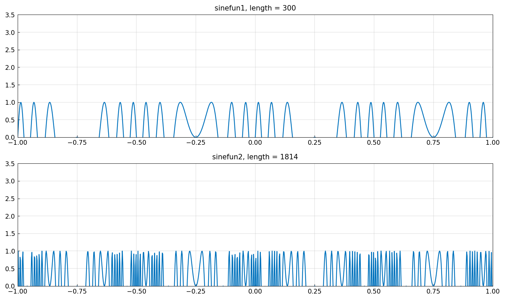


The Runge function $1/(1 + 25x^2)$ has poles at $x = \pm i/5$ in the complex
plane.  The Bernstein ellipse that avoids these poles has
$\rho = 1/5 + \sqrt{1 + 1/25} \approx 1.2099$, so the Chebyshev interpolant
converges geometrically at rate $\approx 1.21^{-n}$:

```python
f = cj.chebfun(lambda x: 1.0 / (1 + 25 * x**2))
c = f.coeffs
print(f"Length of Runge chebfun: {len(c)}")
# The coefficients decay at rate ~1.21^{-k}
```

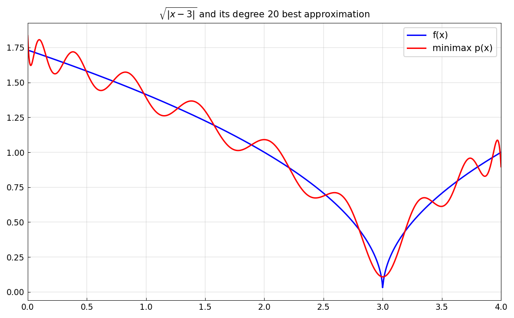


### Theorem 4: Barycentric interpolation formula

*The polynomial interpolant through data $(x_j, f_j)$ at Chebyshev points can
be evaluated stably via the barycentric formula:*

$$p(x) = \frac{\displaystyle\sum_{j=0}^{n} \frac{(-1)^j w_j f_j}{x - x_j}}{\displaystyle\sum_{j=0}^{n} \frac{(-1)^j w_j}{x - x_j}},$$

where $w_j$ are the barycentric weights (with a factor of $1/2$ for the
endpoints).

In chebfunjax, evaluation actually uses the Clenshaw algorithm (recurrence
on the Chebyshev coefficients) rather than the barycentric formula.  The
Clenshaw algorithm is equally stable and more natural for Chebyshev series.

### Theorem 5: Numerical stability

*Both the barycentric formula and the Clenshaw algorithm are numerically stable
for polynomial evaluation, even for very high degrees.*

This means you can safely construct and evaluate chebfuns of degree 1000 or
even 1,000,000 without worrying about catastrophic roundoff.

## 4.5 The Gibbs Phenomenon

When you approximate a discontinuous function by a polynomial, the polynomial
overshoots near the discontinuity.  This is the Gibbs phenomenon, and it
limits Chebyshev approximation to convergence at rate $O(n^{-1})$ in the
max-norm.

```python
# sign(x) -- a discontinuous function
# The Chebyshev interpolant of degree n overshoots by ~9%
x = cj.chebfun(lambda x: x)
for n in [21, 51, 101]:
    s = cj.chebfun(lambda x: jnp.sign(x), n=n)
    x_max, f_max = s.max()
    print(f"  n = {n:4d}: max overshoot = {float(f_max):.6f}")
    # The overshoot converges to 2/pi * integral of sin(t)/t from 0 to pi
    # = 1.17898... (about 18% above 1, or 9% of the jump)
```

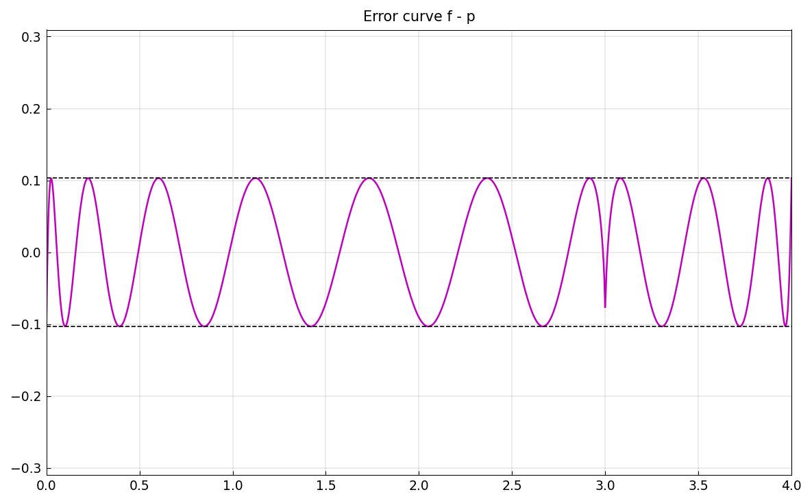


The remedy for the Gibbs phenomenon is to use *piecewise* polynomial
representations, which is exactly what chebfunjax does with breakpoints.  The
`abs` and `sign` methods automatically insert breakpoints at discontinuities.

## 4.6 Convergence Rates in Practice

The rate at which the Chebyshev coefficients decay reveals the smoothness
of the function:

| Function type | Coefficient decay | Example |
|---|---|---|
| Discontinuous | $O(1/k)$ | $\mathrm{sign}(x)$ |
| Continuous, not $C^1$ | $O(1/k^2)$ | $\|x\|$ |
| $C^{s-1}$, not $C^s$ | $O(1/k^{s+1})$ | $x^s$ for non-integer $s$ |
| $C^\infty$ | Faster than any $O(1/k^s)$ | $e^{-1/x^2}$ |
| Analytic | $O(\rho^{-k})$ for some $\rho > 1$ | $1/(1+25x^2)$ |
| Entire | Faster than any $O(\rho^{-k})$ | $e^x$, $\sin(x)$ |

You can observe this directly via `plotcoeffs`:

```python
import jax.numpy as jnp
import chebfunjax as cj

# Analytic: geometric decay
f1 = cj.chebfun(jnp.exp)
cj.plotcoeffs(f1)

# Non-smooth: algebraic decay
f2 = cj.chebfun(lambda x: jnp.abs(x))
cj.plotcoeffs(f2)
```

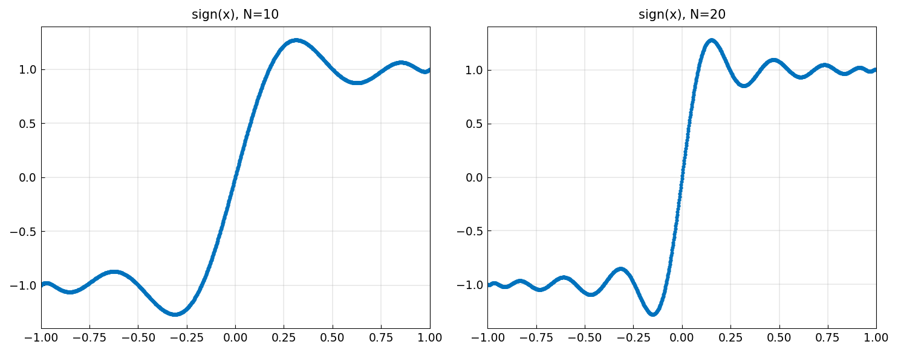

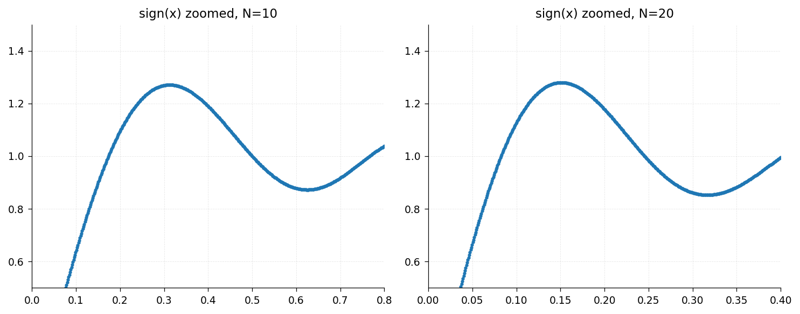

## 4.7 The Runge Phenomenon

The Runge phenomenon demonstrates why Chebyshev points are essential.
With equispaced interpolation, the polynomial approximation to even a simple
smooth function can diverge catastrophically as the degree increases.

The key quantity is the *Lebesgue constant* $\Lambda_n$, defined as the
maximum of the Lebesgue function:

$$\Lambda_n = \max_{x \in [-1,1]} \sum_{j=0}^{n} |\ell_j(x)|,$$

where $\ell_j$ are the Lagrange basis polynomials.  For equispaced points,
$\Lambda_n$ grows exponentially ($\sim 2^n / (e\, n \log n)$), while for
Chebyshev points it grows only logarithmically ($\sim (2/\pi) \log n$).

This logarithmic growth is why Chebyshev interpolation converges for all
continuous functions (Weierstrass approximation theorem), while equispaced
interpolation can diverge.

```python
from chebfunjax.utils.lebesgue import lebesgue

# Compare Lebesgue constants
for n in [5, 10, 20, 40]:
    # Chebyshev Lebesgue constant
    pts_cheb = chebpts(n)
    L_cheb = lebesgue(pts_cheb)
    print(f"  n = {n:3d}: Chebyshev Lambda = {L_cheb:.4f}")
```

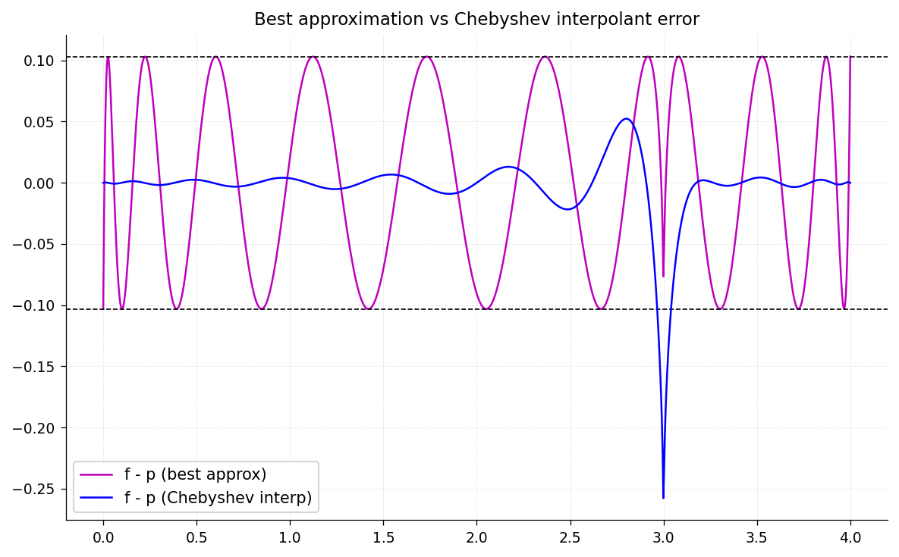


## 4.8 Polynomial Fitting: polyfit

The `polyfit` method computes the best $L^2$ polynomial approximation of a
given degree by truncating the Chebyshev series:

```python
f = cj.chebfun(jnp.exp)
print(f"Full chebfun length: {len(f)}")

# Degree-5 least-squares fit (keeps first 6 coefficients)
f5 = f.polyfit(5)
print(f"Degree-5 fit length: {len(f5)}")

# Error
err = (f - f5).norm(jnp.inf)
print(f"Max error of degree-5 fit: {float(err):.6e}")
```

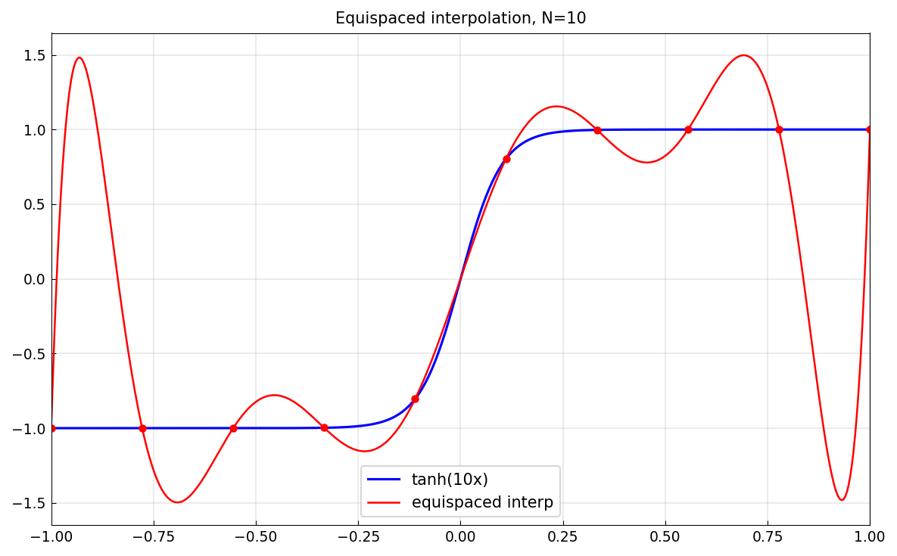


Because the Chebyshev polynomials are orthogonal on $[-1, 1]$ (with respect
to the weight $1/\sqrt{1-x^2}$), truncation of the Chebyshev series gives an
approximation that is near-best in both the $L^2$ and $L^\infty$ norms.

## 4.9 Construction from Data

When you have function values at arbitrary (non-Chebyshev) points, you can
build a chebfun via polynomial interpolation:

```python
import jax.numpy as jnp
import chebfunjax as cj

# Data at 10 random points
key = jax.random.PRNGKey(42)
x_data = jnp.sort(jax.random.uniform(key, (10,), minval=-1, maxval=1))
y_data = jnp.sin(5 * x_data)

f = cj.Chebfun.interp1(x_data, y_data)
```


Or for cubic spline interpolation:

```python
f_spline = cj.Chebfun.spline(x_data, y_data)
```

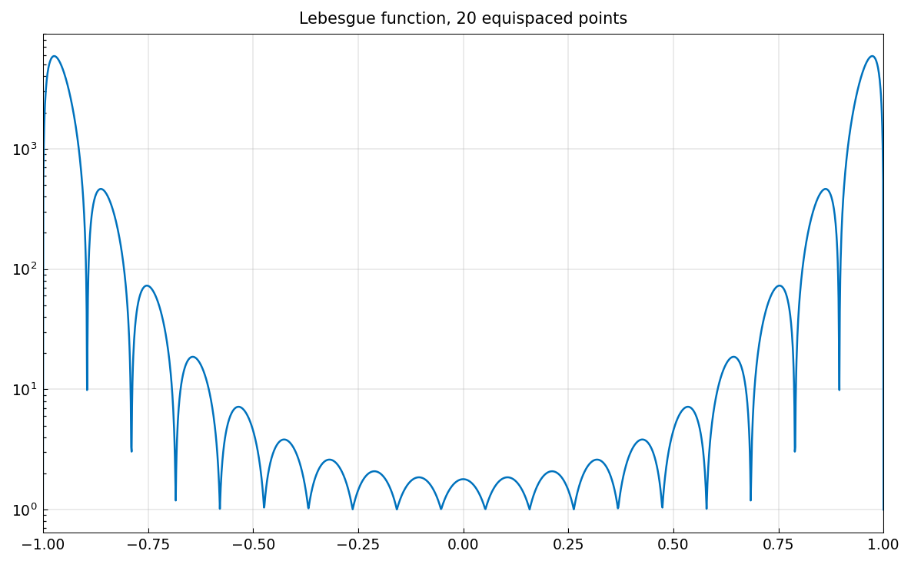


And for shape-preserving piecewise cubic Hermite interpolation:

```python
f_pchip = cj.Chebfun.pchip(x_data, y_data)
```

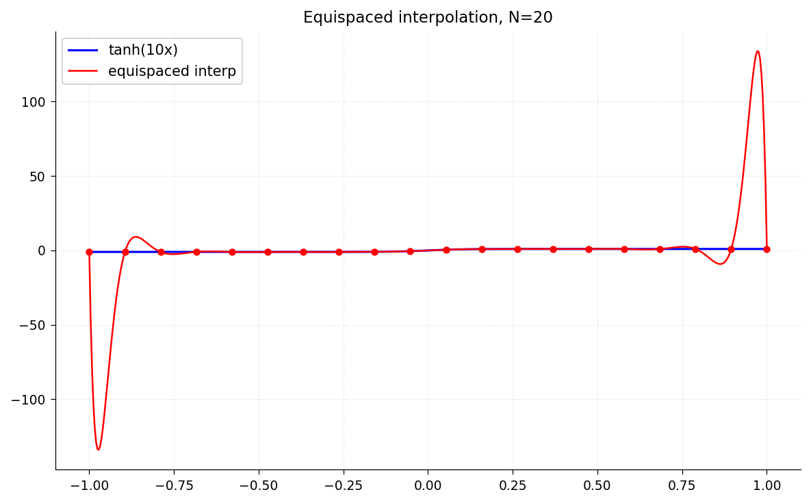


## 4.10 From Chebyshev to Legendre and Back

Chebyshev and Legendre expansions are two common ways to represent polynomials.
The conversion between them can be done in $O(n \log^2 n)$ time using the
fast algorithms of Hale and Townsend.  The quadrature module provides both
Chebyshev and Legendre points:

```python
from chebfunjax.utils.quadrature import chebpts, legpts

cheb_pts = chebpts(10)
leg_pts, leg_wts = legpts(10)

print("Chebyshev points:", cheb_pts)
print("Legendre points: ", leg_pts)
print("Legendre weights:", leg_wts)
```

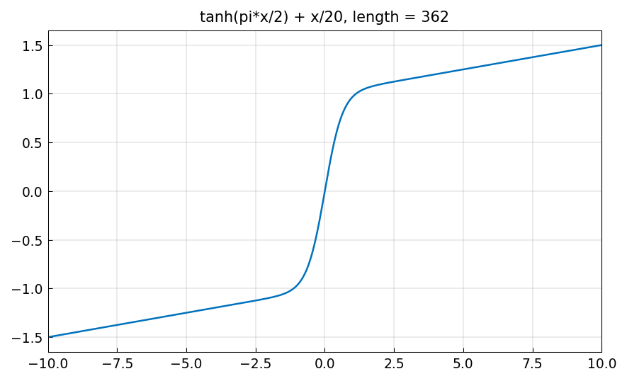


## 4.11 Historical Notes

The mathematical theory behind chebfunjax dates to Pafnuty Chebyshev
(1821-1894), who studied the polynomials bearing his name in the context of
best approximation.  The practical use of Chebyshev expansions for numerical
computation began in the 1950s with the work of Lanczos, Fox, and Clenshaw,
and was greatly accelerated by the discovery of the Fast Fourier Transform
in 1965.

The Chebfun system, which pioneered the idea of treating functions as
computational objects via Chebyshev technology, was created by Zachary Battles
and Nick Trefethen at the University of Oxford in 2002-2005.

## 4.12 Summary

| Concept | Key idea |
|---|---|
| Chebyshev points | Cluster near endpoints; $O(\log n)$ Lebesgue constant |
| Chebyshev series | $f(x) = \sum c_k T_k(x)$; coefficients via FFT |
| Convergence | Algebraic for $C^k$, geometric for analytic, super-geometric for entire |
| Near-best | Chebyshev interpolant within $O(\log n)$ of minimax |
| Gibbs phenomenon | 9% overshoot for discontinuities; cure is piecewise representation |
| Runge phenomenon | Equispaced interpolation diverges; Chebyshev points avoid this |

## 4.13 References

- L. N. Trefethen, *Approximation Theory and Approximation Practice*,
  Extended Edition, SIAM, 2020.
- J. P. Boyd, *Chebyshev and Fourier Spectral Methods*, 2nd edition,
  Dover, 2001.
- N. Hale and A. Townsend, "A fast, simple, and stable Chebyshev-Legendre
  transform using an asymptotic formula," *SIAM J. Sci. Comp.* 36 (2014),
  A148-A167.