# 4. Chebfun and Approximation Theory

*Based on [Chebfun Guide Chapter 4](https://www.chebfun.org/docs/guide/guide04.html) by Lloyd N. Trefethen*
*Python/chebfunjax translation, 2026*

## 4.1  Chebyshev series and interpolants

Chebfunjax is founded on the mathematical subject of approximation theory, and in particular, on Chebyshev series and interpolants. Conversely, it provides a simple environment in which to demonstrate these approximants and other approximation ideas.

The history of "Chebyshev technology" goes back to the 19th century Russian mathematician P. L. Chebyshev (1821-1894) and his mathematical descendants such as Zolotarev and Bernstein (1880-1968). These men realized that just as Fourier series provide an efficient way to represent a smooth periodic function, series of Chebyshev polynomials can do the same for a smooth nonperiodic function. Much of the relevant material is collected in the Chebfun-based book *Approximation Theory and Approximation Practice* [Trefethen 2013].

Let us begin with a look at Chebyshev polynomials. The Chebyshev polynomial of degree $n$ is defined for $x \in [-1,1]$ by $T_n(x) = \cos(n\cos^{-1}x)$. In chebfunjax the degree-$n$ Chebyshev polynomial is available as a coefficient vector from `chebpoly`, and it can be turned into a Chebfun with `Chebfun.from_coeffs`:

```python
import jax.numpy as jnp
import numpy as np
import chebfunjax as cj
from chebfunjax.utils.polynomials import chebpoly

T2 = cj.Chebfun.from_coeffs(jnp.array(chebpoly(2)))
```

Here are the first nine Chebyshev polynomials expressed in the monomial basis (the analogue of MATLAB's `poly(chebpoly(n))`):

```
T0:  1
T1:  x
T2:  2x^2 - 1
T3:  4x^3 - 3x
T4:  8x^4 - 8x^2 + 1
T5:  16x^5 - 20x^3 + 5x
T6:  32x^6 - 48x^4 + 18x^2 - 1
T7:  64x^7 - 112x^5 + 56x^3 - 7x
T8:  128x^8 - 256x^6 + 160x^4 - 32x^2 + 1
```

The expansion of a function in Chebyshev polynomials, unlike the monomial expansion, is a numerically stable representation.

Here are plots of $T_2$, $T_3$, $T_{15}$, and $T_{50}$:

```python
import matplotlib.pyplot as plt

fig, axes = plt.subplots(2, 2)
for ax, N in zip(axes.flat, [2, 3, 15, 50]):
    T = cj.Chebfun.from_coeffs(jnp.array(chebpoly(N)))
    xs = np.linspace(-1, 1, 3000)
    ax.plot(xs, np.asarray(T(jnp.array(xs))))
    ax.set_ylim(-1.5, 1.5)
```

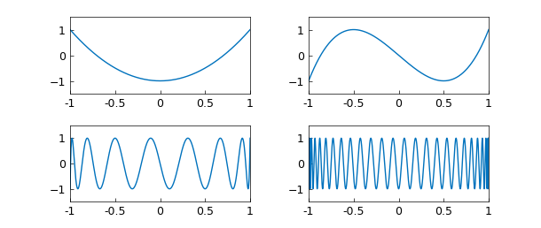

A Chebyshev series is an expansion $f(x) = \sum_{k=0}^{\infty} a_k T_k(x)$, and the $a_k$ are known as Chebyshev coefficients. So long as $f$ is Lipschitz continuous, it has a unique such expansion, which converges absolutely and uniformly. Chebfunjax represents smooth functions on $[-1,1]$ by their Chebyshev coefficients, which is the reason for the "cheb" in the name.

## 4.2  `chebcoeffs` and `poly`

The command `chebpoly(n)` returns the coefficients of the degree-$n$ Chebyshev polynomial. More often we want to go the other way, computing the Chebyshev coefficients of a given Chebfun. These are available directly as `f.coeffs`. For example, here are the Chebyshev coefficients of $x^3$:

```python
x = cj.chebfun(lambda x: x)
(x**3).coeffs
```
```
Array([0.  , 0.75, 0.  , 0.25])
```

This tells us that $x^3 = \tfrac34 T_1(x) + \tfrac14 T_3(x)$.

Here on the other hand are the Chebyshev coefficients of $\sin(x)$:

```python
cj.chebfun(lambda x: jnp.sin(x)).coeffs
```
```
Array([ 0.        ,  0.88010117, -0.        , -0.03912670,  0.        ,
        0.00049951, ...])   # length 14
```

The absence of even-order coefficients reflects that $\sin(x)$ is an odd function, and the rapid decay reflects its smoothness.

The Chebyshev coefficients are essentially independent of scale. Multiplying $\sin(x)$ by $10^{100}$ multiplies the coefficients by the same factor and leaves the length unchanged:

```python
cj.chebfun(lambda x: 1e100 * jnp.sin(x)).coeffs
```
```
Array([ 3.568e+83,  8.801e+99, -4.227e+83, -3.913e+98, ...])
```

The relationship between a Chebfun's Chebyshev coefficients and its monomial ("Taylor") coefficients is numerically delicate. For $\exp(x)$ the Chebyshev representation has length 15, and the exact monomial coefficients would be $1/k!$; but converting between the two bases is exponentially ill-conditioned in the degree, so chebfunjax does not offer a `poly` command. The Chebyshev representation is the stable one.

## 4.3  `chebfun(...,N)` and the Gibbs phenomenon

We can examine the effect of truncating a Chebyshev series by asking chebfunjax to construct a Chebfun with a fixed number of points $N$ rather than adaptively. This is done by passing `n=N` to the constructor. For a discontinuous function, the truncated interpolant exhibits the Gibbs phenomenon: an oscillatory overshoot near the jump. Here is $\mathrm{sign}(x)$ interpolated in $N = 10$ and $N = 20$ Chebyshev points (dots mark the interpolation nodes):

```python
f = cj.chebfun(lambda x: jnp.sign(x), n=10)
f.plot()   # '.-' style: line through the Chebyshev points with dot markers
```

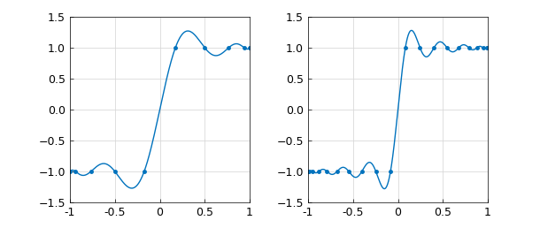

If we zoom in near the discontinuity we can see the overshoot more clearly:

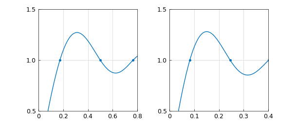

The overshoot does not diminish as $N$ increases; it simply gets narrower. Here are the interpolants for $N = 100$ and $N = 1000$, zoomed to $[0, 0.08]$ and $[0, 0.008]$:

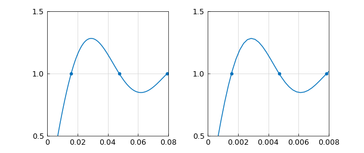

The height of the maximum overshoot converges to a constant, the Gibbs constant for Chebyshev interpolation. Here is `max(f)` for $N = 2, 4, 8, \ldots, 256$:

```python
for N in [2, 4, 8, 16, 32, 64, 128, 256]:
    f = cj.chebfun(lambda x: jnp.sign(x), n=N)
    print(f"{N:5d}  {float(f.max()[1]):.8f}")
```
```
    2   1.00000000
    4   1.18807518
    8   1.26355125
   16   1.27816423
   32   1.28131717
   64   1.28204939
  128   1.28222585
  256   1.28226917
```

The overshoot approaches the limiting value $\approx 1.282283$.

## 4.4  Smoothness and rate of convergence

The number of points chebfunjax needs to resolve a function to machine precision reflects the function's smoothness. A function analytic in a neighborhood of $[-1,1]$ has geometrically decaying Chebyshev coefficients, so only a few dozen points are needed; a function with a singularity has coefficients that decay only algebraically, so many more are needed.

Here is $|x|$ interpolated in $N = 10$ and $N = 20$ points, then in $N = 100$ and $N = 1000$ points:

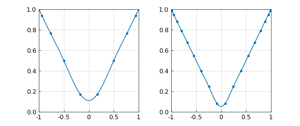

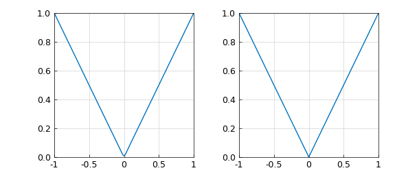

The interpolant improves only slowly, because $|x|$ has a corner at $x = 0$. We can measure the error against the exact function on a fine grid:

```python
for N in [10, 100, 1000]:
    fN = cj.chebfun(lambda x: jnp.abs(x), n=N)
    xs = np.linspace(-1, 1, 5000)
    err = np.max(np.abs(np.asarray(fN(jnp.array(xs))) - np.abs(xs)))
    print(f"err{N} = {err:.3e}")
```
```
err10   = 1.109e-01
err100  = 9.902e-03
err1000 = 8.106e-04
```

The error decreases in proportion to $1/N$ — first-order algebraic convergence — because $|x|$ has a first-order singularity.

The smoother a function, the shorter its adaptive Chebfun. The functions $|x|\,x^k$ gain continuous derivatives as $k$ increases, and the lengths shrink:

```python
for k in [1, 2, 3, 4]:
    print(len(cj.chebfun(lambda x, k=k: jnp.abs(x) * x**k)))
```
```
65537
 1259
  694
  389
```

For $k = 2, 3, 4$ the function has enough continuous derivatives to be resolved in a few hundred to a thousand points. For $k = 1$, $|x|\,x = \mathrm{sign}(x)\,x^2$ has only one continuous derivative, and chebfunjax's global (non-splitting) construction fails to resolve the corner, returning the "unhappy" maximum of 65537 points. (Chebfunjax does not yet support automatic edge detection / splitting; with an explicit breakpoint at $x=0$ the two smooth pieces would resolve immediately.)

For a function like $|x|^5$ with an isolated algebraic singularity, the truncation error decays like $N^{-5}$. We can see this by comparing the fixed-$N$ interpolants against the adaptive Chebfun on log-log and semi-log axes:

```python
exact = cj.chebfun(lambda x: jnp.abs(x)**5)
NN = np.arange(1, 101)
e = np.array([float((cj.chebfun(lambda x: jnp.abs(x)**5, n=int(N)) - exact).norm(2))
              for N in NN])
```

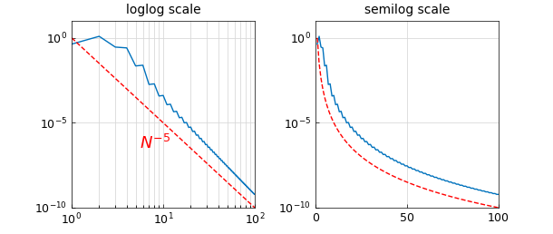

The straight line on the log-log plot (left) confirms the algebraic rate $N^{-5}$ (dashed red reference line). For a function analytic in a neighborhood of $[-1,1]$, like the Runge function $1/(1+25x^2)$, the convergence is instead *geometric* — a straight line on the semi-log plot:

```python
exact = cj.chebfun(lambda x: 1 / (1 + 25 * x**2))
c = 1/5 + np.sqrt(1 + 1/25)          # geometric rate
e = np.array([float((cj.chebfun(lambda x: 1 / (1 + 25 * x**2), n=int(N)) - exact).norm(2))
              for N in NN])
```

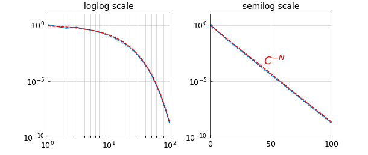

The geometric rate $C^{-N}$ is governed by the size of the largest Bernstein ellipse in which the function is analytic.

## 4.5  Five theorems

The mathematics underlying these observations is developed in [Trefethen 2013] through a sequence of theorems. Loosely: (1) a Lipschitz continuous function has a unique, absolutely convergent Chebyshev series; (2) the smoother the function, the faster the coefficients decay; (3) an analytic function has geometrically convergent coefficients; (4) the truncation and interpolation errors are of the same size as the tail of the coefficient series; and (5) the Chebyshev interpolant is within a modest factor of the best possible polynomial approximation.

A striking illustration is provided by two functions that look almost identical but have very different lengths. The gallery function `sinefun1` is $1.75 + \sin(50x)$, which is analytic, and `sinefun2` is $(1.75 + \sin(50x))^{1.0001}$, which is *not* analytic (the fractional power introduces branch points):

```python
f1 = cj.chebfun(lambda x: 1.75 + jnp.sin(50 * x))
f2 = cj.chebfun(lambda x: (1.75 + jnp.sin(50 * x))**1.0001)
print(len(f1), len(f2))
```

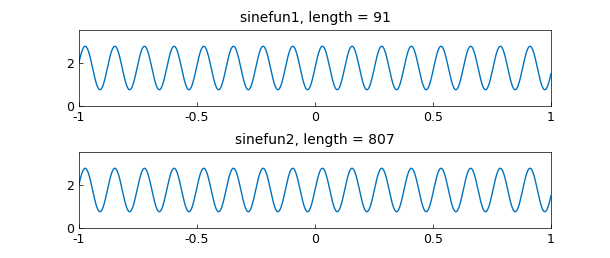

The two curves are visually indistinguishable, yet `sinefun2` needs many more points than `sinefun1` — the tiny exponent $1.0001$ destroys analyticity and slows the convergence dramatically.

## 4.6  Best approximations and the minimax command

For a given function $f$ and degree $n$, the *best* (minimax, or $L^\infty$) polynomial approximation is the polynomial $p$ of degree $\le n$ that minimizes $\|f - p\|_\infty$. Chebfunjax computes it with `minimax`. Here is the degree-20 best approximation to $\sqrt{|x-3|}$ on $[0,4]$:

```python
from chebfunjax.utils.minimax import minimax
from chebfunjax.domain import Domain

f = lambda x: jnp.sqrt(jnp.abs(x - 3.0))
mm = minimax(f, 20, domain=(0.0, 4.0))
p = cj.Chebfun.from_coeffs(jnp.array(mm.coeffs), domain=Domain([0.0, 4.0]))
```

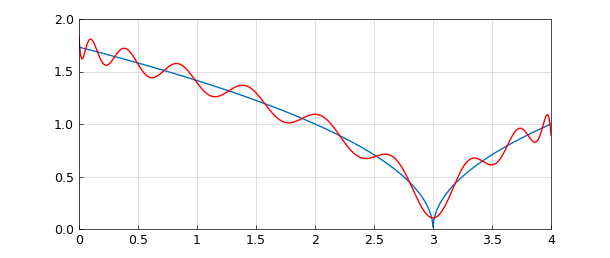

The defining property of the best approximation is that its error curve *equioscillates*: it attains its maximum absolute value, with alternating sign, at least $n+2$ times. Here is the error $f - p$ (magenta) with the $\pm\varepsilon$ levels marked (dashed black), where $\varepsilon$ is the minimax error:

```python
print(float(mm.err))
```
```
0.10521287627957965
```

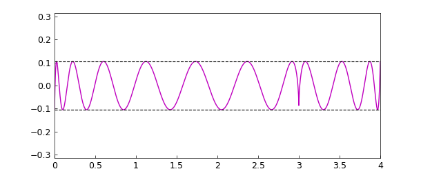

By contrast, the Chebyshev interpolant of the same degree has a slightly larger maximum error, and its error curve does not equioscillate — it is largest near the singularity:

```python
pinterp = cj.chebfun(f, domain=[0, 4], n=21)
```

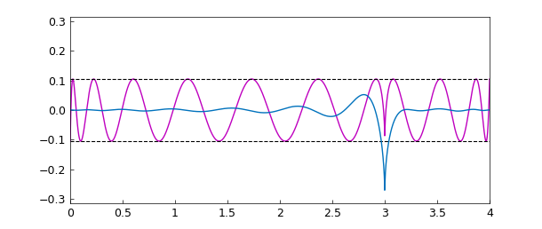

Near-best *rational* approximations can be computed cheaply by the Caratheodory-Fejer (CF) method. Chebfunjax does not yet ship a `cf` command, so the figures below use a NumPy port of Chebfun's `@chebfun/cf.m` driven by the Chebyshev coefficients `f.coeffs` (see `scripts/generate_guide04_plots.py`). Here is the type-$(5,5)$ CF approximation to $e^x$; its error equioscillates 11 times at the level $\approx 10^{-13}$:

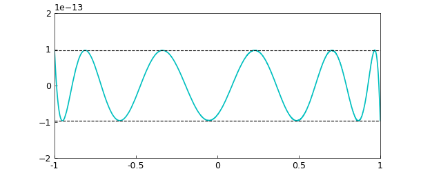

And here is the type-$(5,5)$ CF approximation to the non-smooth function $|x-0.3|$:

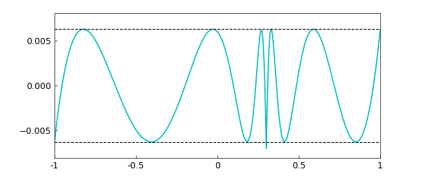

## 4.7  The Runge phenomenon

Interpolation in Chebyshev points is stable, but interpolation in *equispaced* points is not: it suffers the Runge phenomenon, wild oscillations near the ends of the interval that grow exponentially with the number of points. Here is the degree-9 polynomial interpolant of $\tanh(10x)$ through 10 equally spaced points (blue = function, red = interpolant, red dots = data):

```python
f = lambda x: jnp.tanh(10 * x)
s = np.linspace(-1, 1, 10)
p = cj.Chebfun.interp1(jnp.array(s), f(jnp.array(s)))
```

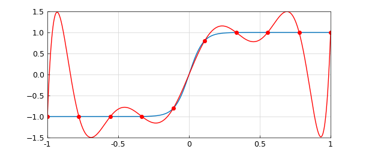

With 20 points the oscillations near $\pm 1$ reach a magnitude of over 100:

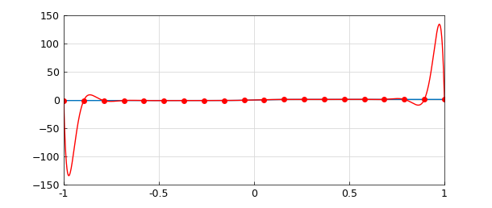

The instability is quantified by the Lebesgue function, whose maximum (the Lebesgue constant) grows exponentially for equispaced points. Here is the Lebesgue function for 20 and for 40 equispaced points, on a semilog scale:

```python
from chebfunjax.utils.lebesgue import lebesgue_function
t, lam = lebesgue_function(jnp.array(np.linspace(-1, 1, 20)))
```

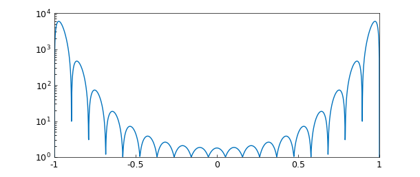

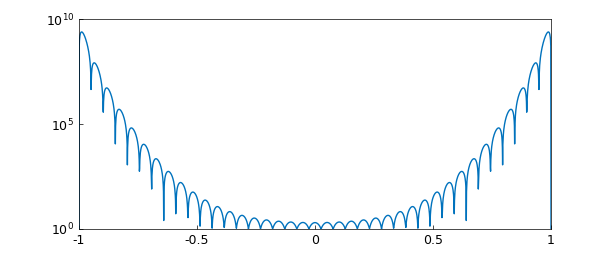

The Lebesgue constant reaches about $10^4$ for 20 points and $10^{10}$ for 40 points, an unmistakable exponential blow-up. For Chebyshev points, by contrast, the Lebesgue constant grows only logarithmically.

## 4.8  Rational approximations

Chebfunjax can also compute rational approximations. Consider the test function $\tanh(\pi x/2) + x/20$ on $[-10,10]$:

```python
f = cj.chebfun(lambda x: jnp.tanh(jnp.pi * x / 2) + x / 20, domain=[-10, 10])
print(len(f))
```
```
368
```

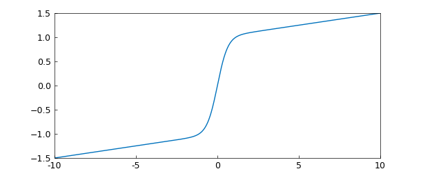

The Chebyshev-Pade approximation of type $(40,4)$ matches the function to about $5\times10^{-9}$:

```python
from chebfunjax.utils.ratapprox import chebpade, ratinterp
p, q, r = chebpade(f, 40, 4)
# max(|f - r|) ~ 5.6e-9
```

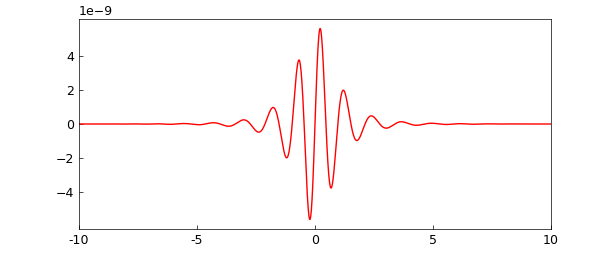

Rational interpolation of the same type is slightly less accurate here (about $4\times10^{-7}$):

```python
r = ratinterp(f, 40, 4, domain=(-10.0, 10.0))
# max(|f - r|) ~ 4.2e-7
```

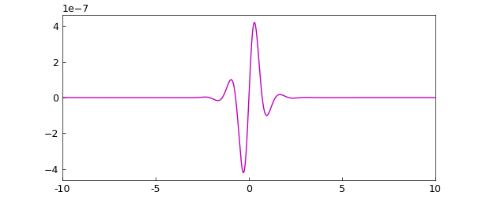

And the CF rational approximation (via the NumPy port of `cf`) reaches about $10^{-10}$:

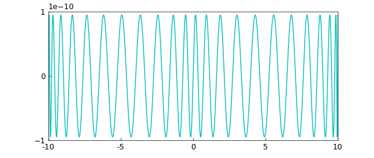

In MATLAB Chebfun the poles of these rational approximants are extracted with `roots(q,'complex')`. Chebfunjax's `roots` returns only real roots in the domain, so complex poles are not yet available directly; see the library-gap notes.

## 4.9  References

[Battles & Trefethen 2004] Z. Battles and L. N. Trefethen, "An extension of MATLAB to continuous functions and operators", *SIAM Journal on Scientific Computing*, 25 (2004), 1743-1770.

[Trefethen 2013] L. N. Trefethen, *Approximation Theory and Approximation Practice*, SIAM, 2013.
