# 5. Complex Chebfuns

*Based on [Chebfun Guide Chapter 5](https://www.chebfun.org/docs/guide/guide05.html)
by Lloyd N. Trefethen. Adapted for chebfunjax; all outputs below are genuine
chebfunjax results.*

## 5.1 Complex functions of a real variable

One of the attractive features of MATLAB is that it handles complex arithmetic
well. For example, here are 20 points on the upper half of the unit circle in
the complex plane:

```python
import numpy as np
import matplotlib.pyplot as plt

s = np.linspace(0, np.pi, 20)
f = np.exp(1j * s)
plt.plot(f.real, f.imag, '.')
```

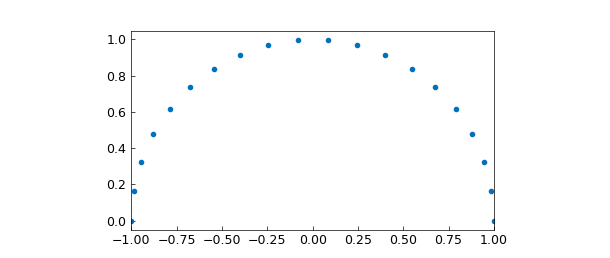

In chebfunjax, such plots are just as natural — chebfuns are complex-valued
whenever the function being sampled is complex. Here is a smooth version of
the same curve:

```python
import jax.numpy as jnp
import chebfunjax as cj

f = cj.chebfun(lambda s: jnp.exp(1j * s), domain=[0, np.pi])
f.plot()
```

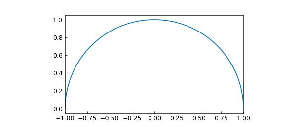

`plot()` of a complex chebfun draws its image in the complex plane (real part
against imaginary part) with equal axis scaling, exactly as in MATLAB. This
curve is represented to nearly machine precision by a polynomial of low degree:

```python
>>> len(f)
17
```

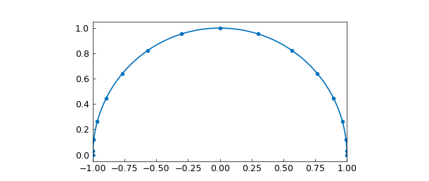

Such curves look at first like the trajectories of particles or the contours
of shapes, and they can be startlingly beautiful. Here are two more:

```python
g = cj.chebfun(lambda s: s * jnp.exp(10j * s), domain=[0, np.pi])
h = cj.chebfun(lambda s: jnp.exp(2j * s) + 0.3 * jnp.exp(20j * s),
               domain=[0, np.pi])
```

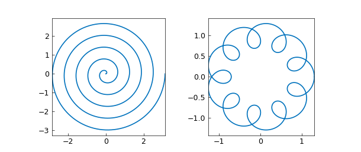

We can do arithmetic on complex chebfuns, such as squaring `g` or
exponentiating `h`:

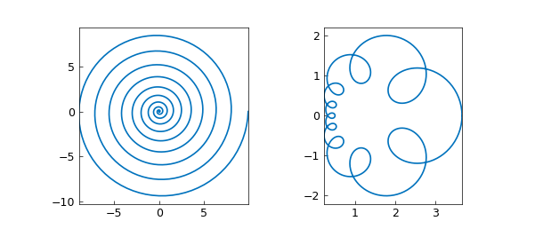

The integral of a complex chebfun is again computed by `sum`, giving a complex
number:

```python
>>> complex(g.sum())
(8.851e-16-0.3141592653589793j)          # = -i*pi/10

>>> complex(h.sum())
(-7.28e-16-3.22e-16j)                    # = 0
```

A chebfun can be piecewise smooth. Here, for example, is a path consisting of
two straight segments, built with a breakpoint domain — the point $z(s)$ is
$(1+0.5i)s$ for $s\in[0,1]$ and $1+0.5i-2(s-1)$ for $s\in[1,2]$ — followed by
its square:

```python
z = cj.chebfun(
    lambda s: jnp.where(s <= 1, (1 + 0.5j) * s, 1 + 0.5j - 2 * (s - 1)),
    domain=[0, 1, 2],
)
(z * z).plot()
```

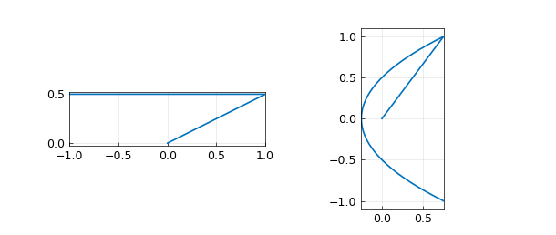

(In MATLAB Chebfun the same path can also be built with the `join` command;
in chebfunjax the breakpoint-domain construction above plays that role, and
two constructions of the same path agree exactly: `(z - zz).norm(2)` returns
`0.0`.)

## 5.2 Analytic functions and conformal maps

A function is *analytic* if it is differentiable in the complex sense, or
equivalently, if it has a convergent Taylor series near each point in its
domain of definition. Away from points where the derivative is zero, analytic
functions are *conformal maps*: although they may scale and rotate an
infinitesimal region, they preserve angles between intersecting curves.

For example, suppose we define `R` to be a chebfun corresponding to the four
sides of a rectangle and `X` to be another chebfun corresponding to a cross
inside `R`:

```python
def join_paths(segs):
    """Piecewise complex path: segment k, with local parameter in
    [0, 1], occupies [k, k+1] of the global parameter."""
    def piecewise(t):
        val = segs[0](t)
        for k in range(1, len(segs)):
            val = jnp.where(t > k, segs[k](t - k), val)
        return val
    return cj.chebfun(piecewise, domain=list(map(float, range(len(segs) + 1))))

R = join_paths([lambda s: 1 + s, lambda s: 2 + 2j * s,
                lambda s: 2 + 2j - s, lambda s: 1 + 2j - 2j * s])
X = join_paths([lambda s: 1.3 + 1.5j + 0.4 * s,
                lambda s: 1.5 + 1.3j + 0.4j * s])
```

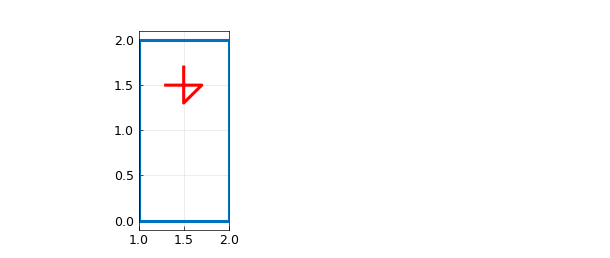

Here is what happens to `R` and `X` under the maps $z^2$ and $\exp(z)$:

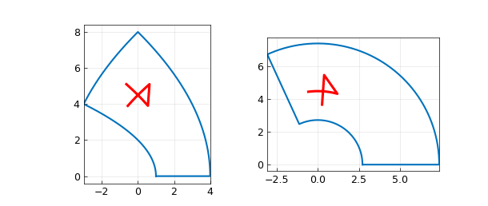

We can take the same idea further and construct a whole grid of lines in the
complex plane (in MATLAB the segments are accumulated as columns of a
quasimatrix; in Python a list of chebfuns serves the same purpose):

```python
S = []
for d in np.arange(-1, 1.01, 0.2):
    S.append(cj.chebfun(lambda x, d=float(d): d + 1j * x))
    S.append(cj.chebfun(lambda x, d=float(d): 1j * d + x))
```

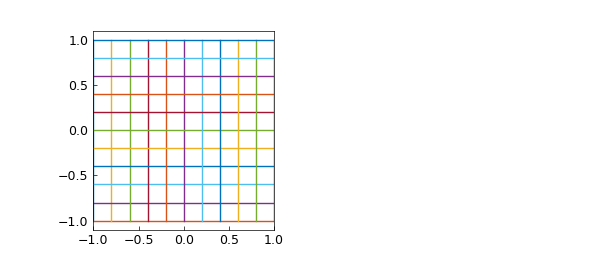

Here are the exponential and tangent of the grid:

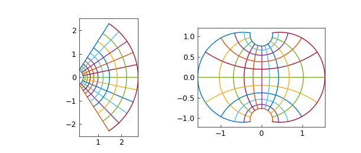

And here is a sequence that puts all three images together on a single scale:

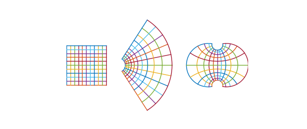

A particularly interesting family of conformal maps are the *Möbius
transformations*, the rational functions $(az+b)/(cz+d)$. Here is a square
and its image under $w = 1/(1+z)$, and the image of the image, and the image
of the image of the image. We also plot the limit point given by the equation
$z = 1/(1+z)$, i.e. $z = (\sqrt 5 - 1)/2$:

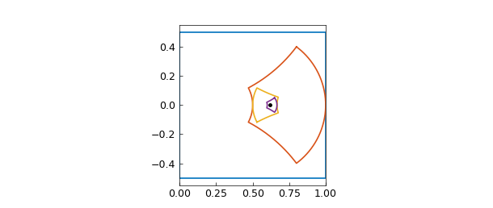

Here is a prettier version of the same image with the regions filled:


## 5.3 Contour integrals

If $s$ is a real parameter and $z(s)$ is a complex function of $s$, then we
can define a contour integral in the complex plane:

$$ \int f(z(s))\, z'(s)\, ds. $$

For example, over the two-segment contour `z` from Section 5.1 (from $0$ to
$-1+0.5i$) the integral of $\exp(-z^2)$ is computed like this:

```python
def z_fn(s):
    return jnp.where(s <= 1, (1 + 0.5j) * s, 1 + 0.5j - 2 * (s - 1))

z = cj.chebfun(z_fn, domain=[0, 1, 2])
f = cj.chebfun(lambda s: jnp.exp(-z_fn(s) ** 2), domain=[0, 1, 2])
I = complex((f * z.diff()).sum())
```

Notice how easily the contour integral is realized, even over a contour
consisting of several pieces. According to Cauchy's theorem, the integral of
an analytic function between two points is path-independent, and indeed the
straight segment going directly from $0$ to $-1+0.5i$ gives the same value:

```python
w = cj.chebfun(lambda s: (-1 + 0.5j) * s, domain=[0, 1])
f2 = cj.chebfun(lambda s: jnp.exp(-((-1 + 0.5j) * s) ** 2), domain=[0, 1])
>>> complex((f2 * w.diff()).sum())
(-0.8425445595261364+0.16658714792407375j)
```

A *meromorphic* function is analytic in a region of interest apart from
possible poles. By the Cauchy integral formula, $1/2\pi i$ times the integral
of a meromorphic $f$ around a closed contour equals the sum of the residues
of $f$ at the enclosed poles. The function $\exp(z)/z^3$ has Laurent series
$z^{-3} + z^{-2} + \tfrac12 z^{-1} + \tfrac16 + \cdots$ at the origin, so its
residue there is $1/2$. We confirm this by integrating around the unit
circle:

```python
z = cj.chebfun(lambda s: jnp.exp(1j * s), domain=[0, 2 * np.pi])
f = cj.chebfun(lambda s: jnp.exp(jnp.exp(1j * s)) * jnp.exp(-3j * s),
               domain=[0, 2 * np.pi])
>>> complex((f * z.diff()).sum() / (2j * np.pi))
(0.49999999999999983-5.48e-17j)
```

We have just computed the degree-2 Taylor coefficient of $\exp(z)$.

(MATLAB Chebfun can also exploit the periodicity of such integrands with its
`'trig'` flag — Fourier rather than Chebyshev representation. Periodic
construction through the chebfunjax factory is not yet wired; the Chebyshev
representation above computes the same integrals to the same accuracy, at a
modest efficiency cost of up to $\pi/2$ in length.)

The contour does not have to be smooth. Here is the same residue computed by
integration over a square:

```python
def sq(s):
    v = 1 + 1j * s
    v = jnp.where(s > 1, 1j - (s - 2), v)
    v = jnp.where(s > 3, -1 - 1j * (s - 4), v)
    v = jnp.where(s > 5, -1j + (s - 6), v)
    return v

z = cj.chebfun(sq, domain=[-1, 1, 3, 5, 7])
f = cj.chebfun(lambda s: jnp.exp(sq(s)) / sq(s) ** 3, domain=[-1, 1, 3, 5, 7])
>>> complex((f * z.diff()).sum() / (2j * np.pi))
(0.5000000000000001-3.53e-17j)
```

One can also construct the more interesting contours that appear in complex
variables texts, such as this "keyhole" contour around the branch cut of
$\log z$ on the negative real axis:

```python
c1, c2 = -2 + 0.05j, -0.2 + 0.05j
c3, c4 = -0.2 - 0.05j, -2 - 0.05j
L1, L2, L3, L4 = (np.log(c) for c in (c1, c2, c3, c4))

z = join_paths([
    lambda s: c1 + s * (c2 - c1),
    lambda s: jnp.exp((1 - s) * L2 + s * L3),   # arc the long way round
    lambda s: c3 + s * (c4 - c3),
    lambda s: jnp.exp((1 - s) * L4 + s * L1),
])
```


(A subtlety worth knowing: the arcs must go the *long* way around the origin,
which is what `c2*c3.^s./c2.^s` — separate principal powers — produces in
MATLAB; the seemingly equivalent `(c3/c2)**s` takes the short arc straight
across the branch cut.)

The integral of $f(z) = \log(z)\tanh(z)$ around this contour equals $2\pi i$
times the sum of the residues at the poles of $f$ at $\pm\pi i/2$, which is
$4\pi i \log(\pi/2)$:

```python
def key(s):
    v = c1 + s * (c2 - c1)
    v = jnp.where(s > 1, jnp.exp((2 - s) * L2 + (s - 1) * L3), v)
    v = jnp.where(s > 2, c3 + (s - 2) * (c4 - c3), v)
    v = jnp.where(s > 3, jnp.exp((4 - s) * L4 + (s - 3) * L1), v)
    return v

z = cj.chebfun(key, domain=[0, 1, 2, 3, 4])
f = cj.chebfun(lambda s: jnp.log(key(s)) * jnp.tanh(key(s)),
               domain=[0, 1, 2, 3, 4])
>>> complex((f * z.diff()).sum())
(-2.3e-16+5.674755637702221j)

>>> complex(4j * np.pi * np.log(np.pi / 2))
5.674755637702224j
```

## 5.4 Cauchy integrals and locating zeros and poles

Here are some further examples of computations with Cauchy integrals. The
Bernoulli number $B_k$ is $k!$ times the $k$th Taylor coefficient of
$z/(e^z-1)$. Here is $B_{10}$ computed on a circle of radius 4, compared with
its exact value $5/66$:

```python
from math import factorial

k = 10
z = cj.chebfun(lambda s: 4 * jnp.exp(1j * s), domain=[0, 2 * np.pi])
integrand = cj.chebfun(
    lambda s: (4 * jnp.exp(1j * s) / (jnp.exp(4 * jnp.exp(1j * s)) - 1))
    / (4 * jnp.exp(1j * s)) ** (k + 1),
    domain=[0, 2 * np.pi],
)
>>> complex(factorial(k) * (integrand * z.diff()).sum() / (2j * np.pi))
(0.07575757575757547+1.86e-15j)

>>> 5 / 66
0.07575757575757576
```

On the unit circle the same computation is much less accurate (error about
$10^{-10}$) — the coefficient is better resolved on a contour whose radius
balances the growth of the integrand, exactly as in MATLAB.

Cauchy integrals can also count and locate zeros. The function
$\sin^3(z) + \cos^3(z)$ has how many zeros in the disk about $0$ of radius 2?

```python
z = cj.chebfun(lambda s: 2 * jnp.exp(1j * s), domain=[0, 2 * np.pi])
f = cj.chebfun(lambda s: jnp.sin(2 * jnp.exp(1j * s)) ** 3
               + jnp.cos(2 * jnp.exp(1j * s)) ** 3, domain=[0, 2 * np.pi])
>>> complex((f.diff() * (1.0 / f)).sum() / (2j * np.pi))
(2.9999999999999987-2.7e-15j)
```

There are three. The same number comes from the argument principle, as the
winding number of $f$ around the contour:

```python
theta = np.unwrap(np.angle(np.asarray(f(jnp.linspace(0, 2 * np.pi, 4000)))))
>>> (theta[-1] - theta[0]) / (2 * np.pi)
3.0000000000000013
```

Inside the unit disk there is just one zero, and a slightly different Cauchy
integral gives its location:

```python
z = cj.chebfun(lambda s: jnp.exp(1j * s), domain=[0, 2 * np.pi])
f = cj.chebfun(lambda s: jnp.sin(jnp.exp(1j * s)) ** 3
               + jnp.cos(jnp.exp(1j * s)) ** 3, domain=[0, 2 * np.pi])
>>> complex((z * (f.diff() * (1.0 / f))).sum() / (2j * np.pi))
(-0.7853981633974481+9.3e-16j)
```

The zero is at $-\pi/4$, as `roots` confirms on the real axis:

```python
>>> np.asarray(cj.chebfun(lambda t: jnp.sin(t)**3 + jnp.cos(t)**3).roots())
# -> array([-0.78539816])
```

## 5.5 Alphabet soup

The chebfunjax command `scribble`, a faithful translation of MATLAB's,
returns a piecewise-linear complex chebfun representing a word:

```python
from chebfunjax.utils.scribble import scribble

f = scribble('Oxford University')
f.plot()
```

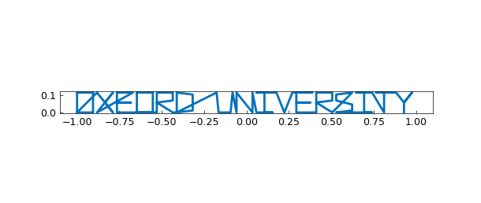

This chebfun happens to have 67 pieces. Though it is really just a chebfun,
one can do complex-arithmetic tricks with it:

```python
>>> complex(f(jnp.array(0.0))), float(f.norm(2))
((0.129+0j), 0.8476)
```

Compositions of the text with analytic functions produce conformal word-art.
Here is $\exp(3if)$:

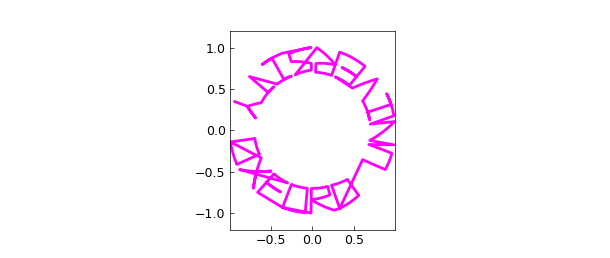

The text can be boxed in:

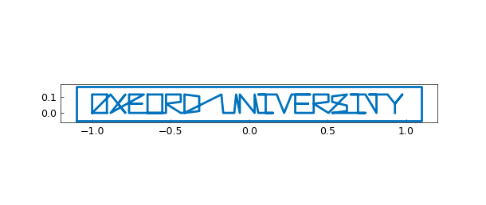

and mapped conformally — here $\exp((1+0.2i)f)$ and $\tan(f)$ of the boxed
text:


What about writing on a curve? Here is a birthday greeting for Pafnuty
Lvovich Chebyshev, born 16 May 1821, mapped along a spiral by
$g(z) = e^{-2.2i + (2.5i+0.4)z}$ together with a mapped ellipse:

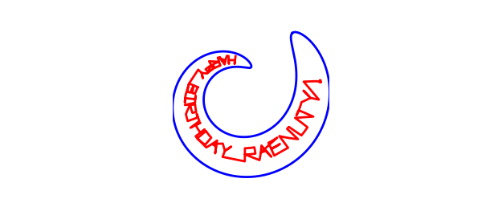

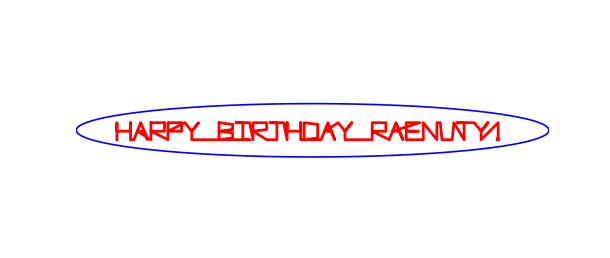

## 5.6 References

- [Davis 1959] P. J. Davis, "On the numerical integration of periodic
  analytic functions", in R. E. Langer, ed., *On Numerical Integration*,
  Math. Res. Ctr., U. of Wisconsin, 1959.
- [Hale & Trefethen 2008] N. Hale and L. N. Trefethen, "New quadrature
  formulas from conformal maps", *SIAM Journal on Numerical Analysis* 46
  (2008), 930-948.
- [McLachlan 1994] R. McLachlan, "Gauss quadrature and the complex error
  function", *Mathematics of Computation* 62 (1994), 337-340.
- [Weideman 1994] J. A. C. Weideman, "Computation of the complex error
  function", *SIAM Journal on Numerical Analysis* 31 (1994), 1497-1518.
