# Chapter 6: Quasimatrices and Least-Squares

*Based on [Chebfun Guide Chapter 6](https://www.chebfun.org/docs/guide/guide06.html)*

## 6.1 Quasimatrices

A chebfun can be combined with others to form a "quasimatrix" -- a matrix in which one dimension is discrete and the other continuous. In chebfunjax, a quasimatrix is represented as a list of Chebfun columns sharing a common domain, wrapped by the `Quasimatrix` class in `chebfunjax.chebfun1d.linalg`.

The term "quasimatrix" originates from Stewart (1998), with related concepts appearing in de Boor (1991) and Trefethen & Bau (1997). A quasimatrix with $n$ columns on $[a, b]$ can be thought of as an $\infty \times n$ matrix whose rows are continuous.

Here is how to build a quasimatrix from the first six monomials:

```python
import chebfunjax as cj
from chebfunjax.chebfun1d.linalg import Quasimatrix
from chebfunjax.domain import Domain

x = cj.chebfun(lambda t: t)
cols = [x**k for k in range(6)]  # 1, x, x^2, x^3, x^4, x^5
A = Quasimatrix(cols, domain=Domain((-1.0, 1.0)))
print(A.shape)    # ('inf', 6)
print(A.n_cols)   # 6
```

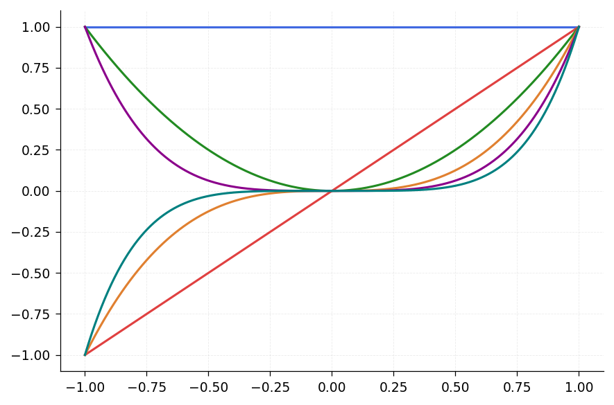

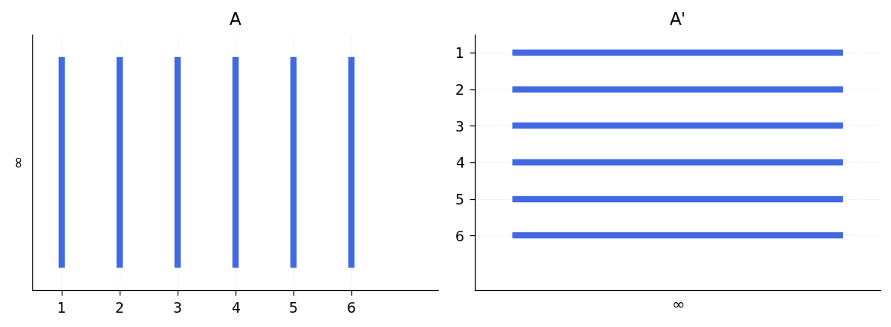

You can access individual columns and evaluate them:

```python
import jax.numpy as jnp

# Evaluate the third column (x^2) at x=0.5
val = float(A[2](jnp.float64(0.5)))
print(val)   # 0.25
```

Column sums (definite integrals from $-1$ to $1$):

```python
for k in range(6):
    print(f"  integral of x^{k} = {float(A[k].sum()):.4f}")
# x^0: 2.0000, x^1: 0.0000, x^2: 0.6667, x^3: 0.0000, x^4: 0.4000, x^5: 0.0000
```

### Inner Products

The continuous $L^2$ inner product of two chebfuns $f$ and $g$ on $[a, b]$ is

$$\langle f, g \rangle = \int_a^b f(x)\,g(x)\,dx.$$

In chebfunjax this is computed with `f.inner(g)` or equivalently `cj.innerProduct(f, g)`:

```python
# Inner product of x^2 and x^4 over [-1,1] = 2/7
ip = float(A[2].inner(A[4]))
print(f"{ip:.15f}")   # 0.285714285714286
```

To build the $6 \times 6$ Gram matrix $G_{ij} = \langle A_i, A_j \rangle$:

```python
import numpy as np

n = A.n_cols
G = np.zeros((n, n))
for i in range(n):
    for j in range(n):
        G[i, j] = float(A[i].inner(A[j]))
print(G)
```

## 6.2 Least-Squares and Polynomial Fitting

In MATLAB Chebfun, the backslash operator `c = A\f` computes the continuous least-squares solution -- that is, the coefficient vector $c$ that minimizes $\| Ac - f \|_2$ in the $L^2$ norm. In chebfunjax, the same computation can be performed using the QR factorization.

The idea is: given a quasimatrix $A$ with columns $a_1, \ldots, a_n$ and a target function $f$, we seek coefficients $c_1, \ldots, c_n$ minimizing

$$\left\| f - \sum_{j=1}^n c_j a_j \right\|_{L^2[a,b]}.$$

The normal equations give $c = (A^* A)^{-1} A^* f$, but in practice we use QR factorization for numerical stability.

### Polynomial Least-Squares Example

```python
import jax.numpy as jnp
from chebfunjax.chebfun1d.linalg import qr_quasimatrix

# Target function
f = cj.chebfun(lambda t: jnp.exp(t) * jnp.sin(6 * t))

# Build monomial quasimatrix [1, x, x^2, ..., x^5]
x = cj.chebfun(lambda t: t)
cols = [x**k for k in range(6)]
A = Quasimatrix(cols, domain=Domain((-1.0, 1.0)))

# Compute least-squares coefficients via QR
Q, R = qr_quasimatrix(A)
# c = R^{-1} * Q^T * f, where Q^T * f is the vector of inner products
rhs = jnp.array([float(Q[j].inner(f)) for j in range(6)])
c = jnp.linalg.solve(R, rhs)
print(c)

# Build the fit
ffit = cols[0] * float(c[0])
for j in range(1, 6):
    ffit = ffit + cols[j] * float(c[j])

# Compute the error
error = float(f.norm() if (f - ffit).norm() == 0 else (f - ffit).norm())
print(f"L2 error: {error:.6f}")
```

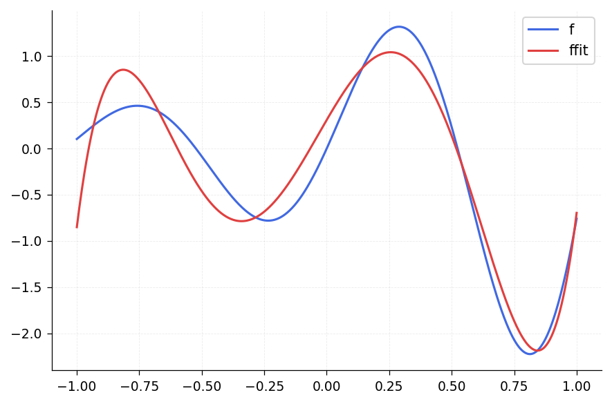

A general principle of polynomial least-squares approximation is that the best degree-$n$ polynomial approximation to a continuous function on $[a, b]$ must intersect the function at least $n+1$ times.

### Least-Squares with Other Basis Functions

Quasimatrices let you do least-squares fitting with any set of basis functions, not just polynomials. For example, one could use hat functions, radial basis functions, or wavelets as columns.

```python
# Example: piecewise linear hat functions on [-1, 1]
hat_cols = []
for j in range(11):
    xj = -1.0 + j / 5.0
    hat_cols.append(
        cj.chebfun(
            lambda t, _xj=xj: jnp.maximum(0.0, 1.0 - 5.0 * jnp.abs(t - _xj)),
            domain=(-1.0, 1.0),
        )
    )
A2 = Quasimatrix(hat_cols, domain=Domain((-1.0, 1.0)))
```

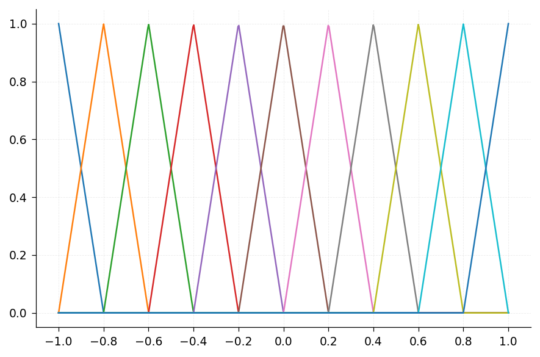

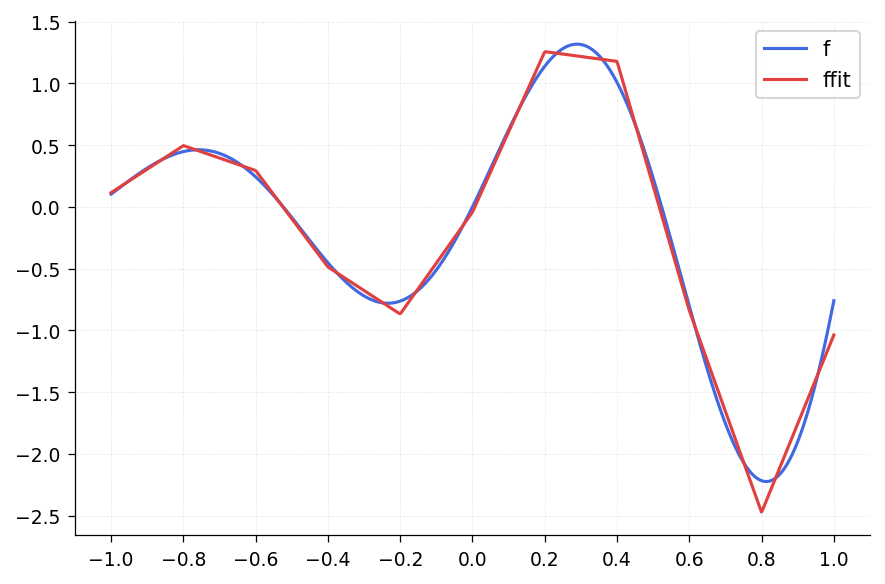

## 6.3 QR Factorization

The QR factorization of an $\infty \times n$ quasimatrix $A$ produces

$$A = QR,$$

where $Q$ is an $\infty \times n$ quasimatrix with $L^2$-orthonormal columns and $R$ is an $n \times n$ upper-triangular matrix.

In chebfunjax, the continuous Householder algorithm of Trefethen (2010) is used. The starting orthonormal basis consists of $L^2$-normalized Legendre polynomials.

```python
from chebfunjax.chebfun1d.linalg import qr_quasimatrix, Quasimatrix

x = cj.chebfun(lambda t: t)
cols = [x**k for k in range(6)]
A = Quasimatrix(cols, domain=Domain((-1.0, 1.0)))

Q, R = qr_quasimatrix(A)
print(f"Q has {Q.n_cols} columns")
print(f"R shape: {R.shape}")
print(R)
```

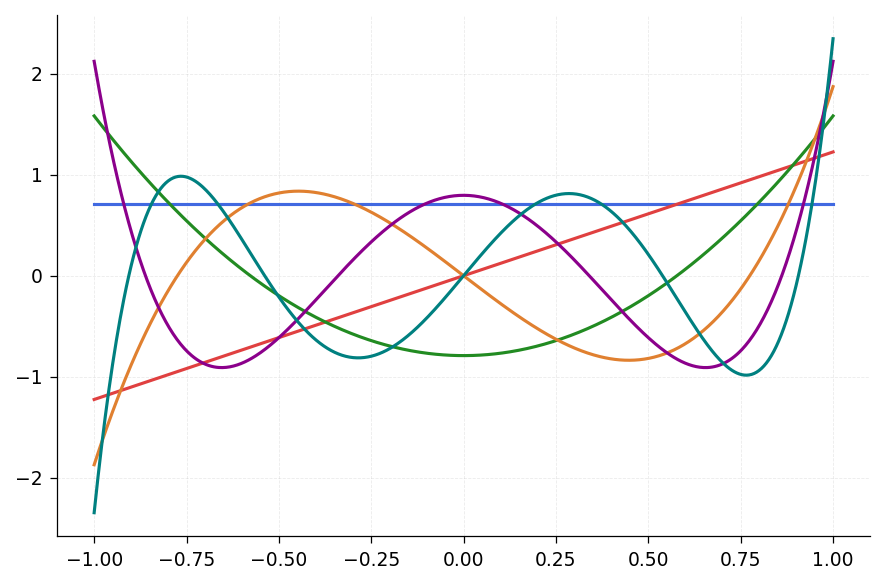

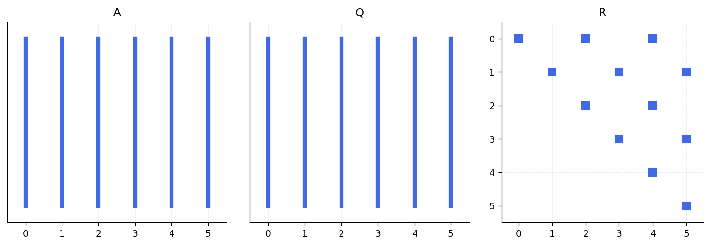

The columns of $Q$ are the Legendre polynomials $P_0, P_1, \ldots, P_5$ on $[-1, 1]$ (with $L^2$-normalization, so $\langle Q_i, Q_j \rangle = \delta_{ij}$).

### Verifying Orthonormality

```python
# Check that Q columns are orthonormal
for i in range(Q.n_cols):
    for j in range(i, Q.n_cols):
        ip = float(Q[i].inner(Q[j]))
        expected = 1.0 if i == j else 0.0
        print(f"  <Q[{i}], Q[{j}]> = {ip:.2e}  (expected {expected})")
```

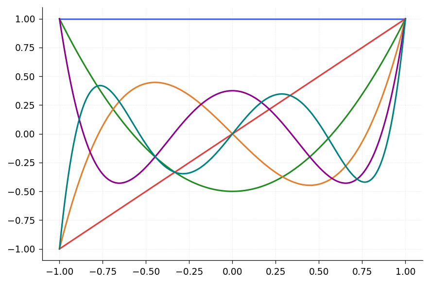

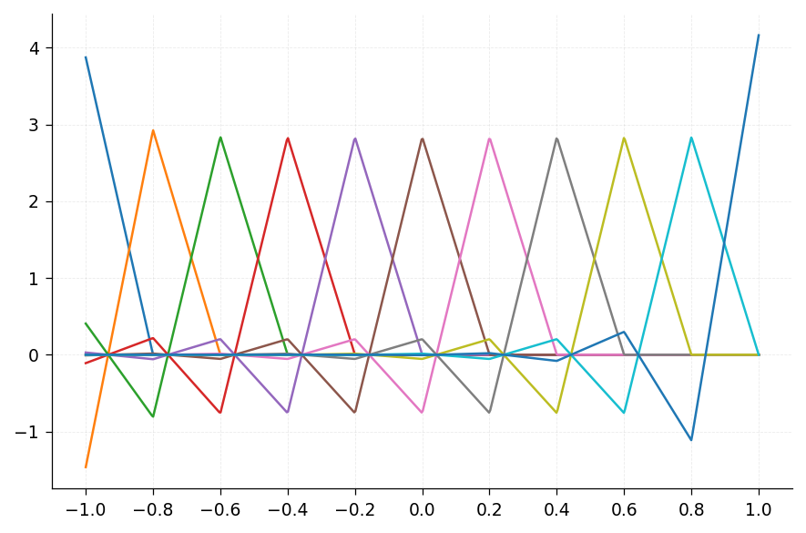

You can also compute QR directly from a Chebfun:

```python
f = cj.chebfun(lambda t: jnp.sin(t))
g = cj.chebfun(lambda t: jnp.cos(t))
Q, R = f.qr(other_cols=[g])
```

## 6.4 SVD, Norm, and Condition Number

The singular value decomposition of an $\infty \times n$ quasimatrix $A$ is

$$A = U S V^T,$$

where $U$ is an $\infty \times n$ quasimatrix with orthonormal columns, $S$ is an $n \times n$ diagonal matrix of singular values, and $V$ is an $n \times n$ orthogonal matrix. The singular values reveal how the quasimatrix maps the unit ball in $\mathbb{R}^n$ to a "hyperellipsoid" in function space.

```python
from chebfunjax.chebfun1d.linalg import svd_quasimatrix

U, S, V = svd_quasimatrix(A)
print("Singular values:", S)
```

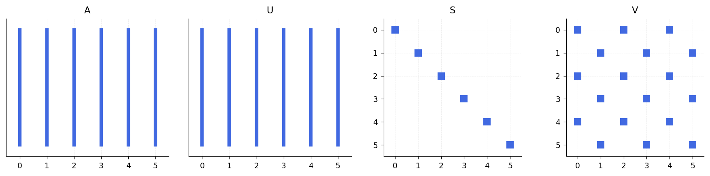

### 2-Norm

The 2-norm of a quasimatrix equals its largest singular value:

$$\|A\|_2 = \sigma_1.$$

```python
print(f"2-norm of A = {float(S[0]):.15f}")
```

### Condition Number

The condition number of a quasimatrix is the ratio of its largest to smallest singular value:

$$\kappa(A) = \frac{\sigma_1}{\sigma_n}.$$

```python
cond_A = float(S[0]) / float(S[-1])
print(f"cond(A) = {cond_A:.6f}")
```

The monomial basis $\{1, x, x^2, \ldots\}$ is notoriously ill-conditioned on $[-1, 1]$. This is one reason why Chebyshev and Legendre polynomials are preferred in spectral methods -- they have condition numbers close to 1.

### Extremal Functions

The right singular vectors reveal the directions that are maximally and minimally amplified by the quasimatrix. The first column of $V$ gives the coefficient vector whose image under $A$ has the largest $L^2$ norm, while the last column gives the smallest.

```python
v1 = V[:, 0]   # maximally amplified direction
vn = V[:, -1]  # minimally amplified direction

# Build the extremal functions
f_max = sum(float(v1[j]) * cols[j] for j in range(6))
f_min = sum(float(vn[j]) * cols[j] for j in range(6))
print(f"||A*v1||_2 = {float(f_max.norm()):.15f}")
print(f"||A*vn||_2 = {float(f_min.norm()):.15f}")
```

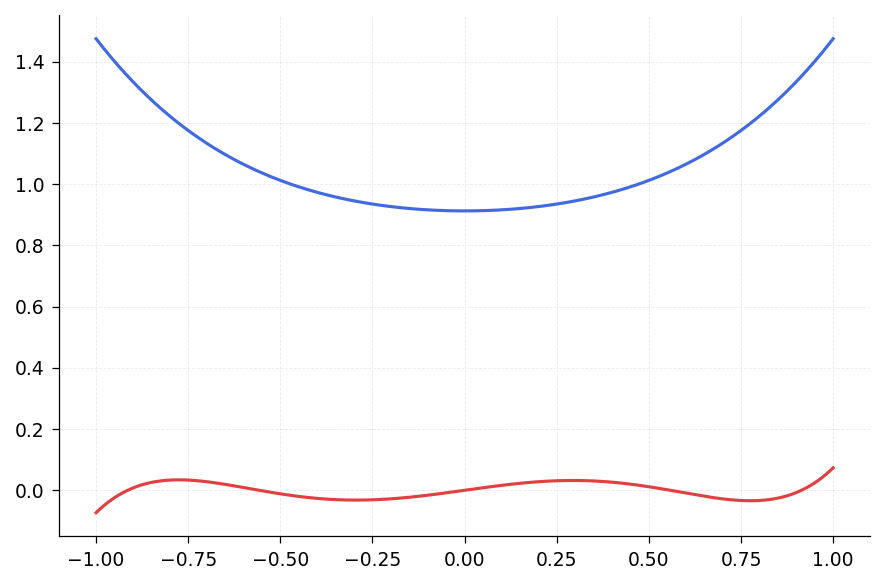

## 6.5 Other Norms

Chebfunjax supports multiple norms on chebfuns:

- **$L^2$ norm** (default): $\|f\|_2 = \sqrt{\int_a^b |f(x)|^2\,dx}$, computed by `f.norm()` or `f.norm(2)`.
- **$L^\infty$ norm**: $\|f\|_\infty = \max_{x \in [a,b]} |f(x)|$, computed by `f.norm(jnp.inf)`.
- **$L^p$ norm**: $\|f\|_p = \left(\int_a^b |f(x)|^p\,dx\right)^{1/p}$, computed by `f.norm(p)`.

```python
f = cj.chebfun(lambda t: jnp.exp(t))

print(f"||exp(x)||_2   = {float(f.norm(2)):.10f}")
print(f"||exp(x)||_inf = {float(f.norm(jnp.inf)):.10f}")
print(f"||exp(x)||_1   = {float(f.norm(1)):.10f}")
```

## 6.6 Subspace Angle

The `subspace` function computes the smallest principal angle between the subspaces spanned by two sets of chebfun columns. This is the continuous analogue of computing angles between column spaces of matrices.

The algorithm orthonormalizes each set of columns via continuous QR, then computes the Gram matrix of inner products. The smallest singular value of this Gram matrix gives $\cos\theta$, where $\theta$ is the smallest principal angle.

```python
from chebfunjax.chebfun1d.chebfun import subspace

# Two identical subspaces -> angle = 0
f = cj.chebfun(lambda t: jnp.sin(t))
theta = subspace([f], [f])
print(f"Angle between identical subspaces: {theta:.2e}")  # ~0

# Orthogonal subspaces
g = cj.chebfun(lambda t: jnp.cos(t))
theta2 = subspace([f], [g])
print(f"Angle between sin and cos: {theta2:.6f}")
```

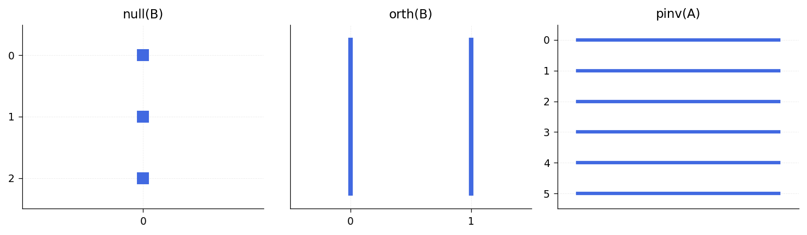

## 6.7 Lagrange Interpolation

The `lagrange` function constructs the Lagrange basis polynomials for a set of interpolation nodes. Given $n$ distinct nodes $x_0, \ldots, x_{n-1}$, it returns $n$ chebfuns $L_0, \ldots, L_{n-1}$ satisfying

$$L_j(x_k) = \delta_{jk}.$$

```python
from chebfunjax.chebfun1d.chebfun import lagrange

nodes = [-1.0, 0.0, 1.0]
basis = lagrange(nodes)
print(f"Number of basis functions: {len(basis)}")

# Verify: L_0(-1) = 1, L_0(0) = 0, L_0(1) = 0
print(f"L_0(-1) = {float(basis[0](jnp.float64(-1.0))):.12f}")
print(f"L_0( 0) = {float(basis[0](jnp.float64( 0.0))):.12f}")
print(f"L_0( 1) = {float(basis[0](jnp.float64( 1.0))):.12f}")
```

## 6.8 References

- Z. Battles, *Numerical Linear Algebra for Continuous Functions*, DPhil thesis, Oxford Computing Laboratory, 2006.

- Z. Battles and L. N. Trefethen, "An extension of Matlab to continuous functions and operators," *SIAM J. Sci. Comput.*, 25 (2004), 1743-1770.

- C. de Boor, "An alternative approach to rank, basis, and dimension," *Linear Algebra Appl.*, 146 (1991), 221-229.

- G. W. Stewart, *Afternotes Goes to Graduate School*, SIAM, 1998.

- L. N. Trefethen, "Householder triangularization of a quasimatrix," *IMA J. Numer. Anal.*, 30 (2010), 887-897.

- L. N. Trefethen and D. Bau, III, *Numerical Linear Algebra*, SIAM, 1997.
