# Chapter 6: Quasimatrices and Least-Squares

*Based on [Chebfun Guide Chapter 6](https://www.chebfun.org/docs/guide/guide06.html)*

## 6.1 Quasimatrices and `spy`

A chebfun can have more than one column, or if it is transposed, more than one
row. In these cases we get a *quasimatrix* -- a "matrix" in which one of the
dimensions is discrete as usual but the other is continuous. In chebfunjax a
quasimatrix is represented by the `Quasimatrix` class in
`chebfunjax.chebfun1d.linalg`: a list of Chebfun columns sharing a common
domain.

The term "quasimatrix" originates with Stewart (1998), with related concepts in
de Boor (1991) and Trefethen & Bau (1997). A quasimatrix with $n$ columns on
$[a, b]$ can be thought of as an $\infty \times n$ matrix whose rows are
continuous.

Here is a quasimatrix built from the first six monomials $1, x, \ldots, x^5$:

```python
import chebfunjax as cj
from chebfunjax.chebfun1d.linalg import Quasimatrix
from chebfunjax.domain import Domain
import jax.numpy as jnp
import numpy as np

np.set_printoptions(precision=6, suppress=True)   # like MATLAB "format short"

x = cj.chebfun(lambda t: t)
A = Quasimatrix([x**k for k in range(6)], domain=Domain((-1.0, 1.0)))
print(A.shape)     # size(A)   -> ('inf', 6)
print(A.n_cols)    # size(A,2) -> 6
```
```
('inf', 6)
6
```

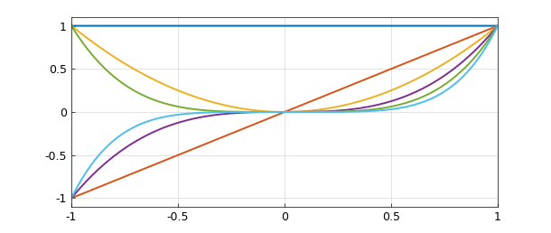

Individual entries are obtained by evaluating a column. The MATLAB expression
`A(0.5,3)` (row $x=0.5$, column 3) becomes:

```python
print(float(A[2](jnp.float64(0.5))))   # A(0.5,3) -> 0.25
```
```
0.25
```

The column sums are the definite integrals of the columns, `sum(A)`:

```python
print(np.array([float(A[k].sum()) for k in range(6)]))
```
```
[2.       0.       0.666667 0.       0.4      0.      ]
```

The continuous $L^2$ inner product of two columns $f$ and $g$ on $[a, b]$ is

$$\langle f, g \rangle = \int_a^b f(x)\,g(x)\,dx,$$

computed by `f.inner(g)` (equivalently `cj.innerProduct(f, g)`). The MATLAB
`A(:,3)'*A(:,5)` is $\langle x^2, x^4\rangle = 2/7$:

```python
print(float(A[2].inner(A[4])))   # 0.2857142857142857
```
```
0.2857142857142857
```

The full Gram matrix $A^{*}A$ (MATLAB `A'*A`) collects all such inner products:

```python
G = np.array([[float(A[i].inner(A[j])) for j in range(6)] for i in range(6)])
print(G)
```
```
[[2.       0.       0.666667 0.       0.4      0.      ]
 [0.       0.666667 0.       0.4      0.       0.285714]
 [0.666667 0.       0.4      0.       0.285714 0.      ]
 [0.       0.4      0.       0.285714 0.       0.222222]
 [0.4      0.       0.285714 0.       0.222222 0.      ]
 [0.       0.285714 0.       0.222222 0.       0.181818]]
```

The `spy` command shows the "shape" of a quasimatrix: `spy(A)` for the
$\infty \times 6$ matrix $A$ (six continuous columns) and `spy(A')` for its
$6 \times \infty$ transpose.

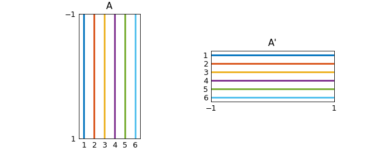

## 6.2 Backslash, least-squares, and `polyfit`

In MATLAB, `c = A\b` solves $Ac = b$ when $A$ is square, and computes the
least-squares solution when $A$ is rectangular with more rows than columns. For
a quasimatrix (infinitely many rows), `A\f` is the *continuous* least-squares
solution: the coefficient vector $c$ minimizing $\|Ac - f\|_2$ in the $L^2$
norm. chebfunjax has no backslash operator, so we form the same solution from
the continuous QR factorization $A = QR$, whose columns are $L^2$-orthonormal:
$c = R^{-1} Q^{*} f$.

```python
from chebfunjax.chebfun1d.linalg import qr_quasimatrix

f = cj.chebfun(lambda t: jnp.exp(t) * jnp.sin(6 * t))
Q, R = qr_quasimatrix(A)
c = jnp.linalg.solve(R, jnp.array([float(Q[j].inner(f)) for j in range(6)]))
print(np.array(c))
```
```
[  0.309655   4.640757  -2.15725  -20.041645   1.073963  15.477982]
```

The fit `ffit = A*c` is the best degree-5 polynomial approximation to $f$ in the
$L^2$ sense, and the residual `norm(f-ffit)` measures how good it is:

```python
ffit = A[0] * float(c[0])
for j in range(1, 6):
    ffit = ffit + A[j] * float(c[j])
print(float((f - ffit).norm()))   # error
```
```
0.3560739760014339
```

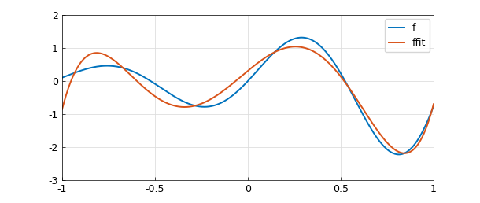

A general principle of polynomial least-squares approximation is that the best
degree-$n$ polynomial approximation to a continuous function on $[a, b]$ must
intersect the function at least $n+1$ times.

MATLAB Chebfun offers `polyfit(f,5)` as a shortcut for exactly this
least-squares fit. chebfunjax exposes `Chebfun.polyfit(n)`, but note that it
currently returns the degree-$n$ *Chebyshev* truncation (a near-best $L^\infty$
approximation) rather than the $L^2$ (Legendre) projection, so it is close to
but not identical to `A\f`:

```python
ffit_polyfit = f.polyfit(5)
print(float((ffit - ffit_polyfit).norm()))   # 0.155 (MATLAB polyfit gives ~0)
```
```
0.1550445562755572
```

### Least-squares with other basis functions

Quasimatrices let you fit with any set of basis functions, not just
polynomials. Here are eleven piecewise-linear hat functions on $[-1, 1]$:

```python
hats = [
    cj.chebfun(lambda t, _xj=-1.0 + j / 5.0: jnp.maximum(0.0, 1.0 - 5.0 * jnp.abs(t - _xj)),
               domain=(-1.0, 1.0))
    for j in range(11)
]
A2 = Quasimatrix(hats, domain=Domain((-1.0, 1.0)))
```

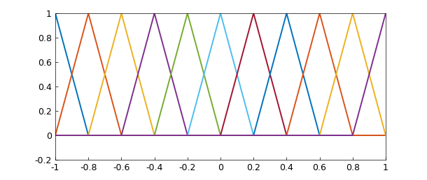

Solving the least-squares problem `A2\f` the same way gives a piecewise-linear
best fit:

```python
Q2, R2 = qr_quasimatrix(A2)
c2 = jnp.linalg.solve(R2, jnp.array([float(Q2[j].inner(f)) for j in range(11)]))
ffit2 = hats[0] * float(c2[0])
for j in range(1, 11):
    ffit2 = ffit2 + hats[j] * float(c2[j])
print(float((f - ffit2).norm()))   # error
```
```
0.08930681124752103
```

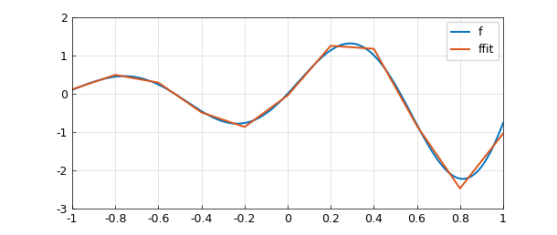

## 6.3 QR factorization

The QR factorization of an $\infty \times n$ quasimatrix $A$ takes the form

$$A = QR,$$

where $Q$ is $\infty \times n$ with $L^2$-orthonormal columns and $R$ is an
$n \times n$ upper-triangular matrix. chebfunjax uses the continuous Householder
algorithm of Trefethen (2010), starting from $L^2$-normalized Legendre
polynomials.

```python
Q, R = qr_quasimatrix(A)
```

The columns of $Q$ are the $L^2$-orthonormal Legendre polynomials
$P_0, \ldots, P_5$ on $[-1, 1]$.

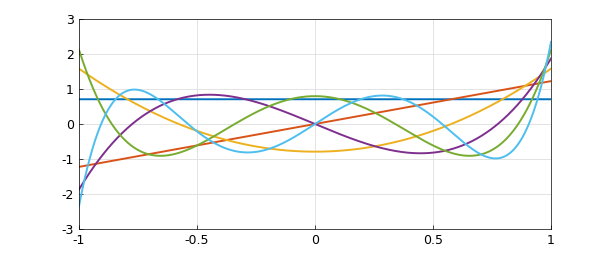

`spy(A)`, `spy(Q)`, and `spy(R)` reveal the structure: $A$ and $Q$ are dense
$\infty \times 6$ quasimatrices, while $R$ is upper triangular. Because the
monomials have definite parity, chebfunjax's $R$ is exactly parity-checkered
(12 nonzeros); MATLAB Chebfun's Householder sequence leaves small fill-in
(19 nonzeros), so the two spy patterns differ although both are valid.

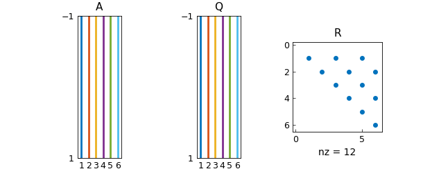

### Renormalizing to the classical Legendre polynomials

Rescaling each column so that $Q_j(1) = 1$ turns the orthonormal $Q$ into the
classical Legendre polynomials (with $P_n(1) = 1$). After the same rescaling of
the rows of $R$, `inv(R)` reproduces the Legendre-to-monomial change of basis:

```python
Rn = np.array(R).copy()
Q_leg = []
for j in range(6):
    q1 = float(Q[j](jnp.float64(1.0)))
    Rn[j, :] = Rn[j, :] * q1
    Q_leg.append(Q[j] * (1.0 / q1))
print(np.linalg.inv(Rn))
```
```
[[ 1.     0.    -0.5    0.     0.375 -0.   ]
 [ 0.     1.    -0.    -1.5    0.     1.875]
 [ 0.     0.     1.5   -0.    -3.75   0.   ]
 [ 0.     0.     0.     2.5   -0.    -8.75 ]
 [ 0.     0.     0.     0.     4.375 -0.   ]
 [ 0.     0.     0.     0.     0.     7.875]]
```

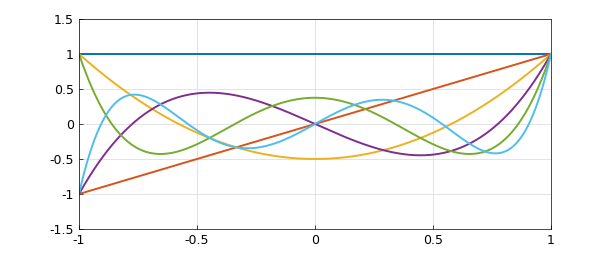

The columns of $Q$ are orthonormal to machine precision:

```python
print(max(abs(float(Q[i].inner(Q[j])) - (1.0 if i == j else 0.0))
          for i in range(6) for j in range(6)))
```
```
1.1102230246251565e-15
```

The same factorization orthonormalizes any set of columns, for example the hat
functions:

```python
Q2, R2 = qr_quasimatrix(A2)
```

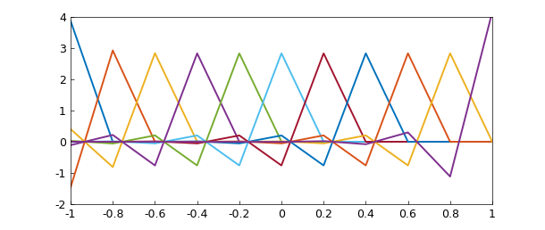

You can also factorize directly from a Chebfun, which builds the quasimatrix
from `self` plus any extra columns:

```python
g = cj.chebfun(lambda t: jnp.cos(t))
Qg, Rg = cj.chebfun(lambda t: jnp.sin(t)).qr(other_cols=[g])
```

## 6.4 `svd`, `norm`, `cond`

The singular value decomposition of an $\infty \times n$ quasimatrix $A$ is

$$A = U S V^{T},$$

where $U$ is $\infty \times n$ with orthonormal columns, $S$ is $n \times n$
diagonal, and $V$ is $n \times n$ orthogonal. The image of the unit ball in
$\mathbb{R}^n$ under $A$ is a hyperellipsoid lying in function space, with
semi-axis lengths equal to the singular values.

```python
from chebfunjax.chebfun1d.linalg import svd_quasimatrix

U, S, V = svd_quasimatrix(A)
print(np.array(S))
```
```
[1.532063 1.032552 0.518126 0.25842  0.080939 0.035425]
```

The 2-norm of a quasimatrix equals its largest singular value, $\|A\|_2 = \sigma_1$:

```python
print(float(S[0]))   # norm(A, 2)
```
```
1.5320628893753403
```

The first right singular vector $v_1$ is the coefficient combination whose image
has the largest $L^2$ norm; that norm equals $\sigma_1$:

```python
v1 = np.array(V)[:, 0]
print(v1)
fv1 = A[0] * float(v1[0])
for j in range(1, 6):
    fv1 = fv1 + A[j] * float(v1[j])
print(float(np.linalg.norm(v1)), float(fv1.norm()))   # 1,  sigma_1
```
```
[0.913034 0.       0.344611 0.       0.2182   0.      ]
1.0 1.5320628893753405
```

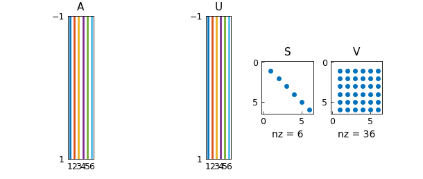

The last right singular vector gives the minimally amplified direction. Plotting
$A v_1$ (blue) and $A v_n$ (red) shows the extremal degree-5 polynomials.

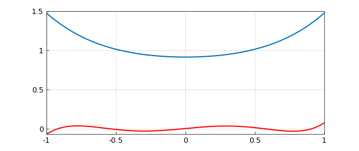

The condition number is the ratio of largest to smallest singular value,
$\kappa(A) = \sigma_1 / \sigma_n$:

```python
print(float(S[0]) / float(S[-1]))   # cond(A)
```
```
43.24797570413978
```

The monomial basis is notoriously ill-conditioned on $[-1, 1]$, and it grows
rapidly worse with more columns:

```python
A16 = Quasimatrix([x**k for k in range(16)], domain=Domain((-1.0, 1.0)))
_, S16, _ = svd_quasimatrix(A16)
print(float(S16[0]) / float(S16[-1]))   # cond([1, x, ..., x^15])
```
```
229893.82771862883
```

By contrast, an orthonormal basis is perfectly conditioned. The orthonormal
Legendre columns $Q$ have condition number 1 (MATLAB's `cond(legpoly(0:15,'norm'))`);
the Chebyshev polynomials are also excellently conditioned, with
$\mathrm{cond} \approx 4.6$. This is why Chebyshev and Legendre bases are
preferred in spectral methods.

```python
_, SQ, _ = svd_quasimatrix(Quasimatrix(Q.cols, domain=Domain((-1.0, 1.0))))
print(float(SQ[0]) / float(SQ[-1]))   # cond of orthonormal Legendre
```
```
1.000000000000001
```

## 6.5 Other norms

The 2-norm is not the only norm on a quasimatrix. As with ordinary matrices,
$\|A\|_1$ is the largest column sum, $\|A\|_\infty$ is the largest row sum, and
the Frobenius norm is the square root of the sum of squared entries. For the
continuous $\infty \times n$ quasimatrix these become:

```python
# norm(A, 1): largest column L1-norm
print(max(float(A[j].norm(1)) for j in range(6)))
# norm(A, inf): max over x of the sum of |A(x, j)|
xs = np.linspace(-1, 1, 4001)
print(float(np.abs(np.array(A(jnp.array(xs)))).sum(axis=1).max()))
# norm(A, 'fro'): sqrt of the sum of squared column L2-norms
print(float(np.sqrt(sum(float(A[j].norm(2))**2 for j in range(6)))))
```
```
2.0
6.0
1.9381489510410073
```

The Frobenius norm also equals $\sqrt{\sum_i \sigma_i^2}$, which agrees with the
value above.

## 6.6 `rank`, `null`, `orth`, `pinv`

The most useful of these is the rank: it counts how many singular values are
significantly nonzero. Consider a quasimatrix whose columns are linearly
dependent, since $1 = \sin^2 x + \cos^2 x$:

```python
one  = cj.chebfun(lambda t: jnp.ones_like(t))
sin2 = cj.chebfun(lambda t: jnp.sin(t)**2)
cos2 = cj.chebfun(lambda t: jnp.cos(t)**2)
B = Quasimatrix([one, sin2, cos2], domain=Domain((-1.0, 1.0)))
```

chebfunjax has no dedicated `rank`, `null`, `orth`, or `pinv` for quasimatrices,
but all four follow directly from `svd_quasimatrix`. The rank is the number of
singular values above a tolerance:

```python
UB, SB, VB = svd_quasimatrix(B)
print(np.array(SB))
rankB = int(np.sum(np.array(SB) > 1e-10 * float(SB[0])))
print(rankB)   # rank(B)
```
```
[1.794519 0.430234 0.      ]
2
```

The null space is spanned by the right singular vectors for the zero singular
values -- here the single vector $[-1, 1, 1]/\sqrt{3}$, exactly the coefficients
of $-1 + \sin^2 x + \cos^2 x = 0$:

```python
nullB = np.array(VB)[:, -1]
print(nullB)   # null(B)
```
```
[-0.57735  0.57735  0.57735]
```

The orthonormal range basis `orth(B)` is the leading `rankB` columns of $U$, and
`pinv(A)` for a full-rank $A$ is $V S^{-1} U^{*}$, a $6 \times \infty$
quasimatrix. Their shapes are shown below: `null(B)` is $3 \times 1$,
`orth(B)` is $\infty \times 2$, and `pinv(A)` is $6 \times \infty$.

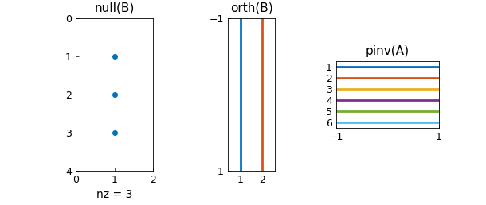

## 6.7 Array-valued chebfuns vs. arrays of chebfuns

There is a distinction, both in MATLAB Chebfun and in chebfunjax, between an
*array-valued chebfun* -- a single object holding several columns that share one
discretization -- and an *array (list) of separate chebfuns*, each with its own
discretization. A quasimatrix built as `Quasimatrix([...])` is the second kind:
a container of independent `Chebfun` columns, so different columns may have
different lengths and breakpoints (as with the hat functions above, whose
piecewise-linear columns each carry their own breakpoints). This flexibility is
exactly what lets a single quasimatrix mix smooth polynomials and non-smooth
basis functions, at the cost of a little extra bookkeeping compared with a
uniform array-valued representation.

## 6.8 References

- M. Abramowitz and I. A. Stegun, eds., *Handbook of Mathematical Functions
  with Formulas, Graphs, and Mathematical Tables*, 9th printing, Dover, 1972.

- Z. Battles, *Numerical Linear Algebra for Continuous Functions*, DPhil thesis,
  Oxford University Computing Laboratory, 2006.

- Z. Battles and L. N. Trefethen, "An extension of Matlab to continuous
  functions and operators," *SIAM J. Sci. Comput.*, 25 (2004), 1743-1770.

- C. de Boor, "An alternative approach to (the teaching of) rank, basis, and
  dimension," *Linear Algebra Appl.*, 146 (1991), 221-229.

- G. W. Stewart, *Afternotes Goes to Graduate School: Lectures on Advanced
  Numerical Analysis*, SIAM, 1998.

- L. N. Trefethen, "Householder triangularization of a quasimatrix," *IMA J.
  Numer. Anal.*, 30 (2010), 887-897.

- L. N. Trefethen and D. Bau, III, *Numerical Linear Algebra*, SIAM, 1997.
