# Chapter 7: Linear Differential Operators and Equations

*Based on [Chebfun Guide Chapter 7](https://www.chebfun.org/docs/guide/guide07.html)*

## 7.1 Introduction

Chebfunjax provides tools for solving ordinary differential equations through spectral collocation methods. The central abstractions are:

- **`OperatorBlock`** -- a linear map from functions to functions (e.g., differentiation).
- **`FunctionalBlock`** -- a linear map from functions to scalars (e.g., point evaluation).
- **`Linop`** -- a linear differential operator with attached boundary conditions.
- **`Chebop`** -- a user-friendly nonlinear operator constructor.

This chapter focuses on linear two-point boundary value problems. Nonlinear problems are treated in Chapter 10.

The key references are Driscoll, Bornemann & Trefethen (2008), Driscoll & Hale (2014), and Trefethen, Birkisson & Driscoll (2018, *Exploring ODEs*).

## 7.2 About Linear Operators

A linear differential operator acts on chebfuns and can be discretized as a matrix on a Chebyshev collocation grid. Chebfunjax uses Chebyshev-2 (Clenshaw-Curtis) collocation: the operator is represented as an $n \times n$ matrix mapping function values at $n$ Chebyshev points to values of the result at the same points.

Boundary conditions are imposed by replacing the last rows of the operator matrix with the corresponding functional rows (e.g., evaluation at endpoints). The resulting square system is then solved by `jnp.linalg.solve`.

## 7.3 Building Operators with Blocks

The building blocks for operators live in `chebfunjax.operators.blocks`:

```python
from chebfunjax.operators.blocks import D, I, diag, eval_at, sum_functional
```

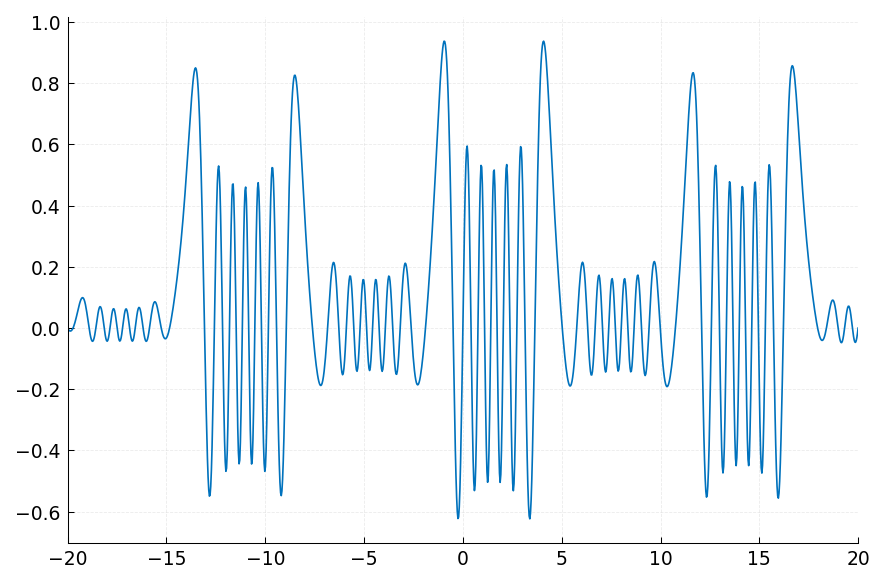


### The Differentiation Operator `D`

The function `D(domain, order)` returns an `OperatorBlock` for differentiation:

```python
# First derivative on [-1, 1]
D1 = D()

# Second derivative on [-1, 1]
D2 = D(order=2)

# First derivative on [0, pi]
import jax.numpy as jnp
D_pi = D(domain=(0.0, float(jnp.pi)))
```

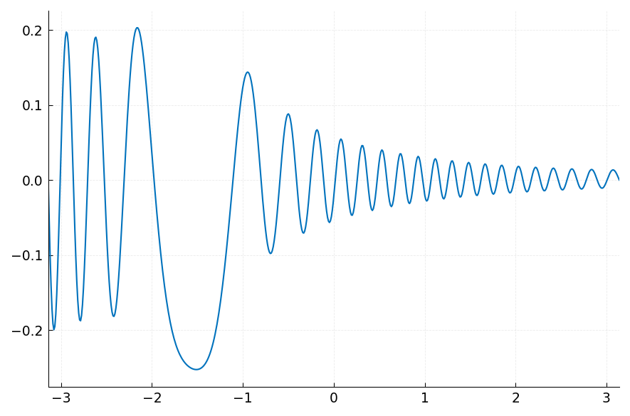


### The Identity Operator `I`

`I(domain)` returns the identity operator (its matrix is the identity):

```python
Id = I()
```

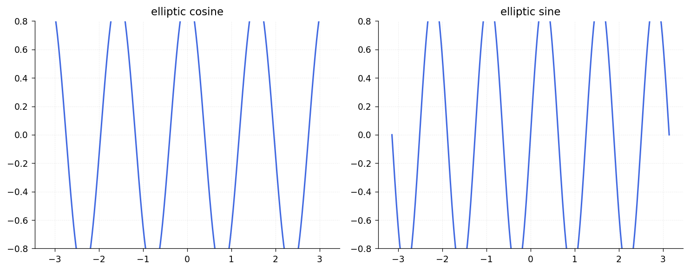


### Multiplication Operator `diag`

`diag(f)` returns the operator that multiplies by the chebfun `f`:

```python
import chebfunjax as cj

x = cj.chebfun(lambda t: t)
M = diag(x)   # multiplication by x
```

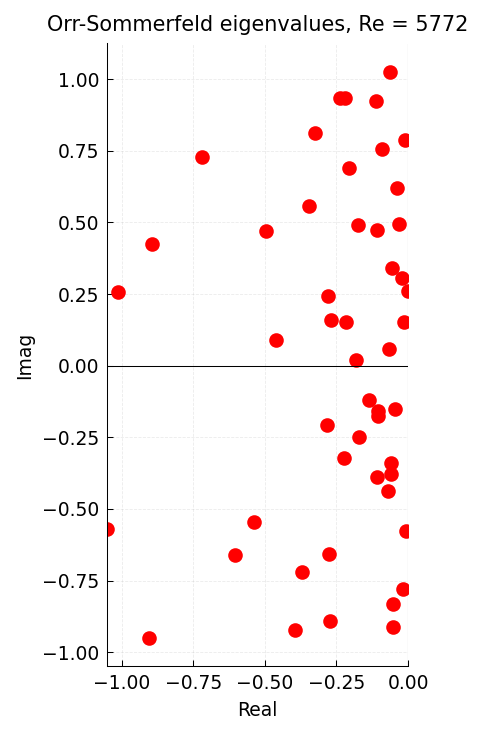


### Operator Algebra

Operators support addition, subtraction, scalar multiplication, and composition:

```python
# L = d^2/dx^2 + x*I  (Airy-type operator)
L_op = D(order=2) + diag(x)

# L = 0.001 * d^2/dx^2 - I
L_op2 = 0.001 * D(order=2) - I()
```

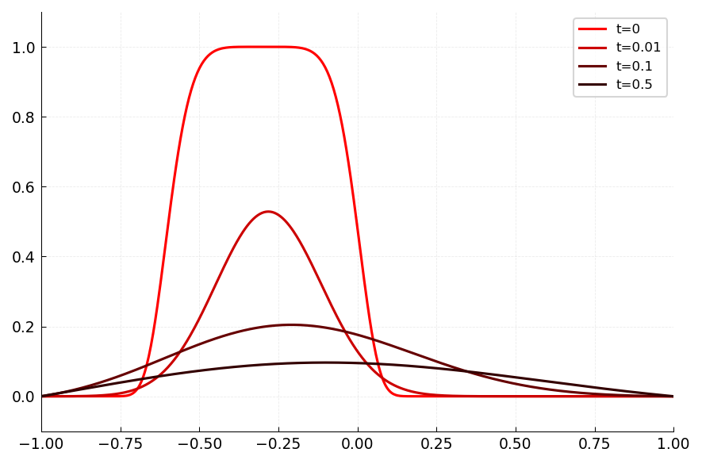


### Evaluation Functionals

`eval_at(x, domain)` returns a `FunctionalBlock` for point evaluation $u(x)$:

```python
# Evaluate at x = -1
E_left = eval_at(-1.0)

# Evaluate at x = 1
E_right = eval_at(1.0)
```

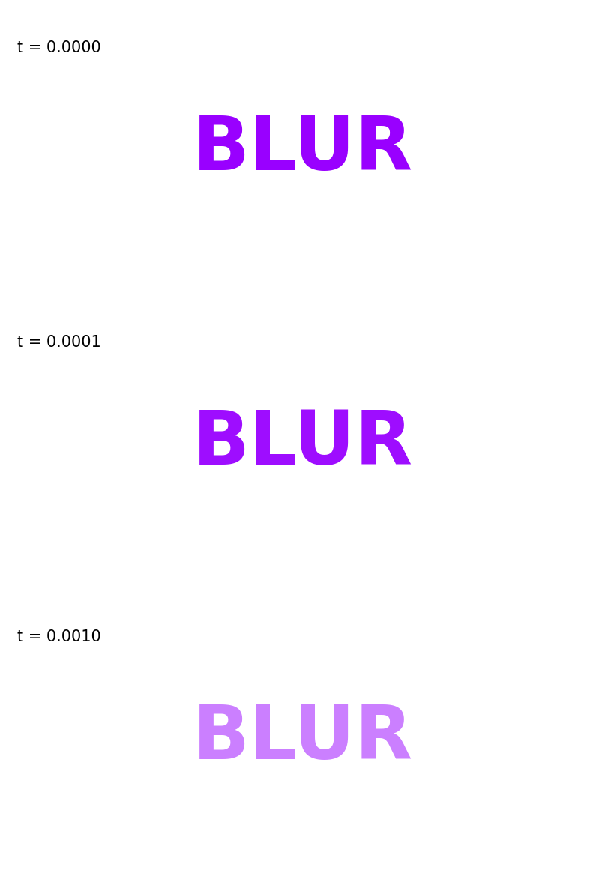


### Integral Functional

`sum_functional(domain)` returns the definite integral functional $\int_a^b u(x)\,dx$:

```python
S = sum_functional()
```

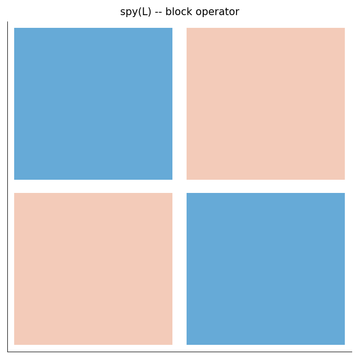


## 7.4 Solving BVPs with `Linop`

The `Linop` class packages a linear operator with boundary conditions and provides a `solve` method.

### Example: $u'' = -1$, $u(-1) = u(1) = 0$

The exact solution is $u(x) = (1 - x^2)/2$.

```python
from chebfunjax.operators.linop import Linop
from chebfunjax.operators.blocks import D, eval_at
import jax.numpy as jnp

L = Linop(
    D(order=2),
    bcs=[eval_at(-1.0), eval_at(1.0)],
    domain=(-1.0, 1.0),
    bc_values=[0.0, 0.0],
)
u = L.solve(lambda x: -jnp.ones_like(x))
print(f"u(0) = {float(u(jnp.float64(0.0))):.15f}")   # 0.5
```

![cumsum(x) on [0,1]](../images/guide/guide07_01.png)

### Adaptive Discretization

When no fixed size `n` is provided, `Linop.solve` uses an adaptive loop: it tries discretization sizes $n = 8, 16, 32, \ldots$ until the Chebyshev coefficients of the solution decay below the tolerance.

```python
# Fixed size
u_fixed = L.solve(lambda x: -jnp.ones_like(x), n=32)

# Adaptive (default)
u_adaptive = L.solve(lambda x: -jnp.ones_like(x), tol=1e-12)
```

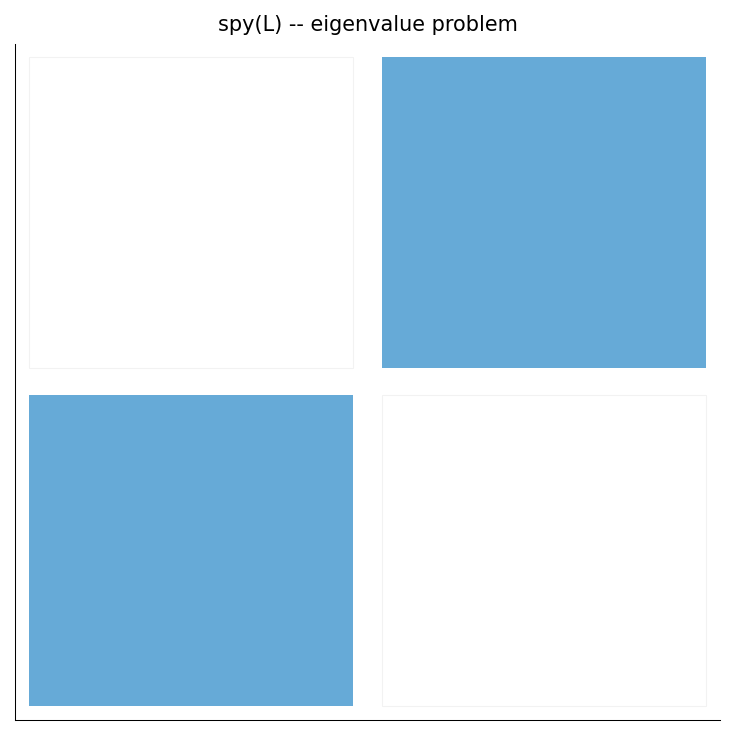


### Variable Coefficients

Operators with variable coefficients are built by combining `D`, `I`, and `diag`:

```python
import chebfunjax as cj

x = cj.chebfun(lambda t: t, domain=(-3.0, 3.0))

# u'' + x^3 * u = 1, u(-3) = u(3) = 0
L = Linop(
    D(domain=(-3.0, 3.0), order=2) + diag(x**3),
    bcs=[eval_at(-3.0, domain=(-3.0, 3.0)),
         eval_at(3.0, domain=(-3.0, 3.0))],
    domain=(-3.0, 3.0),
    bc_values=[0.0, 0.0],
)
u = L.solve(lambda t: jnp.ones_like(t))
```

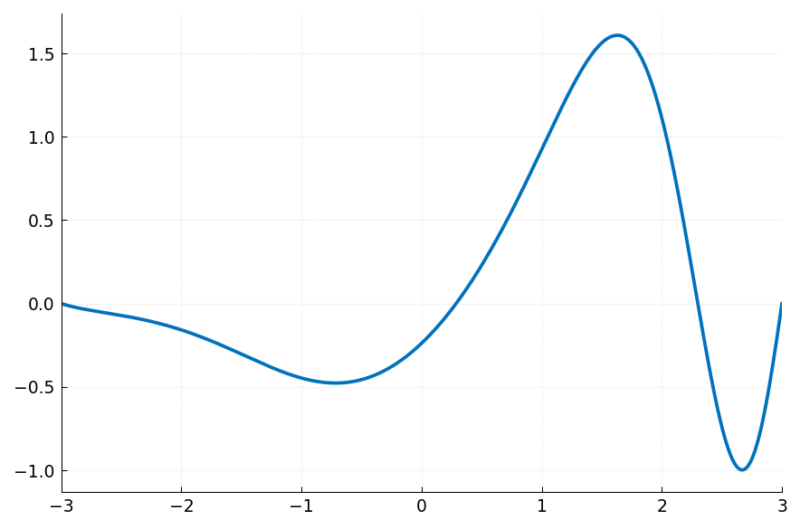

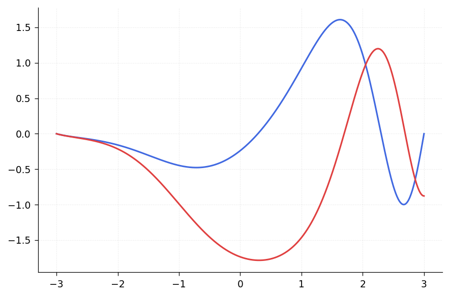

### Verifying the Solution

You can verify the residual by evaluating the operator on the solution:

```python
residual = u.diff(2) + x**3 * u - 1.0
print(f"Residual norm: {float(residual.norm()):.2e}")
```

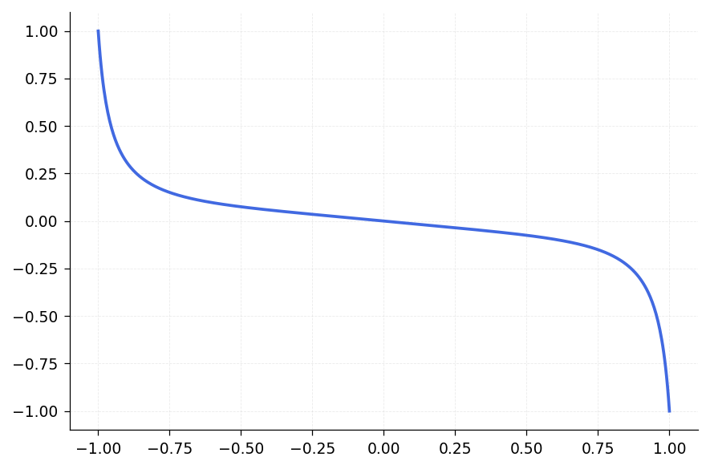


## 7.5 Solving BVPs with `Chebop`

The `Chebop` class provides a higher-level interface. The operator is specified as a Python callable taking `(x, u)` arguments, where `x` is the identity chebfun and `u` is the unknown:

```python
from chebfunjax.operators.chebop import Chebop

N = Chebop(lambda x, u: u.diff(2), domain=(-1.0, 1.0))
N.lbc = 0.0   # u(-1) = 0
N.rbc = 0.0   # u(1) = 0
u = N.solve(-1.0)
print(f"u(0) = {float(u(jnp.float64(0.0))):.15f}")
```

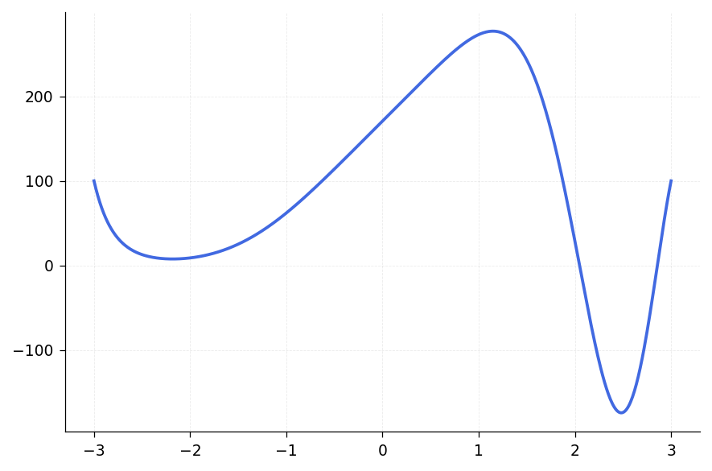

### Boundary Condition Types

Chebop supports several BC forms:

- **Scalar**: `N.lbc = c` sets $u(a) = c$ (Dirichlet).
- **List**: `N.lbc = [c0, c1]` sets $u(a) = c_0$ and $u'(a) = c_1$.
- **Callable**: `N.lbc = lambda u: u.diff() - 1` sets a general condition $g(u) = 0$ at the left endpoint.

```python
# Neumann BC on the right: u'(1) = 0
N2 = Chebop(lambda x, u: u.diff(2), domain=(-1.0, 1.0))
N2.lbc = 0.0
N2.rbc = lambda u: u.diff()
u2 = N2.solve(-1.0)
```

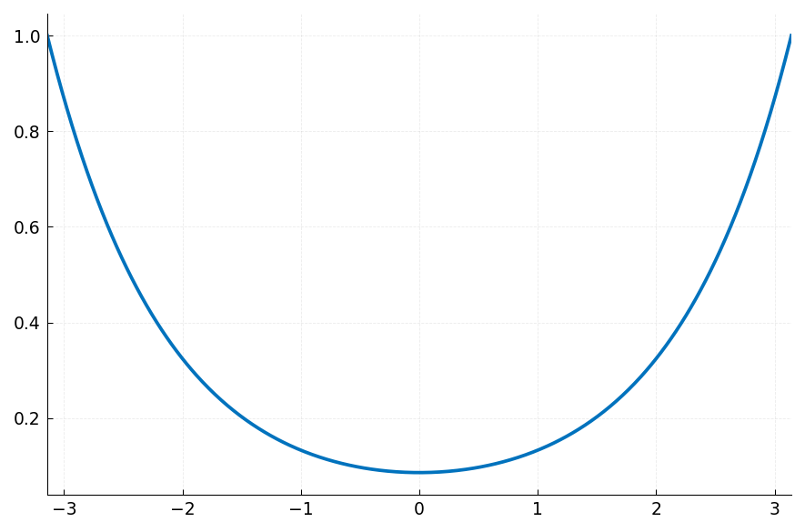


### The Convenience Function `bvp`

For quick one-off solves, use the `bvp` function:

```python
from chebfunjax.chebfun1d.ode import bvp

u = bvp(
    lambda x, u: u.diff(2),
    domain=(-1.0, 1.0),
    lbc=0.0,
    rbc=0.0,
    f=-1.0,
)
```

## 7.6 Eigenvalue Problems with `eigs`

The `eigs` method computes eigenvalues of the constrained differential operator. For the operator $L$ with boundary conditions, the eigenvalue problem is

$$Lu = \lambda u.$$

### Example: Eigenvalues of $-u''$ with Dirichlet BCs on $[0, \pi]$

The exact eigenvalues are $\lambda_k = k^2$ for $k = 1, 2, 3, \ldots$

```python
from chebfunjax.chebfun1d.ode import eigs
import jax.numpy as jnp

lam = eigs(
    lambda x, u: -u.diff(2),
    domain=(0.0, float(jnp.pi)),
    lbc=0.0,
    rbc=0.0,
    k=6,
)
print("Eigenvalues:", lam)
# Should be approximately 1, 4, 9, 16, 25, 36
```

![Eigenmodes of the second derivative on [0, pi]](../images/guide/guide07_08.png)

### Using Chebop for Eigenvalues

```python
N = Chebop(lambda x, u: -u.diff(2), domain=(0.0, float(jnp.pi)))
N.lbc = 0.0
N.rbc = 0.0
lam = N.eigs(k=6)
print("Eigenvalues:", lam)
```

### Generalized Eigenproblems and Target Selection

The `sigma` parameter controls which eigenvalues are returned:

- `sigma=None` or `sigma='SM'`: smallest magnitude.
- `sigma='LM'`: largest magnitude.
- `sigma='SR'`: smallest real part.
- `sigma='LR'`: largest real part.
- `sigma=c` (a number): nearest to the target $c$.

```python
# Find eigenvalues nearest to 50
lam_near_50 = N.eigs(k=4, sigma=50.0)
```

## 7.7 Algorithms: Chebyshev Spectral Collocation

Chebfunjax uses Chebyshev-2 (Gauss-Lobatto) spectral collocation for discretizing differential operators. The algorithm proceeds as follows:

1. **Discretize** the operator $L$ at $n$ Chebyshev-2 collocation points on $[a, b]$ to obtain an $n \times n$ matrix $A$.
2. **Replace** the last $n_{\mathrm{bc}}$ rows of $A$ with the boundary condition rows (e.g., evaluation functionals at endpoints).
3. **Build** the right-hand side vector $\mathbf{f}$, replacing the last $n_{\mathrm{bc}}$ entries with boundary values.
4. **Solve** $A \mathbf{u} = \mathbf{f}$ via `jnp.linalg.solve`.
5. **Interpret** the solution vector as function values at the collocation points and wrap in a Chebfun.

For adaptive solves, the process repeats at sizes $n = 8, 16, 32, \ldots$ until the Chebyshev coefficients of the solution decay below the requested tolerance.

### Accessing the Discretization Matrix

```python
from chebfunjax.operators.blocks import D, ChebColloc2Disc

disc = ChebColloc2Disc(8, (-1.0, 1.0))
D2_mat = D(order=2).matrix(disc)
print(f"D2 matrix shape: {D2_mat.shape}")
print(D2_mat)
```

![Cosine solution on [-10, 10]](../images/guide/guide07_14.png)

### Conditioning

Chebyshev spectral differentiation matrices are notoriously ill-conditioned. For a second-order problem, one typically loses 2-3 digits of accuracy relative to machine precision, and 5-6 digits for fourth-order problems. This is a well-known feature of spectral methods (Trefethen 2000).

## 7.8 Systems of Equations

Systems of ODEs can be solved using Chebop with multi-variable operator signatures.

### Example: $u' = v$, $v' = -u$ on $[0, 10\pi]$

This is the harmonic oscillator $u'' + u = 0$, written as a first-order system:

```python
# Second-order formulation
N = Chebop(lambda x, u: u.diff(2) + u, domain=(0.0, 10 * float(jnp.pi)))
N.lbc = [1.0, 0.0]   # u(0) = 1, u'(0) = 0
u = N.solve(0.0)

# Verify: u should be cos(x)
mid = 5.0 * float(jnp.pi)
print(f"u({mid:.4f}) = {float(u(jnp.float64(mid))):.10f}")
print(f"cos({mid:.4f}) = {float(jnp.cos(jnp.float64(mid))):.10f}")
```

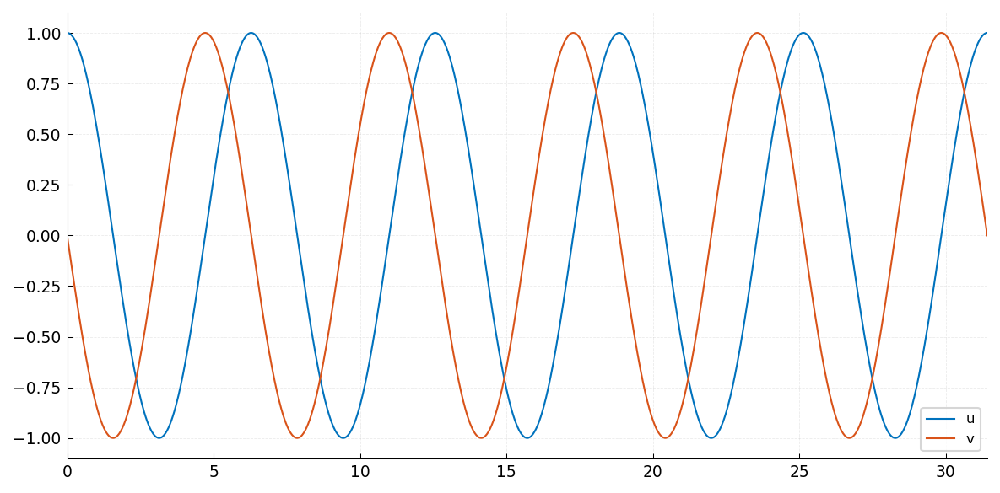

## 7.9 Quantum States

The `quantumstates` function solves the time-independent Schrodinger equation

$$-h^2 u''(x) + V(x)\,u(x) = \lambda\,u(x)$$

with Dirichlet boundary conditions, returning the $n$ smallest eigenvalues (energy levels) and corresponding eigenfunctions.

```python
import chebfunjax as cj

# Harmonic oscillator: V(x) = x^2
x = cj.chebfun(lambda t: t, domain=(-5.0, 5.0))
V = x**2
eigenvalues, eigenfunctions = cj.quantumstates(V, n=5, h=0.1)
print("Energy levels:", eigenvalues)
```

## 7.10 GMRES for Operator Equations

For large or ill-conditioned systems, chebfunjax provides a `gmres` function that applies iterative GMRES (via SciPy) to the discretized operator system:

```python
from chebfunjax.operators.linop import Linop, gmres
from chebfunjax.operators.blocks import D, eval_at

L = Linop(
    D(order=2),
    bcs=[eval_at(-1.0), eval_at(1.0)],
    domain=(-1.0, 1.0),
    bc_values=[0.0, 0.0],
)
u = gmres(L, lambda x: -jnp.ones_like(x), n=64)
print(f"u(0) = {float(u(jnp.float64(0.0))):.10f}")
```

## 7.11 References

- J. L. Aurentz and L. N. Trefethen, "Block operators and spectral discretizations," *SIAM Review* 59 (2017), 423-446.

- A. Birkisson, *Numerical Solution of Nonlinear Boundary Value Problems for ODEs in the Continuous Framework*, D.Phil. thesis, University of Oxford, 2014.

- T. A. Driscoll, F. Bornemann, and L. N. Trefethen, "The chebop system for automatic solution of differential equations," *BIT Numer. Math.* 46 (2008), 701-723.

- T. A. Driscoll and N. Hale, "Rectangular spectral collocation," *IMA J. Numer. Anal.* 36 (2016), 108-132.

- S. Olver and A. Townsend, "A fast and well-conditioned spectral method," *SIAM Review* 55 (2013), 462-489.

- L. N. Trefethen, *Spectral Methods in MATLAB*, SIAM, 2000.

- L. N. Trefethen, A. Birkisson, and T. A. Driscoll, *Exploring ODEs*, SIAM, 2018.