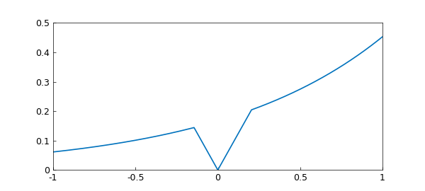
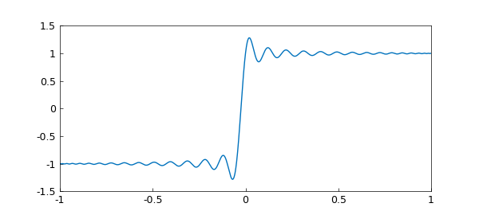
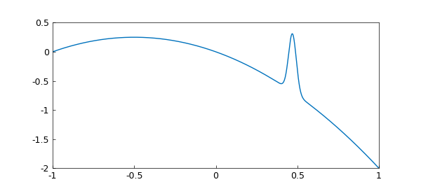
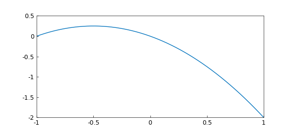
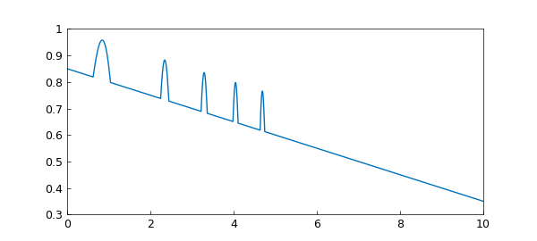
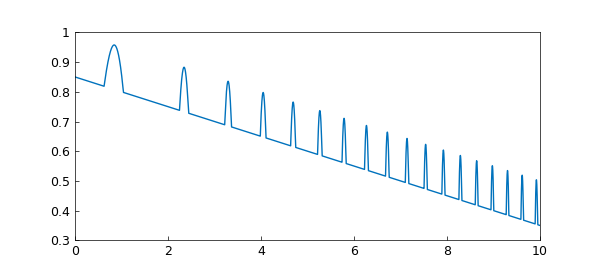
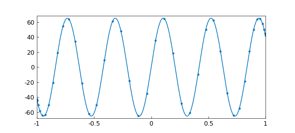
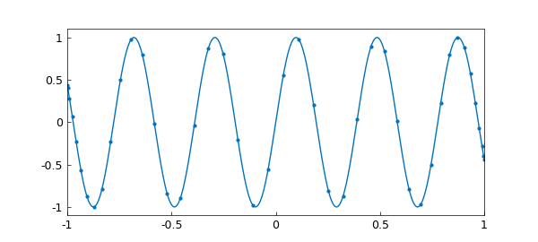

# Chapter 8: Chebfun Preferences

*Based on [Chebfun Guide Chapter 8](https://www.chebfun.org/docs/guide/guide08.html)
by Nick Trefethen. Original text and examples copyright the Chebfun
Developers; this is a Python/JAX translation.*

Chebfun lets users adjust design decisions through *preferences*. In
chebfunjax these live in a single preferences object, `chebfunjax.pref.pref`,
which plays the role of MATLAB Chebfun's `chebfunpref`. The Python
preferences model is smaller than MATLAB's, and several MATLAB knobs
(`splitting`, `minSamples`, `resampling`, `splitLength`, ...) have no direct
equivalent. Where that is the case this chapter says so plainly and shows the
public-API way to get the same result.

## 8.1 Introduction

The preferences singleton is imported directly and printed to show all
current settings:

```python
from chebfunjax.pref import pref

print(pref)
```

```
ChebPreferences(
    chop_tol=None,
    domain=(-1.0, 1.0),
    eps=2.220446049250313e-16,
    max_length=65537,
    tech='chebtech2',
)
```

The same information is available as a plain dictionary:

```python
print(pref.to_dict())
# {'eps': 2.220446049250313e-16, 'max_length': 65537, 'tech': 'chebtech2',
#  'domain': (-1.0, 1.0), 'chop_tol': None}
```

To reset every preference to its factory default:

```python
pref.reset()
```

As in MATLAB, there are two ways to change a preference. The recommended way
is to pass it directly to the constructor (e.g. `domain=` or `n=`). The other
is to set it globally on `pref`, optionally scoped to a block with the
thread-safe `pref.context(...)` context manager:

```python
with pref.context(max_length=1000):
    ...            # pref.max_length == 1000 inside this block
# restored to 65537 here
```

## 8.2 `domain`: the default domain

The default domain is `[-1, 1]`. In MATLAB one can change the global default
with `chebfunpref.setDefaults('domain', ...)`. In chebfunjax the `domain`
preference exists, but **the constructor does not currently read it** — build
functions on a non-default interval by passing `domain=` explicitly:

```python
import chebfunjax as cj
import jax.numpy as jnp
import math

f = cj.chebfun(lambda t: jnp.sin(19 * t), domain=(0.0, 2 * math.pi))
g = cj.chebfun(lambda t: jnp.cos(20 * t), domain=(0.0, 2 * math.pi))
print(len(f), len(g))
# 102 105
```

Plotting `g` against `f` traces a Lissajous-style figure:

```python
import matplotlib.pyplot as plt
tt = jnp.linspace(0.0, 2 * math.pi, 4000)
plt.plot(f(tt), g(tt))
plt.axis("equal"); plt.axis("off")
```

![Lissajous figure from sin(19t) and cos(20t) on [0, 2pi]](../images/guide/guide08_01.png)

(MATLAB pairs this example with `'tech', @trigtech` for a periodic
representation; chebfunjax uses its default Chebyshev technology here, which
traces the identical curve. See Chapter 11 for the trigonometric technology.)

## 8.3 `splitting`: breaking into subintervals or not

In MATLAB, `splitting on` turns on automatic edge detection so the constructor
can break the domain into subintervals at singularities and corners.
**chebfunjax has no automatic splitting / edge detection.** A chebfun can
still be piecewise — you supply the breakpoints yourself as extra entries in
the `domain` tuple, `domain=(a, b1, ..., b)`.

Consider `min(|x|, exp(x)/6)`. It has corners at `x = 0` and at the two points
where `|x|` and `exp(x)/6` cross. We locate those crossings and pass them as
breakpoints:

```python
import numpy as np
from scipy.optimize import brentq

c1 = brentq(lambda x: -x - np.exp(x) / 6, -1, 0)   # -0.14427...
c2 = brentq(lambda x:  x - np.exp(x) / 6,  0, 1)    #  0.20448...

f = cj.chebfun(lambda x: jnp.minimum(jnp.abs(x), jnp.exp(x) / 6),
               domain=(-1.0, c1, 0.0, c2, 1.0))
print(len(f), [p.tech.n for p in f.funs])
# 29 [13, 2, 2, 12]
```

The two central pieces (where the function equals `|x|`) are linear, so each
is length 2; the outer pieces follow `exp(x)/6`.



If instead the breakpoints are omitted, the constructor tries to fit a single
global polynomial to a function with corners. It cannot converge and returns
an unhappy representation at the maximum length, with a warning:

```python
import warnings
with warnings.catch_warnings(record=True) as w:
    warnings.simplefilter("always")
    f = cj.chebfun(lambda x: jnp.minimum(jnp.abs(x), jnp.exp(x) / 6))
print(len(f), str(w[0].message))
# 65537  Chebtech2.from_function: function did not converge with 65537 points. ...
```

Splitting is most useful for functions whose complexity varies across the
domain: breaking them into pieces can lower the overall polynomial degree.
Consider

```python
ff = lambda x: jnp.sin(x) * jnp.tanh(3 * jnp.exp(x) * jnp.sin(15 * x))
f = cj.chebfun(ff)
print(len(f))
# 1416
```

![sin(x)*tanh(3 exp(x) sin(15x)) on [-1, 1]](../images/guide/guide08_03.png)

On the wider domain `[-3, 3]` the same function needs a much higher degree:

```python
f3 = cj.chebfun(ff, domain=(-3.0, 3.0))
print(len(f3))
# 17571
```

![Same function on [-3, 3]](../images/guide/guide08_04.png)

In MATLAB, `'splitting', 'on'` would resolve these with lower total degree by
subdividing automatically (lengths 829 and 2787). In chebfunjax you would have
to supply the subdivision breakpoints yourself. A single global polynomial is,
however, more robust for subsequent differentiation and for use inside chebops.

## 8.4 `splitLength`: length limit in splitting mode

In MATLAB, `splitLength` (factory value 160) caps the length of an individual
fun before the interval is subdivided. Because chebfunjax does not perform
automatic splitting, there is no `splitLength` preference: the length of each
piece is whatever the adaptive constructor needs (up to `max_length`), and you
control the subdivision directly through the breakpoints you pass to `domain`.

## 8.5 `max_length`: maximum length

In splitting-off mode, the constructor builds a global polynomial of ever
higher degree until it resolves the function or hits the maximum length. The
factory value is `2**16 + 1 = 65537`.

The sign function is discontinuous and cannot be resolved by any polynomial,
so adaptive construction fails:

```python
with warnings.catch_warnings(record=True) as w:
    warnings.simplefilter("always")
    f = cj.chebfun(lambda x: jnp.sign(x))
print(len(f), str(w[0].message))
# 65537  Chebtech2.from_function: function did not converge with 65537 points. ...
```

You can instead request a fixed number of points with `n=`, which bypasses the
adaptive loop and issues no warning:

```python
f = cj.chebfun(lambda x: jnp.sign(x), n=65)
print(len(f))
# 65
```



The interpolant shows the Chebyshev analogue of the Gibbs phenomenon near the
jump. (chebfunjax's fixed-length construction is pure interpolation, so its
overshoot reaches the full Chebyshev–Gibbs value of about 1.28; MATLAB's
render of the same example is visually a little gentler.)

> **Library note.** In the current chebfunjax the adaptive constructor's
> maximum length is fixed at 65537; the `max_length` preference is a
> placeholder that the constructor does not yet read. This differs from
> MATLAB, where `'maxLength', 1e6` lets very high-degree functions such as
> `1/(1 + 1e8*x^2)` (length 363661) resolve. In chebfunjax that function
> currently exceeds the fixed cap and cannot be resolved adaptively; request
> a fixed `n=` if you truly need such a degree.

```python
for ml in (65537, 1_000_000):
    with pref.context(max_length=ml):
        f = cj.chebfun(lambda x: 1.0 / (1.0 + 1e8 * x**2))
    print(ml, len(f))
# 65537 65537     <- length is capped regardless of the preference
# 1000000 65537
```

## 8.6 `minSamples`: minimum number of sample points

The adaptive constructor samples on grids of `17, 33, 65, 129, ...` points
until the Chebyshev coefficients decay to tolerance. The starting grid of 17
points corresponds to MATLAB's factory `minSamples`. chebfunjax does not expose
a `minSamples` knob, but because the starting grid is the same, the
"feature found / feature missed" behaviour matches MATLAB exactly.

A cubic resolves well below the initial grid size:

```python
print(len(cj.chebfun(lambda x: x**3)))
# 4
```

A smooth bump of width `~1/30` is caught by the 17-point start:

```python
f = cj.chebfun(lambda x: -x - x**2 + jnp.exp(-(30 * (x - 0.47))**2))
print(len(f))
# 312
```



But make the bump a steeper, narrower super-Gaussian (exponent 4) and the
initial grid steps right over it: every sample lands where the bump is below
machine precision, so the constructor "resolves" only the underlying parabola:

```python
f = cj.chebfun(lambda x: -x - x**2 + jnp.exp(-(30 * (x - 0.47))**4))
print(len(f))
# 3
```



In MATLAB the fix is `'minSamples', 33`, which starts on a finer grid. Since
chebfunjax has no `minSamples`, force a fixed dense grid with `n=` to recover
the spike:

```python
f = cj.chebfun(lambda x: -x - x**2 + jnp.exp(-(30 * (x - 0.48))**4), n=1087)
print(len(f))
# 1087
```


The same under-sampling appears for functions with many narrow features. The
function `max(0.85, sin(x + x^2)) - x/20` on `[0, 10]` has spikes that get
narrower as `x` grows. Under-resolved, only the first, widest arches survive
and the fast tail collapses to the baseline `0.85 - x/20`:



Supplying breakpoints at every corner (or, in MATLAB, `'minsamples', 33`)
recovers all of the spikes:



(In chebfunjax both plots are built as piecewise chebfuns whose breakpoints are
the crossings of `sin(x + x^2) = 0.85`, since there is no automatic splitting;
see `scripts/generate_guide08_plots.py`.)

## 8.7 `resampling`: exploiting nested grids or not

Chebyshev grids are nested, so MATLAB Chebfun reuses previously computed values
as it refines. The `resampling` preference controls this, and turning it on
enables curious grid-dependent "functions" whose value depends on the number
of sample points, e.g. `length(x)*sin(15*x)`.

chebfunjax does not expose a `resampling` hook and its constructor does not
pass the grid length into the sampled function, so these grid-dependent
constructions cannot be built. What MATLAB's example actually converges to is
the fixed-length function evaluated on the grid where convergence happened —
for `length(x)*sin(15*x)` that grid has 65 points, i.e. the limit is
`65*sin(15*x)`:

```python
f = cj.chebfun(lambda x: 65.0 * jnp.sin(15 * x))
print(len(f))
# 42
```



Similarly `sin(length(x)**(2/3) * x)` converges on the 65-point grid to
`sin(65**(2/3) * x)`:

```python
f = cj.chebfun(lambda x: jnp.sin(65**(2 / 3) * x))   # 65**(2/3) = 16.1662
print(len(f))
# 44
```



Resampling is what makes chebops work in MATLAB, where the discretized
operator `L\f` genuinely depends on the grid size. chebfunjax's chebops handle
that adaptivity internally (see Chapter 10) rather than through a user-facing
`resampling` preference.

## 8.8 `eps`: constructor tolerance

MATLAB's constructor tolerance is `chebfuneps`, defaulting to machine epsilon
`2.220446049250313e-16`. chebfunjax stores the analogous value in `pref.eps`:

```python
print(pref.eps)
# 2.220446049250313e-16
```

> **Library note.** In the current chebfunjax the adaptive constructor uses a
> fixed machine-epsilon tolerance internally; the `eps` preference is a
> placeholder that construction does not yet read. Changing it therefore does
> not change the resulting length:
>
> ```python
> for e in (1e-4, 1e-8, 2.220446049250313e-16):
>     with pref.context(eps=e):
>         print(e, len(cj.chebfun(lambda x: jnp.exp(jnp.sin(10 * x)))))
> # 0.0001 143
> # 1e-08 143
> # 2.220446049250313e-16 143
> ```
>
> In MATLAB, weakening `chebfuneps` shortens the representation; this is useful
> for noisy data and for higher-dimensional problems. For one dimension the
> default is almost always the right choice.

## 8.9 Chebyshev grids of first or second kind

MATLAB Chebfun supports Chebyshev points of both the first kind
(`cos((j+1/2)π/(n+1))`, class `chebtech1`) and the second kind
(`cos(jπ/n)`, class `chebtech2`), switchable with `chebkind`. chebfunjax
implements only the second kind (Gauss–Lobatto points), which is the default
in both libraries and the right choice for almost all users:

```python
print(pref.tech)
# chebtech2
```

For periodic functions on equispaced grids, chebfunjax provides a separate
trigonometric technology (`trigtech`); see Chapter 11.

## 8.10 Spectral discretizations for chebops

MATLAB exposes `cheboppref` to choose the spectral discretization
(`chebcolloc2`, `chebcolloc1`, `ultraspherical`) used when solving differential
equations. chebfunjax's chebop/linop solvers instead take their parameters
directly as keyword arguments to `solve` (for example a discretization
tolerance `tol`, grid-size bounds `n_min`/`n_max`, and Newton controls
`max_iter`/`newton_tol`), rather than through a global preferences object. See
Chapter 10 for the operator API.

## 8.11 Chebfun2 preferences

The two-dimensional objects of Chapters 12–15 (`chebfun2`) carry their own
construction controls, such as the maximum rank of the low-rank approximation.
As with the 1-D constructor, these are passed at construction time or through
the two-dimensional constructor's own arguments rather than through the global
`pref` object.

## 8.12 Additional preferences and further information

Print `pref` (or inspect `pref.to_dict()`) for the complete list of recognised
preferences. Individual preferences reset to their factory value by name, and
all of them at once with a bare `reset()`:

```python
pref.max_length = 1000
print(pref.max_length)          # 1000
pref.reset("max_length")
print(pref.max_length)          # 65537
pref.reset()                    # everything back to factory
```

## Summary of factory defaults

| Preference   | Default                     | Notes                                              |
|--------------|-----------------------------|----------------------------------------------------|
| `eps`        | `2.220446049250313e-16`     | Construction tolerance (placeholder; see 8.8)      |
| `max_length` | `65537`                     | Adaptive cap fixed at this value (see 8.5)          |
| `tech`       | `'chebtech2'`               | Chebyshev points of the second kind                |
| `domain`     | `(-1.0, 1.0)`               | Pass `domain=` to the constructor (see 8.2)         |
| `chop_tol`   | `None`                      | Coefficient-chopping tolerance (`None` uses `eps`) |

## 8.13 Reference

[Aurentz & Trefethen 2017] J. L. Aurentz and L. N. Trefethen, "Chopping a
Chebyshev series," *ACM Trans. Math. Softw.* 43 (2017), p. 33.
