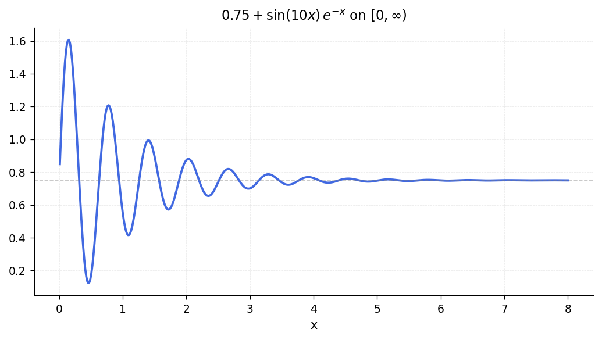
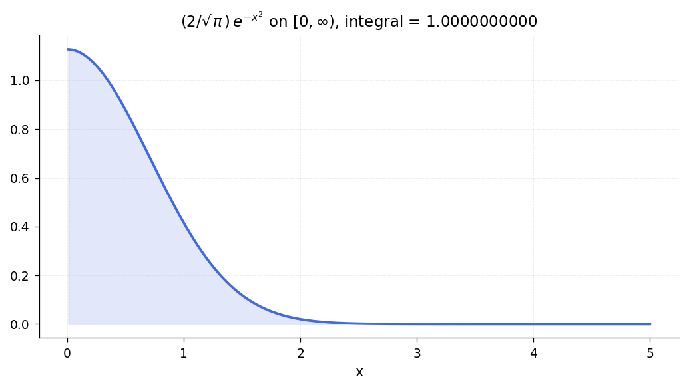
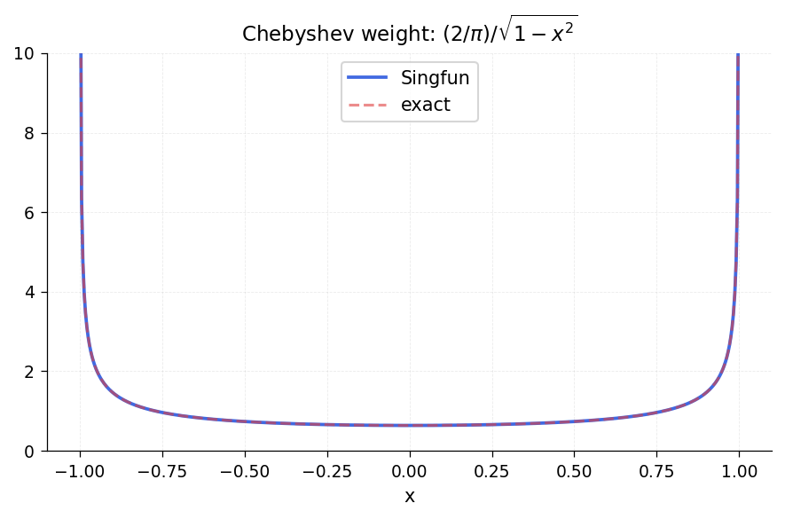

# Chapter 9: Infinite Intervals, Infinite Function Values, and Singularities

*Based on [Chebfun Guide Chapter 9](https://www.chebfun.org/docs/guide/guide09.html)*

## 9.1 Introduction

Standard chebfuns on a bounded interval $[a, b]$ can handle amazingly complicated smooth functions without difficulty. This chapter describes chebfunjax's support for extending beyond these limits:

- **Infinite intervals**: functions on $[a, \infty)$, $(-\infty, b]$, or $(-\infty, \infty)$.
- **Poles and singularities**: functions with algebraic endpoint blow-up such as $1/\sqrt{x}$ or $1/x$.

These features are inherently more challenging than bounded smooth-function approximation, and users should calibrate their expectations accordingly: accuracy may be limited to 8-10 digits rather than the 14-15 digits typical for smooth bounded problems.

## 9.2 Functions on Infinite Intervals

Chebfunjax supports functions on semi-infinite and doubly-infinite intervals via the `Unbndfun` class (`chebfunjax.fun.unbndfun`). The approach uses a rational change of variables (Mobius-type mapping) that maps $[a, \infty)$ or $(-\infty, \infty)$ to the reference interval $[-1, 1]$, where standard Chebyshev approximation is applied.

### The Mapping

For $[a, \infty)$, the forward map is:

$$x = \frac{15(s + 1)}{1 - s} + a, \quad s \in [-1, 1),$$

with inverse:

$$s = \frac{x - a - 15}{x - a + 15}.$$

For $(-\infty, b]$, a reflected version is used. For $(-\infty, \infty)$, the map is:

$$x = \frac{5s}{1 - s^2}, \quad s \in (-1, 1).$$

The scale constants (15 for semi-infinite, 5 for doubly-infinite) are chosen to balance resolution near the finite endpoint with coverage of the tail.

### Example: Function on $[0, \infty)$

```python
from chebfunjax.fun.unbndfun import Unbndfun
import jax.numpy as jnp

# f(x) = 0.75 + sin(10x) * exp(-x) on [0, infinity)
f = Unbndfun.from_function(
    lambda x: 0.75 + jnp.sin(10 * x) * jnp.exp(-x),
    a=0.0, b=float('inf'),
)

# Evaluate
print(f"f(0) = {float(f(jnp.float64(0.0))):.6f}")
print(f"f(10) = {float(f(jnp.float64(10.0))):.6f}")
```



### Example: Gaussian on $(-\infty, \infty)$

The error function can be computed by integrating the Gaussian:

$$\mathrm{erf}(x) = \frac{2}{\sqrt{\pi}} \int_0^x e^{-t^2}\,dt.$$

```python
# g(x) = (2/sqrt(pi)) * exp(-x^2) on [0, infinity)
g = Unbndfun.from_function(
    lambda x: (2.0 / jnp.sqrt(jnp.pi)) * jnp.exp(-x**2),
    a=0.0, b=float('inf'),
)
integral = float(g.sum())
print(f"integral of (2/sqrt(pi))*exp(-x^2) from 0 to inf = {integral:.15f}")
# Should be 1.0 (the complete error function)
```



### Caveats for Infinite Intervals

Functions must decay sufficiently rapidly at infinity for the representation to be accurate. Slowly decaying functions like $\sin(\pi x)/(\pi x)$ may not be resolved within the default `max_length`. The mapping concentrates points near the finite endpoint, so oscillations far from the origin are poorly represented.

## 9.3 Singularities at Endpoints: `Singfun`

The `Singfun` class (`chebfunjax.fun.singfun`) represents functions with algebraic endpoint singularities of the form

$$f(x) = s(x)\,(1 + x)^{\alpha}\,(1 - x)^{\beta},$$

where $s(x)$ is smooth and $(\alpha, \beta)$ are real exponents. The smooth part $s(x)$ is approximated by a standard `Chebtech2`, and the singular factors are handled analytically.

### Example: Inverse Square Root Singularity

The function $w(x) = \frac{2}{\pi\sqrt{1-x^2}}$ (the Chebyshev weight function) has inverse-square-root singularities at both endpoints:

```python
from chebfunjax.fun.singfun import Singfun
import jax.numpy as jnp

# w(x) = (2/pi) / sqrt(1 - x^2) = (2/pi) * (1+x)^{-1/2} * (1-x)^{-1/2}
# Smooth part: s(x) = 2/pi * 2^{1/2} (absorbing constant factors)
w = Singfun.from_function(
    lambda x: (2.0 / jnp.pi) / jnp.sqrt(1.0 - x**2),
    exponents=(-0.5, -0.5),
)

# The integral should be 2
integral = float(w.sum())
print(f"integral of w(x) = {integral:.15f}")
```



### Specifying Exponents

The `exponents` parameter is a tuple `(alpha, beta)` specifying the algebraic behavior at the left and right endpoints respectively:

- $\alpha < 0$: singularity (blow-up) at the left endpoint $x = -1$.
- $\alpha > 0$: zero (vanishing) at the left endpoint.
- $\alpha = 0$: smooth at the left endpoint.

Similarly for $\beta$ at the right endpoint.

### Example: Square Root Function

The function $\sqrt{x}$ on $[0, 1]$ has a square-root singularity (in its derivative) at $x = 0$. While $\sqrt{x}$ itself is continuous, it is not smooth and requires a large number of Chebyshev coefficients for a polynomial approximation:

```python
import chebfunjax as cj

# Without singularity handling: needs many points
f_plain = cj.chebfun(lambda x: jnp.sqrt(x), domain=(0.0, 1.0))
print(f"Length without exponents: {len(f_plain)}")

# With singularity handling: much more efficient
# sqrt(x) on [0, 1] mapped to [-1, 1]: sqrt((1+t)/2) = (1+t)^{1/2} / sqrt(2)
f_sing = Singfun.from_function(
    lambda x: jnp.sqrt(jnp.clip((1.0 + x) / 2.0, 0.0, None)),
    exponents=(0.5, 0.0),
)
print(f"Singfun length: {f_sing.smoothPart.n}")
```

### Poles

Poles (negative integer exponents) are a special case of algebraic singularities. A function with a simple pole at the left endpoint has $\alpha = -1$:

```python
# f(x) = sin(50x) + 1/x on (0, 4]
# In reference coords on [-1, 1]: pole at x=-1 (corresponding to physical x=0)
f = Singfun.from_function(
    lambda x: jnp.sin(50 * (x + 1) * 2) + 1.0 / ((x + 1) * 2),
    exponents=(-1, 0),
)
```

## 9.4 Piecewise Construction with Singularities

For functions with interior singularities or different singular behavior at different points, chebfunjax's piecewise Chebfun framework can be combined with singularity handling. The idea is to introduce breakpoints at the singular points and handle each piece separately.

### Example: Absolute Value and Splitting

When a function has a non-smooth point (like a kink) in the interior of the domain, the Chebfun constructor can introduce breakpoints. The `abs` method of Chebfun automatically detects sign changes and introduces breakpoints:

```python
import chebfunjax as cj
import jax.numpy as jnp

x = cj.chebfun(lambda t: t)
f = cj.abs(x)  # |x| with a kink at x=0
print(f"Number of pieces: {len(f.funs)}")
```

### The Gamma Function

The gamma function has poles at the non-positive integers. To represent it over an interval containing poles, one needs to specify breakpoints at the pole locations and appropriate exponents:

```python
import jax.numpy as jnp
from scipy.special import gamma

# Represent gamma(x) on [0.5, 4.5] (no poles in this range)
f = cj.chebfun(lambda x: jnp.array(gamma(x)), domain=(0.5, 4.5))
print(f"Length: {len(f)}")
```

## 9.5 Integration and Differentiation with Singularities

The `Singfun` class supports integration and differentiation that properly account for the singular factors.

### Integration

The integral $\int_{-1}^1 f(x)\,dx$ with $f(x) = s(x)(1+x)^\alpha(1-x)^\beta$ is computed by:

1. Expanding $s(x)$ in Chebyshev coefficients.
2. Using the analytic formula for $\int_{-1}^1 T_k(x)(1+x)^\alpha(1-x)^\beta\,dx$ (involving the Beta function).

This gives high accuracy even for strongly singular integrands, provided $\alpha > -1$ and $\beta > -1$ (so the integral converges).

### Differentiation

Differentiation uses the product rule:

$$f'(x) = s'(x)(1+x)^\alpha(1-x)^\beta + s(x)\left[\frac{\alpha}{1+x}(1+x)^\alpha(1-x)^\beta - \frac{\beta}{1-x}(1+x)^\alpha(1-x)^\beta\right].$$

The result may have stronger singularities (exponents decreased by 1) at the endpoints.

## 9.6 Automatic Singularity Detection

Chebfunjax's `Singfun` class includes an exponent-detection algorithm that can automatically determine the algebraic exponents at each endpoint. This is analogous to MATLAB Chebfun's `blowup` flag.

The detection algorithm works by sampling the function at points clustered near each endpoint and fitting the observed growth/decay to an algebraic model $|f(x)| \sim C|x - x_0|^\alpha$.

## 9.7 Practical Considerations

### Accuracy

Functions with singularities typically achieve 8-12 digits of accuracy rather than the 14-15 digits typical for smooth functions. The loss comes from:

- Conditioning of the smooth-part extraction.
- Numerical evaluation of the singular factors near the endpoints.

### When to Use Singfun

Use `Singfun` when:

- You know the function has algebraic endpoint singularities.
- A polynomial approximation would require tens of thousands of coefficients.
- You need accurate integration of singular integrands.

For functions that are merely steep (but not truly singular), standard Chebfun with a higher `max_length` is often sufficient.

### Combining with Piecewise Construction

For functions with singularities at interior points, use piecewise Chebfun construction: introduce breakpoints at the singularities and handle each piece with appropriate exponents.

## 9.8 References

- J. P. Boyd, *Chebyshev and Fourier Spectral Methods*, 2nd ed., Dover, 2001.

- M. Richardson, *Approximating Divergent Functions in the Chebfun System*, MSc thesis, University of Oxford, 2009.
