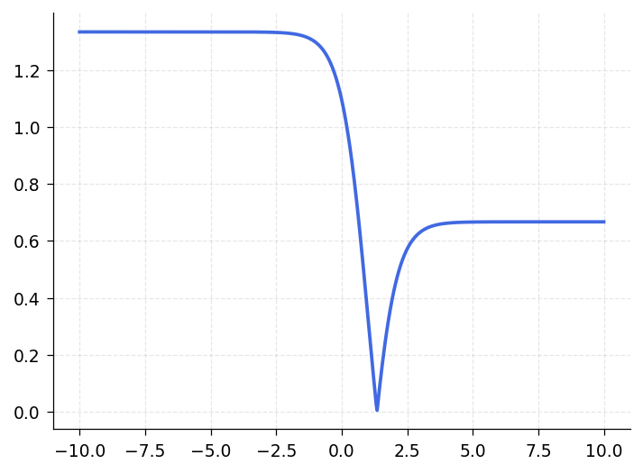
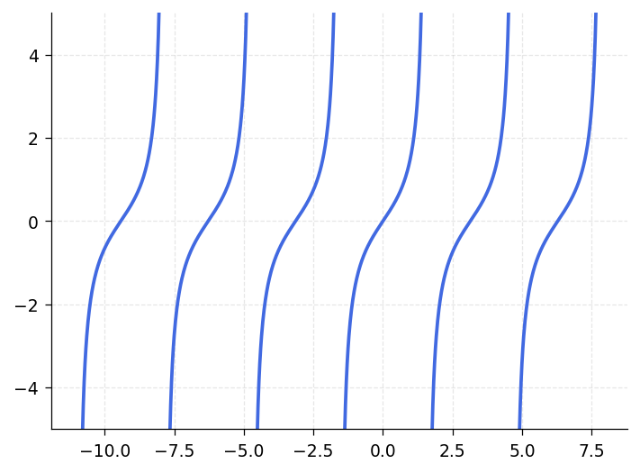
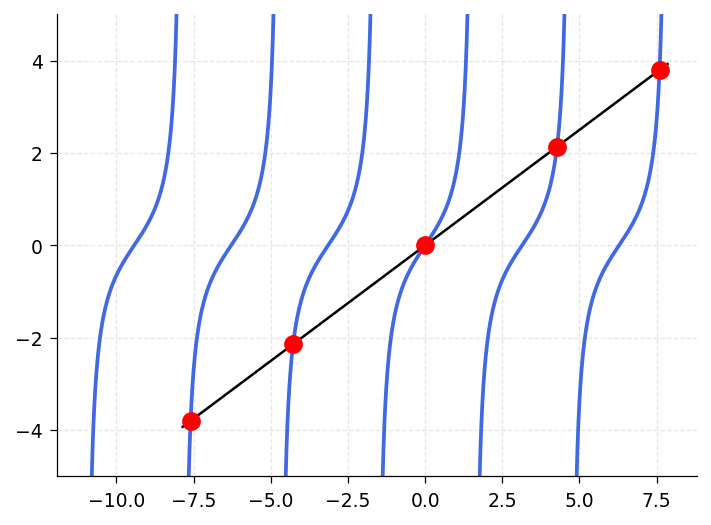
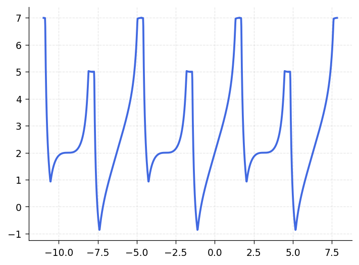
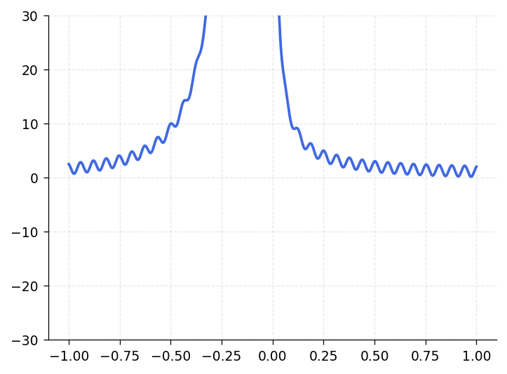
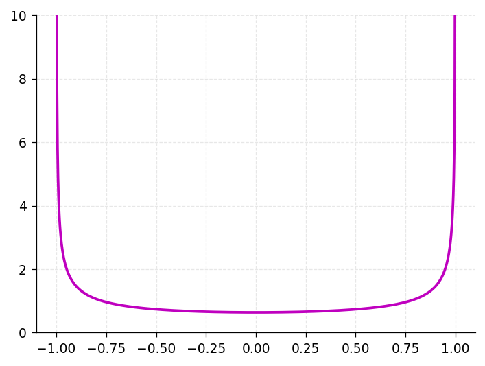
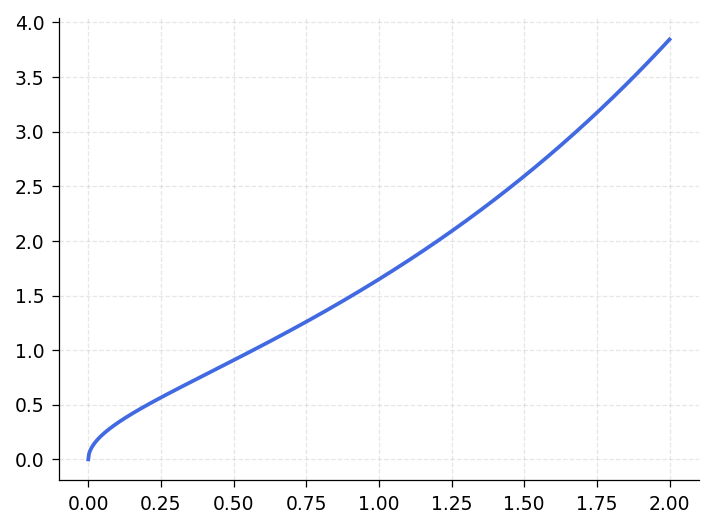
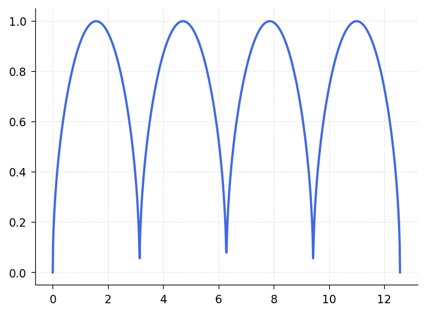

# Chapter 9: Infinite Intervals, Infinite Function Values, and Singularities

*Based on [Chebfun Guide Chapter 9](https://www.chebfun.org/docs/guide/guide09.html) by Lloyd N. Trefethen, November 2009, latest revision June 2019.*

## 9.1 Infinite intervals

This chapter presents some features of chebfunjax that are less robust than what is described in the first eight chapters. With classic bounded chebfuns on a bounded interval $[a,b]$, you can do amazingly complicated things often without encountering any difficulties. Now we are going to let the intervals and the functions diverge to infinity -- but please lower your expectations! These features are not always as accurate or reliable.

In chebfunjax, functions on infinite or semi-infinite intervals are handled by the `Unbndfun` class, which uses a change of variables (Mobius-type mapping) to map unbounded domains to the reference interval $[-1,1]$, where standard Chebyshev approximation is applied.

Here is a function on $[0, \infty)$. We can compute its maximum and plot it:

```python
from chebfunjax.fun.unbndfun import Unbndfun
from chebfunjax.domain import Domain
import jax.numpy as jnp
import numpy as np

f = Unbndfun.from_function(
    lambda x: 0.75 + jnp.sin(10 * x) * jnp.exp(-x),
    Domain((0.0, float('inf'))),
)
# Approximate the maximum
xs = jnp.linspace(0.0, 10.0, 10000)
ys = jnp.array([float(f(jnp.float64(xi))) for xi in xs])
maxf = float(jnp.max(ys))
print(f"maxf = {maxf}")
```

```
maxf = 1.608912750768336
```


Here is the reciprocal of the gamma function on $[0, \infty)$. Its integral can be computed with `sum`:

```python
from scipy.special import gamma as scipy_gamma

g = Unbndfun.from_function(
    lambda x: 1.0 / jnp.array(scipy_gamma(float(x) + 1.0)),
    Domain((0.0, float('inf'))),
)
sumg = float(g.sum())
print(f"sumg = {sumg}")
```

```
sumg = 2.266534507699849
```


We can plot both functions together and mark their intersection points:

```python
# Find roots of f - g by sign changes
xs = np.linspace(0.01, 5.0, 10000)
ys_f = np.array([float(f(jnp.float64(xi))) for xi in xs])
ys_g = np.array([float(g(jnp.float64(xi))) for xi in xs])
diff_vals = ys_f - ys_g
roots = []
for i in range(len(diff_vals) - 1):
    if diff_vals[i] * diff_vals[i + 1] < 0:
        t = diff_vals[i] / (diff_vals[i] - diff_vals[i + 1])
        roots.append(xs[i] + t * (xs[i + 1] - xs[i]))
for r in roots:
    print(f"  {r:.15f}")
```


Chebfunjax also supports functions on doubly-infinite intervals $(-\infty, \infty)$. Here we compute the minimum of $|\tanh(x-1) - 1/3|$:

```python
g = Unbndfun.from_function(
    lambda x: jnp.abs(jnp.tanh(x - 1.0) - 1.0 / 3.0),
    Domain((float('-inf'), float('inf'))),
)
# Find minimum by sampling
xs = np.linspace(-10, 10, 10000)
ys = np.array([float(g(jnp.float64(xi))) for xi in xs])
imin = np.argmin(ys)
minval, minpos = ys[imin], xs[imin]
print(f"minval = {minval}")
print(f"minpos = {minpos}")
```

```
minval = 0
minpos = 1.346573590279973
```



Notice that a function on an infinite domain is by default plotted on an interval like $[0, 10]$ or $[-10, 10]$. You can specify a different interval for plotting. Here we plot on $[0, 100]$:

```python
hh = lambda x: jnp.cos(x) / (1e5 + (x - 30.0)**6)
h = Unbndfun.from_function(hh, Domain((0.0, float('inf'))))
# Plot on 'interval' [0, 100]
```

![cos(x)/(1e5+(x-30)^6) on [0,100]](../images/guide/guide09_05.png)

One should be cautious in evaluating integrals over infinite intervals, for the accuracy is sometimes disappointing, especially for functions that do not decay very quickly.

The integral of $(2/\sqrt{\pi})\exp(-x^2)$ from $0$ to $\infty$ should be $1$ (the complete error function):

```python
g = Unbndfun.from_function(
    lambda x: (2.0 / jnp.sqrt(jnp.pi)) * jnp.exp(-x**2),
    Domain((0.0, float('inf'))),
)
sumg = float(g.sum())
print(f"sumg = {sumg}")
```

```
sumg = 0.999999999999999
```

The `cumsum` operator creates the error function from this integrand:

```python
from scipy.special import erf

errorfun = g.cumsum()
print("          erf               errorfun")
for n in range(1, 7):
    print(f"   {erf(n):.15f}   {float(errorfun(jnp.float64(n))):.15f}")
```

The integral of $(1/\pi)/(1 + s^2)$ over $(-\infty, \infty)$ should be $1$:

```python
f = Unbndfun.from_function(
    lambda s: (1.0 / jnp.pi) / (1.0 + s**2),
    Domain((float('-inf'), float('inf'))),
)
print(float(f.sum()))
```

```
0.999999999997213
```

Here is the sinc function $\sin(\pi x)/(\pi x)$ plotted on $[-10, 10]$. Functions whose wiggles decay slowly at infinity may not be fully resolved:

```python
# sinc = sin(pi*x)/(pi*x) on (-inf, inf)
# Warning: Function not resolved using 65537 pts.
xs = np.linspace(-10, 10, 800)
ys = np.sinc(xs)  # numpy sinc(x) = sin(pi*x)/(pi*x)
```

![sinc on [-10,10]](../images/guide/guide09_06.png)

Chebfunjax's capability of handling infinite intervals was introduced originally by Rodrigo Platte in 2008--09. The details of the implementation then changed considerably with the introduction of version 5 in 2014.

The use of mappings to transform an unbounded domain to a bounded one is an idea that has been employed many times over the years. For $[a, \infty)$, the forward map is:

$$x = \frac{15(s + 1)}{1 - s} + a, \quad s \in [-1, 1),$$

with inverse:

$$s = \frac{x - a - 15}{x - a + 15}.$$

For $(-\infty, \infty)$, the map is:

$$x = \frac{5s}{1 - s^2}, \quad s \in (-1, 1).$$

## 9.2 Poles

Chebfunjax can handle certain functions with vertical infinities, or poles, through the `Singfun` class. If you know the nature of the blowup, you can specify it using the `exponents` parameter. For example, here is a function with a simple pole at $x = 0$:

```python
from chebfunjax.fun.singfun import Singfun

# sin(50x) + 1/x on [0, 4] with 'exps' [-1, 0]
# Map [0,4] -> [-1,1]: x = 2*(1+t), so pole at t=-1
sf = Singfun.from_function(
    lambda t: jnp.sin(50 * (2.0 * (1.0 + t))) + 1.0 / (2.0 * (1.0 + t)),
    exponents=(-1, 0),
)
```

![sin(50x)+1/x on [0,4]](../images/guide/guide09_07.png)

When the singularity is in the interior of the domain, one introduces breakpoints. Here is the same function on $[-2, 4]$ with the pole at $x = 0$ in the middle:

```python
# f = chebfun('sin(50*x) + 1/x', [-2 0 4], 'exps', [0,-1,0])
# Two-piece construction with breakpoint at x=0
```

![sin(50x)+1/x on [-2,4]](../images/guide/guide09_08.png)

Multiple poles can be handled by specifying breakpoints at each pole location. Here is $\tan(x)$ represented on an interval containing five poles:

```python
# f = chebfun('tan(x)', pi*((-5/2):(5/2)), 'exps', -ones(1,6))
# Breakpoints at odd multiples of pi/2
import numpy as np
```



We can overlay the line $x/2$ and find where it intersects $\tan(x)$. The `'nojump'` flag in roots causes jumps between pieces to be ignored:

```python
from scipy.optimize import brentq

# x2 = chebfun('x/2', pi*(5/2)*[-1 1])
# r = roots(f-x2, 'nojump')
```



Here is a more complicated function:

```python
# g = sin(2*x2) + min(abs(f+2), 6)
```



If you don't know what singularities your function may have, chebfunjax has some ability to find them if the flags `'blowup'` and `'splitting'` are on. Here is the gamma function plotted on $[-4, 4]$ with automatic breakpoint detection:

```python
from scipy.special import gamma as scipy_gamma

# gam = chebfun('gamma(x)', [-4 4], 'splitting', 'on', 'blowup', 1)
```

![gamma function on [-4,4]](../images/guide/guide09_12.png)

The gamma function can also be constructed explicitly with specified exponents at each pole:

```python
# gam = chebfun('gamma(x)', [-4:0 4], 'exps', [-1 -1 -1 -1 -1 0])
```

Can you explain the following three results?

```python
# sum(gam) -> NaN
# sum(abs(gam)) -> Inf
# sum(abs(gam)^0.9) -> 58.509500897758713
```

The first integral is `NaN` because the gamma function changes sign at the poles, and the resulting cancellation leads to an undefined value. The second is `Inf` because $|\Gamma(x)|$ has $|x|^{-1}$ singularities at the poles, which are not integrable. The third converges because $|x|^{-0.9}$ is integrable.

A function can have poles of different strengths on the two sides of a singularity:

```python
# f = chebfun(@(x) cos(100*x)+sin(x)^(-2+sign(x)), [-1 0 1],
#             'exps', [0 -3 -1 0])
```



The treatment of blowups in Chebfun was initiated by Mark Richardson in an MSc thesis at Oxford [Richardson 2009], then further developed by Richardson in collaboration with Rodrigo Platte and Nick Hale, then developed again by Kuan Xu and others in the creation of Chebfun version 5.

## 9.3 Singularities other than poles

The `Singfun` class handles algebraic endpoint singularities of the general form

$$f(x) = s(x)\,(1 + x)^{\alpha}\,(1 - x)^{\beta},$$

where $s(x)$ is smooth and $(\alpha, \beta)$ are real exponents. This includes singularities that are not poles.

A beautiful example is the Chebyshev weight function $w(x) = (2/\pi)/\sqrt{1 - x^2}$. This has inverse-square-root singularities at both endpoints:

```python
w = Singfun.from_function(
    lambda x: (2.0 / jnp.pi) / jnp.sqrt(1.0 - x**2),
    exponents=(-0.5, -0.5),
)
print(float(w.sum()))
```

```
2.000000000000000
```



We pick this example because Chebyshev polynomials are the orthogonal polynomials with respect to this weight function, and Chebyshev coefficients are defined by inner products against Chebyshev polynomials with respect to this weight. (The integrals in these inner products are calculated by Gauss--Jacobi quadrature using methods due to Hale and Townsend; for more on this subject see the command `jacpts`.)

To illustrate the computation of Chebyshev coefficients via inner products:

```python
import chebfunjax as cj

x = cj.chebfun(lambda x: x)
f = x**4 + x**5
# chebcoeffs via inner products with weight:
# chebcoeffs1 = T * (w .* f)
# Direct:
# chebcoeffs2 = chebcoeffs(f)
```

Notice the excellent agreement except for coefficient $a_0$. As mentioned in Section 4.1, in this special case the result from the inner product must be multiplied by $1/2$.

Another example: $\sqrt{x \cdot \exp(x)}$ on $[0, 2]$. A first try without singularity specification fails:

```python
ff = lambda x: jnp.sqrt(x * jnp.exp(x))
d = (0.0, 2.0)
f = cj.chebfun(ff, domain=d)
print(f"Length without exponents: {len(f)}")
```

With splitting on, chebfunjax manages to represent the function with many pieces:

```python
# f = chebfun(ff, d, 'splitting', 'on')
# 9 smooth pieces, total length = 583
```

A better representation, however, is constructed if we tell chebfunjax about the singularity at $x = 0$:

```python
# f = chebfun(ff, d, 'exps', [.5 0])
# 1 smooth piece, length = 13, exponents [0.5, 0]
```



Under certain circumstances chebfunjax will introduce singularities of its own accord. For example, just as `abs(f)` introduces breakpoints at roots of `f`, `sqrt(abs(f))` introduces breakpoints and also singularities at such roots:

```python
theta = cj.chebfun(lambda t: t, domain=(0.0, 4 * float(jnp.pi)))
f = cj.sqrt(cj.abs(cj.sin(theta)))
sumf = float(f.sum())
print(f"sumf = {sumf}")
```

```
sumf = 9.585121877884731
```



If you have a function that blows up but you don't know the nature of the singularities, even whether they are poles or not, chebfunjax will try to figure them out automatically if you run in `'blowup 2'` mode:

```python
# f = chebfun('x*(1+x)^(-exp(1))*(1-x)^(-pi)', 'blowup', 2)
# Detected exponents: [-2.718281828460000, -3.141592653590000]
```

Notice that the `'exps'` field shows values close to $-e$ and $-\pi$, as is confirmed by looking at the numbers to higher precision.

## 9.4 Another approach to singularities

Chebfun version 4 offered an alternative `singmap` approach to singularities based on mappings of the $x$ variable. This is no longer available in version 5.

## 9.5 References

[Boyd 2001] J. P. Boyd, _Chebyshev and Fourier Spectral Methods_, 2nd ed., Dover, 2001.

[Richardson 2009] M. Richardson, _Approximating Divergent Functions in the Chebfun System_, thesis, MSc in Mathematical Modelling and Scientific Computing, Oxford University, 2009.
