# Chapter 10: Nonlinear ODEs, IVPs, and Chebgui

*Based on [Chebfun Guide Chapter 10](https://www.chebfun.org/docs/guide/guide10.html) by Lloyd N. Trefethen, November 2009, latest revision June 2019.*

## 10.1 Boundary-value problems: `solve` and `solvebvp`

Chapter 7 described chebfunjax's `Chebop` capabilities for solving linear ordinary differential equations. We will now describe extensions of chebops to nonlinear problems, as well as special methods used for ODE initial-value problems (IVPs) as opposed to boundary-value problems (BVPs).

For a linear problem, the `Chebop` approach is straightforward. Here we set up a linear operator and solve a BVP:

```python
from chebfunjax.operators.chebop import Chebop
import jax.numpy as jnp

L = Chebop(lambda x, u: 0.0001 * u.diff(2) + x * u, domain=(-1.0, 1.0))
```

```python
L.lbc = 0.0
L.rbc = 1.0
u = L.solve(lambda x: jnp.exp(x))
```

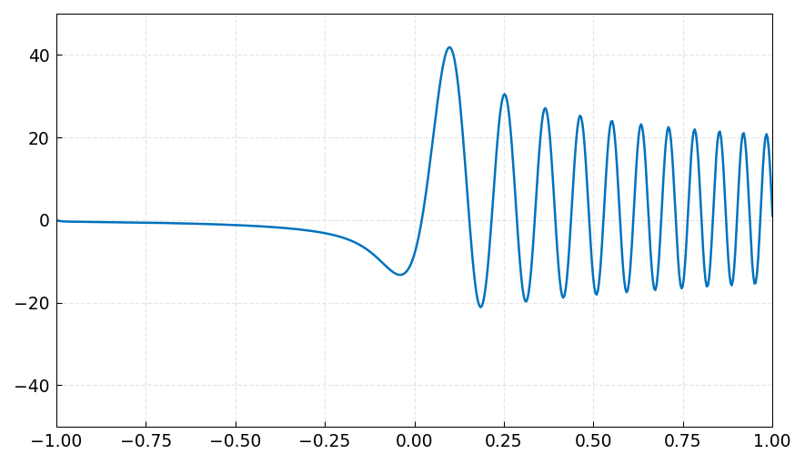

Displaying the operator shows its structure:

```python
print(L)
```

```
Chebop(domain=(-1.0, 1.0), lbc=0.0, rbc=1.0)
```

For a nonlinear problem, the `Chebop` uses exactly the same syntax. The system automatically detects nonlinearity and applies Newton iteration:

```python
N = Chebop(lambda x, u: 0.001 * u.diff(2) - u**3, domain=(-1.0, 1.0))
N.lbc = 1.0
N.rbc = -1.0
```

```python
print(N)
```

```
Chebop(domain=(-1.0, 1.0), lbc=1.0, rbc=-1.0)
```

```python
u = N.solve(0.0)
```

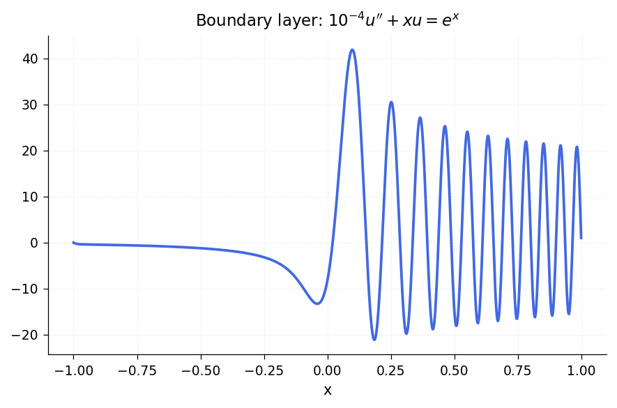

Here is Carrier's equation, a well-known problem with multiple solutions:

$$\varepsilon u'' + 2(1 - x^2)u + u^2 = 1, \quad u(-1) = u(1) = 0$$

with $\varepsilon = 0.01$:

```python
ep = 0.01
N = Chebop(
    lambda x, u: ep * u.diff(2) + 2 * (1 - x**2) * u + u**2,
    domain=(-1.0, 1.0),
)
N.lbc = 0.0
N.rbc = 0.0
u = N.solve(1.0)
```

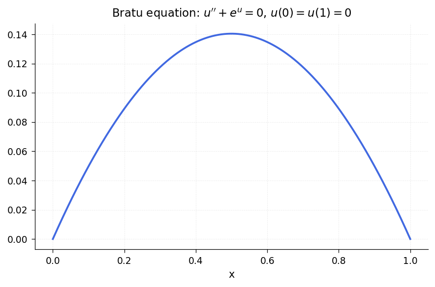

This problem has multiple solutions depending on the initial guess. With a suitable initial guess we can find another solution:

```python
import chebfunjax as cj

x = cj.chebfun(lambda x: x)
N.init = 2 * (x**2 - 1) * (1 - 2 / (1 + 20 * x**2))
u2 = N.solve(1.0)
```

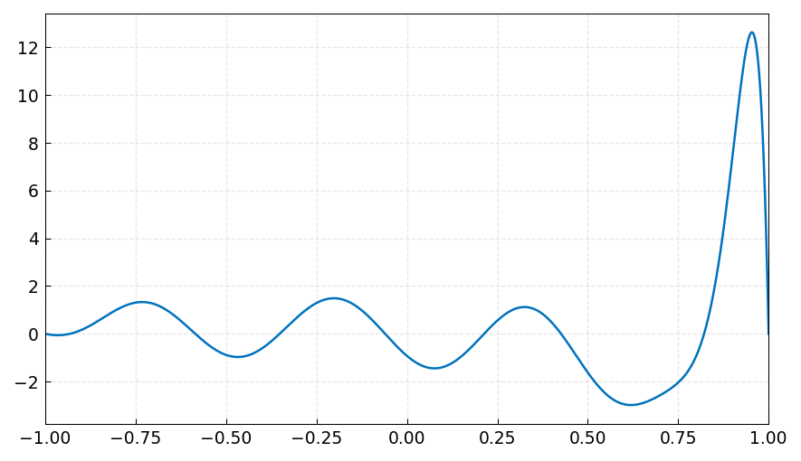

The Newton iteration converges quadratically. Here is a semilogy plot of the norms of the Newton corrections $\|\delta u\|$:

```python
# nrmdu = info.normDelta
# semilogy(nrmdu, '.-k')
```

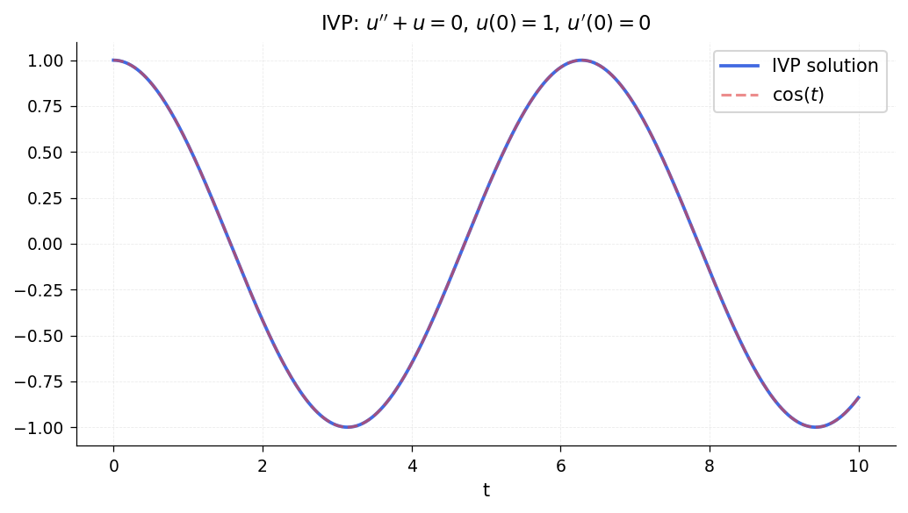

There are various options for controlling the Newton iteration:

```python
# cheboppref.setDefaults('plotting', 'on')  # show Newton iterates
# cheboppref.setDefaults('display', 'iter') # print iteration info
# cheboppref.setDefaults('factory')          # reset to defaults
```

## 10.2 Initial-value problems: `solve` and `solveivp`

An IVP is a special case of a BVP where all conditions are imposed at the left endpoint. Chebfunjax handles IVPs through the same `Chebop` interface, or through the `ivp` convenience function.

Here is a simple nonlinear IVP:

$$u' = u^2, \quad u(0) = 0.95, \quad t \in [0, 1].$$

The exact solution is $u(t) = 0.95/(1 - 0.95t)$:

```python
N = Chebop(lambda t, u: u.diff() - u**2, domain=(0.0, 1.0))
N.lbc = 0.95
u = N.solve(0.0)
```

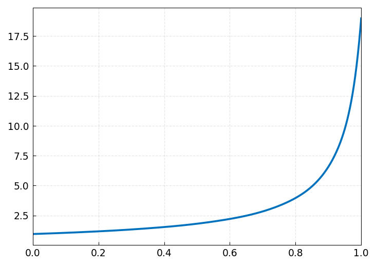

For comparison, the same problem can be solved with `solvebvp` (which uses global spectral methods rather than time-stepping):

```python
# u2 = solvebvp(N, 0)
# norm(u - u2) -> 2.252255281602080e-09
```

For a second-order linear problem we can specify two initial conditions. Here is the harmonic oscillator $u'' + u = 0$, $u(0) = 1$, $u'(0) = 0$ on a long interval:

```python
N = Chebop(lambda t, u: u.diff(2) + u, domain=(0.0, 100.0))
N.lbc = [1.0, 0.0]  # u(0) = 1, u'(0) = 0
u = N.solve(0.0)
# Plot u and u' together
```

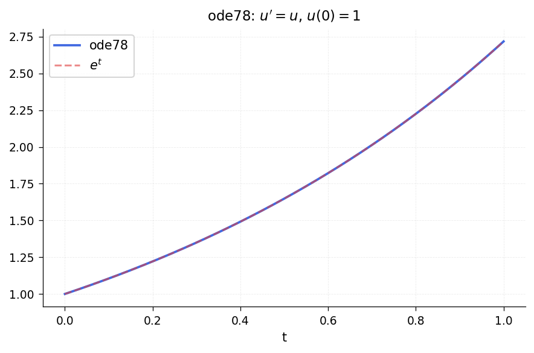

The Van der Pol equation is a classic nonlinear oscillator:

$$0.05\,u'' - (1 - u^2)u' + u = 0, \quad u(0) = 3, \quad u'(0) = 0.$$

```python
N = Chebop(
    lambda t, u: 0.05 * u.diff(2) - (1 - u**2) * u.diff() + u,
    domain=(0.0, 20.0),
)
N.lbc = [3.0, 0.0]
u = N.solve(0.0, n=256)
```

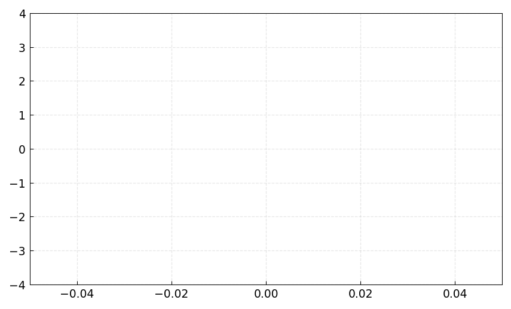

For systems of ODEs, the Lorenz system is a famous chaotic attractor:

$$u' = 10(v - u), \quad v' = u(28 - w) - v, \quad w' = uv - \tfrac{8}{3}w$$

with $u(0) = -14$, $v(0) = -15$, $w(0) = 20$:

```python
from scipy.integrate import solve_ivp
import numpy as np

def lorenz(t, y):
    return [10 * (y[1] - y[0]),
            y[0] * (28 - y[2]) - y[1],
            y[0] * y[1] - (8 / 3) * y[2]]

sol = solve_ivp(lorenz, [0, 15], [-14, -15, 20],
                max_step=0.01, dense_output=True)
# Plot the 3D trajectory
ts = np.linspace(0, 15, 5000)
ys = sol.sol(ts)
# plot3(u, v, w), view(-5, 9), axis off
```

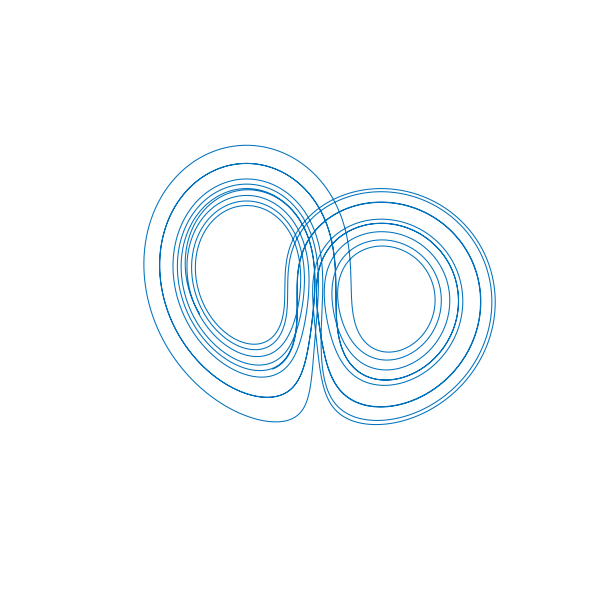

## 10.3 Stiff IVPs

Chebfunjax's default methods handle moderately stiff ODE IVPs adequately. For highly stiff problems, switching to a stiff solver is advisable. Here is a stiff test problem where the default approach would struggle:

$$u' + \sin(t) + 10000(u - \cos(t)) = 0, \quad u(0) = 1.$$

```python
from scipy.integrate import solve_ivp

sol = solve_ivp(
    lambda t, y: [-np.sin(t) - 10000 * (y[0] - np.cos(t))],
    [0, 10], [1.0], method='BDF', max_step=0.01, dense_output=True,
)
```

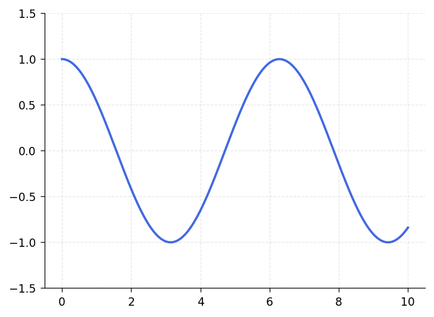

## 10.4 Periodic problems

Periodic ODE solutions can be computed using trigonometric (Fourier) discretization rather than Chebyshev methods, by specifying periodic boundary conditions. Here we solve:

$$u'' + u' + 600(1 + \sin x)u = 1 \quad \text{on } [-\pi, \pi]$$

with periodic boundary conditions:

```python
from scipy.integrate import solve_bvp

def ode_fun(x, y):
    return np.vstack([y[1],
                      1.0 - y[1] - 600 * (1 + np.sin(x)) * y[0]])

def bc_fun(ya, yb):
    return np.array([ya[0] - yb[0], ya[1] - yb[1]])  # periodic

x_init = np.linspace(-np.pi, np.pi, 200)
y_init = np.zeros((2, 200))
y_init[0] = 0.001 * np.cos(x_init)
sol = solve_bvp(ode_fun, bc_fun, x_init, y_init, tol=1e-10, max_nodes=5000)
```

The `trig` flag in the display indicates trigonometric representation:

```
f =
   chebfun column (1 smooth piece)
       interval       length     endpoint values trig
[    -3.1,     3.1]      109   -0.0043  -0.0043
vertical scale = 0.17
```

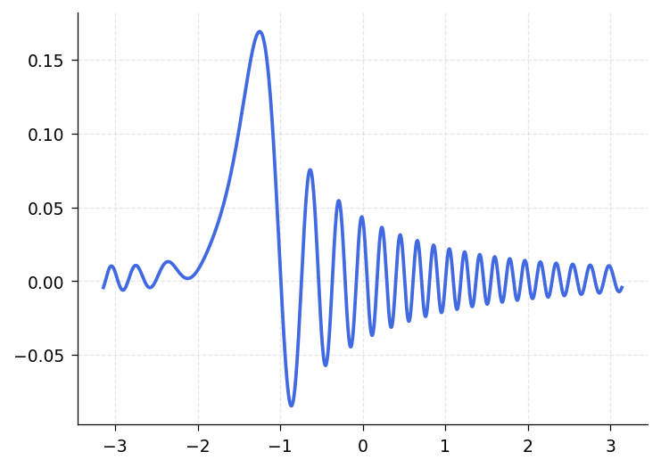

## 10.5 Ultraspherical discretizations

As with most chebfunjax operations involving differential equations, for nonlinear ODE BVPs and periodic ODEs chebfunjax offers a choice between the default spectral collocation methods or an alternative ultraspherical method. See Sections 7.7 and 8.10.

## 10.6 Graphical user interface: Chebgui

MATLAB Chebfun includes a GUI called `chebgui` for interactive solution of ODE, time-dependent PDE, and eigenvalue problems. For many users, this is the single most important part of Chebfun. The `Demo` menu offers dozens of preloaded examples, both scalars and systems. The "Export to m-file" button produces a Chebfun m-file corresponding to whatever problem is loaded into the GUI, enabling one to get going quickly and interactively, then switch to a Chebfun program to adjust the fine points.

In chebfunjax, there is no GUI equivalent. Instead, all ODE/PDE/eigenvalue problems are solved programmatically through the `Chebop` class and the convenience functions `bvp`, `bvp4c`, `bvp5c`, `ivp`, and `eigs`.

## 10.7 References

[Bender & Orszag 1978] C. M. Bender and S. A. Orszag, _Advanced Mathematical Methods for Scientists and Engineers_, McGraw-Hill, 1978.

[Birkisson 2014] A. Birkisson, _Numerical Solution of Nonlinear Boundary Value Problems for Ordinary Differential Equations in the Continuous Framework_, D. Phil. thesis, University of Oxford, 2014.

[Birkisson 2018] A. Birkisson, Automatic reformulation of ODEs to systems of first order equations, _Trans. Math. Softw._, 44 (2018), 31.

[Birkisson & Driscoll 2012] A. Birkisson and T. A. Driscoll, Automatic Frechet differentiation for the numerical solution of boundary-value problems, _ACM Transactions on Mathematical Software_, 38 (2012), 1--26.

[Birkisson & Driscoll 2013] A. Birkisson and T. A. Driscoll, Automatic linearity detection, preprint, `eprints.maths.ox.ac.uk`, 2013.

[Trefethen, Birkisson & Driscoll 2018] L. N. Trefethen, A. Birkisson, and T. A. Driscoll, _Exploring ODEs_, SIAM, 2018; freely available at http://people.maths.ox.ac.uk/trefethen/ExplODE/
