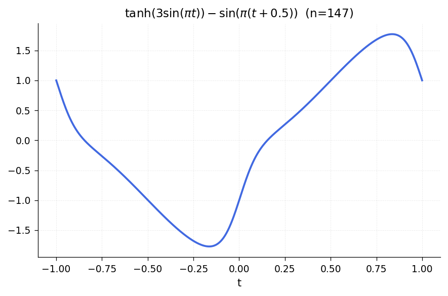
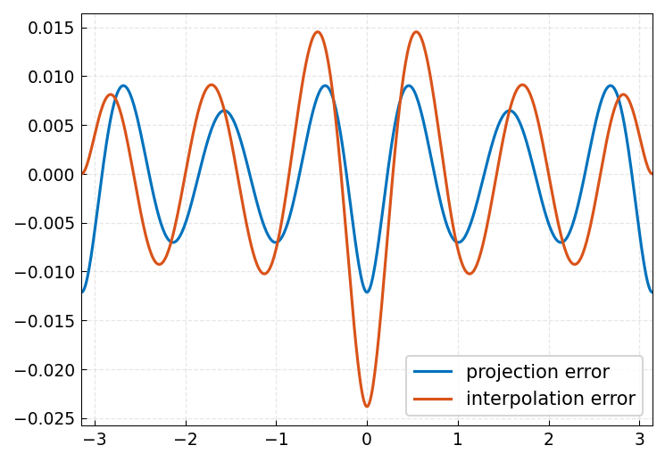
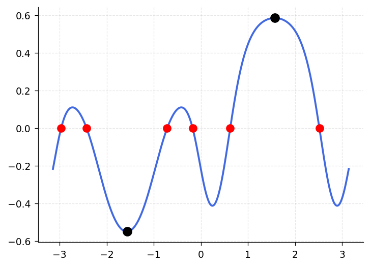
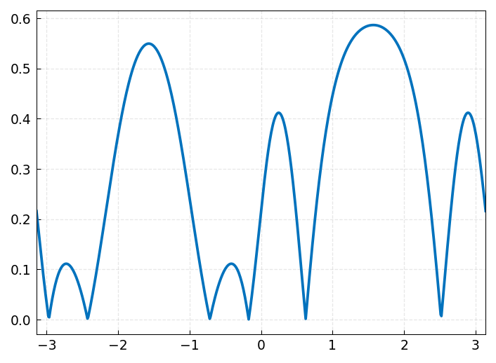
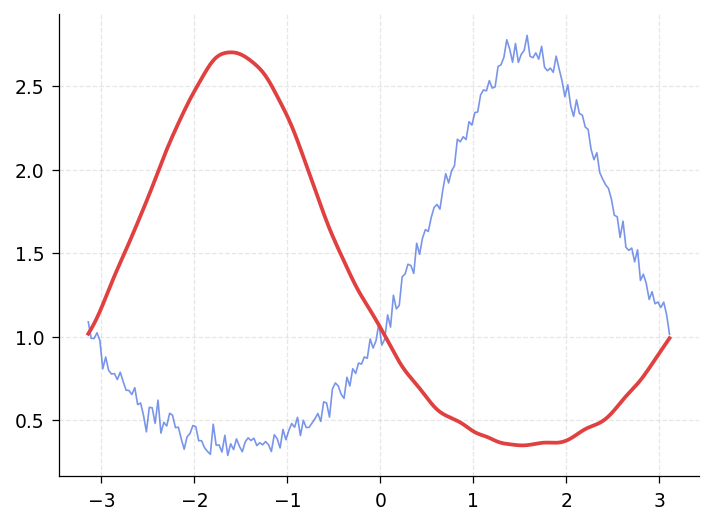
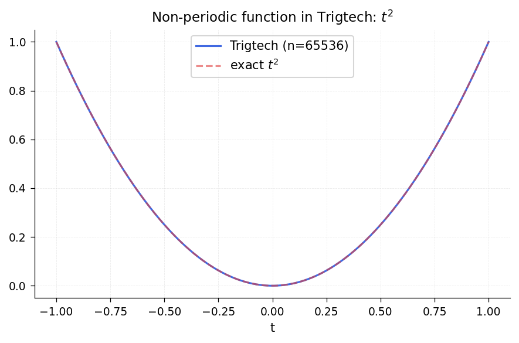
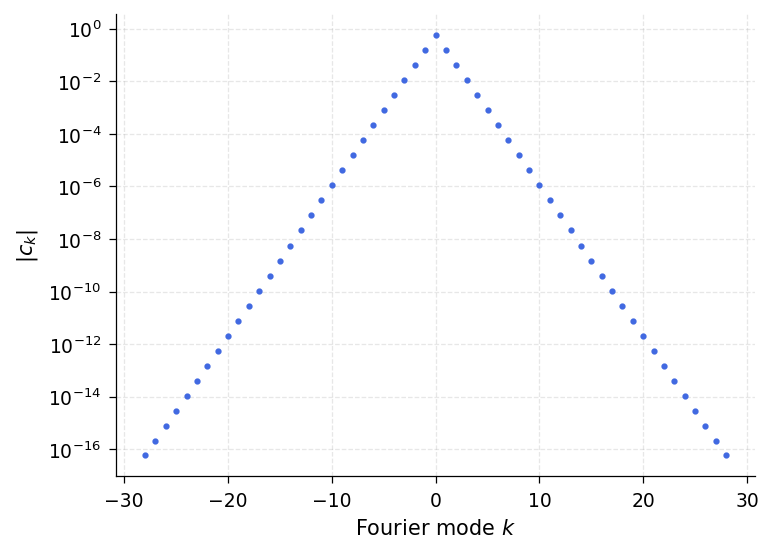
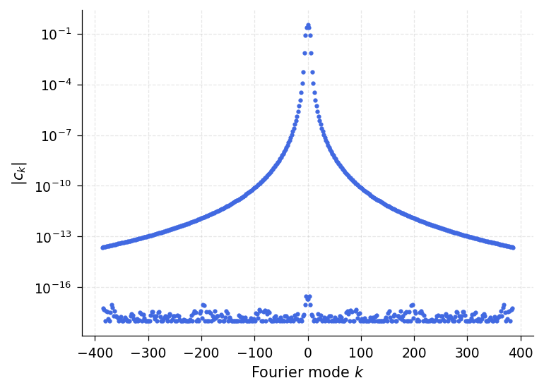
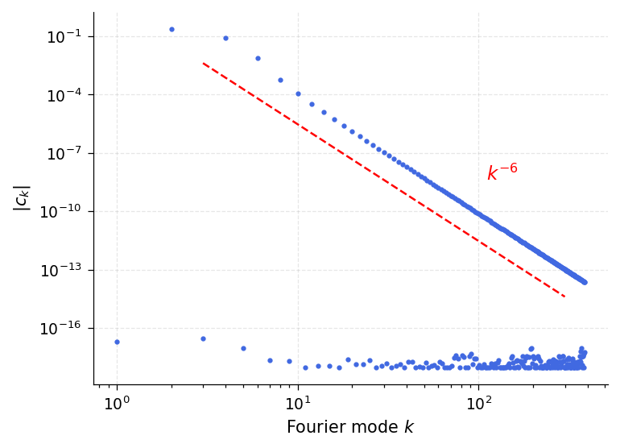
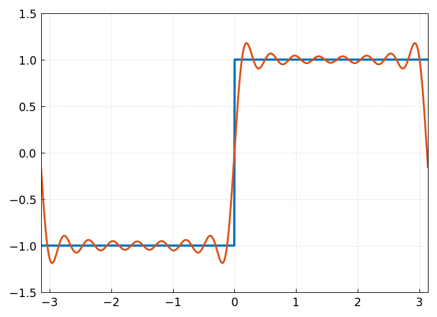

# Chapter 11: Periodic Chebfuns

*Based on [Chebfun Guide Chapter 11](https://www.chebfun.org/docs/guide/guide11.html) by Grady B. Wright, June 2014, latest revision December 2016.*

## 11.1 Introduction

One of the major new features introduced in Chebfun version 5 was the ability to use trigonometric functions instead of polynomials for representing smooth periodic functions [Wright et al. 2015]. These trig-based chebfuns, or "trigfuns", can be created with the use of the `'trig'` (or `'periodic'`) flag in the Chebfun constructor. In chebfunjax, the `Trigtech` class provides this capability. For example, the function $f(t) = \tanh(3\sin t) - \sin(t + 1/2)$ on $[-\pi, \pi]$ can be constructed as follows:

```python
from chebfunjax.tech.trigtech import Trigtech
import jax.numpy as jnp

# Map [-pi,pi] -> [-1,1] via t = pi*s
f = Trigtech.from_function(
    lambda s: jnp.tanh(3 * jnp.sin(jnp.pi * s)) - jnp.sin(jnp.pi * s + 0.5),
)
print(f)
```

```
Trigtech(n=147, is_real=True, vscale=9.200e-01)
```



The text `'trig'` in the display indicates that $f$ is represented by trigonometric functions. The length means that $f$ is resolved to machine precision using a trigonometric interpolant through equally spaced samples over $[-\pi, \pi)$, or equivalently, the corresponding number of trigonometric (= Fourier) modes.

In this chapter we review some of the functionality for trigfuns as well as some theory of trigonometric interpolation. For brevity, we refer to trigonometric-based chebfuns as _trigfuns_ and polynomial-based chebfuns as _chebfuns_.

Throughout our discussion, the trigfuns we construct live on the interval $[-\pi, \pi]$, which we specify explicitly in each call to the constructor (in chebfunjax, the `Trigtech` class always works on the reference interval $[-1, 1]$, so we apply the affine map $t = \pi s$ when needed). Mathematically, it might have made sense for this to be the default domain for trigfuns, but in Chebfun the factory default is always $[-1, 1]$, whether the representation is trigonometric or not.

For examples of Chebfun solution of periodic ODEs, see Chapter 7 and also Chapter 15 of [Trefethen, Birkisson & Driscoll 2018].

Periodic chebfuns were created by Grady Wright of Boise State University during a visit to Oxford in 2014. Another MATLAB project based on trigonometric interpolants, called _Fourfun_, was developed independently by Kristyn McLeod under the supervision of Rodrigo Platte [McLeod 2014].

## 11.2 Trigonometric series and interpolants

The classical trigonometric series of a periodic function $u$ defined on $[-\pi, \pi]$ is given as

$$\mathcal{F}[u] = \sum_{k=-\infty}^{\infty} a_k\, e^{ikt}$$

with coefficients

$$a_k = \frac{1}{2\pi} \int_{-\pi}^{\pi} u(t)\,e^{-ikt}\,dt.$$

Alternatively, we can express the series in terms of sines and cosines,

$$\mathcal{F}[u] = \sum_{k=0}^{\infty} a_k \cos(kt) + \sum_{k=1}^{\infty} b_k \sin(kt)$$

with

$$a_k = \frac{1}{\pi} \int_{-\pi}^{\pi} f(t)\cos(kt)\,dt, \quad b_k = \frac{1}{\pi}\int_{-\pi}^{\pi} f(t)\sin(kt)\,dt,$$

for $k > 0$ and

$$a_0 = \frac{1}{2\pi} \int_{-\pi}^{\pi} f(t)\,dt.$$

In what follows we will use the complex exponential form of the series.

Note that the first of these series is often referred to as the _Fourier series_ of $u$, but we will use the term _trigonometric series_ as advocated by Zygmund [Zygmund, 1959]. Similar expressions for the series and coefficients hold for intervals other than $[-\pi, \pi]$ by shifting and scaling appropriately.

The convergence of the trigonometric series depends on the smoothness of $u$ on $[-\pi, \pi]$ and its periodic extension. Let $q_N$ be the truncated series of degree $\lfloor N/2 \rfloor$. If $u$ is periodic, continuous, and of bounded variation on $[-\pi, \pi]$, then $|u - q_N| \to 0$ as $N \to \infty$ in the maximum norm. A classical result says that if $u$ is $(\ell - 1)$-times continuously differentiable with each of these derivatives being periodic, and the derivative of order $\ell$ is of bounded variation, then

$$|a_k| = O(|k|^{-\ell - 1}),\quad k = \pm 1, \pm 2, \ldots$$

Adding up the tail, this gives $|u - q_N| = O(N^{-\ell})$ as $N \to \infty$, assuming $\ell \ge 1$. If $u$ and its periodic extension are $C^\infty$, then $q_N$ converges faster than any inverse power of $N$. If $u$ is analytic on $[-\pi, \pi]$ then the convergence rate is exponential.

In general the coefficients $a_k$ are not known exactly. Using the trapezoidal rule [Trefethen & Weideman 2014], we define the _trigonometric points_ by

$$t_j = -\pi + 2\pi j/N, \qquad j = 0, \ldots, N-1$$

and approximate:

$$a_k \approx c_k := \frac{1}{N}\sum_{j=0}^{N-1} u(t_j)\,e^{-ikt_j}.$$

The coefficients $c_k$ are the _discrete Fourier coefficients_, and the resulting series is the _discrete Fourier series_ or _trigonometric interpolant_ $p_N$. The interpolation coefficients $c_k$ relate to the exact coefficients $a_k$ via the _Poisson summation formula_ (aliasing formula):

$$c_k = a_k + \sum_{m=1}^{\infty}\bigl(a_{k+mN} + a_{k-mN}\bigr).$$

This implies that if $\ell \ge 1$, the decay rate of $c_k$ is essentially the same as that of $a_k$, with $c_k \to a_k$ as $N \to \infty$.

To illustrate some of these ideas numerically, consider $u(t) = |\sin t|^3$, a function with $\ell = 3$:

```python
uu = lambda s: jnp.abs(jnp.sin(jnp.pi * s))**3
u = Trigtech.from_function(uu)
```

We can construct both the truncated trigonometric series approximation with $N = 11$ (using `'trunc'` mode) and the 11-point trigonometric interpolant:

```python
# q11: truncated series (projection)
c_full = u.coeffs
M_full = len(c_full) // 2
import numpy as np
trunc_c = np.zeros(11, dtype=np.complex128)
for k in range(-5, 6):
    trunc_c[k + 5] = np.array(c_full)[k + M_full]
from chebfunjax.tech.trigtech import Trigtech
q11 = Trigtech(coeffs=jnp.array(trunc_c), is_real=True, ishappy=True)

# p11: interpolant
p11 = Trigtech.from_function(uu, n=11)
```

The error curves for the two approximations are similar:



The difference between truncation of a trigonometric series and trigonometric interpolation, while interesting mathematically, is rarely very important in practical computation.

## 11.3 Basic operations

Most computations with trigfuns follow the same pattern as with chebfuns. Typically the result will be a trigfun too. Here for example we construct an initial trigfun $g$ and then transform it to a new trigfun $f$:

```python
g = Trigtech.from_function(lambda s: jnp.sin(jnp.pi * s))
f_vals_fn = lambda s: (jnp.tanh(jnp.cos(1.0 + 2.0 * jnp.sin(jnp.pi * s))**2)
                       + jnp.sin(jnp.pi * s) / 3.0 - 0.5)
f = Trigtech.from_function(f_vals_fn)
print(f)
```

The operations $+$, $\times$, and so on are all carried out by appropriate manipulation of trigonometric representations. Here we compute and plot the maximum, minimum, and roots of $f$:

```python
r = f.roots()
print(f"roots: {r}")
```



The derivative of a trigfun can be computed with `diff`, and the definite integral with `sum`:

```python
print(f"sum(f) = {float(f.sum())}")
```

```
sum(f) = -0.074010812957415
```

Other operations should generally proceed as expected. Sometimes, if an operation breaks the smoothness needed for a trig representation, the result of a trigfun computation will be a chebfun. For example, the absolute value of the function above is not smooth:

```python
g_abs = lambda s: jnp.abs(f_vals_fn(s))
# |f| is a chebfun, not a trigfun
```



If you combine a trigfun and a chebfun, the result will be a chebfun.

## 11.4 Complex-valued functions and contour integrals

Like other chebfuns, trigfuns can take complex values, and this feature is especially useful for the computation of contour integrals over smooth contours in the complex plane, such as circles, as was highlighted in Section 5.3. We recommend trigfuns for the computation of most contour integrals.

## 11.5 Circular convolution

The circular or periodic convolution of two functions $f$ and $g$ with period $T$ is defined by

$$(f * g)(t) := \int_{t_0}^{t_0 + T} g(s)\,f(t - s)\,ds$$

where $t_0$ is arbitrary. Circular convolutions can be computed for trigfuns with the `circconv` function. For example, here is a trigonometric interpolant through 201 samples of a smooth function plus noise:

```python
import numpy as np

np.random.seed(0)
n = 201
tt = np.linspace(-np.pi, np.pi, n, endpoint=False)
ff = np.exp(np.sin(tt)) + 0.05 * np.random.randn(n)
```

The high frequencies can be smoothed by convolving with a mollifier such as a Gaussian:

```python
sigma = 0.1
gaussian = (1.0 / (sigma * np.sqrt(2 * np.pi))) * np.exp(-0.5 * (tt / sigma)**2)
# Circular convolution via FFT
dt = 2 * np.pi / n
h = np.real(np.fft.ifft(np.fft.fft(ff) * np.fft.fft(gaussian))) * dt
```



## 11.6 Trigfuns vs. chebfuns

Trigonometric interpolants have a resolution power of 2 points per wavelength, whereas Chebyshev interpolants require approximately $\pi$ points per wavelength (averaged over the grid). This means that smooth periodic functions can usually be represented as trigfuns using fewer samples than standard chebfuns.

To illustrate this, consider the chebfun and trigfun representations of $f(t) = \cos(11\sin(3(t - 1/\pi)))$ over $[-\pi, \pi]$:

```python
import chebfunjax as cj

ff = lambda t: jnp.cos(11 * jnp.sin(3 * (t - 1.0 / jnp.pi)))

# Chebyshev representation
f_cheb = cj.chebfun(ff, domain=(-float(jnp.pi), float(jnp.pi)))

# Trigonometric representation
f_trig = Trigtech.from_function(lambda s: ff(jnp.pi * s))

print(f"Chebyshev length: {len(f_cheb)}")
print(f"Trigtech length:  {f_trig.n}")
ratio = len(f_cheb) / f_trig.n
print(f"Ratio: {ratio:.1f}")
```

```
ratio = 1.600000000000000
```

The ratio of lengths should be approximately $\pi/2$, and this is indeed what we find.

Another advantage of trigonometric representations appears in the computation of derivatives. For example, consider the function $\cos(10\sin t)$:

```python
f = Trigtech.from_function(lambda s: jnp.cos(10 * jnp.sin(jnp.pi * s)))
```

All odd derivatives of $f$ vanish at $\pm \pi$. Here is what the trigfun finds for $f'''(\pi)$:

```python
df3 = f.diff(3)
print(f"df3(pi) = {float(df3(jnp.float64(1.0)))}")
```

```
-1.273632671113180e-12
```

This is essentially full precision since the scale of $f'''$ is about 1000. By contrast, we lose several digits of accuracy if we use a non-trigonometric chebfun:

```python
f_cheb = cj.chebfun(lambda t: jnp.cos(10 * jnp.sin(t)),
                     domain=(-float(jnp.pi), float(jnp.pi)))
df3_cheb = f_cheb.diff(3)
print(f"df3_cheb(pi) = {float(df3_cheb(jnp.float64(float(jnp.pi))))}")
```

```
2.570928010630634e-06
```

Trying to construct a trigfun from a function that is not smoothly periodic will typically result in a warning:

```python
import warnings

with warnings.catch_warnings(record=True) as w:
    warnings.simplefilter("always")
    f_bad = Trigtech.from_function(lambda s: s**2)
    print(f"Length: {f_bad.n}")
    # Warning: Function not resolved using 65536 pts.
```

In such a case one should usually switch to a non-trigonometric representation.

## 11.7 Trigonometric coefficients

Trigfuns provide an easy tool for computing Fourier coefficients via the `coeffs` attribute. Here as an example is $u(t) = 1 - 4\cos t + 6\sin(2t)$:

```python
u = Trigtech.from_function(
    lambda s: 1.0 - 4.0 * jnp.cos(jnp.pi * s) + 6.0 * jnp.sin(2.0 * jnp.pi * s),
)
print("Fourier coefficients (complex exponential form):")
print(u.coeffs)
```

```
[ 0.+3.j, -2.+0.j,  1.+0.j, -2.-0.j,  0.-3.j]
```

Note that in this default mode, the coefficients are returned in complex exponential form, from lowest degree to highest. The equivalent real coefficients are:

- Cosine coefficients $a_k$: $[1, -4, 0]$ (for $k = 0, 1, 2$)
- Sine coefficients $b_k$: $[0, 6]$ (for $k = 1, 2$)

Coefficients of trigfuns (their absolute values) can be plotted with `plotcoeffs`. For the entire function $\exp(\sin t)$ (i.e., analytic throughout the complex plane), the coefficients decrease faster than geometrically:

```python
f = Trigtech.from_function(lambda s: jnp.exp(jnp.sin(jnp.pi * s)))
```



For $f(t) = 1/(2 - \cos t)$, which is analytic on $[-\pi, \pi]$ but not entire, the decrease is perfectly geometric:

```python
f = Trigtech.from_function(lambda s: 1.0 / (2.0 - jnp.cos(jnp.pi * s)))
```



A function with a finite number of derivatives gives algebraic decay:

```python
f = Trigtech.from_function(lambda s: jnp.abs(jnp.sin(jnp.pi * s))**5)
```



The `loglog` option enables one more easily to quantify the decay rate. This function has $\ell = 5$ for the estimates above, which imply that the decay rate of coefficients is $a_k = O(|k|^{-6})$:



There is an important fine point concerning $[-\pi, \pi]$ vs. $[0, 2\pi]$, or more generally, the transplantation from one domain $[a, b]$ to another. Consider, say, the function $f(x) = \cos x = (e^{ix} + e^{-ix})/2$. Obviously its Fourier coefficients in the exponential basis are $1/2, 0, 1/2$:

```python
f = Trigtech.from_function(lambda s: jnp.cos(jnp.pi * s))
print(f.coeffs)
```

```
[0.5+0.j, 0.+0.j, 0.5+0.j]
```

Naturally we expect the same result on $[0, 2\pi]$ or any interval of length $2\pi$. This all seems so natural that one can easily overlook that something of substance is going on. To work on an interval like $[7, 7 + 2\pi]$, chebfunjax first transplants the problem to $[-1, 1]$. The transplanted function is not $\cos x$ at all -- it is $\cos(x + 8)$. The coefficients returned by the Fourier transform for expansion on any interval $[a, b]$ correspond to the basis $\{\exp(i\alpha k x)\}$ with $\alpha = 2\pi/(b - a)$, _not_ to the basis $\{\exp(i\alpha k(x - (b+a)/2))\}$.

## 11.8 Truncated trigonometric series approximations

The Fourier coefficient computation can also be used to compute a prescribed number of trigonometric coefficients of a function that may not be smooth enough for resolution to machine precision; this is done by accurate numerical evaluation of the integral defining $a_k$. For example, here is a non-smooth function, a square wave, with its approximation by a trigonometric sum of degree 15 superimposed:

```python
from chebfunjax.tech.trigtech import trig_vals2coeffs, trig_coeffs2vals

# Square wave
sq_wave = lambda s: jnp.sign(jnp.sin(jnp.pi * s))
N = 201
t = jnp.linspace(-1.0, 1.0, N, endpoint=False)
vals = sq_wave(t)
coeffs = trig_vals2coeffs(vals)

# Truncate to degree 15
degree = 15
M = N // 2
trunc_coeffs = jnp.zeros(2 * degree + 1, dtype=jnp.complex128)
for k in range(-degree, degree + 1):
    trunc_coeffs = trunc_coeffs.at[k + degree].set(coeffs[k + M])

u_trunc = Trigtech(coeffs=trunc_coeffs, is_real=True, ishappy=True)
```



This represents the best degree 15 trigonometric approximation to the square wave over $[-\pi, \pi]$ in the $L^2$ sense. The oscillations show the famous Gibbs phenomenon.

## 11.9 References

[Austin, Kravanja & Trefethen 2014] A. P. Austin, P. Kravanja and L. N. Trefethen, "Numerical algorithms based on analytic function values at roots of unity", _SIAM J. Numer. Anal._ 52 (2014), 1795--1821.

[Canuto et al. 2006/7] C. Canuto, M. Y. Hussaini, A. Quarteroni and T. A. Zang, _Spectral Methods_, 2 vols., Springer, 2006 and 2007.

[Henrici 1986] P. Henrici, _Applied and Computational Complex Analysis_, vol. 3, Wiley, 1986.

[Hesthaven et al. 2007] J. S. Hesthaven, S. Gottlieb, and D. Gottlieb, _Spectral Methods for Time-Dependent Problems_, Cambridge U. Press, 2007.

[McLeod 2014] K. McLeod, "Fourfun: A new system for automatic computations using Fourier expansions", submitted, 2014.

[Trefethen 2000] L. N. Trefethen, _Spectral Methods in MATLAB_, SIAM, 2000.

[Trefethen, Birkisson & Driscoll 2018] L. N. Trefethen, A. Birkisson, and T. A. Driscoll, _Exploring ODEs_, SIAM, 2018; freely available at http://people.maths.ox.ac.uk/trefethen/ExplODE/

[Trefethen & Weideman 2014] L. N. Trefethen and J. A. C. Weideman, "The exponentially convergent trapezoidal rule", _SIAM Review_ 56 (2014), 385--458.

[Van Loan 1992] C. Van Loan, _Computational Frameworks for the Fast Fourier Transform_, SIAM, 1992.

[Wright et al. 2015] G. B. Wright, M. Javed, H. Montanelli, and L. N. Trefethen, Extension of Chebfun to periodic functions, _SIAM J. Sci. Comp._ 37 (2015), C554--C573.

[Zygmund 1959] A. Zygmund, _Trigonometric Series_, Cambridge U. Press, 1959.
