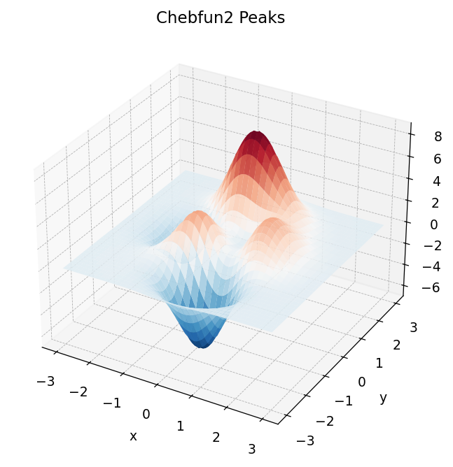
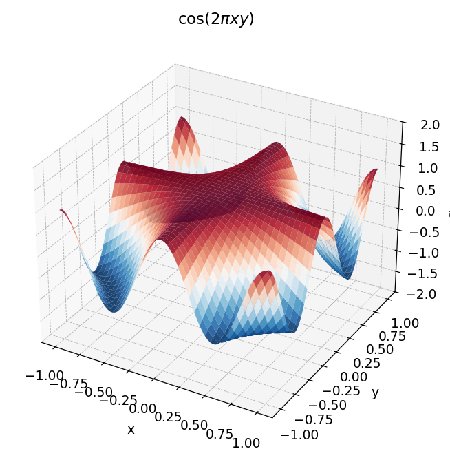
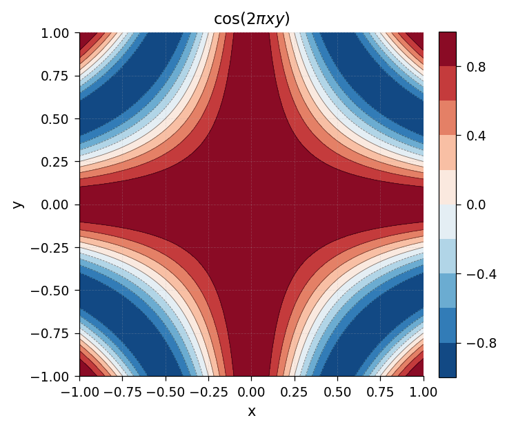
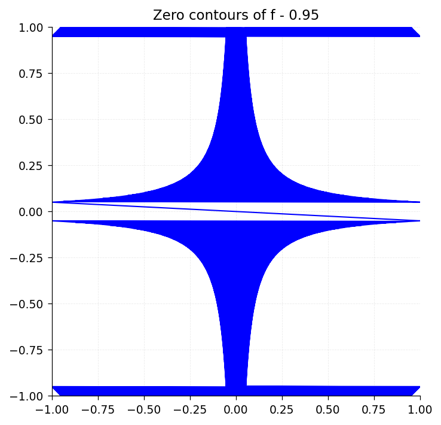
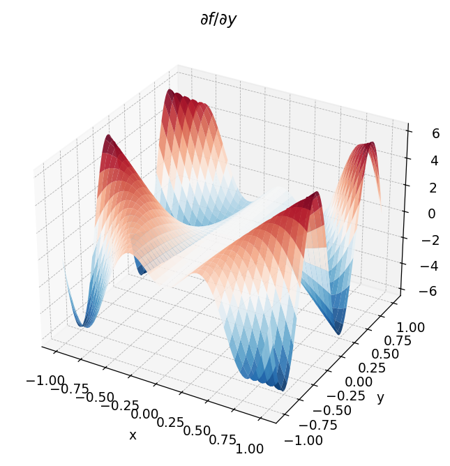
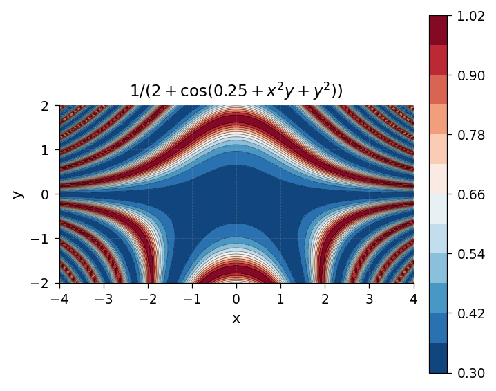
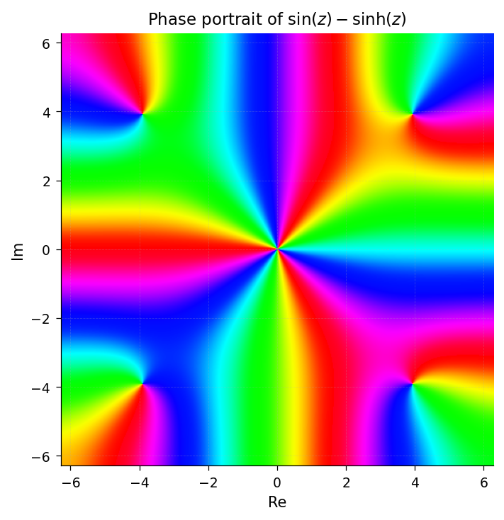
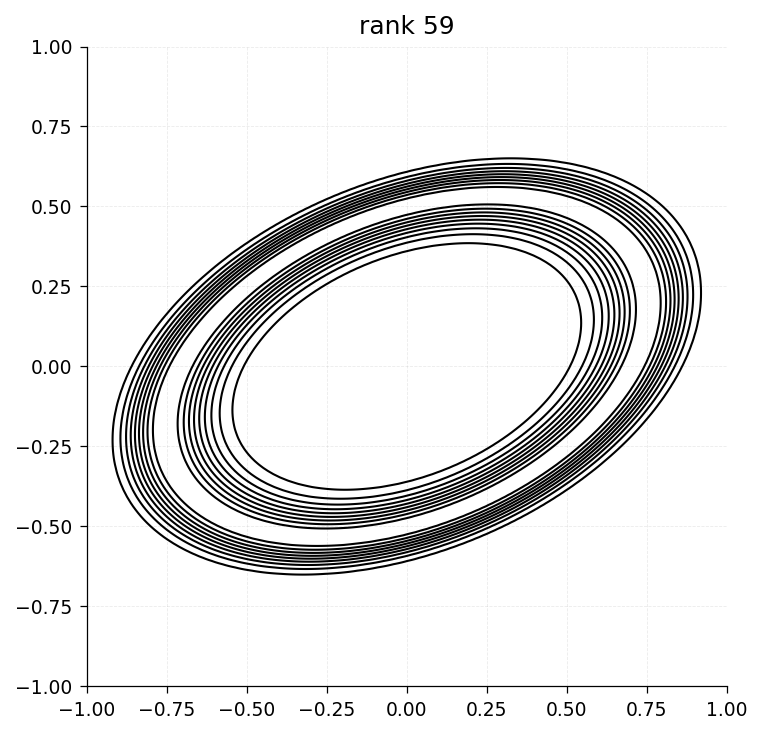
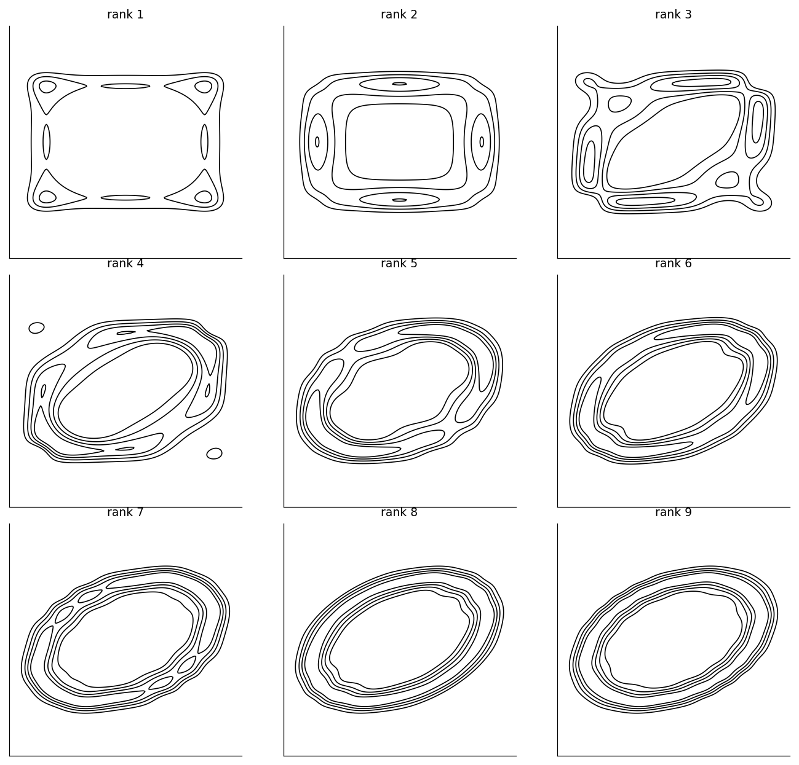

# Chapter 12: Chebfun2: Getting Started

*Based on [Chebfun Guide Chapter 12](https://www.chebfun.org/docs/guide/guide12.html)*

Chebfun2 extends chebfunjax to functions of two variables on rectangles $[a, b] \times [c, d]$. This chapter introduces the `Chebfun2` class and its companion `Chebfun2v` for vector-valued functions.

## 12.1 What is a Chebfun2?

A `Chebfun2` is a Python object that represents a smooth bivariate function $f(x, y)$ on a rectangle. Under the hood, chebfunjax adaptively finds a low-rank separable approximation

$$f(x, y) \approx \sum_{j=1}^{k} d_j\, c_j(y)\, r_j(x)$$

where $c_j$ are column slices (functions of $y$), $r_j$ are row slices (functions of $x$), and $d_j$ are scalar pivot weights. Each slice is a Chebyshev interpolant resolved to machine precision.

Here is a first example:

```python
import jax.numpy as jnp
import chebfunjax as cj
from chebfunjax.chebfun2d import Chebfun2, chebfun2

f = chebfun2(lambda x, y: jnp.cos(x + y**2))
print(f)
```




```
Chebfun2(rank=5, domain=(-1.0, 1.0, -1.0, 1.0))
```




The default domain is $[-1, 1]^2$. To specify a different rectangle, pass a 4-tuple `(xa, xb, ya, yb)`:

```python
g = chebfun2(lambda x, y: jnp.exp(-(x**2 + y**2)),
             domain=(-2.0, 2.0, -2.0, 2.0))
print(g)
```




## 12.2 Evaluation

A `Chebfun2` is callable. You can evaluate it at scalar or array arguments:

```python
# Scalar evaluation
val = f(0.5, -0.3)
print(val)  # cos(0.5 + 0.09) = cos(0.59)

# Array evaluation
import jax.numpy as jnp
xs = jnp.linspace(-1, 1, 5)
ys = jnp.linspace(-1, 1, 5)
vals = f(xs, ys)  # evaluates at paired points (xs[i], ys[i])
```




Evaluation is JIT-compiled, vmap-safe, and grad-safe. This means you can differentiate through `Chebfun2` evaluation using JAX's automatic differentiation:

```python
import jax
grad_f = jax.grad(lambda x: f(x, 0.5))
print(grad_f(0.0))  # df/dx at (0, 0.5)
```




## 12.3 Basic Operations

### Double integration

The method `sum2()` computes the definite double integral over the domain:

```python
f = chebfun2(lambda x, y: jnp.exp(-(x**2 + y**2)))
integral = f.sum2()
print(integral)  # integral of exp(-(x^2+y^2)) over [-1,1]^2
```




### Partial integration

The method `sum(dim=...)` integrates over a single variable:

```python
# Integrate over y (dim=1), leaving a function of x
g = f.sum(dim=1)  # returns a Chebfun2 representing g(x)

# Integrate over x (dim=2), leaving a function of y
h = f.sum(dim=2)
```




### Partial differentiation

The method `diff(dim, k)` computes partial derivatives:

```python
f = chebfun2(lambda x, y: jnp.sin(x * y))

# df/dy (dim=1 differentiates with respect to y)
fy = f.diff(dim=1)

# df/dx (dim=2 differentiates with respect to x)
fx = f.diff(dim=2)

# Second derivative d^2f/dx^2
fxx = f.diff(dim=2, k=2)

# Verify: at (0.5, 0.3), df/dx = y*cos(x*y) = 0.3*cos(0.15)
print(fx(0.5, 0.3))
print(0.3 * jnp.cos(0.15))
```




### Norms

The Frobenius (L2) norm is computed by `norm()`:

```python
f = chebfun2(lambda x, y: jnp.sin(x) * jnp.cos(y))
print(f.norm())  # sqrt(integral |f|^2 dx dy)
```




## 12.4 Low-Rank Approximations

Many functions of two variables can be well approximated by low-rank separable representations. The rank of a `Chebfun2` tells you how many rank-1 terms are needed:

```python
# Separable functions have rank 1
f = chebfun2(lambda x, y: jnp.cos(x) * jnp.sin(y))
print(f.rank)  # 1

# More complex functions need higher rank
g = chebfun2(lambda x, y: jnp.cos(x + y**2) + jnp.exp(x * y))
print(g.rank)
```

The `Chebfun2` constructor uses an algorithm based on Gaussian elimination with complete pivoting (Townsend and Trefethen, 2013) to adaptively determine the rank and build the separable approximation.

Internally, the `SeparableApprox` object stores three lists:
- `cols`: column slices $c_j(y)$ (Chebtech2 objects)
- `rows`: row slices $r_j(x)$ (Chebtech2 objects)
- `pivots`: scalar weights $d_j$

## 12.5 Root Finding

The `roots()` method finds the zero contours of a `Chebfun2`:

```python
f = chebfun2(lambda x, y: x**2 + y**2 - 0.5)
zero_curves = f.roots()
# Returns a list of (x, y) point arrays along the zero contour
```

This uses a marching-squares algorithm on a fine grid. The result is a list of point clouds, one per connected component.

## 12.6 Vector-Valued Functions: Chebfun2v

The `Chebfun2v` class represents 2- or 3-component vector fields on a rectangle:

```python
from chebfunjax.chebfun2d.chebfun2v import Chebfun2v
from chebfunjax.chebfun2d.separable_approx import SeparableApprox

# Construct from function handles
F = Chebfun2v.from_functions(
    lambda x, y: jnp.sin(x),
    lambda x, y: jnp.cos(y),
)
print(F)  # Chebfun2v(n_components=2, domain=(-1.0, 1.0, -1.0, 1.0))

# Evaluate: returns shape (..., 2) array
vals = F(0.5, 0.3)
print(vals)
```

`Chebfun2v` supports the standard vector calculus operations:

```python
# Divergence: df1/dx + df2/dy
div_F = F.divergence()  # returns a SeparableApprox (scalar)

# Curl (2D): df2/dx - df1/dy
curl_F = F.curl()  # returns a SeparableApprox (scalar)

# Dot product
G = Chebfun2v.from_functions(
    lambda x, y: x,
    lambda x, y: y,
)
dot_product = F.dot(G)  # returns a SeparableApprox
```

For 3-component vector fields, the curl returns a `Chebfun2v`:

```python
F3 = Chebfun2v.from_functions(
    lambda x, y: jnp.sin(x),
    lambda x, y: jnp.cos(y),
    lambda x, y: x * y,
)
curl_F3 = F3.curl()  # returns Chebfun2v with 3 components
```

## 12.7 Tolerance Control

By default, `Chebfun2` resolves functions to machine precision ($\approx 2.2 \times 10^{-16}$). You can relax the tolerance for faster construction:

```python
# Machine-precision construction (default)
f = chebfun2(lambda x, y: jnp.cos(100 * x * y))
print(f.rank)

# Relaxed tolerance
f_approx = chebfun2(lambda x, y: jnp.cos(100 * x * y), tol=1e-8)
print(f_approx.rank)  # typically smaller rank
```

## 12.8 JIT Compilation and GPU Acceleration

One key advantage of chebfunjax over MATLAB Chebfun is that evaluation is JIT-compiled by JAX. Construction is not JIT-safe (it uses adaptive Python loops), but once built, a `Chebfun2` can be used inside `jax.jit`, `jax.vmap`, and `jax.grad`:

```python
import jax

f = chebfun2(lambda x, y: jnp.sin(x * y))

# JIT-compiled evaluation
f_jit = jax.jit(f)
print(f_jit(0.5, 0.3))

# Gradient of the double integral with respect to a parameter
def integral_with_param(a):
    return f(a, 0.5)

print(jax.grad(integral_with_param)(1.0))
```

## 12.9 References

1. A. Townsend and L. N. Trefethen, "An extension of Chebfun to two dimensions", *SIAM J. Sci. Comput.*, 35(6), C495--C518, 2013.

2. A. Townsend and L. N. Trefethen, "Continuous analogues of matrix factorizations", *Proc. Royal Soc. A*, 471, 2015.