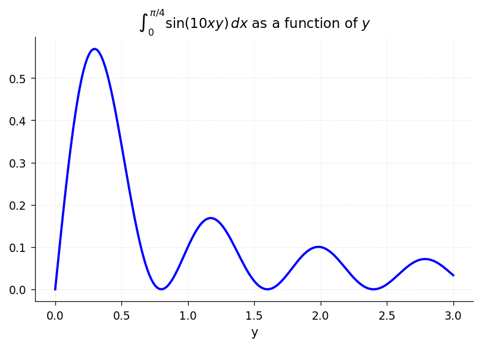
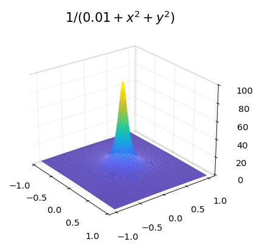
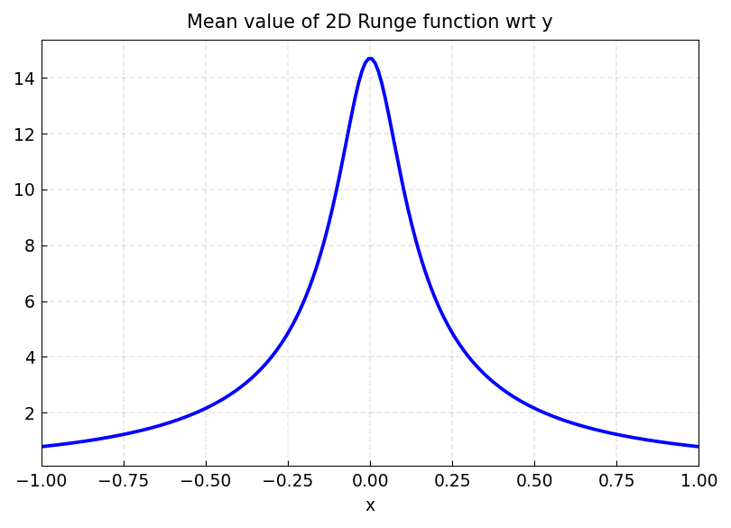
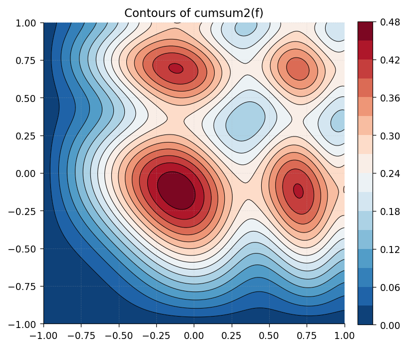
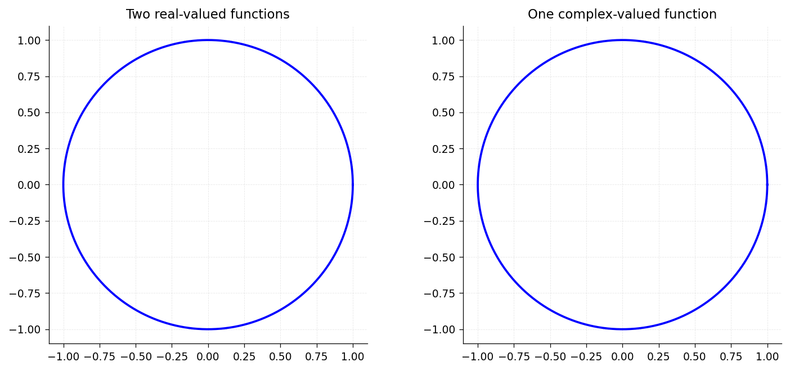
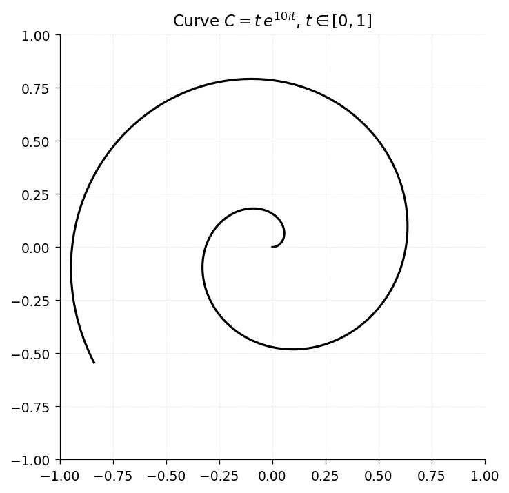
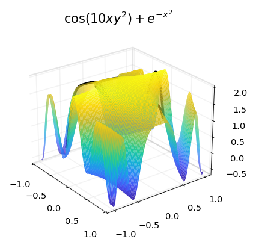

# 13. Chebfun2: Integration and Differentiation

*Based on [Chebfun Guide Chapter 13](https://www.chebfun.org/docs/guide/guide13.html) by Alex Townsend, March 2013, latest revision October 2019*

## 13.1 `sum` and `sum2`

We have already seen the `sum2` command, which returns the definite double integral of a chebfun2 over its domain of definition. The `sum` command is a little different, integrating with respect to one variable at a time following the MATLAB analogy. For instance, the following commands integrate $\sin(10xy)$ with respect to $y$:

```python
import jax.numpy as jnp
import chebfunjax as cj
from chebfunjax.chebfun2d import chebfun2

f = chebfun2(lambda x, y: jnp.sin(10*x*y),
             domain=(0.0, float(jnp.pi/4), 0.0, 3.0))
g = f.sum(dim=1)  # integrate over y, returning a function of x
print(g)
```

A chebfun2 is returned because the result depends on $x$ and hence is a function of one variable. Similarly, we can integrate over the $x$ variable and plot the result.

```python
h = f.sum(dim=2)  # integrate over x, returning a function of y
```



A closer look reveals that `sum(dim=1)` integrates over $y$ while `sum(dim=2)` integrates over $x$. This distinction is a reminder that `sum(dim=1)` produces a function of $x$ while `sum(dim=2)` produces a function of $y$. If we integrate over $y$ and then $x$, the result is the double integral of $f$.

```python
print(f.sum2())
print(f.sum(dim=1).sum2())
```

```
0.377914013520379
0.377914013520379
```

It is interesting to compare the execution times involved for computing the double integral by different commands. Chebfun2 does very well for smooth functions.

```python
import time
import numpy as np

F = lambda x, y: jnp.exp(-(x**2 + y**2 + jnp.cos(4*x*y)))

tic = time.time()
I = float(chebfun2(F).sum2())
t = time.time() - tic
print(f'CHEBFUN2/SUM2:  I = {I:17.15f}  time = {t:6.4f} secs')
```

```
CHEBFUN2/SUM2:  I = 1.399888131932671  time = ... secs
```

Chebfun2 is not designed specifically for numerical quadrature (or more properly, "cubature"), and careful comparisons with existing software have not been carried out. Low rank function approximations have been previously used for numerical quadrature by Carvajal, Chapman, and Geddes [Carvajal, Chapman & Geddes 2005]. A cubature package CHEBINT based on Chebyshev approximations has been produced by Poppe and Cools [Poppe & Cools 2013].

## 13.2 `norm`, `mean`, and `mean2`

The $L^2$-norm of a function $f(x,y)$ can be computed as the square root of the double integral of $f^2$. In chebfunjax the command `f.norm()`, without any additional arguments, computes this quantity. For example,

```python
f = chebfun2(lambda x, y: jnp.exp(-(x**2 + y**2 + 4*x*y)))
print(float(f.norm()))
```

```
2.819481057146936
```

Here is another example. This time we compute the norms of $f(x,y)$, $\cos(f(x,y))$, and $f(x,y)^5$.

```python
f = chebfun2(lambda x, y: jnp.exp(-1.0 / (jnp.sin(x*y) + x + 0.1)**2))
print(float(f.norm()))
```

The mean value over the rectangle can be computed by dividing `sum2` by the area. For example, here is the average value of a 2D Runge function.

```python
runge = chebfun2(lambda x, y: 1.0 / (0.01 + x**2 + y**2))
cj.surf(runge, title=r'$1/(0.01 + x^2 + y^2)$')
```



```python
mean2_runge = float(runge.sum2()) / 4.0  # divide by area of [-1,1]^2
print(mean2_runge)
```

```
3.796119578934829
```

The `mean` command computes the average along one variable. The output is a function of one variable, so we can plot it.

```python
# mean wrt y: integrate over y, divide by domain length
h = runge.sum(dim=1)  # integral over y
import matplotlib.pyplot as plt
import numpy as np
xs = np.linspace(-1, 1, 200)
vals = np.array([float(h(xi, 0.0)) / 2.0 for xi in xs])
plt.plot(xs, vals)
plt.title('Mean value of 2D Runge function wrt y')
```



If we average over $y$ and then $x$, we obtain the mean value over the whole domain, matching the earlier result.

```python
# mean(mean(runge)) = mean2(runge)
print(mean2_runge)
```

```
3.796119578934828
```

## 13.3 `cumsum` and `cumsum2`

The command `cumsum2` computes the double indefinite integral, which is a function of two variables, and returns a chebfun2. On the other hand, `cumsum(f)` computes the indefinite integral with respect to just one variable, also returning a chebfun2. The indefinite integral with respect to $y$ and then $x$ is the same as the double indefinite integral, as we can check numerically.

```python
f = chebfun2(lambda x, y: jnp.sin(3*((x+1)**2 + (y+1)**2)))
# Numerical approximation of cumsum2(f):
import numpy as np
n = 150
xs = np.linspace(-1, 1, n); ys = np.linspace(-1, 1, n)
dx = xs[1] - xs[0]; dy = ys[1] - ys[0]
XX, YY = np.meshgrid(xs, ys)
ZZ = np.array(f(jnp.array(XX.ravel()), jnp.array(YY.ravel()))).reshape(n, n)
cumsum_y = np.cumsum(ZZ, axis=0) * dy
cumsum_xy = np.cumsum(cumsum_y, axis=1) * dx
```

```python
import matplotlib.pyplot as plt
plt.contourf(XX, YY, cumsum_xy, levels=15, cmap='RdBu_r')
plt.contour(XX, YY, cumsum_xy, levels=15, colors='k', linewidths=0.5)
plt.axis('equal'); plt.xlim(-1, 1); plt.ylim(-1, 1)
plt.title('Contours of cumsum2(f)')
```



## 13.4 Complex encoding

As is well known, a pair of real scalar functions $f$ and $g$ can be encoded as a complex function $f+ig$. This trick can be useful for simplifying many operations, though at the same time it may be confusing. For instance, instead of representing the unit circle by two real-valued functions, we can represent it by one complex-valued function:

```python
import numpy as np
import chebfunjax as cj

d = [0, 2*np.pi]
c1 = cj.chebfun(lambda t: jnp.cos(t), domain=d)  # first real-valued function
c2 = cj.chebfun(lambda t: jnp.sin(t), domain=d)  # second real-valued function
# One complex function: c(t) = cos(t) + i*sin(t) = exp(it)
```

Here are two ways to make a plot of a circle.

```python
import matplotlib.pyplot as plt
t = np.linspace(0, 2*np.pi, 200)
fig, (ax1, ax2) = plt.subplots(1, 2, figsize=(10, 4.5))
ax1.plot(np.cos(t), np.sin(t), 'b-')
ax1.set_aspect('equal')
ax1.set_title('Two real-valued functions')
ax2.plot(np.cos(t), np.sin(t), 'b-')
ax2.set_aspect('equal')
ax2.set_title('One complex-valued function')
```



This complex encoding trick is exploited in a number of places in chebfun2. Specifically, it's used to encode the path of integration for a line integral (see next section), to represent zero contours of a chebfun2 (Chapter 14), and to represent trajectories in vector fields (Chapter 15).

We hope users become comfortable with complex encodings, though they are not required for the majority of chebfun2 functionality.

## 13.5 Integration along curves

Chebfun2 can compute the integral of $f(x,y)$ along a curve $(x(t), y(t))$. It uses the complex encoding trick and encodes the curve $(x(t), y(t))$ as a complex-valued chebfun $x(t) + iy(t)$.

For example, here is the curve in the unit square defined by $t\exp(10it)$, $t \in [0,1]$.

```python
import matplotlib.pyplot as plt
import numpy as np
t = np.linspace(0, 1, 500)
C_real = t * np.cos(10*t)
C_imag = t * np.sin(10*t)
plt.plot(C_real, C_imag, 'k-')
plt.xlim(-1, 1); plt.ylim(-1, 1)
plt.axis('square')
```



Here is a plot of the function $f(x,y) = \cos(10xy^2) + \exp(-x^2)$ on the square, with the values of $f(x,y)$ on the curve $C$ shown in black:

```python
f = chebfun2(lambda x, y: jnp.cos(10*x*y**2) + jnp.exp(-x**2))
fig, ax = cj.surf(f, title=r'$\cos(10xy^2) + e^{-x^2}$')
cx = t * np.cos(10*t)
cy = t * np.sin(10*t)
cz = np.array([float(f(jnp.float64(xi), jnp.float64(yi)))
               for xi, yi in zip(cx, cy)])
ax.plot3D(cx, cy, cz, 'k-', linewidth=2)
```



The object $f(C)$ is just a real-valued function defined on $[0,1]$, whose integral we can readily compute:

```python
# Approximate the line integral numerically
t_fine = np.linspace(0, 1, 10000)
cx = t_fine * np.cos(10*t_fine)
cy = t_fine * np.sin(10*t_fine)
fvals = np.array([float(f(jnp.float64(xi), jnp.float64(yi)))
                  for xi, yi in zip(cx, cy)])
dx = np.diff(cx); dy = np.diff(cy)
ds = np.sqrt(dx**2 + dy**2)
line_integral = np.sum(0.5*(fvals[:-1] + fvals[1:]) * ds)
print(line_integral)
```

```
1.613596461872283
```

This number can be interpreted as the integral of $f(x,y)$ along the curve $C$.

## 13.6 `diff`, `diffx`, `diffy`

In MATLAB the `diff` command calculates finite differences of a matrix along its columns (by default) or rows. For a chebfun2 the same syntax represents partial differentiation $\partial f / \partial y$ (by default) or $\partial f / \partial x$.

As pointed out in the last chapter, however, this can be rather confusing. Accordingly chebfunjax offers `diff(dim=1)` for $\partial/\partial y$ and `diff(dim=2)` for $\partial/\partial x$, which have more obvious meaning. Here we use these to check that the Cauchy-Riemann equations hold for an analytic function.

```python
f = chebfun2(lambda x, y: jnp.sin(x + 1j*y))
u = chebfun2(lambda x, y: jnp.real(jnp.sin(x + 1j*y)))
v = chebfun2(lambda x, y: jnp.imag(jnp.sin(x + 1j*y)))

# diffy(v) - diffx(u)
vy = v.diff(dim=1); ux = u.diff(dim=2)
# diffx(v) + diffy(u)
vx = v.diff(dim=2); uy = u.diff(dim=1)

# Evaluate norms on a grid
n = 100
xs = jnp.linspace(-1, 1, n); ys = jnp.linspace(-1, 1, n)
xx, yy = jnp.meshgrid(xs, ys)
xf = xx.ravel(); yf = yy.ravel()
print(f'norm(diffy(v) - diffx(u)) = {float(jnp.max(jnp.abs(vy(xf, yf) - ux(xf, yf)))):.2e}')
print(f'norm(diffx(v) + diffy(u)) = {float(jnp.max(jnp.abs(vx(xf, yf) + uy(xf, yf)))):.2e}')
```

```
norm(diffy(v) - diffx(u)) = 1.06e-14
norm(diffx(v) + diffy(u)) = 0.00e+00
```

## 13.7 Integration in three variables

Chebfun2 also works pretty well for integration in three variables. The idea is to integrate over two of the variables using chebfun2 and the remaining variable using chebfun. We have selected a tolerance of $10^{-6}$ for this example because the default tolerance in MATLAB's `integral3` command is also $10^{-6}$.

```python
import time

def r_fn(x, y, z):
    return jnp.sqrt(x**2 + y**2 + z**2)
def t_fn(x, y, z):
    return jnp.arccos(z / r_fn(x, y, z))
def p_fn(x, y, z):
    return jnp.arctan2(y, x)
def f_fn(x, y, z):
    return jnp.sin(5*(t_fn(x, y, z) - r_fn(x, y, z))) * jnp.sin(p_fn(x, y, z))**2

def I_of_z(z_val):
    g = chebfun2(lambda x, y: f_fn(x, y, z_val),
                 domain=(-2.0, 2.0, 0.5, 2.5))
    return float(g.sum2())

from scipy.integrate import quad
tic = time.time()
I, _ = quad(I_of_z, 1, 2, limit=100)
t_elapsed = time.time() - tic
print(f'Chebfun2:  I = {I:16.14f}  time = {t_elapsed:5.3f} secs')
```

```
Chebfun2:  I = -0.48056569408898  time = ... secs
```

## 13.8 References

[Carvajal, Chapman & Geddes 2005] O. A. Carvajal, F. W. Chapman and K. O. Geddes, "Hybrid symbolic-numeric integration in multiple dimensions via tensor-product series", *Proceedings of ISSAC'05*, M. Kauers, ed., ACM Press, 2005, pp. 84--91.

[Poppe & Cools 2013] K. Poppe and R. Cools, "CHEBINT: a MATLAB/Octave toolbox for fast multivariate integration and interpolation based on Chebyshev approximations over hypercubes," ACM Trans. Math. Softw., 40 (2013), 2.
