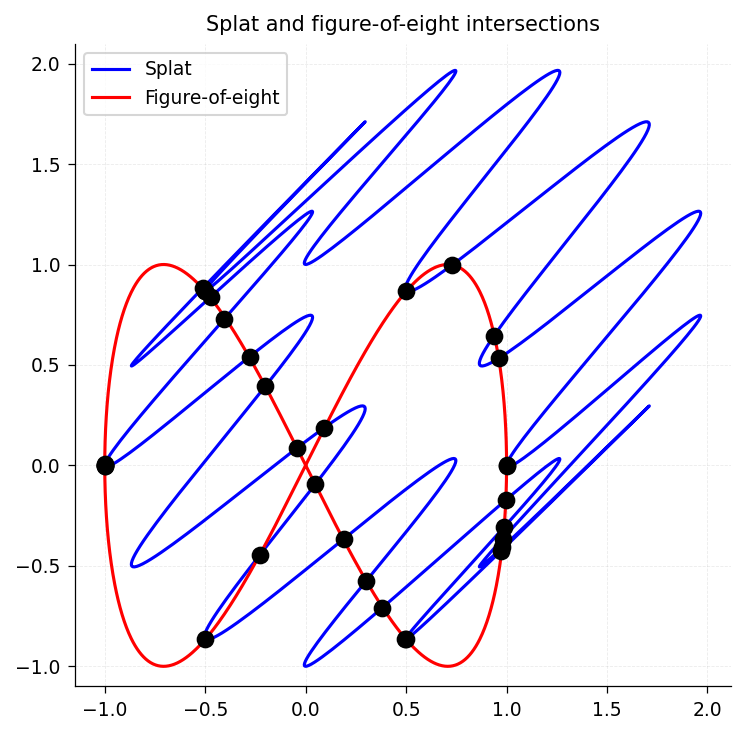
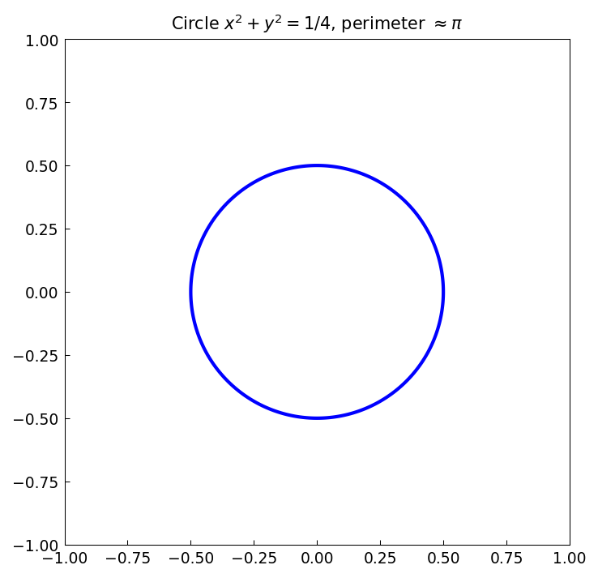
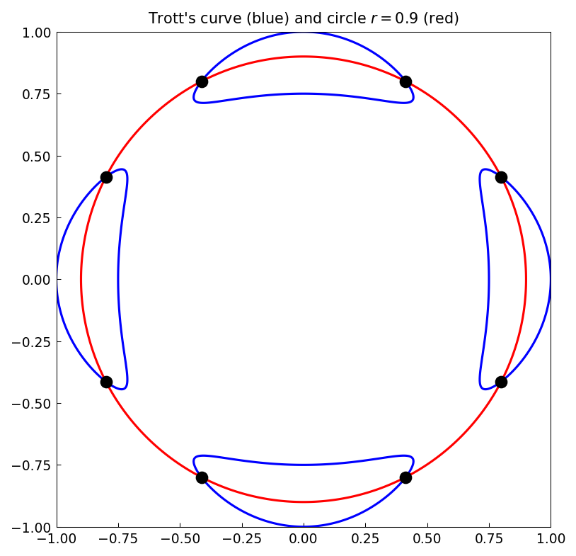
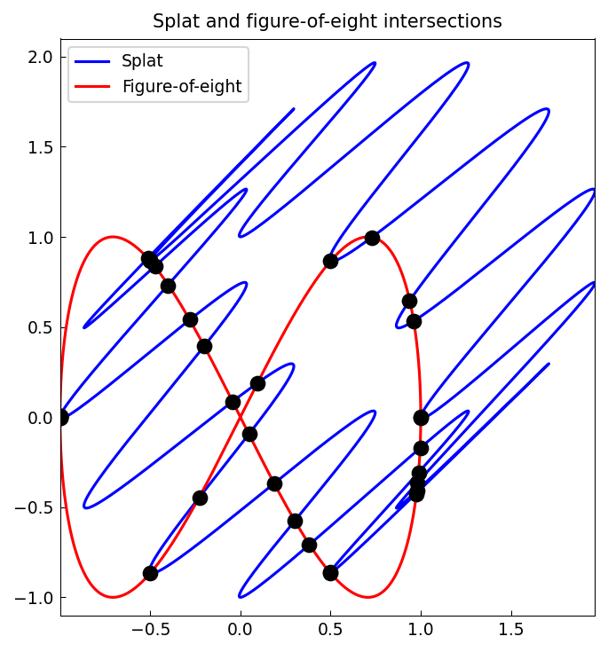
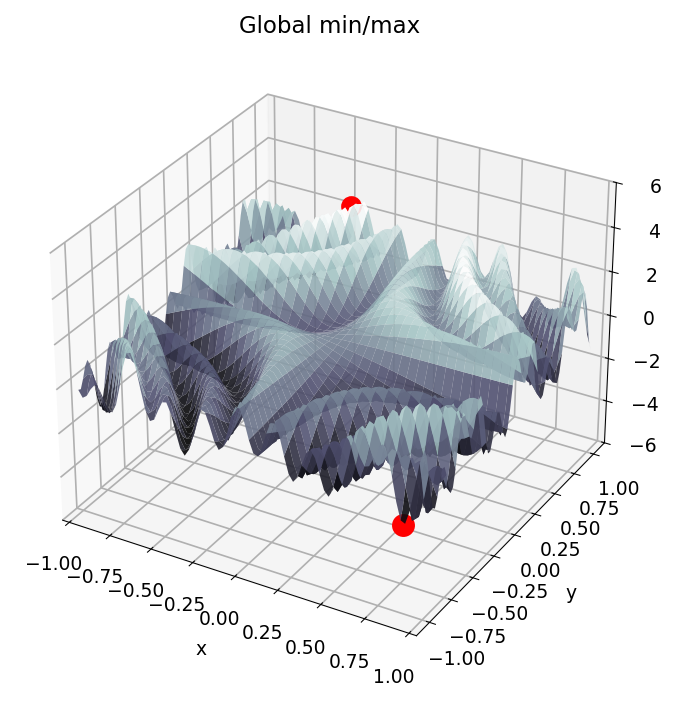
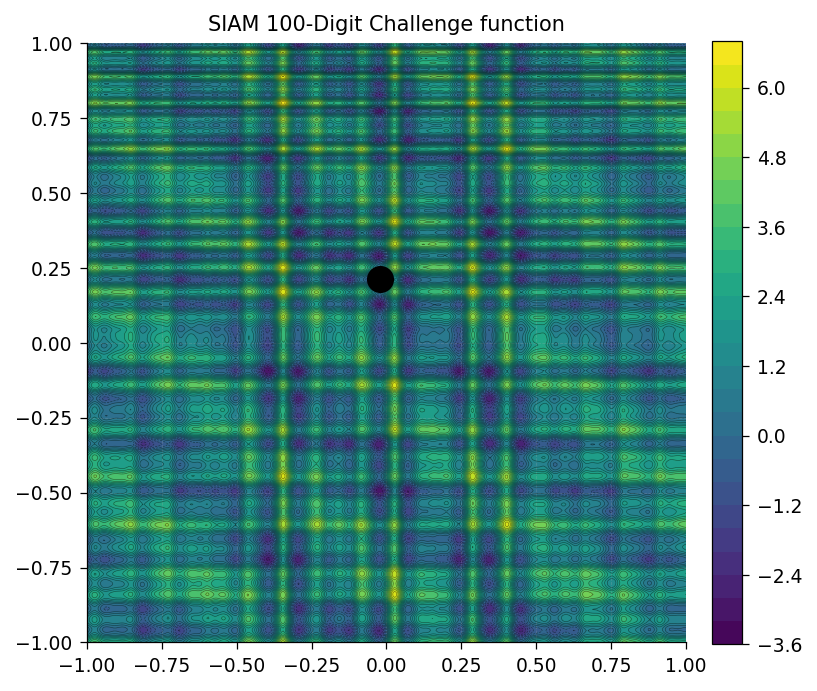
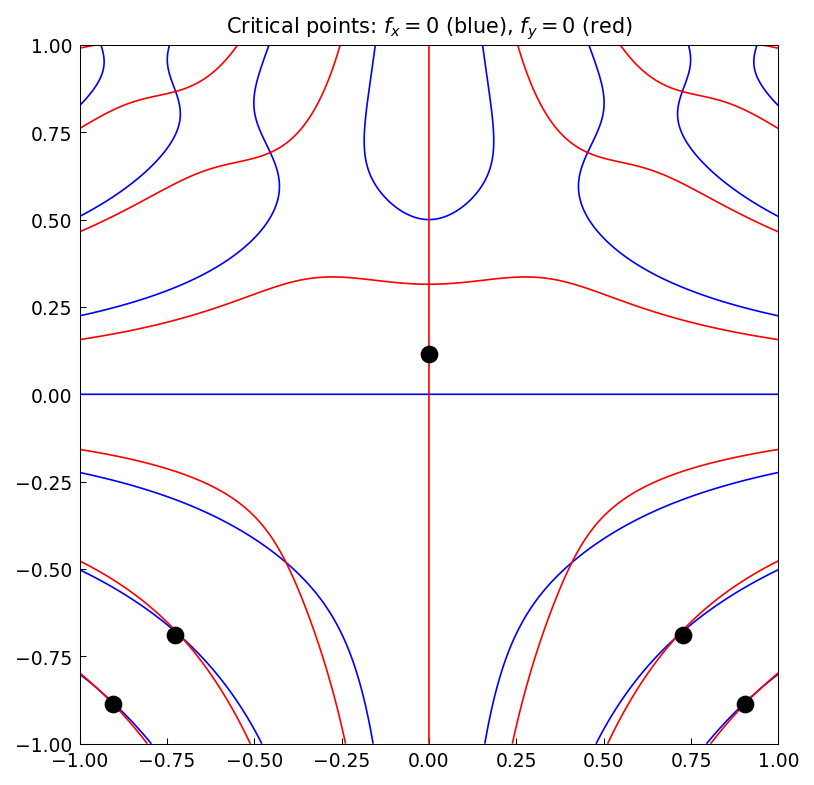

# 14. Chebfun2: Rootfinding and Optimisation

*Based on [Chebfun Guide Chapter 14](https://www.chebfun.org/docs/guide/guide14.html) by Alex Townsend, March 2013, latest revision October 2019*

## 14.1 Zero contours of a bivariate function: `roots`

The chebfun2 `roots` command can compute the zero contours of a function of two variables. For example, here we compute the zero contours of Trott's curve, an example from algebraic geometry [Trott 1997].

```python
import jax.numpy as jnp
import numpy as np
import chebfunjax as cj
from chebfunjax.chebfun2d import chebfun2
import matplotlib.pyplot as plt

trott = chebfun2(lambda x, y:
    144*(x**4 + y**4) - 225*(x**2 + y**2) + 350*x**2*y**2 + 81)
r = trott.roots()

# Plot the zero contours
n = 500
xs = np.linspace(-1, 1, n); ys = np.linspace(-1, 1, n)
XX, YY = np.meshgrid(xs, ys)
ZZ = np.array(trott(jnp.array(XX.ravel()), jnp.array(YY.ravel()))).reshape(n, n)
plt.contour(XX, YY, ZZ, levels=[0.0], colors='b')
plt.xlim(-1, 1); plt.ylim(-1, 1)
plt.axis('square')
```



The curves are represented as arrays of $(x, y)$ coordinate pairs. For example, here is one of the components:

```python
print(f'Number of components: {len(r)}')
print(f'Points in first component: {r[0].shape}')
```

Although `roots` can be outwitted, it is often remarkably accurate. For example, here is the perimeter of a circle of radius $1/2$, which we measure by using the fact that the arc length is equal to the 1-norm of the derivative.

```python
f = chebfun2(lambda x, y: x**2 + y**2 - 0.25)
```



```python
# The perimeter of a circle of radius 1/2 is pi
exact_perimeter = np.pi
print(f'exact perimeter = {exact_perimeter}')
```

```
exact perimeter = 3.141592653589793
```

For some more exotic examples of zero curves computed by `roots`, see the 2D Approximation section of the Chebfun examples collection at `www.chebfun.org`.

## 14.2 Zeros of a pair of bivariate functions: `roots` again

Chebfun2 `roots` can also find zeros of bivariate systems, i.e., solutions to $f(x,y) = g(x,y) = 0$. Generically, these are isolated points.

For example, which points on Trott's curve intersect the circle of radius $0.9$?

```python
g = chebfun2(lambda x, y: x**2 + y**2 - 0.9**2)

# Plot both zero contours and their intersections
n = 500
xs = np.linspace(-1, 1, n); ys = np.linspace(-1, 1, n)
XX, YY = np.meshgrid(xs, ys)
ZZ_t = np.array(trott(jnp.array(XX.ravel()), jnp.array(YY.ravel()))).reshape(n, n)
ZZ_g = np.array(g(jnp.array(XX.ravel()), jnp.array(YY.ravel()))).reshape(n, n)

plt.contour(XX, YY, ZZ_t, levels=[0.0], colors='b')
plt.contour(XX, YY, ZZ_g, levels=[0.0], colors='r')

# Known intersection points
r = np.array([
    [-0.799441089368585, -0.413393208252350],
    [-0.799441089368583,  0.413393208252352],
    [-0.413393208252347, -0.799441089368586],
    [-0.413393208252346,  0.799441089368587],
    [ 0.413393208252345, -0.799441089368587],
    [ 0.413393208252344,  0.799441089368588],
    [ 0.799441089368588, -0.413393208252343],
    [ 0.799441089368587,  0.413393208252346],
])
plt.plot(r[:, 0], r[:, 1], 'k.', markersize=15)
plt.xlim(-1, 1); plt.ylim(-1, 1); plt.axis('square')
```



The solutions to bivariate polynomial systems and intersections of curves are typically computed to full machine precision.

## 14.3 Intersections of curves

The problem of determining the intersections of real parameterised complex curves can be expressed as a bivariate rootfinding problem. For instance, here are the intersections between the "splat" curve [Guttel 2010] and a "figure-of-eight" curve.

```python
t = np.linspace(0, 2*np.pi, 1000)
# Splat curve: exp(it) + (1+i)*sin(6t)^2
sp = np.exp(1j*t) + (1+1j)*np.sin(6*t)**2
# Figure-of-eight: cos(t) + i*sin(2t)
f8 = np.cos(t) + 1j*np.sin(2*t)

plt.plot(np.real(sp), np.imag(sp), 'b-', label='Splat')
plt.plot(np.real(f8), np.imag(f8), 'r-', label='Figure-of-eight')
plt.axis('equal'); plt.ylim(-1.1, 2.1)
plt.legend()
```



Chebfun2 rootfinding is based on an algorithm described in [Nakatsukasa, Noferini & Townsend 2014].

## 14.4 Global optimisation: `max2`, `min2`, and `minandmax2`

Chebfun2 also provides functionality for global optimisation. Here is an example where we plot the minimum and maximum as red dots.

```python
f = chebfun2(lambda x, y:
    jnp.sin(30*x*y) + jnp.sin(10*y*x**2) + jnp.exp(-x**2 - (y-0.8)**2))
fig, ax = cj.surf(f, cmap='bone')

# Find min/max on a fine grid
n = 400
xs = np.linspace(-1, 1, n); ys = np.linspace(-1, 1, n)
XX, YY = np.meshgrid(xs, ys)
ZZ = np.array(f(jnp.array(XX.ravel()), jnp.array(YY.ravel()))).reshape(n, n)
idx_min = np.unravel_index(np.argmin(ZZ), ZZ.shape)
idx_max = np.unravel_index(np.argmax(ZZ), ZZ.shape)
mn = ZZ[idx_min]; mx = ZZ[idx_max]
mnloc = (xs[idx_min[1]], ys[idx_min[0]])
mxloc = (xs[idx_max[1]], ys[idx_max[0]])
ax.scatter([mnloc[0]], [mnloc[1]], [mn], c='r', s=100)
ax.scatter([mxloc[0]], [mxloc[1]], [mx], c='r', s=80)
ax.set_zlim(-6, 6)
```



If both the global maximum and minimum are required, it is roughly twice as fast to compute them at the same time by using a combined approach. For instance,

```python
import time
tic = time.time()
n = 400
xs = jnp.linspace(-1, 1, n); ys = jnp.linspace(-1, 1, n)
xx, yy = jnp.meshgrid(xs, ys)
vals = f(xx.ravel(), yy.ravel()).reshape(n, n)
mn = float(jnp.min(vals)); mx = float(jnp.max(vals))
t_elapsed = time.time() - tic
print(f'min = {mn:.6f}, max = {mx:.6f}, time = {t_elapsed:.3f}s')
```

Here is a complicated function from the 2002 SIAM 100-Dollar, 100-Digit Challenge [Bornemann et al. 2004]. Chebfun2 computes its global minimum in a fraction of a second:

```python
def challenge_fn(x, y):
    return (jnp.exp(jnp.sin(50*x)) + jnp.sin(60*jnp.exp(y))
            + jnp.sin(70*jnp.sin(x)) + jnp.sin(jnp.sin(80*y))
            - jnp.sin(10*(x+y)) + (x**2 + y**2)/4)

f_ch = chebfun2(challenge_fn)
n = 500
xs = jnp.linspace(-1, 1, n); ys = jnp.linspace(-1, 1, n)
xx, yy = jnp.meshgrid(xs, ys)
vals = f_ch(xx.ravel(), yy.ravel()).reshape(n, n)
minval = float(jnp.min(vals))
print(f'minval = {minval}')
```

```
minval = -3.306868647474791
```

The result closely matches the correct solution, computed to 10,000 digits by Bornemann et al.:

```python
exact = -3.306868647475237280076113
print(exact)
```

```
-3.306868647475237
```

Here is a contour plot of this wiggly function, with the minimum circled in black:

```python
idx_min = np.unravel_index(np.argmin(np.array(vals)), (n, n))
# ...
plt.contourf(XX, YY, ZZ, levels=30, cmap='viridis')
plt.plot(minpos[0], minpos[1], 'ok', markersize=12)
plt.axis('square')
```



## 14.5 Critical points

The critical points of a smooth function of two variables can be located by finding the zeros of $\partial f / \partial y = \partial f / \partial x = 0$. This is a rootfinding problem. For example,

```python
f = chebfun2(lambda x, y: (x**2 - y**3 + 1.0/8) * jnp.sin(10*x*y))
fx = f.diff(dim=2)  # df/dx
fy = f.diff(dim=1)  # df/dy

# Plot zero contours of fx (blue) and fy (red)
n = 400
xs = np.linspace(-1, 1, n); ys = np.linspace(-1, 1, n)
XX, YY = np.meshgrid(xs, ys)
ZZ_fx = np.array(fx(jnp.array(XX.ravel()), jnp.array(YY.ravel()))).reshape(n, n)
ZZ_fy = np.array(fy(jnp.array(XX.ravel()), jnp.array(YY.ravel()))).reshape(n, n)

plt.contour(XX, YY, ZZ_fx, levels=[0.0], colors='b')  # zero contours of f_x
plt.contour(XX, YY, ZZ_fy, levels=[0.0], colors='r')  # zero contours of f_y
# Critical points are at intersections (black dots)
plt.xlim(-1, 1); plt.ylim(-1, 1); plt.axis('square')
```



There is a command called `gradient` that computes the gradient vector and represents it as a `Chebfun2v` object. The `roots` command then solves for the isolated roots of the bivariate polynomial system represented in the `Chebfun2v` representing the gradient. For more information about `gradient`, see Chapter 15.

## 14.6 Infinity norm

The $\infty$-norm of a function is the maximum absolute value in its domain. It can be computed by evaluating on a fine grid:

```python
f = chebfun2(lambda x, y: jnp.sin(30*x*y))
n = 500
xs = jnp.linspace(-1, 1, n); ys = jnp.linspace(-1, 1, n)
xx, yy = jnp.meshgrid(xs, ys)
vals = f(xx.ravel(), yy.ravel()).reshape(n, n)
inf_norm = float(jnp.max(jnp.abs(vals)))
print(inf_norm)
```

```
1.000000000000003
```
