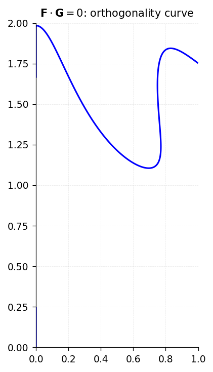
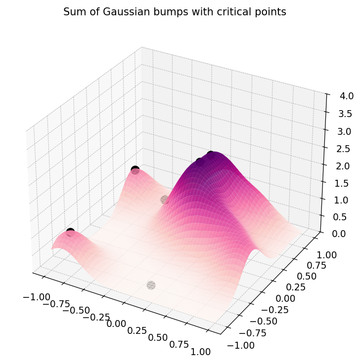
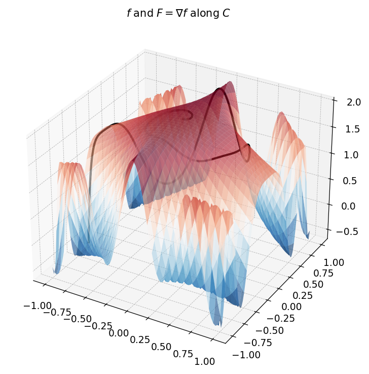
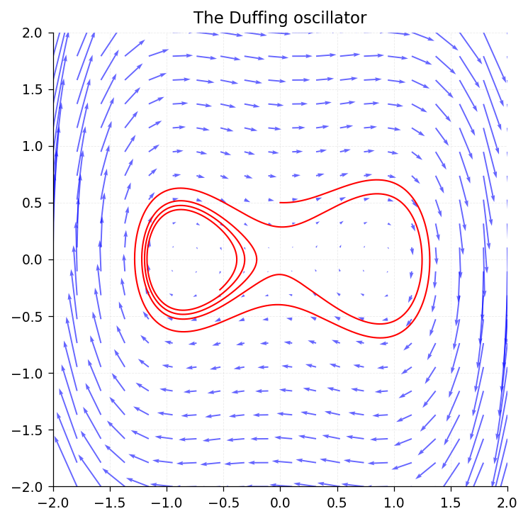
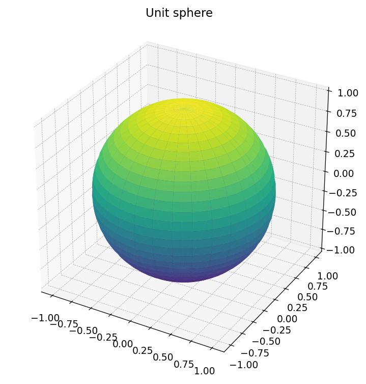
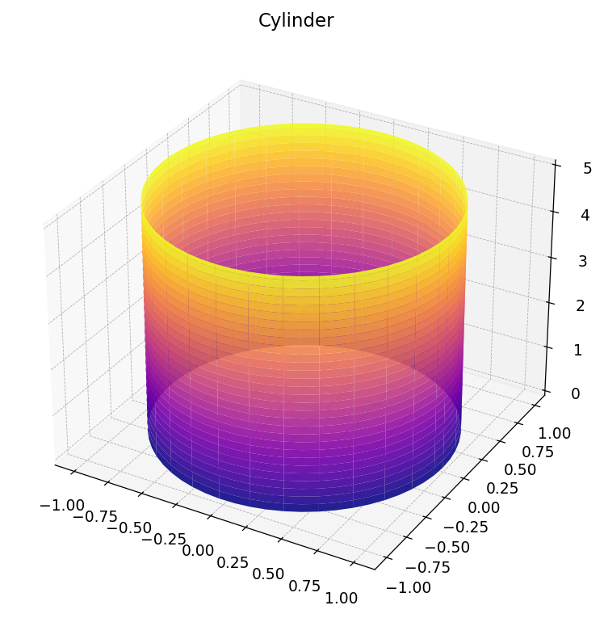

# Chapter 15: Chebfun2: Vector Calculus and 2D Surfaces

*Based on [Chebfun Guide Chapter 15](https://www.chebfun.org/docs/guide/guide15.html)*

This chapter covers `Chebfun2v`, the vector-valued extension of `Chebfun2`, and its applications to vector calculus and parametric surface representation.

## 15.1 Chebfun2v Objects

A `Chebfun2v` represents a vector field $\mathbf{F}(x,y) = (f_1(x,y),\, f_2(x,y))$ (or a 3-component field $\mathbf{F} = (f_1, f_2, f_3)$) on a rectangle $[x_a, x_b] \times [y_a, y_b]$. Each component is a `SeparableApprox` (the low-rank engine behind `Chebfun2`).

```python
import jax.numpy as jnp
from chebfunjax.chebfun2d.chebfun2v import Chebfun2v

# Create a 2-component vector field
F = Chebfun2v.from_functions(
    lambda x, y: -y,
    lambda x, y: x,
)
print(F)  # Chebfun2v(n_components=2, ...)
```




You can also create a 3-component field for surfaces and 3D vector calculus:

```python
F3 = Chebfun2v.from_functions(
    lambda x, y: jnp.cos(x) * jnp.sin(y),
    lambda x, y: jnp.sin(x) * jnp.sin(y),
    lambda x, y: jnp.cos(y),
)
print(F3)  # Chebfun2v(n_components=3, ...)
```




## 15.2 Evaluation

Calling a `Chebfun2v` returns a stacked array with the component index along the last axis:

```python
vals = F(0.5, 0.3)
print(vals)  # [-0.3, 0.5] as a JAX array of shape (2,)

# Vectorized evaluation
xs = jnp.linspace(-1, 1, 10)
ys = jnp.zeros(10)
vals = F(xs, ys)  # shape (10, 2)
```




## 15.3 Algebraic Operations

`Chebfun2v` supports the standard algebraic operations for vector fields.

### Scalar multiplication

```python
G = 2.0 * F  # or F * 2.0
```




### Vector addition and subtraction

```python
H = Chebfun2v.from_functions(
    lambda x, y: x,
    lambda x, y: y,
)
sum_FH = F + H
diff_FH = F - H
```




### Dot product

The dot product $\mathbf{F} \cdot \mathbf{G} = f_1 g_1 + f_2 g_2$ returns a scalar `SeparableApprox`:

```python
dot = F.dot(H)  # returns SeparableApprox
print(dot(0.5, 0.3))  # -y*x + x*y = 0
```




### Cross product

For 2-component fields, the cross product returns the scalar $z$-component of $\mathbf{F} \times \mathbf{G}$:

$$\mathbf{F} \times \mathbf{G} = f_1 g_2 - f_2 g_1$$

```python
cross = F.cross(H)  # returns SeparableApprox
# F = (-y, x), H = (x, y)
# cross = (-y)(y) - (x)(x) = -y^2 - x^2
print(cross(0.5, 0.3))  # -0.09 - 0.25 = -0.34
```

For 3-component fields, the cross product returns a `Chebfun2v`:

```python
A = Chebfun2v.from_functions(
    lambda x, y: x,
    lambda x, y: y,
    lambda x, y: x + y,
)
B = Chebfun2v.from_functions(
    lambda x, y: jnp.ones_like(x),
    lambda x, y: jnp.zeros_like(x),
    lambda x, y: -jnp.ones_like(x),
)
C = A.cross(B)  # returns Chebfun2v with 3 components
```

## 15.4 Differential Operators

### Divergence

The divergence $\nabla \cdot \mathbf{F} = \partial f_1 / \partial x + \partial f_2 / \partial y$ is computed by:

```python
F = Chebfun2v.from_functions(
    lambda x, y: jnp.sin(x),   # f_1
    lambda x, y: jnp.cos(y),   # f_2
)

div_F = F.divergence()  # or F.div()
# div(F) = cos(x) - sin(y)
print(div_F(0.5, 0.3))
print(jnp.cos(0.5) - jnp.sin(0.3))
```

### Curl

For a 2D vector field $\mathbf{F} = (f_1, f_2)$, the curl is the scalar

$$\text{curl}(\mathbf{F}) = \frac{\partial f_2}{\partial x} - \frac{\partial f_1}{\partial y}$$

```python
curl_F = F.curl()  # returns SeparableApprox (scalar)
# curl(F) = d(cos(y))/dx - d(sin(x))/dy = 0 - 0 = 0
print(curl_F(0.5, 0.3))  # should be 0
```

For a 3-component field, `curl()` returns a `Chebfun2v` with three components:

$$\text{curl}(\mathbf{F}) = \left(\frac{\partial f_3}{\partial y},\; -\frac{\partial f_3}{\partial x},\; \frac{\partial f_2}{\partial x} - \frac{\partial f_1}{\partial y}\right)$$

(Since all components are functions of $(x, y)$ only, all $z$-derivatives vanish.)

### Laplacian

The Laplacian of a scalar function can be computed as the divergence of the gradient. Using `Chebfun2` directly:

```python
from chebfunjax.chebfun2d import chebfun2

f = chebfun2(lambda x, y: jnp.sin(x) * jnp.cos(y))

# Laplacian = d^2f/dx^2 + d^2f/dy^2
fxx = f.diff(dim=2, k=2)
fyy = f.diff(dim=1, k=2)

# At (0.5, 0.3): Laplacian = -2*sin(x)*cos(y)
x0, y0 = 0.5, 0.3
print(fxx(x0, y0) + fyy(x0, y0))
print(-2.0 * jnp.sin(x0) * jnp.cos(y0))
```

### Componentwise differentiation

The `diff()` method on `Chebfun2v` differentiates each component:

```python
dF_dy = F.diff(n=1, dim=1)  # d/dy of each component
dF_dx = F.diff(n=1, dim=2)  # d/dx of each component
```

## 15.5 The Gradient Theorem

The gradient theorem states that for a gradient field $\mathbf{F} = \nabla \phi$, the line integral along any path depends only on the endpoints:

$$\int_C \nabla \phi \cdot d\mathbf{r} = \phi(\mathbf{r}(b)) - \phi(\mathbf{r}(a))$$

We can verify this property. If $\phi(x,y) = x^2 + y^2$, then $\nabla \phi = (2x, 2y)$:

```python
# The potential
phi = chebfun2(lambda x, y: x**2 + y**2)

# Check: phi(end) - phi(start) should equal the line integral
# of grad(phi) along any path
start = jnp.array([0.0, 0.0])
end = jnp.array([1.0, 1.0])
print(phi(end[0], end[1]) - phi(start[0], start[1]))  # 2.0
```

## 15.6 Parametric Surfaces

A `Chebfun2v` with three components can represent a parametric surface in 3D:

$$\mathbf{r}(u, v) = (x(u,v),\; y(u,v),\; z(u,v))$$

### Sphere

```python
import numpy as np

# Parametric sphere: u = theta, v = phi
sphere = Chebfun2v.from_functions(
    lambda u, v: jnp.cos(u) * jnp.sin(v),
    lambda u, v: jnp.sin(u) * jnp.sin(v),
    lambda u, v: jnp.cos(v),
    domain=(-np.pi, np.pi, 0.0, np.pi),
)
```

### Torus

```python
R, r = 2.0, 0.5  # major and minor radii

torus = Chebfun2v.from_functions(
    lambda u, v: (R + r * jnp.cos(v)) * jnp.cos(u),
    lambda u, v: (R + r * jnp.cos(v)) * jnp.sin(u),
    lambda u, v: r * jnp.sin(v),
    domain=(-np.pi, np.pi, -np.pi, np.pi),
)
```

## 15.7 The Norm of a Vector Field

The Frobenius norm of a `Chebfun2v` is $\sqrt{\sum_j \|f_j\|_2^2}$:

```python
F = Chebfun2v.from_functions(
    lambda x, y: jnp.sin(x),
    lambda x, y: jnp.cos(y),
)
print(F.norm())
```

## 15.8 References

1. A. Townsend and L. N. Trefethen, "An extension of Chebfun to two dimensions", *SIAM J. Sci. Comput.*, 35(6), C495--C518, 2013.

2. L. N. Trefethen, *Approximation Theory and Approximation Practice*, SIAM, 2013.