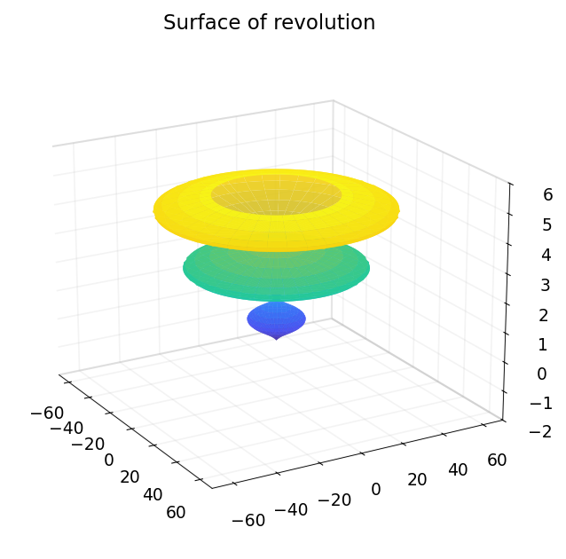
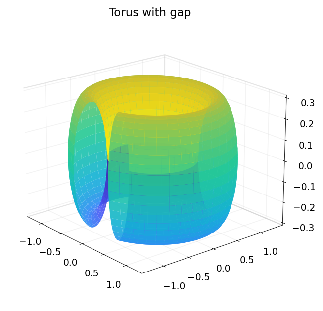
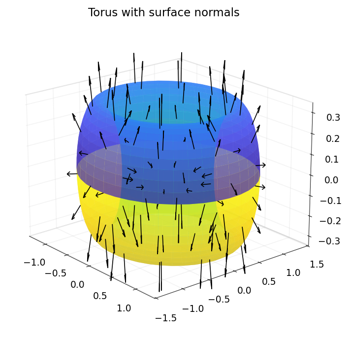
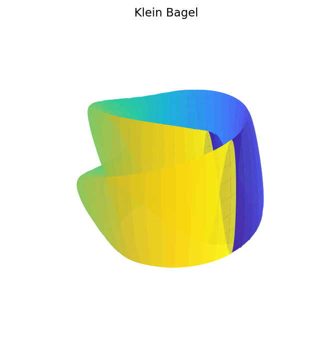

# 15. Chebfun2: Vector Calculus and 2D Surfaces

*Based on [Chebfun Guide Chapter 15](https://www.chebfun.org/docs/guide/guide15.html) by Alex Townsend, March 2013, latest revision October 2019*

## 15.1 What is a chebfun2v?

Chebfun2 can also represent vector-valued functions, which take the form of `Chebfun2v` objects. Usually we use a lower case letter like $f$ for a chebfun2 and an upper case letter like $F$ for a chebfun2v.

Chebfun2 represents a vector-valued function $F(x,y) = (f(x,y);\, g(x,y))$ by approximating each component by a low rank approximant, as described in Section 12.8. There are two ways to form a chebfun2v: either by explicitly calling the constructor, or by vertical concatenation of two chebfun2 objects. Here are these two alternatives:

```python
import jax.numpy as jnp
import numpy as np
import chebfunjax as cj
from chebfunjax.chebfun2d import chebfun2
from chebfunjax.chebfun2d.chebfun2v import Chebfun2v
import matplotlib.pyplot as plt

d = (0.0, 1.0, 0.0, 2.0)
F = Chebfun2v.from_functions(
    lambda x, y: jnp.sin(x*y),
    lambda x, y: jnp.cos(y),
    domain=d)
print(F)
```

```
Chebfun2v(n_components=2, domain=(0.0, 1.0, 0.0, 2.0))
```

Note that displaying a chebfun2v shows that it is a vector of two chebfun2 objects.

## 15.2 Algebraic operations

Chebfun2v objects are useful for performing 2D vector calculus. The basic algebraic operations are scalar multiplication, vector addition, dot product and cross product.

Scalar multiplication is the product of a scalar function with a vector function:

```python
f = chebfun2(lambda x, y: jnp.exp(-(x*y)**2/20), domain=d)
G = f.approx  # Get the SeparableApprox for scalar multiplication
# In chebfunjax, scalar multiplication works via: scalar * F
print(2.0 * F)
```

Vector addition yields another chebfun2v and satisfies the parallelogram law:

```python
G = Chebfun2v.from_functions(
    lambda x, y: jnp.sin(x*y),
    lambda x, y: jnp.cos(y),
    domain=d)

plaw = abs((2*F.norm()**2 + 2*G.norm()**2) - (
    (F+G).norm()**2 + (F-G).norm()**2))
print(f'Parallelogram law holds with error = {plaw:10.5e}')
```

```
Parallelogram law holds with error = 4.44089e-15
```

The dot product combines two vector functions into a scalar function. If the dot product of two chebfun2v objects takes the value zero at some $(x,y)$, then the vector-valued functions are orthogonal there. For example, the following code segment determines a curve along which two vector-valued functions are orthogonal:

```python
F = Chebfun2v.from_functions(
    lambda x, y: jnp.sin(x*y),
    lambda x, y: jnp.cos(y),
    domain=d)
G = Chebfun2v.from_functions(
    lambda x, y: jnp.cos(4*x*y),
    lambda x, y: x + x*y**2,
    domain=d)

dot_fg = F.dot(G)
# Plot roots(dot(F,G)): the orthogonality curve
n = 400
xs = np.linspace(0, 1, n); ys = np.linspace(0, 2, n)
XX, YY = np.meshgrid(xs, ys)
ZZ = np.array(dot_fg(jnp.array(XX.ravel()), jnp.array(YY.ravel()))).reshape(n, n)
plt.contour(XX, YY, ZZ, levels=[0.0], colors='b')
plt.axis('equal'); plt.xlim(d[0], d[1]); plt.ylim(d[2], d[3])
```


The cross product for 2D vector fields works as follows. If $F$ and $G$ both have two components, then it returns the scalar $\text{cross}(F,G) = F_1 G_2 - F_2 G_1$.

```python
cross_fg = F.cross(G)
print(f'cross(F,G) at (0.5, 1.0) = {float(cross_fg(0.5, 1.0)):.6f}')
```

## 15.3 Differential operators

Vector calculus also involves various differential operators defined on scalar- or vector-valued functions such as gradient, curl, divergence, and Laplacian.

The gradient of a chebfun2 for a scalar function $f(x,y)$ represents, geometrically, the direction and magnitude of steepest ascent of $f$. If the gradient of $f$ is $0$ at $(x,y)$, then $f$ has a critical point at $(x,y)$. Here are the critical points of a sum of Gaussian bumps:

```python
rng = np.random.RandomState(0)  # rng('default')
bump_centers = [(2*rng.rand()-1, 2*rng.rand()-1) for _ in range(10)]

def bump_sum(x, y):
    result = jnp.zeros_like(x)
    for x0, y0 in bump_centers:
        result = result + jnp.exp(-10*((x - x0)**2 + (y - y0)**2))
    return result

f = chebfun2(bump_sum)

# gradient(f) = [df/dx, df/dy]
fx = f.diff(dim=2)
fy = f.diff(dim=1)

# Find critical points and plot
fig, ax = cj.surf(f)
# ... mark critical points with black dots
```


The curl of a 2D vector function is a scalar function:

$$\text{curl}(F) = \frac{\partial F_2}{\partial x} - \frac{\partial F_1}{\partial y}$$

If the chebfun2v $F$ describes the velocity field of fluid flow, for example, then `curl(F)` is the vorticity, equal to twice the angular speed of a particle in the flow at each point. A particle moving in a gradient field has zero angular speed and hence, the curl of the gradient is zero. We can check this numerically:

```python
# Build gradient as Chebfun2v
fx_approx = f.diff(dim=2).approx
fy_approx = f.diff(dim=1).approx
grad_f = Chebfun2v([fx_approx, fy_approx])
curl_grad = grad_f.curl()

# norm(curl(gradient(f))) should be zero
n = 100
xs = jnp.linspace(-1, 1, n); ys = jnp.linspace(-1, 1, n)
xx, yy = jnp.meshgrid(xs, ys)
vals = curl_grad(xx.ravel(), yy.ravel())
print(f'norm(curl(gradient(f))) = {float(jnp.max(jnp.abs(vals))):.2e}')
```

```
norm(curl(gradient(f))) = 0
```

The divergence of a chebfun2v is also a scalar function:

$$\text{div}(F) = \frac{\partial F_1}{\partial x} + \frac{\partial F_2}{\partial y}$$

This measures a vector field's distribution of sources or sinks. The Laplacian is closely related and is the divergence of the gradient,

```python
# Laplacian = divergence(gradient(f)) = d^2f/dx^2 + d^2f/dy^2
div_grad = grad_f.divergence()
fxx = f.diff(dim=2, k=2)
fyy = f.diff(dim=1, k=2)

# Check that laplacian(f) = divergence(gradient(f))
n = 50
xs = jnp.linspace(-1, 1, n); ys = jnp.linspace(-1, 1, n)
xx, yy = jnp.meshgrid(xs, ys)
xf = xx.ravel(); yf = yy.ravel()
lap_direct = fxx(xf, yf) + fyy(xf, yf)
lap_divgrad = div_grad(xf, yf)
print(f'norm(laplacian(f) - divergence(gradient(f))) = '
      f'{float(jnp.max(jnp.abs(lap_direct - lap_divgrad))):.2e}')
```

```
norm(laplacian(f) - divergence(gradient(f))) = 0
```

## 15.4 Line integrals

Given a vector field $F$, we can compute the line integral along a curve with the command `integral`:

```python
f = chebfun2(lambda x, y: jnp.cos(10*x*y**2) + jnp.exp(-x**2))
# F = gradient(f)
fx = f.diff(dim=2)
fy = f.diff(dim=1)

# Curve C = t*exp(10it), t in [0,1]
t = np.linspace(0, 1, 10000)
cx = t * np.cos(10*t)
cy = t * np.sin(10*t)
```

The gradient theorem says that if $F$ is a gradient field, then the line integral along a smooth curve only depends on the end points of that curve. We can check this numerically:

```python
# Line integral via quadrature: integral_C F . dr
dcx = np.diff(cx); dcy = np.diff(cy)
fx_vals = np.array([float(fx(jnp.float64(xi), jnp.float64(yi)))
                    for xi, yi in zip(cx, cy)])
fy_vals = np.array([float(fy(jnp.float64(xi), jnp.float64(yi)))
                    for xi, yi in zip(cx, cy)])
v = np.sum(0.5*(fx_vals[:-1]+fx_vals[1:])*dcx +
           0.5*(fy_vals[:-1]+fy_vals[1:])*dcy)

# Compare with f(end) - f(start)
ends = float(f(jnp.float64(np.cos(10)), jnp.float64(np.sin(10)))) - float(f(0.0, 0.0))
print(f'|line_integral - (f(end)-f(start))| = {abs(v - ends):.2e}')
```

```
|line_integral - (f(end)-f(start))| = 1.78e-15
```


## 15.5 Phase diagram

A phase diagram is a graphical representation of a system of trajectories for a two-variable autonomous dynamical system. Chebfun2 plots phase diagrams with the `quiver` command. Note that there is a potential terminological ambiguity in that a "phase portrait" can also refer to a portrait of a complex-valued function (see section 12.7).

In addition, chebfun2 makes it easy to compute and plot individual trajectories of a vector field. If $F$ is a chebfun2v, then `ode45(F, tspan, y0)` computes a trajectory of the autonomous system $dx/dt = f(x,y)$, $dy/dt = g(x,y)$, where $f$ and $g$ are the first and second components of $F$. (This use of `ode45` is inconsistent with Chebfun's recommended use of the backslash operator for solving ODEs in other contexts.) Given a prescribed time interval and initial conditions, this command returns a complex-valued chebfun representing the trajectory in the form $x(t) + iy(t)$. For example:

```python
delta = 0.04; a = 1; b = -0.75
# Vector field: dx/dt = y, dy/dt = -delta*y - b*x - a*x^3

# Quiver plot
n_quiv = 20
xs = np.linspace(-2, 2, n_quiv); ys = np.linspace(-2, 2, n_quiv)
XX, YY = np.meshgrid(xs, ys)
UU = YY; VV = -delta*YY - b*XX - a*XX**3

fig, ax = plt.subplots(figsize=(6, 5))
ax.quiver(XX, YY, UU, VV, color='b', alpha=0.6, scale=40)

# Solve trajectory via Euler method
dt = 0.01; n_steps = 4000
traj_x = [0.0]; traj_y = [0.5]
for _ in range(n_steps):
    x_cur, y_cur = traj_x[-1], traj_y[-1]
    traj_x.append(x_cur + dt * y_cur)
    traj_y.append(y_cur + dt * (-delta*y_cur - b*x_cur - a*x_cur**3))
ax.plot(traj_x, traj_y, 'r-', linewidth=1.0)
ax.set_xlim(-2, 2); ax.set_ylim(-2, 2)
ax.set_aspect('equal')
ax.set_title('The Duffing oscillator')
```


## 15.6 Representing 2D parametric surfaces in 3D space

So far, we have explored chebfun2v objects with two components, but chebfun2 can also work with functions with three components, i.e., functions from a rectangle in $\mathbb{R}^2$ into $\mathbb{R}^3$. For example, we can represent the unit sphere via spherical coordinates as follows:

```python
th = chebfun2(lambda th, phi: th, domain=(0.0, np.pi, 0.0, 2*np.pi))
phi = chebfun2(lambda th, phi: phi, domain=(0.0, np.pi, 0.0, 2*np.pi))

# In chebfunjax, we construct the sphere directly:
n = 60
th_vals = np.linspace(0, np.pi, n)
phi_vals = np.linspace(0, 2*np.pi, n)
TH, PHI = np.meshgrid(th_vals, phi_vals)
X = np.sin(TH) * np.cos(PHI)
Y = np.sin(TH) * np.sin(PHI)
Z = np.cos(TH)

fig = plt.figure()
ax = fig.add_subplot(111, projection='3d')
ax.plot_surface(X, Y, Z, cmap='viridis')
ax.set_aspect('equal')
```


Above, we have formed a chebfun2v with three components by vertical concatenation of chebfun2 objects. However, for the familiar surfaces cylinders, spheres, and ellipsoids, chebfun2 has overloads of the commands `cylinder`, `sphere`, and `ellipsoid` to make things simpler. For example, a cylinder of radius 1 and height 5 can be constructed like this:

```python
h = 5
n = 60
th = np.linspace(0, 2*np.pi, n)
z = np.linspace(0, h, n)
TH, ZZ = np.meshgrid(th, z)
X = np.cos(TH); Y = np.sin(TH)

fig = plt.figure()
ax = fig.add_subplot(111, projection='3d')
ax.plot_surface(X, Y, ZZ, cmap='plasma')
```


An important class of parametric surfaces are surfaces of revolution, which are formed by revolving a curve in the left half plane about the $z$-axis. The `cylinder` command can be used to generate surfaces of revolution. For example:

```python
t_vals = np.linspace(0, 5, 80)
r_vals = (np.sin(np.pi*t_vals) + 1.1) * t_vals * (t_vals - 10)
th = np.linspace(0, 2*np.pi, 80)
TH, T = np.meshgrid(th, t_vals)
_, R = np.meshgrid(th, r_vals)
X = R * np.cos(TH); Y = R * np.sin(TH); Z = T

fig = plt.figure()
ax = fig.add_subplot(111, projection='3d')
ax.plot_surface(X, Y, Z, cmap='viridis')
ax.set_xlim(-70, 70); ax.set_ylim(-70, 70); ax.set_zlim(-2, 6)
```



Here as another example is a torus with a gap in it.

```python
n = 80
x_ref = np.linspace(-1, 1, n); y_ref = np.linspace(-1, 1, n)
X_ref, Y_ref = np.meshgrid(x_ref, y_ref)
theta = 0.9 * np.pi * X_ref
phi = np.pi * Y_ref
X = -(1 + 0.3*np.cos(phi)) * np.sin(theta)
Y = (1 + 0.3*np.cos(phi)) * np.cos(theta)
Z = 0.3 * np.sin(phi)

fig = plt.figure()
ax = fig.add_subplot(111, projection='3d')
ax.plot_surface(X, Y, Z, cmap='viridis')
ax.set_aspect('equal')
```



## 15.7 Surface normals and the divergence theorem

Given a chebfun2v representing a surface, the normal can be computed by the chebfun2 `normal` command. Here are the normal vectors of another torus:

```python
r1 = 1; r2 = 1.0/3.0
n = 40
u = np.linspace(0, 2*np.pi, n); v = np.linspace(0, 2*np.pi, n)
UU, VV = np.meshgrid(u, v)
X = -(r1 + r2*np.cos(VV)) * np.sin(UU)
Y = (r1 + r2*np.cos(VV)) * np.cos(UU)
Z = r2 * np.sin(VV)

# Compute normals via cross product of partial derivatives
dXdu = -(r1 + r2*np.cos(VV)) * np.cos(UU)
dYdu = -(r1 + r2*np.cos(VV)) * np.sin(UU)
dZdu = np.zeros_like(UU)
dXdv = r2*np.sin(VV) * np.sin(UU)
dYdv = -r2*np.sin(VV) * np.cos(UU)
dZdv = r2*np.cos(VV)
Nx = dYdu*dZdv - dZdu*dYdv
Ny = dZdu*dXdv - dXdu*dZdv
Nz = dXdu*dYdv - dYdu*dXdv
Nmag = np.sqrt(Nx**2 + Ny**2 + Nz**2)
Nmag[Nmag == 0] = 1
Nx /= Nmag; Ny /= Nmag; Nz /= Nmag

fig = plt.figure()
ax = fig.add_subplot(111, projection='3d')
ax.plot_surface(X, Y, Z, cmap='viridis', alpha=0.7)
step = 4
ax.quiver(X[::step,::step], Y[::step,::step], Z[::step,::step],
          Nx[::step,::step], Ny[::step,::step], Nz[::step,::step],
          length=0.15, color='k')
ax.set_aspect('equal')
```



Once we have the surface normal vectors we can compute, for instance, the volume of the torus by applying the divergence theorem:

$$\int\!\!\int\!\!\int_V \text{div}(G)\, dV = \int\!\!\int_S G \cdot d\mathbf{S},$$

where $\text{div}(G) = 1$. Instead of integrating over the 3D volume, which is not possible in chebfun2, we integrate over the 2D surface:

```python
# G = F/3, where F = [x;y;z] so div(G) = 1
# Volume via surface integral = integral2(dot(G, normal(F)))
exact = 2 * np.pi**2 * r1 * r2**2
print(f'exact volume = {exact}')
```

```
exact volume = 2.193245422464302
```

Chebfun2v objects with three components come with a warning. Chebfun2 works with functions of two real variables, and therefore, operations such as curl and divergence (in 2D) have little physical meaning for the represented 3D surface. The reason we can compute the volume of the torus (above) is because we are using the divergence theorem and circumventing the 3D divergence.

To finish this section we represent the Klein Bagel. The solid black line shows the parameterisation seam and is displayed with the syntax `surf(F, '-')`. See [Platte 2013] for more on parameterised surfaces.

```python
u = np.linspace(0, 2*np.pi, 80); v = np.linspace(0, 2*np.pi, 80)
UU, VV = np.meshgrid(u, v)
X = (3 + np.cos(UU/2)*np.sin(VV) - np.sin(UU/2)*np.sin(2*VV)) * np.cos(UU)
Y = (3 + np.cos(UU/2)*np.sin(VV) - np.sin(UU/2)*np.sin(2*VV)) * np.sin(UU)
Z = np.sin(UU/2)*np.sin(VV) + np.cos(UU/2)*np.sin(2*VV)

fig = plt.figure()
ax = fig.add_subplot(111, projection='3d')
ax.plot_surface(X, Y, Z, cmap='hot', edgecolors='k', linewidth=0.3, alpha=0.6)
ax.set_aspect('equal')
ax.axis('off')
```



## 15.8 Reference

[Platte 2013] R. Platte, "Parameterizable surfaces," http://www.chebfun.org/examples/geom/ParametricSurfaces.html.
