# Chapter 16: Diskfun

*Heather Wilber, October 2016, latest revision November 2019*

*Python translation based on [Chebfun Guide Chapter 16](https://www.chebfun.org/docs/guide/guide16.html)*

## 16.1 Introduction

Diskfun is a part of chebfunjax for computing with 2D scalar and vector-valued functions on the unit disk. Conceptually, it is an extension of Chebfun2 to the polar setting, designed to accurately and efficiently perform over 100 operations. These include differentiation, integration, vector calculus, and rootfinding, among many other things. Diskfun was developed in tandem with Spherefun, and the two are algorithmically closely related. For complete details on the algorithms of both of these classes, see [Townsend, Wilber & Wright, 2016], [Wilber, Townsend & Wright, 2016]. Later, Ballfun was also created, for computing with functions in a spherical ball, as described in chapter 20.

To get started, we simply call the Diskfun constructor. In this example, we consider a Gaussian function.

```python
import jax.numpy as jnp
from chebfunjax.diskfun import Diskfun

g = Diskfun.from_function(
    lambda theta, r: jnp.exp(-10 * ((r * jnp.cos(theta) - 0.3)**2
                                     + (r * jnp.sin(theta))**2)))
# plot(g), view(3)
```

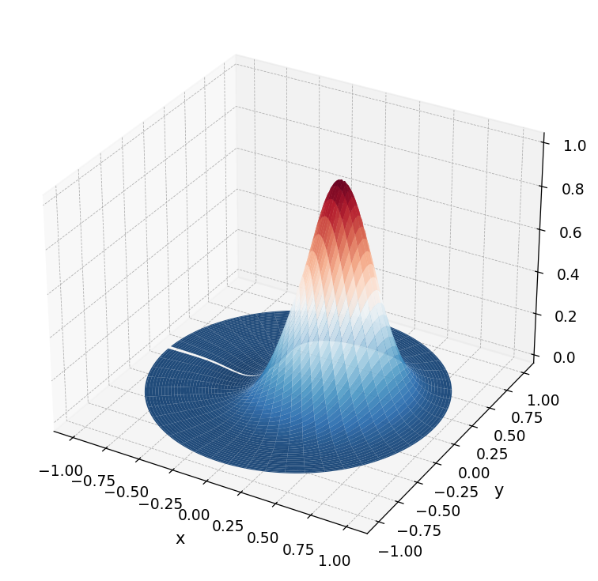

When working with functions on the disk, it is sometimes convenient to express them in terms of polar coordinates. Given a function $f(x,y)$ expressed in Cartesian coordinates, we apply the following transformation of variables:

$$x = \rho\cos\theta, \qquad y = \rho\sin\theta, \qquad (\theta, \rho) \in [-\pi, \pi] \times [0, 1].$$

This gives $f(\theta, \rho)$, where $\theta$ is the *angular* variable and $\rho$ is the *radial* variable.

To construct `g` using polar coordinates, we include the polar coordinate form directly. The result using either coordinate system is the same up to machine precision:

```python
f = Diskfun.from_function(
    lambda t, r: jnp.exp(-10 * ((r * jnp.cos(t) - 0.3)**2
                                 + (r * jnp.sin(t))**2)))
# norm(f - g) => 0
```

The object we have constructed is called a diskfun, with a lower case 'd'. We can find out more about a diskfun by printing it to the command line.

```python
print(f)
# Diskfun object
#   domain        rank    vertical scale
#  unit disk       19            1
```

The output describes the *numerical* rank of $f$, as well an approximation of the maximum absolute value of $f$ (the vertical scale).

To evaluate a diskfun, we use polar coordinates `(theta, r)`:

```python
import numpy as np
print(f(jnp.pi / 4, 0.5))   # f at theta=pi/4, r=1/2
# 0.278404647671088
```

We can also evaluate a univariate slice of $f$ at a fixed radius. Here, we plot three angular slices at the fixed radii $\rho = 1/4$, $1/3$, and $1/2$.

```python
theta_vals = jnp.linspace(-jnp.pi, jnp.pi, 200)
for rho in [0.25, 1./3., 0.5]:
    vals = f(theta_vals, jnp.full_like(theta_vals, rho))
    # plot vals vs theta_vals
```

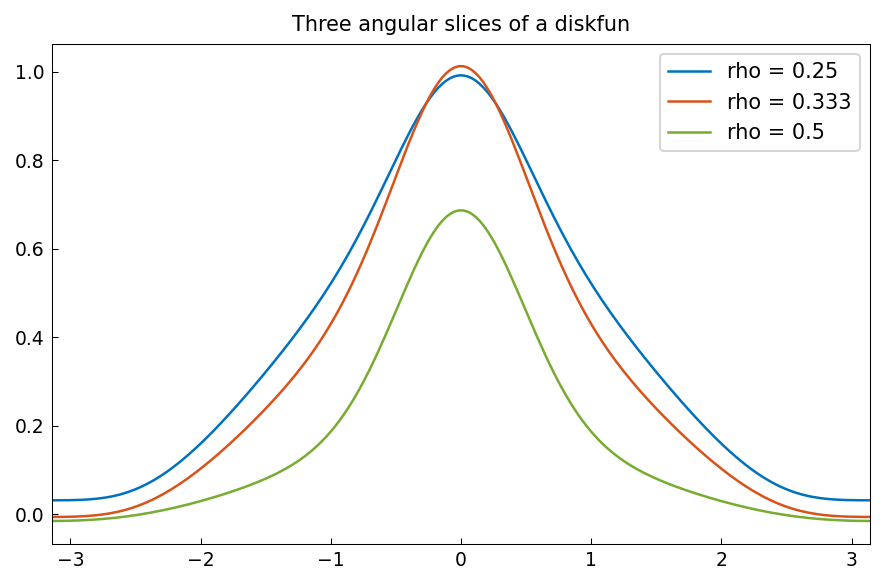

Whenever possible, we interpret commands with respect to the function in Cartesian coordinates. So, for example, the diagonal slice $f(x,x)$ can be obtained by evaluating along the line $\theta = \pi/4$, $r = |x|\sqrt{2}$.

```python
x_vals = jnp.linspace(-1./jnp.sqrt(2), 1./jnp.sqrt(2), 200)
r_vals = jnp.abs(x_vals) * jnp.sqrt(2.)
theta_vals = jnp.where(x_vals >= 0, jnp.pi/4, jnp.pi/4 + jnp.pi)
diag = f(theta_vals, jnp.clip(r_vals, 0, 1))
# plot(diag)
```

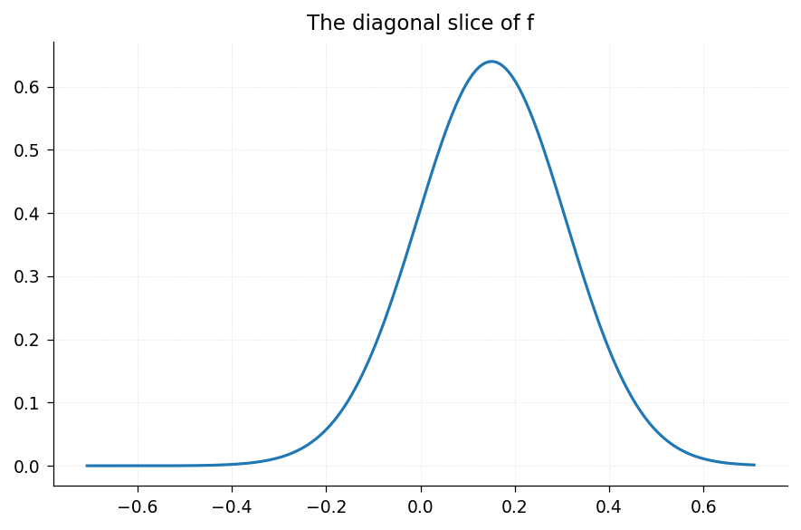

```python
trace_f = float(jnp.trapezoid(diag, x_vals))
print(trace_f)
# 0.357313890819409
```

Like the rest of chebfunjax, Diskfun is designed to perform operations at close to machine precision, and using Diskfun requires no special knowledge about the underlying algorithms or discretization procedures.

## 16.2 Basic operations

A suite of commands are available in Diskfun, and here we describe only a few.

We start by adding, subtracting, and multiplying diskfuns together:

```python
g = Diskfun.from_function(
    lambda th, r: -40 * (jnp.cos(((jnp.sin(jnp.pi * r) * jnp.cos(th)
        + jnp.sin(2 * jnp.pi * r) * jnp.sin(th)) / 4))) + 39.5)

f = Diskfun.from_function(
    lambda th, r: jnp.cos(15 * ((r * jnp.cos(th) - 0.2)**2
        + (r * jnp.sin(th) - 0.2)**2))
        * jnp.exp(-(r * jnp.cos(th) - 0.2)**2
                   - (r * jnp.sin(th) - 0.2)**2))
```

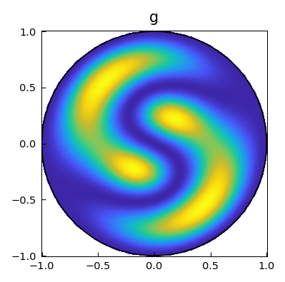

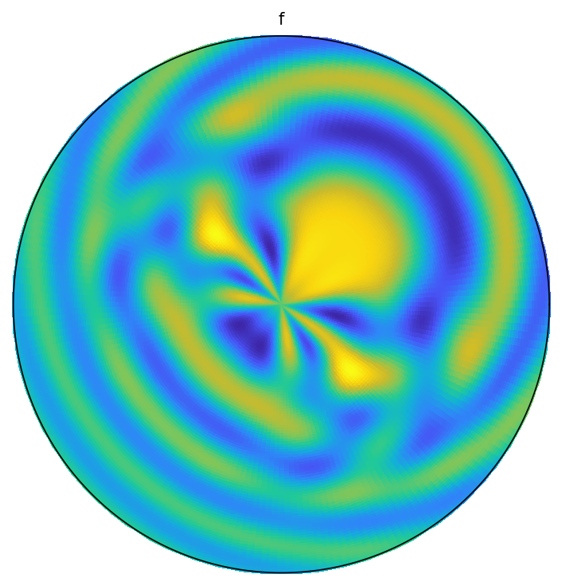


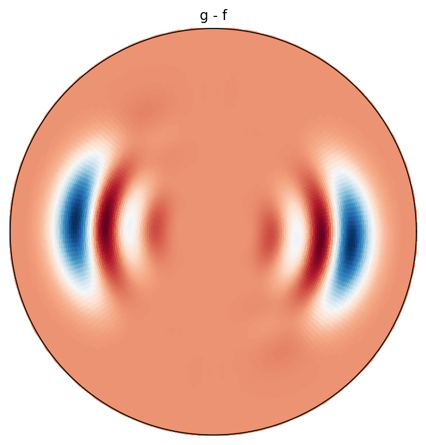

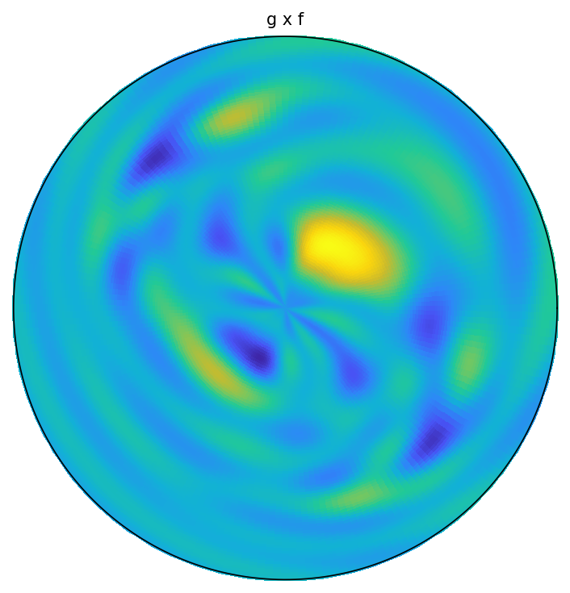

In addition to algebraic operations, we can also solve unconstrained global optimization problems. Here we plot $f$ along with its maximum value.

```python
# The maximum of f is at (x, y) = (0.2, 0.2)
val = 0.999999999999999
loc = (0.200000005872459, 0.200000000131672)
```

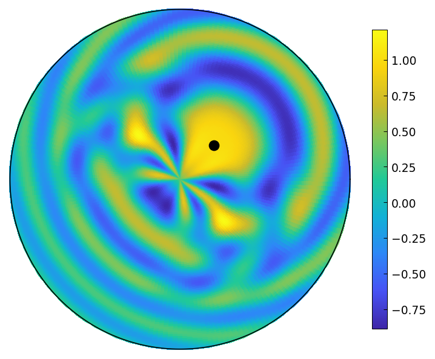

There are many ways to visualize a function on the disk. For example, here is a contour plot of $g$, with the zero contours displayed in black:

```python
# contour(g) with zero contours in black
```

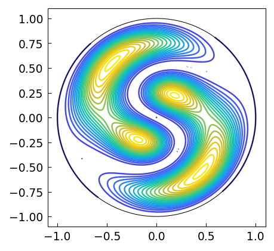

The roots of a function (1D contours) can also be found explicitly. Following the pattern of Chebfun2, the contours are stored as complex-valued chebfuns.

```python
# r = roots(g)
# plot(g), hold on, plot(r, 'k')
```

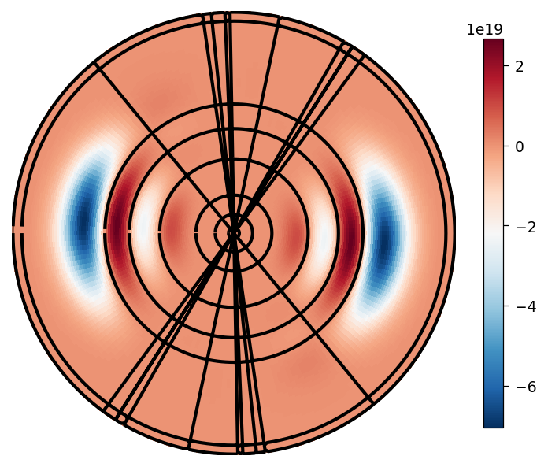

One can also perform calculus on diskfuns. For instance, the integral of the function $g(x,y) = -x^2 - 3xy - (y-1)^2$ over the unit disk can be computed using the `sum` method. We know that the exact answer is $-3\pi/2$.

```python
f_int = Diskfun.from_function(
    lambda th, r: -(r * jnp.cos(th))**2
        - 3 * r * jnp.cos(th) * r * jnp.sin(th)
        - (r * jnp.sin(th) - 1)**2)
intf = float(f_int.sum())
tru = -3 * np.pi / 2
print(f"intf = {intf}")
print(f"tru  = {tru}")
# intf = -4.712388980384690
# tru  = -4.712388980384690
```

Differentiation on the disk with respect to the radial variable $\rho$ can lead to singularities, even for smooth functions. For example, the function $f(\theta, \rho) = \rho \sin(\theta)$ is smooth on the disk, but $\partial f / \partial \rho = \sin(\theta)$ has a singularity at $\rho = 0$. For this reason, differentiation in Diskfun is only done with respect to the Cartesian coordinates, $x$ and $y$.

Here, we examine a pair of harmonic conjugate functions, $u$ and $v$. We can use Diskfun to check that they satisfy the Cauchy-Riemann equations, and that $\nabla^2 u = \nabla^2 v = 0$. Geometrically, this implies that the contour lines of $u$ and $v$ intersect at right angles.

```python
u = Diskfun.from_function(lambda t, r: r**3 * jnp.cos(3 * t))
v = Diskfun.from_function(lambda t, r: r**3 * jnp.sin(3 * t))

# Check Cauchy-Riemann: u_y = -v_x, u_x = v_y
# Check Laplacian: lap(u) = 0, lap(v) = 0
```

```python
# contour(u, 20, 'b'), contour(v, 20, 'm')
```

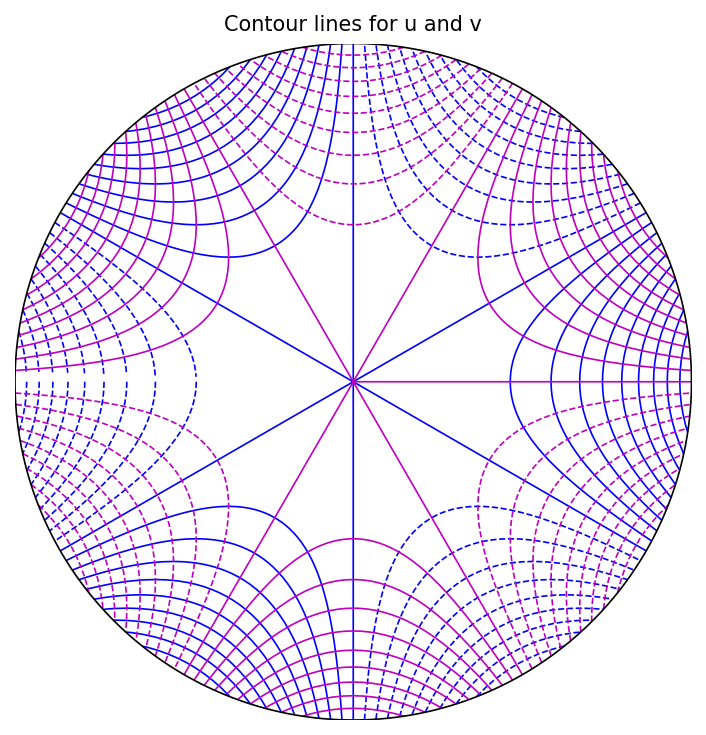

For the next example, we consider the eigenfunctions of the Laplace operator in polar coordinates. As the analogue of the spherical harmonics, they are a natural basis for functions on the disk.

Here, we examine the derivatives of the cylindrical harmonic function $u = a J_4(\omega_{41}\rho) \cos(4\theta)$. The function $J_4$ is a Bessel function with parameter 4, $\omega_{41}$ is the first positive root of $J_4$, and $a$ is a normalization constant (see Ch. 9, [Churchill & Brown, 1978]). We construct $u$ in Diskfun as follows:

```python
from scipy.special import jn_zeros, jv

w41 = jn_zeros(4, 1)[0]
u = Diskfun.from_function(
    lambda th, r: jv(4, w41 * r) * jnp.cos(4 * th))
# plot(u)
```

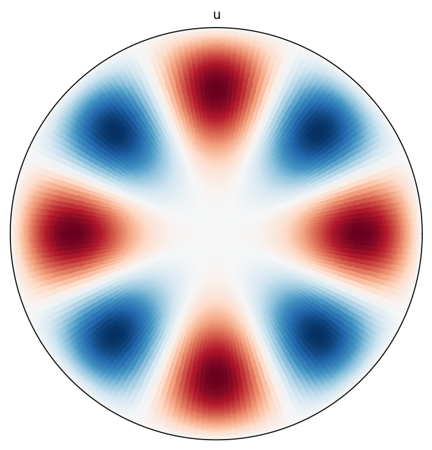

Here are the first derivatives of $u$:

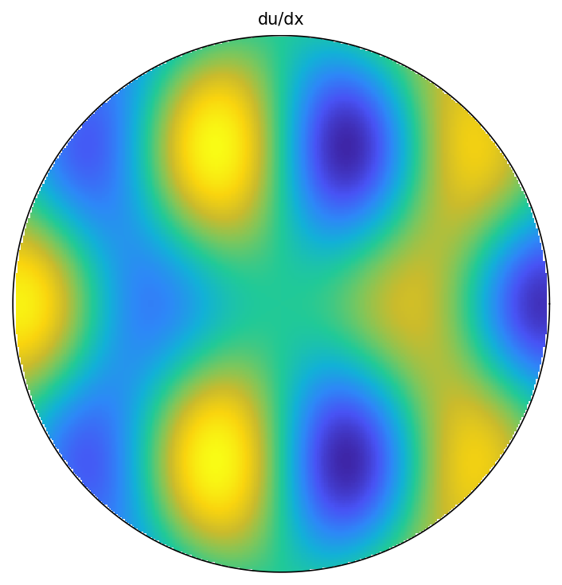

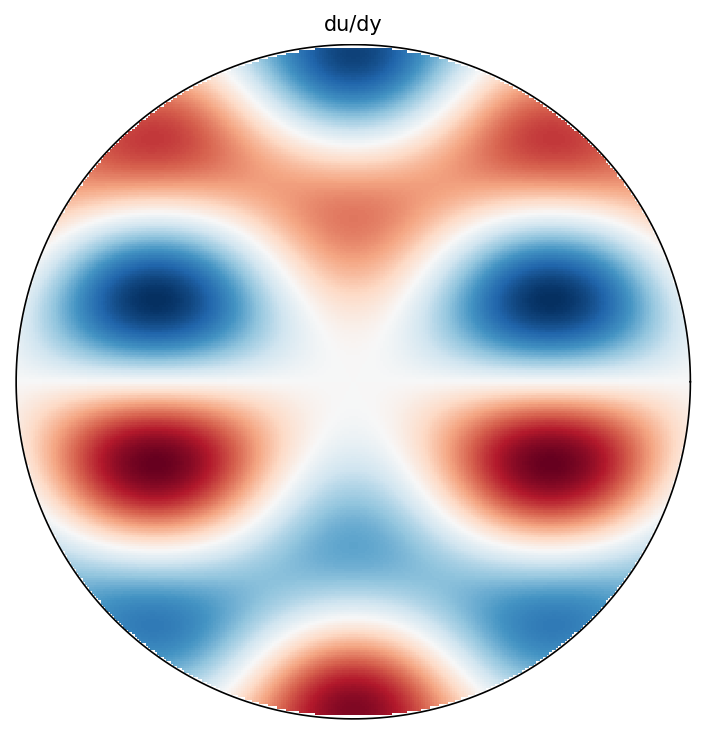

Due to the rotational symmetry of $u$, $u_x$ is equivalent to the rotation of $u_y$ by an angle of $-\pi/2$ radians.

We observe that $u_{xx} + u_{yy}$ is a scalar multiple of $u$. We can compare with the computation $-\lambda u$, where $\sqrt{\lambda} = 7.58834243450380$.

```python
lam = 7.58834243450380**2
# norm(-lam * u - lap(u))
# ans = 5.718384796184924e-13
```

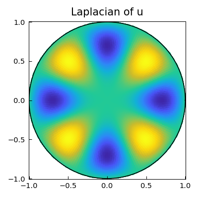

## 16.3 Poisson equation

We can use Diskfun to compute smooth solutions to the Poisson equation on the disk. In this example, we compute the solution $v(\theta, \rho)$ for the Poisson equation with a Dirichlet boundary condition: we seek $v$ such that

$$\nabla^2 v = f, \qquad v(\theta, 1) = 1,$$

where $(\theta, \rho) \in [-\pi, \pi] \times [0, 1]$ and $f = \sin \left( 21 \pi \left( 1 + \cos(\pi \rho) \right) \rho^2 - 2\rho^5 \cos \left( 5(t - 0.11) \right) \right)$. The solution is returned as a diskfun, so we can immediately plot it, evaluate it, find its zero contours, or perform other operations.

```python
f_rhs = lambda t, r: jnp.sin(
    21 * jnp.pi * (1 + jnp.cos(jnp.pi * r))
    * (r**2 - 2 * r**5 * jnp.cos(5 * (t - 0.11))))
rhs = Diskfun.from_function(f_rhs)
# v = diskfun.poisson(f_rhs, bc, 256)
```

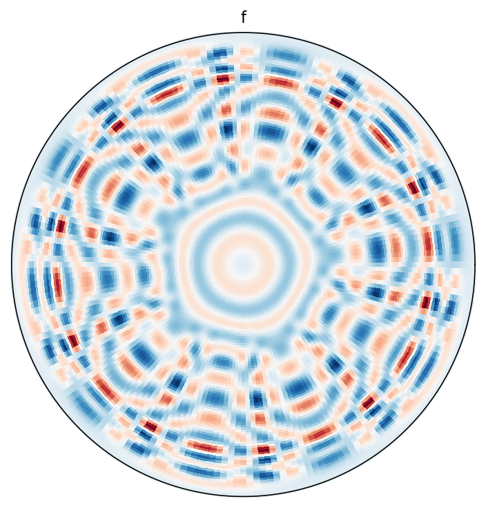

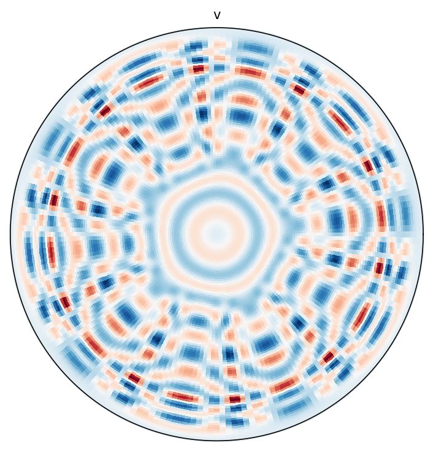

## 16.4 Vector calculus

Since the introduction of Chebfun2, Chebfun has supported computations with vector-valued functions, including functions in 2D (Chebfun2v), 3D (Chebfun3v), and spherical geometries (Spherefunv, Ballfunv). Similarly, Diskfunv allows one to compute with vector-valued functions on the disk. Currently, there are dozens of commands available in Diskfunv, including vector-based algebraic commands such as `cross`, as well as commands that map vector-valued functions to scalar-valued functions (e.g., `dot`, `curl`, `div` and `jacobian`) and vice-versa (e.g., `grad`), and commands for performing calculus with vector fields (e.g., `laplacian`).

In this example, we create a diskfun consisting of a difference of two Gaussian functions, and then compute its gradient. The result is returned as a vector-valued object called a diskfunv, with a lower case 'd'.

```python
from chebfunjax.diskfun import Diskfunv

psi = Diskfun.from_function(
    lambda th, r: 5 * jnp.exp(-10 * (r * jnp.cos(th) + 0.2)**2
                               - 10 * (r * jnp.sin(th) + 0.4)**2)
    - 5 * jnp.exp(-10 * (r * jnp.cos(th) - 0.2)**2
                   - 10 * (r * jnp.sin(th) - 0.2)**2)
    + 5 * (1 - r**2) - 20)
# u = grad(psi)
```

The vector-valued function $\mathbf{u}$ consists of two components, ordered with respect to unit vectors in the directions of $x$ and $y$, respectively. Each of these is stored as a diskfun. We can view the vector field using a quiver plot:

```python
# plot(psi), quiver(u, 'k')
```

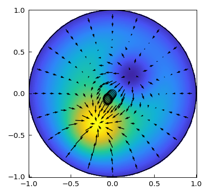

Once a diskfunv object is created, dozens of overloaded commands can be applied to it. For example, here is a contour plot of the divergence of $\mathbf{u}$.

```python
# D = div(u)
# contour(D, 10), quiver(u, 'k')
```

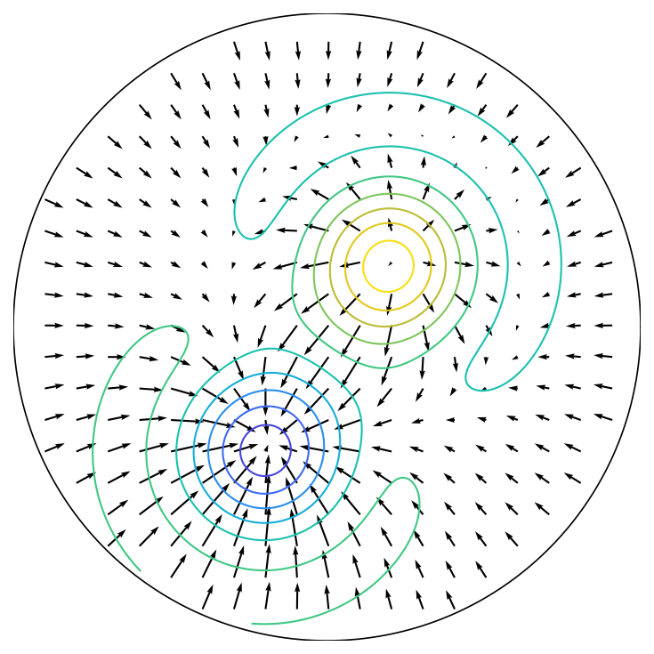

Since $\mathbf{u}$ is the gradient of $f$, we can verify that $\nabla \cdot \mathbf{u} = \nabla^2 f$:

```python
# norm(div(u) - lap(f))
# ans = 0
```

Additionally, since $\mathbf{u}$ is a gradient field, $\nabla \times \mathbf{u} = 0$.

We can verify this with the `curl` command.

```python
# v = curl(u)
# norm(v)
# ans = 1.581462823700134e-11
```

Diskfunv objects can be created by calling the constructor directly and supplying function handles or diskfuns for each component, or by vertically concatenating two diskfuns. Here, we demonstrate this by forming a diskfunv $\mathbf{v}$ that represents the surface curl for a scalar-valued function $g$, i.e., $\nabla \times [0, 0, g]$.

```python
g = Diskfun.from_function(
    lambda th, r: jnp.cosh(0.25 * (jnp.cos(5 * r * jnp.cos(th))
        + jnp.sin(4 * (r * jnp.sin(th))**2))) - 2)
# dgx = diffx(g); dgy = diffy(g)
# v = Diskfunv(dgy, -dgx)
```

```python
# plot(g), quiver(v, 'w')
```

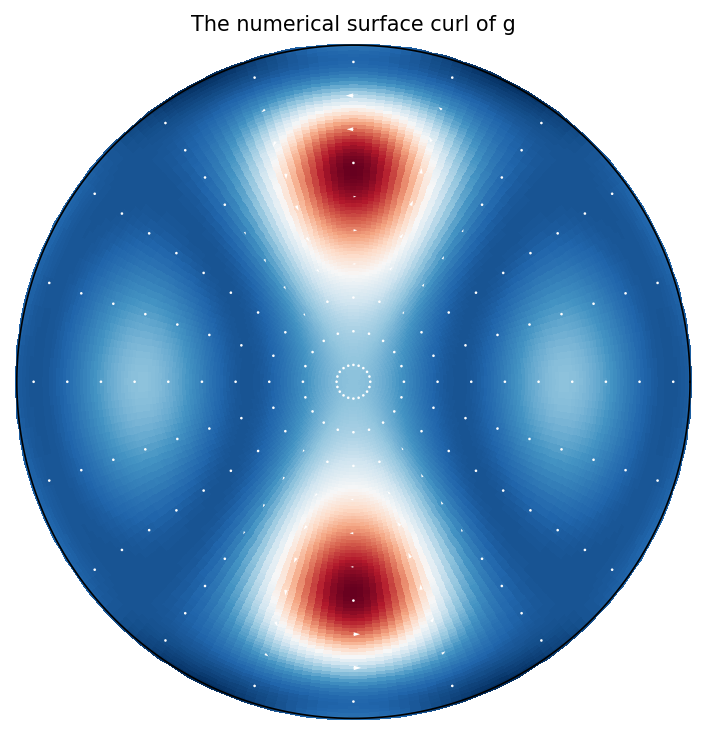

This construction is equivalent to using the command `curl` on the scalar function $g$:

```python
# norm(v - curl(g))
# ans = 0
```

## 16.5 Constructing a diskfun

The above sections describe how to use Diskfun, and this section provides a brief overview of how the algorithms in Diskfun work. This can be useful for understanding various aspects of approximation involving functions on the disk. More details can be found in [Townsend, Wilber & Wright, 2016b], and also in the closely related Spherefun part (Chapter 17) of the guide.

Like Chebfun2 and Spherefun, Diskfun uses a variant of Gaussian elimination (GE) to form low rank approximations to functions. This often results in a compressed representation of the function, and it also facilitates the use of highly efficient algorithms that work primarily on sets of 1D functions related to the approximant.

To construct a diskfun from a function $f$, we consider an extended version of $f$, denoted by $\tilde{f}$, which is formed by taking $f(\theta, \rho)$ and letting $\rho$ range over $[-1, 1]$, as opposed to $[0, 1]$. This is the disk analogue of the so-called double Fourier sphere method discussed in Chapter 17 (also, see [Fornberg, 1998] and [Trefethen, 2000]). The function $\tilde{f}$ has a special structure, referred to as a block-mirror-centrosymmetric (BMC) structure. By forming approximants that preserve the BMC structure of $\tilde{f}$, smoothness near the origin is guaranteed.

To see the BMC structure, we construct a diskfun `f` and use the `cart2pol` command:

```python
f = Diskfun.from_function(
    lambda th, r: jnp.cos(2 * (3 * jnp.sin(2 * r * jnp.cos(th))
        + 5 * jnp.sin(r * jnp.sin(th))))
        - 0.5 * jnp.sin(r * jnp.cos(th) - r * jnp.sin(th)))
# plot(f)
```

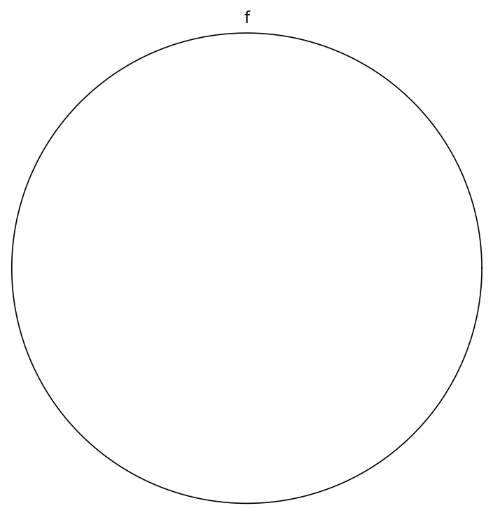

```python
# tf = cart2pol(f, 'cdr')
# plot(tf), view(2)
```

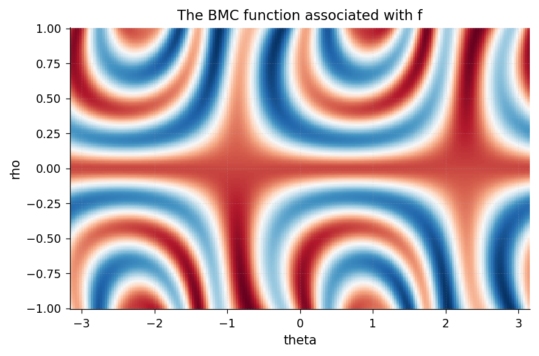

A structure-preserving method of GE (see [Townsend, Wilber & Wright, 2016b]) adaptively selects a collection of 1D circular and radial "slices" that are used to approximate $\tilde{f}$. Each circular slice is a periodic function in $\theta$, and is represented by a trigonometric interpolant (or trigfun, see Chapter 11). Each radial slice, a function in $\rho$, is represented as a chebfun. These slices form a low rank representation of $f$,

$$f(\theta, \rho) \approx \sum_{j=1}^{n} d_j c_j(\rho) r_j(\theta),$$

where $\{d_j\}_{j=1}^{n}$ are pivot values associated with the GE procedure.

The `plot` command can be used to display the "skeleton" of `f`: the locations of the slices that were adaptively selected and sampled during the GE procedure.

Comparing the skeleton to the tensor product grid required to approximate $\tilde{f}$ to machine precision, we see that $\tilde{f}$ is numerically of low rank, so Diskfun is effectively compressing the representation. The clustering of sample points near the center and the edges of the disk can be observed in the tensor product grid; low rank methods alleviate this issue in many instances.

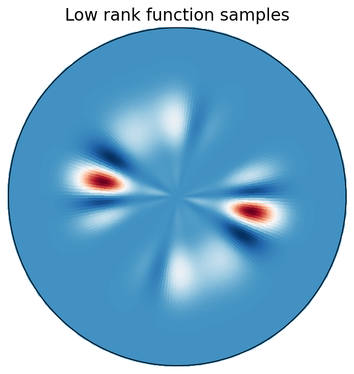

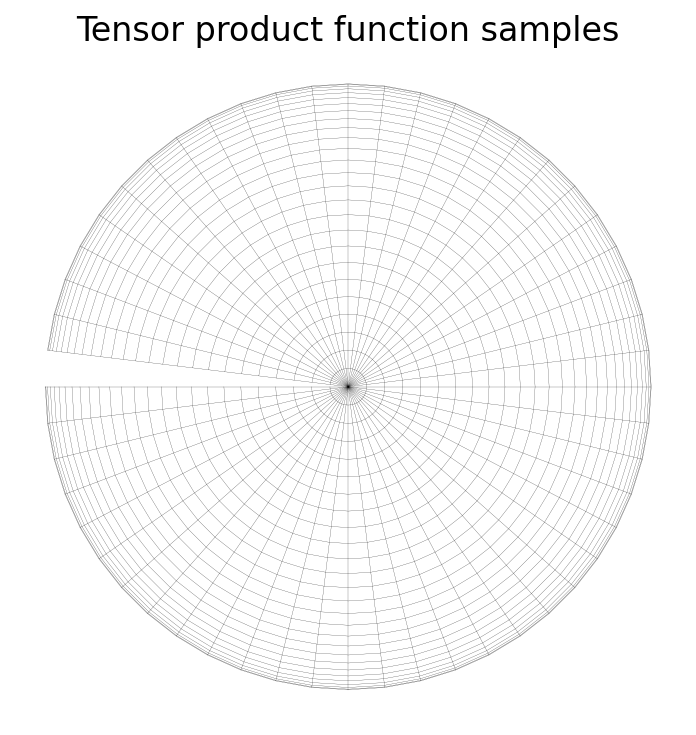

Writing the approximant as above allows us to work with it as a continuous analogue of a matrix factorization. Then, the "column" (radial) slices of $f$ are the collection of Chebyshev interpolants $c_j(\rho)$, and the "row" slices are the trigonometric interpolants $r_j(\theta)$. These can be plotted; doing so we observe that each column is either even or odd, and each row is either $\pi$-periodic or $\pi$-antiperiodic. This is reflective of the BMC structure inherent to the approximant.

```python
# plot(f.cols[:, 3:7])
# plot(f.rows[:, 3:7])
```

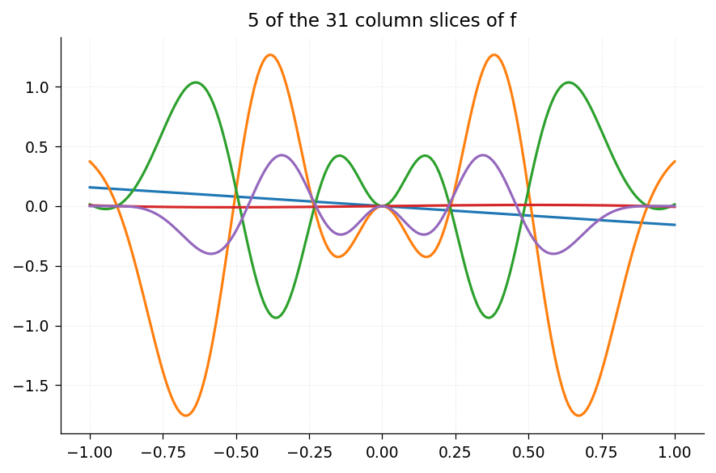

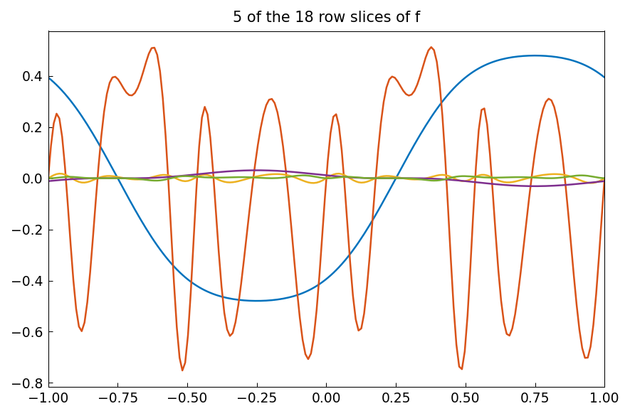

In practice, several basis choices can be used for approximation on the disk (see [Boyd & Yu, 2011]). Diskfun uses the Chebyshev-Fourier basis, and `f` is fully characterized by its Chebyshev and Fourier coefficients. The command `plotcoeffs` lets us inspect these details.

```python
# plotcoeffs(f)
```

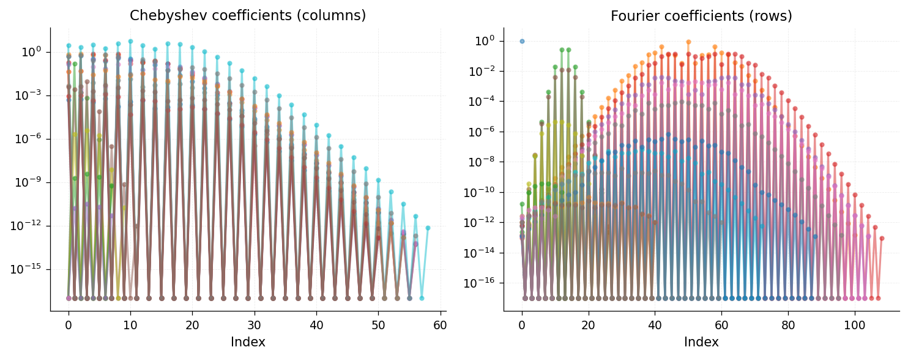

## References

[Boyd & Yu, 2011] J.P. Boyd, and F. Yu, Comparing seven spectral methods for interpolation and for solving the Poisson equation in a disk: Zernike polynomials, Logan & Shepp ridge polynomials, Chebyshev & Fourier series, cylindrical Robert functions, Bessel & Fourier expansions, square-to-disk conformal mapping and radial basis functions, *J. Comp. Physics*, 230.4 (2011), pp. 1408-1438.

[Churchill & Brown, 1978] R.V. Churchill, and J.W. Brown, *Fourier Series and Boundary Value Problems*, McGraw-Hill, 1978.

[Fornberg 1998] B. Fornberg, *A Practical Guide to Pseudospectral Methods*, Cambridge University Press, 1998.

[Townsend, Wilber & Wright, 2016] A. Townsend, H. Wilber, and G.B. Wright, Computing with functions in spherical and polar geometries I. The sphere, *SIAM J. Sci. Comp.*, 38-4 (2016), C403-C425.

[Wilber, Townsend & Wright, 2016b] A. Townsend, H. Wilber, and G.B. Wright, Computing with functions in spherical and polar geometries II. The disk, *SIAM J. Sci. Comput.*, 39-3 (2017), C238-C262.

[Trefethen, 2000] L. N. Trefethen, *Spectral Methods in MATLAB*, SIAM, 2000.
