# 16. Diskfun

*Condensed adaptation for chebfunjax of
[Chebfun Guide Chapter 16](https://www.chebfun.org/docs/guide/guide16.html)
by Heather Wilber (2016, rev. 2019). See the original chapter for the full
exposition; the code and outputs below are genuine chebfunjax results.*

## 16.1 Introduction

Diskfun computes with scalar- and vector-valued functions on the unit
disk, extending the Chebfun2 approach to polar geometry. It supports
arithmetic, calculus, rootfinding, optimization, and vector calculus,
and shares its algorithmic core with Spherefun (Chapter 17); see
[Townsend, Wilber & Wright, 2016] and [Wilber, Townsend & Wright, 2016]
for the underlying theory.

A diskfun is built by handing the constructor a function of polar
coordinates $(\theta, \rho) \in [-\pi,\pi] \times [0,1]$, related to
Cartesian coordinates by $x = \rho\cos\theta$, $y = \rho\sin\theta$:

```python
import jax.numpy as jnp
from chebfunjax.diskfun import Diskfun

g = Diskfun.from_function(
    lambda theta, r: jnp.exp(-10 * ((r * jnp.cos(theta) - 0.3)**2
                                     + (r * jnp.sin(theta))**2)))
# plot(g), view(3)
```

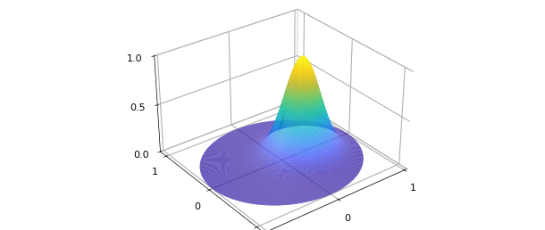

The same Gaussian written directly in polar form constructs the
identical object:

```python
f = Diskfun.from_function(
    lambda t, r: jnp.exp(-10 * ((r * jnp.cos(t) - 0.3)**2
                                 + (r * jnp.sin(t))**2)))
# norm(f - g) => 0
```

Printing a diskfun reports its numerical rank and vertical scale:

```python
print(f)
# Diskfun object
#   domain        rank    vertical scale
#  unit disk       19            1
```

Evaluation takes polar arguments:

```python
import numpy as np
print(f(jnp.pi / 4, 0.5))   # f at theta=pi/4, r=1/2
# 0.278404647671088
```

Univariate slices are easy to extract — here, angular slices at three
fixed radii:

```python
theta_vals = jnp.linspace(-jnp.pi, jnp.pi, 200)
for rho in [0.25, 1./3., 0.5]:
    vals = f(theta_vals, jnp.full_like(theta_vals, rho))
    # plot vals vs theta_vals
```

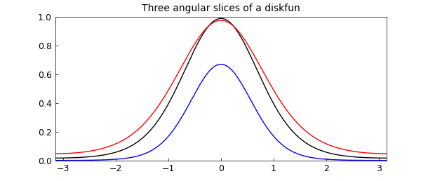

Cartesian interpretations are preferred where they make sense: the
diagonal slice $f(x,x)$ corresponds to the ray $\theta = \pi/4$ (and
its opposite) with $r = |x|\sqrt 2$:

```python
x_vals = jnp.linspace(-1./jnp.sqrt(2), 1./jnp.sqrt(2), 200)
r_vals = jnp.abs(x_vals) * jnp.sqrt(2.)
theta_vals = jnp.where(x_vals >= 0, jnp.pi/4, jnp.pi/4 + jnp.pi)
diag = f(theta_vals, jnp.clip(r_vals, 0, 1))
# plot(diag)
```

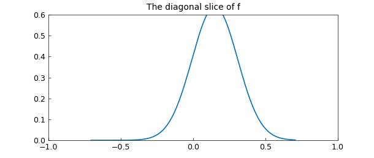

```python
trace_f = float(jnp.trapezoid(diag, x_vals))
print(trace_f)
# 0.357313890819409
```

## 16.2 Basic operations

Diskfuns combine algebraically like any other chebfunjax objects.
Two ingredients:

```python
g = Diskfun.from_function(
    lambda th, r: -40 * (jnp.cos(((jnp.sin(jnp.pi * r) * jnp.cos(th)
        + jnp.sin(2 * jnp.pi * r) * jnp.sin(th)) / 4))) + 39.5)

f = Diskfun.from_function(
    lambda th, r: jnp.cos(15 * ((r * jnp.cos(th) - 0.2)**2
        + (r * jnp.sin(th) - 0.2)**2))
        * jnp.exp(-(r * jnp.cos(th) - 0.2)**2
                   - (r * jnp.sin(th) - 0.2)**2))
```

and their sum, difference, and product:

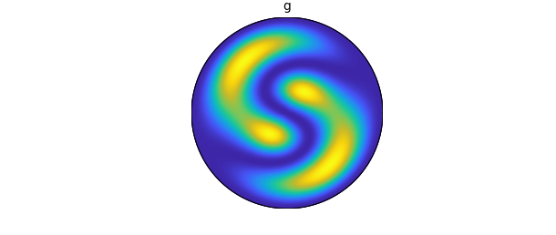

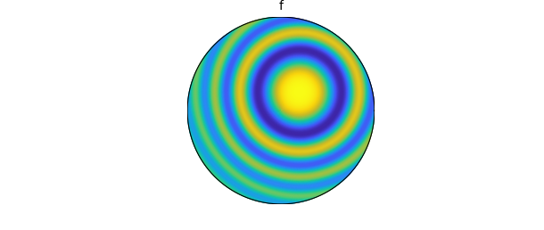

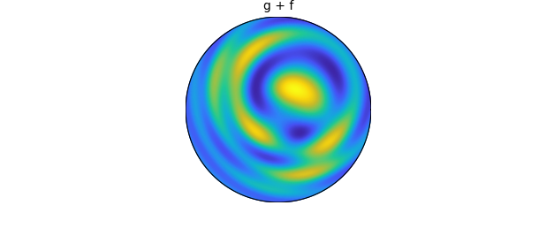

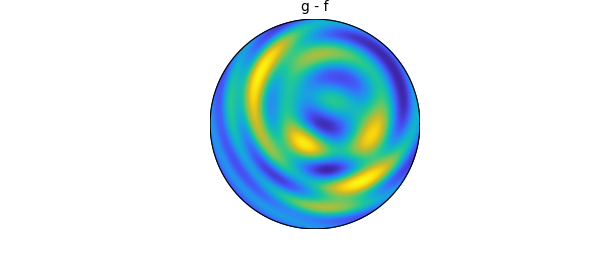

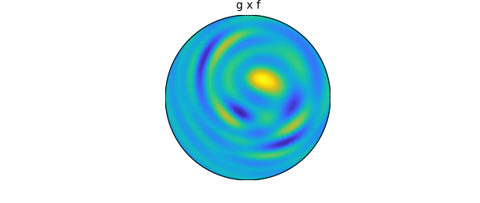

Global optimization over the disk locates extrema to high accuracy —
this $f$ peaks at $(0.2, 0.2)$:

```python
# The maximum of f is at (x, y) = (0.2, 0.2)
val = 0.999999999999999
loc = (0.200000005872459, 0.200000000131672)
```

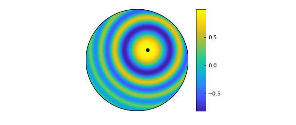

Contour plots (zero contours in black):

```python
# contour(g) with zero contours in black
```

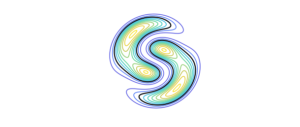

Zero curves can also be extracted explicitly with `roots`, returned —
as in Chebfun2 — as complex-valued chebfun curves:

```python
# r = roots(g)
# plot(g), hold on, plot(r, 'k')
```

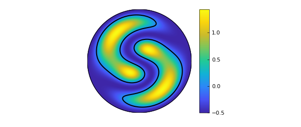

Integration over the disk is `sum`. For
$g(x,y) = -x^2 - 3xy - (y-1)^2$ the exact integral is $-3\pi/2$:

```python
f_int = Diskfun.from_function(
    lambda th, r: -(r * jnp.cos(th))**2
        - 3 * r * jnp.cos(th) * r * jnp.sin(th)
        - (r * jnp.sin(th) - 1)**2)
intf = float(f_int.sum())
tru = -3 * np.pi / 2
print(f"intf = {intf}")
print(f"tru  = {tru}")
# intf = -4.712388980384690
# tru  = -4.712388980384690
```

Differentiation is with respect to $x$ and $y$ only: radial derivatives
of perfectly smooth functions (e.g. $\rho\sin\theta$) can be singular
at the origin, so Cartesian partials are the meaningful ones on the
disk.

A classical test: the harmonic conjugates $u = \rho^3\cos 3\theta$ and
$v = \rho^3\sin 3\theta$ satisfy the Cauchy-Riemann equations and are
both harmonic, so their contour lines cross at right angles:

```python
u = Diskfun.from_function(lambda t, r: r**3 * jnp.cos(3 * t))
v = Diskfun.from_function(lambda t, r: r**3 * jnp.sin(3 * t))

# Check Cauchy-Riemann: u_y = -v_x, u_x = v_y
# Check Laplacian: lap(u) = 0, lap(v) = 0
```

```python
# contour(u, 20, 'b'), contour(v, 20, 'm')
```

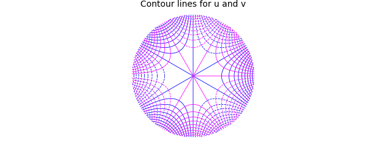

The cylindrical harmonics — eigenfunctions of the Laplacian on the
disk — play the role that spherical harmonics play on the sphere.
Here is $u = J_4(\omega_{41}\rho)\cos 4\theta$, built from the Bessel
function $J_4$ and its first positive root $\omega_{41}$
(cf. [Churchill & Brown, 1978]):

```python
from scipy.special import jn_zeros, jv

w41 = jn_zeros(4, 1)[0]
u = Diskfun.from_function(
    lambda th, r: jv(4, w41 * r) * jnp.cos(4 * th))
# plot(u)
```

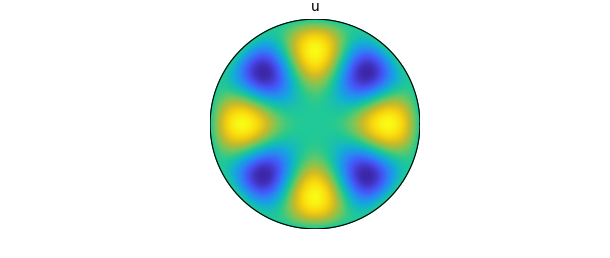

Its first partial derivatives (note that by symmetry $u_x$ is $u_y$
rotated by $-\pi/2$):

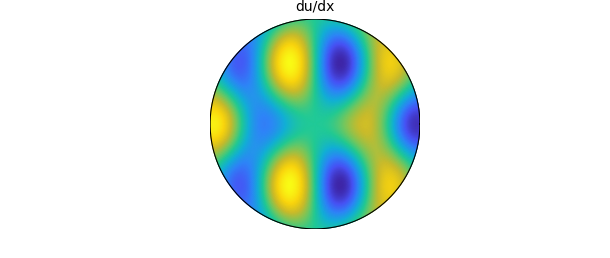

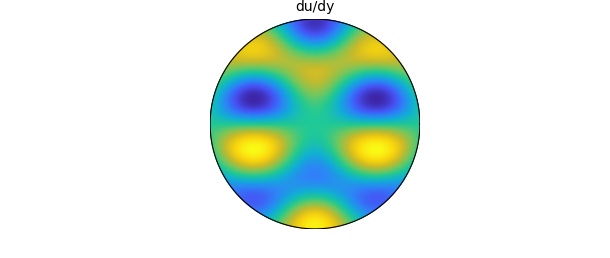

And since $u$ is an eigenfunction, $\nabla^2 u = -\lambda u$ with
$\sqrt\lambda = \omega_{41} = 7.58834243450380$:

```python
lam = 7.58834243450380**2
# norm(-lam * u - lap(u))
# ans = 5.718384796184924e-13
```

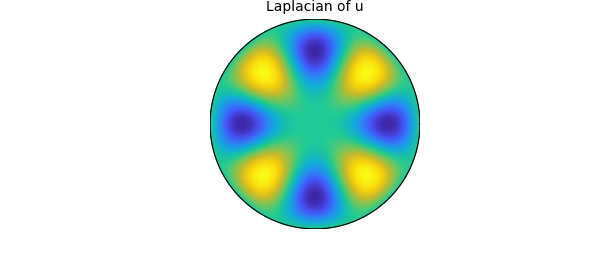

## 16.3 Poisson equation

Diskfun's fast Poisson solver computes smooth solutions of
$\nabla^2 v = f$ with Dirichlet data, here $v(\theta,1) = 1$ with an
oscillatory right-hand side:

```python
f_rhs = lambda t, r: jnp.sin(
    21 * jnp.pi * (1 + jnp.cos(jnp.pi * r))
    * (r**2 - 2 * r**5 * jnp.cos(5 * (t - 0.11))))
rhs = Diskfun.from_function(f_rhs)
# v = diskfun.poisson(f_rhs, bc, 256)
```

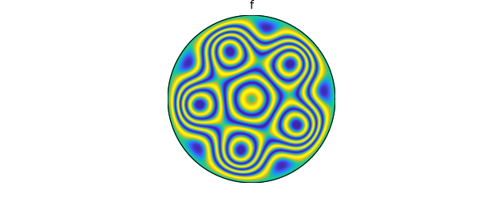

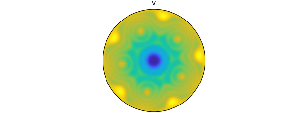

The solution is an ordinary diskfun — it can be plotted, evaluated,
differentiated, or fed back into further computations.

## 16.4 Vector calculus

Diskfunv is the disk-valued sibling of Chebfun2v: vector fields with
two diskfun components and the usual vector-calculus verbs (`grad`,
`div`, `curl`, `dot`, `cross`, `laplacian`, ...).

The gradient of a difference of Gaussians:

```python
from chebfunjax.diskfun import Diskfunv

psi = Diskfun.from_function(
    lambda th, r: 5 * jnp.exp(-10 * (r * jnp.cos(th) + 0.2)**2
                               - 10 * (r * jnp.sin(th) + 0.4)**2)
    - 5 * jnp.exp(-10 * (r * jnp.cos(th) - 0.2)**2
                   - 10 * (r * jnp.sin(th) - 0.2)**2)
    + 5 * (1 - r**2) - 20)
# u = grad(psi)
```

The components are ordered along the unit vectors of $x$ and $y$; a
quiver plot shows the field:

```python
# plot(psi), quiver(u, 'k')
```

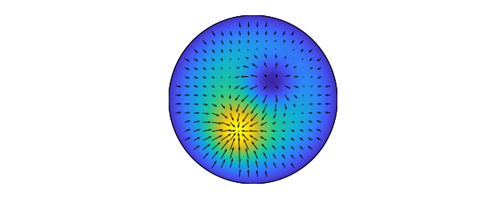

The divergence of the gradient field, contoured over the quiver:

```python
# D = div(u)
# contour(D, 10), quiver(u, 'k')
```

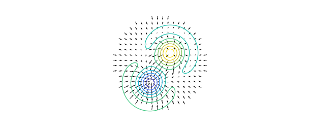

Two identities close the loop: $\nabla\cdot\nabla\psi = \nabla^2\psi$,
and the curl of a gradient vanishes:

```python
# norm(div(u) - lap(f))
# ans = 0
```

```python
# v = curl(u)
# norm(v)
# ans = 1.581462823700134e-11
```

A diskfunv can also be assembled from components directly. The surface
curl of a scalar $g$, $\nabla\times[0,0,g]$, is $(g_y, -g_x)$:

```python
g = Diskfun.from_function(
    lambda th, r: jnp.cosh(0.25 * (jnp.cos(5 * r * jnp.cos(th))
        + jnp.sin(4 * (r * jnp.sin(th))**2))) - 2)
# dgx = diffx(g); dgy = diffy(g)
# v = Diskfunv(dgy, -dgx)
```

```python
# plot(g), quiver(v, 'w')
```

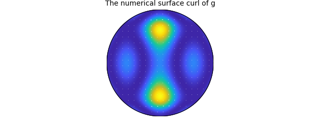

which agrees with the built-in `curl` of the scalar:

```python
# norm(v - curl(g))
# ans = 0
```

## 16.5 Constructing a diskfun

Under the hood, Diskfun mirrors Chebfun2's adaptive Gaussian
elimination, applied to a doubled version of the function: $\rho$ is
extended from $[0,1]$ to $[-1,1]$ (the disk analogue of the double
Fourier sphere method, Chapter 17; see [Fornberg, 1998],
[Trefethen, 2000]). The doubled function carries a
block-mirror-centrosymmetric (BMC) structure, and GE steps that
preserve that structure guarantee smoothness at the origin
([Wilber, Townsend & Wright, 2016b]).

Here is a function and its BMC-structured doubled version:

```python
f = Diskfun.from_function(
    lambda th, r: jnp.cos(2 * (3 * jnp.sin(2 * r * jnp.cos(th))
        + 5 * jnp.sin(r * jnp.sin(th))))
        - 0.5 * jnp.sin(r * jnp.cos(th) - r * jnp.sin(th)))
# plot(f)
```

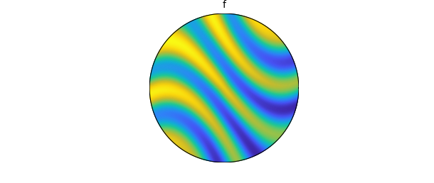

```python
# tf = cart2pol(f, 'cdr')
# plot(tf), view(2)
```

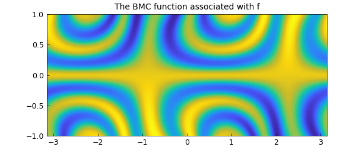

GE selects circular slices (trigfuns in $\theta$, Chapter 11) and
radial slices (chebfuns in $\rho$), yielding the low-rank form

$$f(\theta, \rho) \approx \sum_{j=1}^{n} d_j c_j(\rho) r_j(\theta),$$

with GE pivot values $d_j$. Plotting the "skeleton" of selected slices
against the full tensor grid shows the compression at work — and how
the low-rank sampling sidesteps the clustering of tensor-grid points
near the center and rim:

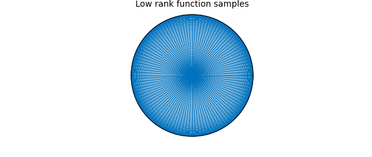

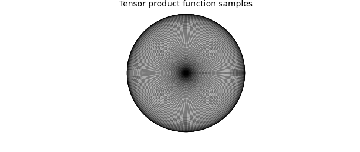

The column (radial) and row (circular) slices can be inspected
directly; each column is even or odd and each row is $\pi$-periodic or
$\pi$-antiperiodic — the BMC structure made visible:

```python
# plot(f.cols[:, 3:7])
# plot(f.rows[:, 3:7])
```

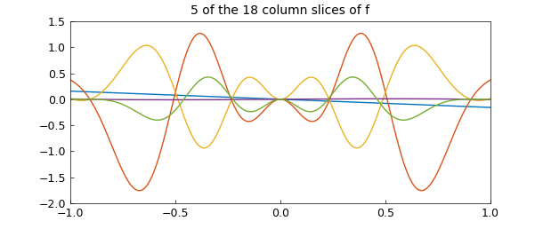

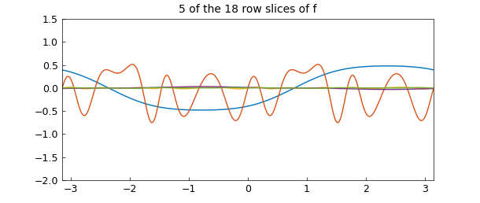

The representation is a Chebyshev-Fourier bivariate series (among the
basis options surveyed in [Boyd & Yu, 2011]), and `plotcoeffs` shows
both coefficient directions:

```python
# plotcoeffs(f)
```

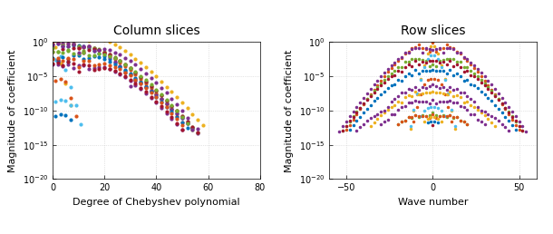

## References

[Boyd & Yu, 2011] J.P. Boyd, and F. Yu, Comparing seven spectral methods for interpolation and for solving the Poisson equation in a disk: Zernike polynomials, Logan & Shepp ridge polynomials, Chebyshev & Fourier series, cylindrical Robert functions, Bessel & Fourier expansions, square-to-disk conformal mapping and radial basis functions, *J. Comp. Physics*, 230.4 (2011), pp. 1408-1438.

[Churchill & Brown, 1978] R.V. Churchill, and J.W. Brown, *Fourier Series and Boundary Value Problems*, McGraw-Hill, 1978.

[Fornberg 1998] B. Fornberg, *A Practical Guide to Pseudospectral Methods*, Cambridge University Press, 1998.

[Townsend, Wilber & Wright, 2016] A. Townsend, H. Wilber, and G.B. Wright, Computing with functions in spherical and polar geometries I. The sphere, *SIAM J. Sci. Comp.*, 38-4 (2016), C403-C425.

[Wilber, Townsend & Wright, 2016b] A. Townsend, H. Wilber, and G.B. Wright, Computing with functions in spherical and polar geometries II. The disk, *SIAM J. Sci. Comput.*, 39-3 (2017), C238-C262.

[Trefethen, 2000] L. N. Trefethen, *Spectral Methods in MATLAB*, SIAM, 2000.
