# Chapter 17: Spherefun

*Based on [Chebfun Guide Chapter 17](https://www.chebfun.org/docs/guide/guide17.html) by Alex Townsend, Heather Wilber, and Grady Wright.*

## 17.1 Introduction

Spherefun is the part of chebfunjax for computing with functions on the surface of the unit sphere. A `Spherefun` is constructed from a function of Cartesian variables $(x, y, z)$ restricted to the sphere:

```python
import jax.numpy as jnp
from chebfunjax.spherefun import Spherefun

def sf(fn3):
    return Spherefun.from_function(
        lambda l, t: fn3(jnp.cos(l) * jnp.sin(t),
                         jnp.sin(l) * jnp.sin(t), jnp.cos(t)))

f = sf(lambda x, y, z: 1.0 / (1 + (x + 1/jnp.sqrt(2.0))**2 + z**2))
f.plot()
```

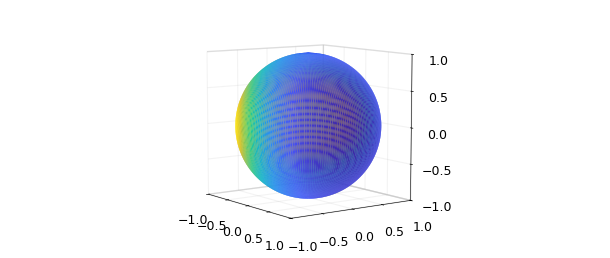

The same function can be given directly in spherical coordinates $(\lambda, \theta)$ — longitude $\lambda\in[-\pi,\pi]$ and colatitude $\theta\in[0,\pi]$, with $x=\cos\lambda\sin\theta$, $y=\sin\lambda\sin\theta$, $z=\cos\theta$:

```python
g = Spherefun.from_function(
    lambda lam, th: 1.0 / (1 + (jnp.cos(lam)*jnp.sin(th) + 1/jnp.sqrt(2.0))**2
                           + jnp.cos(th)**2))
(f - g).norm()   # 0
f.rank           # 21, as in MATLAB's display
```

Evaluation works in either coordinate system, and restricting one variable gives a periodic 1-D chebfun. The equatorial slice `f(:, pi/2)`:

```python
feq = f.slice_theta(jnp.pi / 2)
```

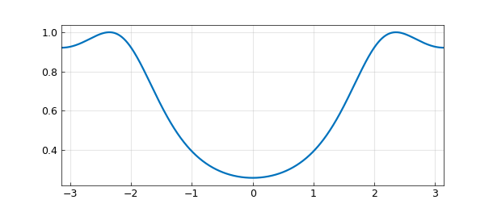

and the slice through $z = 0.25$:

```python
fz = f.slice_z(0.25)
```

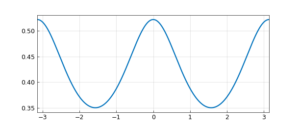

## 17.2 Basic operations

Integration (`sum2`), means, and global optima are spectrally accurate. For a polynomial with $\iint f\,dS = 216\pi/35$:

```python
f = sf(lambda x, y, z: 1 + x + y**2 + x**2*y + x**4 + y**5 + (x*y*z)**2)
f.sum2()                          # 19.388114662154155
abs(f.sum2() - 216*jnp.pi/35)     # 3.6e-15
f.mean2()                         # 1.542857142857143 = 54/35
```

```python
f = sf(lambda x, y, z: 2 * jnp.sinh(5 * x * y * z))
f.max2()   # 2.235548406627322 = 2 sinh(5*3^(-3/2))
f.min2()   # -2.235548406627322
```

`roots` computes zero contours; here the level set $f = 1/2$ overlaid on $f$:

```python
r = (f - 0.5).roots()
f.plot()   # + the curves r
```

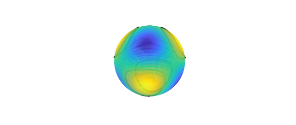

`contour` draws contour levels on the sphere:

```python
f.contour(levels=jnp.arange(-2, 2.25, 0.25))
```

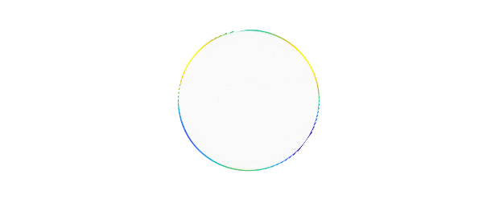

and `Spherefun.plotEarth` overlays the continents:

```python
f.contour(levels=jnp.arange(-2, 2.25, 0.25))
Spherefun.plotEarth("k-")
```

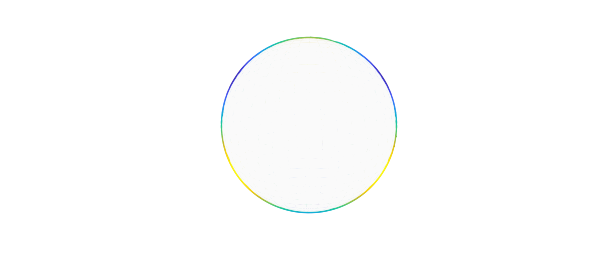

Derivatives are *tangential* (surface) derivatives. The $x$- and $z$-components of the surface gradient:

```python
f.diff(1).plot()
```

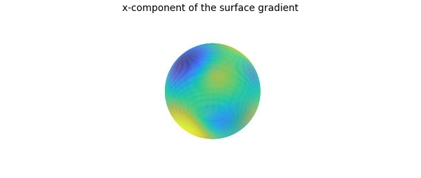

```python
f.diff(3).plot()
```

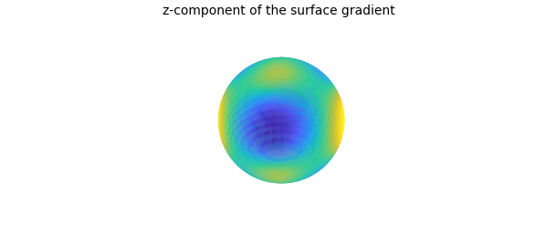

and the surface Laplacian:

```python
f.laplacian().plot()
```

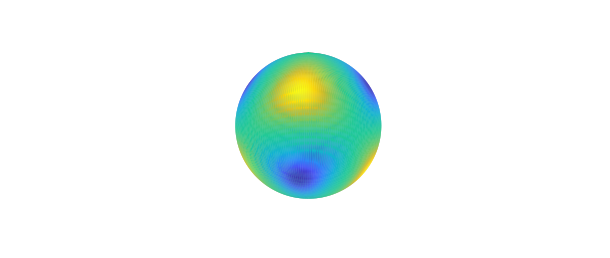

Pointwise arithmetic behaves as expected. With
$g = 2\cos(10\cos(\lambda - 0.25)\cos\lambda(\sin\theta\cos\theta)^2)$:

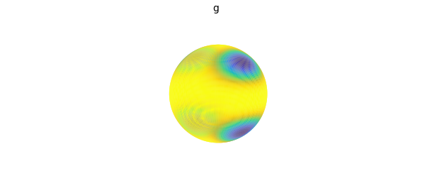

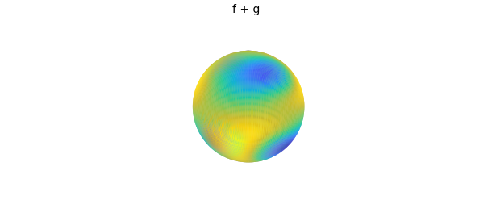


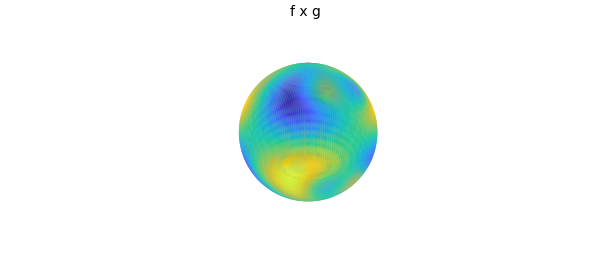

## 17.3 Low rank function approximation

Spherefun represents functions in low-rank form using a structure-preserving Gaussian elimination on the doubled sphere. For $f = \cos(\cosh(5xz) - 10y)$ (rank 39):

```python
f = sf(lambda x, y, z: jnp.cos(jnp.cosh(5*x*z) - 10*y))
f.plot()
```

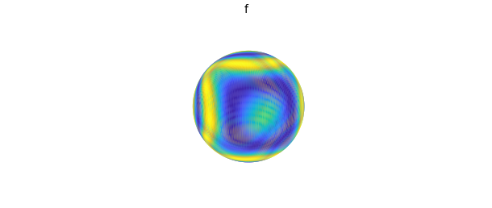

`plot(f, '.-')` shows the GE skeleton — the pivot locations and slices used in the construction:

```python
f.plot(".-")
```

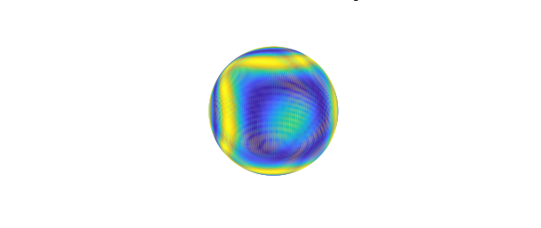

`plotcoeffs` shows the decay of the Fourier coefficients:

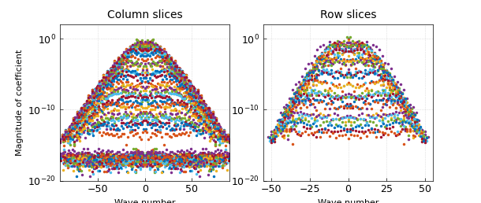

and `coeffs2` gives the full bivariate Fourier coefficient matrix:

```python
X = f.coeffs2()
```

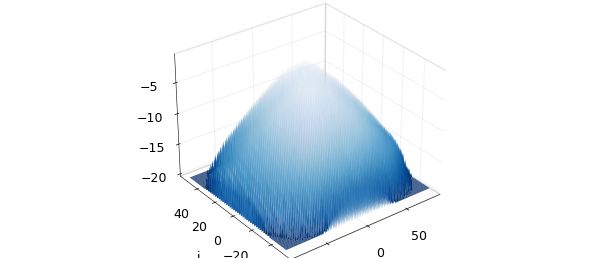

Low-rank sampling touches far fewer points than a full tensor grid:

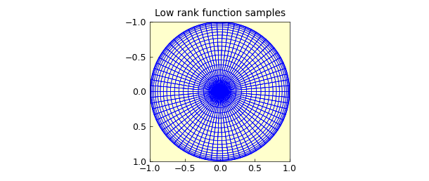

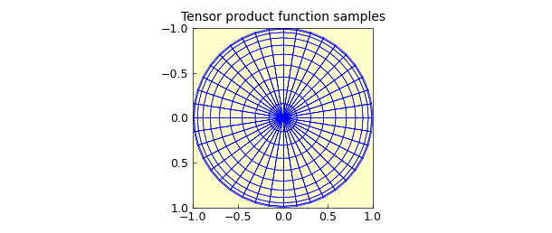

A fixed-rank approximation is obtained by capping the constructor's rank; `norm(f - f18)` is about $6.6\times 10^{-4}$:

```python
f18 = Spherefun.from_function(
    lambda l, t: jnp.cos(jnp.cosh(5*jnp.cos(l)*jnp.sin(t)*jnp.cos(t))
                         - 10*jnp.sin(l)*jnp.sin(t)), max_rank=18)
f18.plot()
```

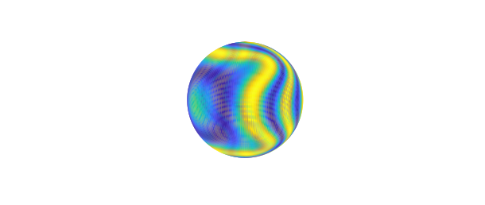

Loosening the tolerance (`tol=1e-8`, MATLAB's `'eps'` flag) similarly compresses the representation.

## 17.4 Spherical harmonics

`Spherefun.sphharm(l, m)` builds the real spherical harmonic $Y_\ell^m$, an eigenfunction of the surface Laplacian: $\Delta Y_6^{-3} = -42\,Y_6^{-3}$ exactly.

```python
Y = Spherefun.sphharm(6, -3)
(-42.0 * Y).plot()
```

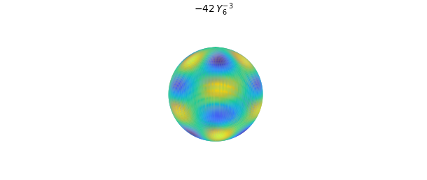

```python
Y.laplacian().plot()
(Y - (-1.0/42.0) * Y.laplacian()).norm()   # ~0
```

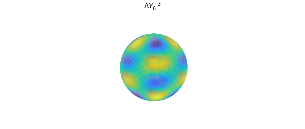

## 17.5 Poisson equation

`Spherefun.poisson` is a fast solver for $\Delta u = f$ on the sphere. With a spherical-harmonic forcing the solution is exact; here a high-frequency example on a $1000\times 1000$ grid:

```python
f = sf(lambda x, y, z: jnp.sin(100 * x * y * z))
u = Spherefun.poisson(f, 1.0, 1000, 1000)
u.plot()
```

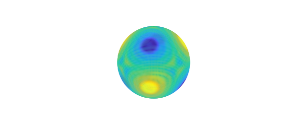

## 17.6 Filtering

`randnfunsphere` produces smooth random fields, shown here in the black-and-white `'zebra'` style:

```python
from chebfunjax.utils.random import randnfunsphere
f = randnfunsphere(0.1)
f.plot("zebra")
```

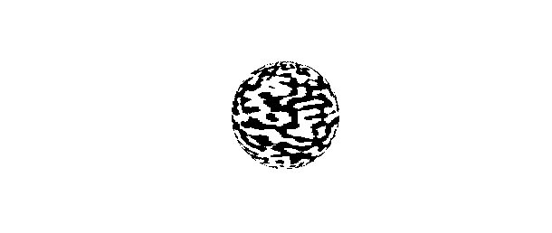

and `gaussfilt` applies Gaussian smoothing:

```python
ff = f.gaussfilt(0.05)
ff.plot("zebra")
```

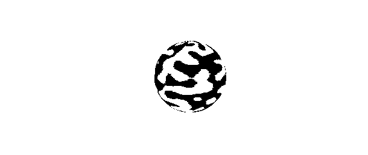

## 17.7 Vector-valued functions: Spherefunv

A `Spherefunv` holds a tangential vector field. The surface gradient of a spherical-harmonic combination, drawn over the function:

```python
f = Spherefun.sphharm(6, 0) + jnp.sqrt(14.0/11.0) * Spherefun.sphharm(6, 5)
g = f.grad()
f.plot()
g.quiver()
```

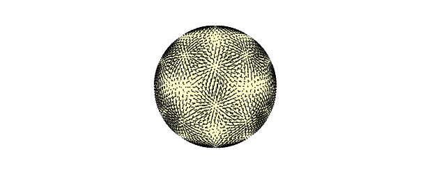

The (rotated-gradient) `curl` of a stream function gives a divergence-free field — here the Rossby–Haurwitz stream function:

```python
psi = Spherefun.from_function(
    lambda lam, th: -jnp.cos(th)
    + jnp.cos(th) * jnp.sin(th)**4 * jnp.cos(4*lam))
u = psi.curl()
psi.plot()
u.quiver()
```

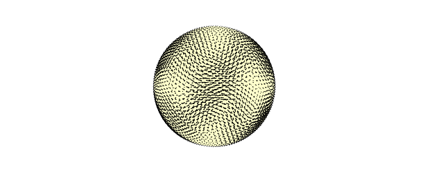

Its `vorticity` (with the velocity field overlaid); `div(u)` vanishes identically:

```python
omega = u.vorticity()
omega.plot()
u.quiver()
u.div().norm()   # ~0
```

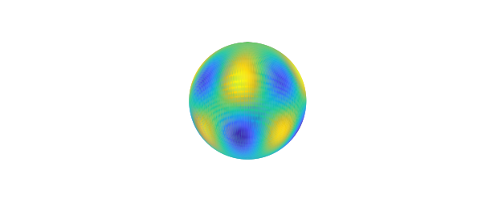

## References

- A. Townsend, H. Wilber, and G. Wright, *Computing with functions in spherical and polar geometries I. The sphere*, SIAM J. Sci. Comput. 38 (2016), C403–C425.
- Chebfun Guide, [Chapter 17: Spherefun](https://www.chebfun.org/docs/guide/guide17.html).
