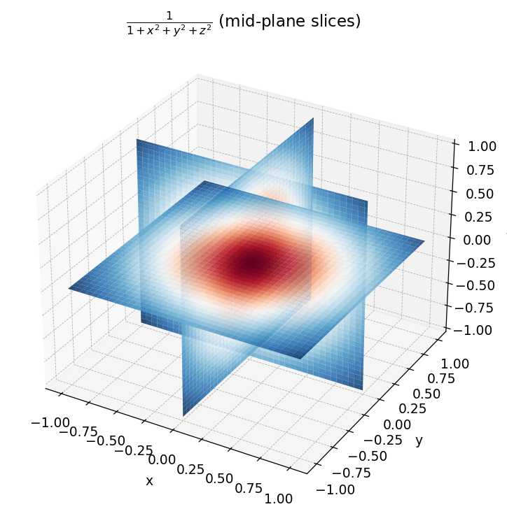
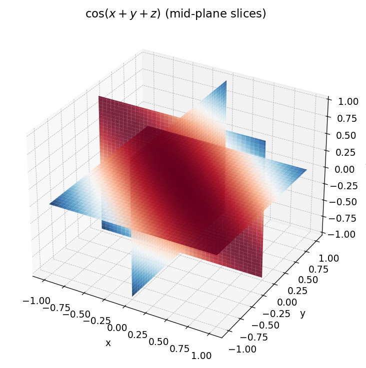
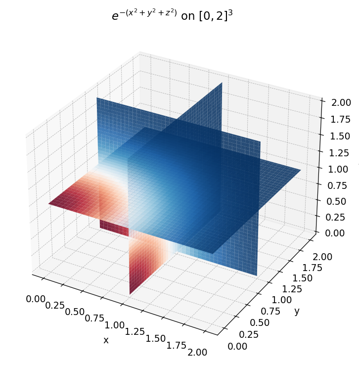
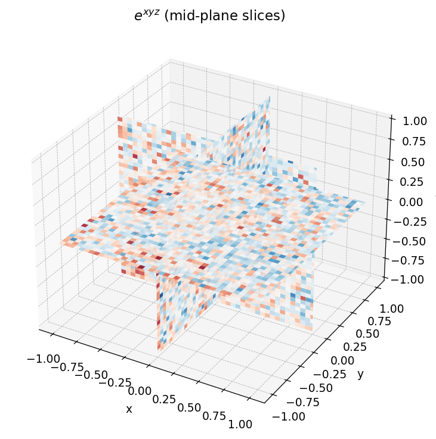
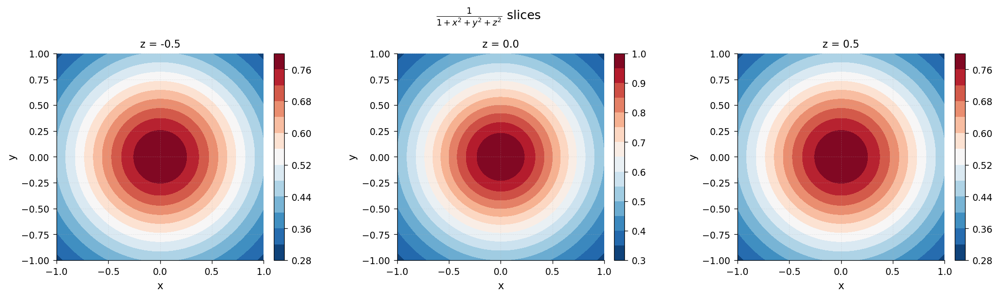

# Chapter 18: Chebfun3

*Based on [Chebfun Guide Chapter 18](https://www.chebfun.org/docs/guide/guide18.html)*

Chebfun3 extends chebfunjax to functions of three variables on cuboids. It uses a Tucker decomposition to represent $f(x, y, z)$ as a compressed tensor product of univariate Chebyshev functions.

## 18.1 Introduction

A `Chebfun3` represents a smooth trivariate function $f(x, y, z)$ on a cuboid $[x_a, x_b] \times [y_a, y_b] \times [z_a, z_b]$. The default domain is $[-1, 1]^3$.

```python
import jax.numpy as jnp
from chebfunjax.chebfun3d import Chebfun3, chebfun3

# The 3D Runge function
f = chebfun3(lambda x, y, z: 1.0 / (1.0 + x**2 + y**2 + z**2))
print(f)  # Chebfun3(rank=(rx, ry, rz), domain=...)
```




### Evaluation

A `Chebfun3` is callable at point(s) $(x, y, z)$:

```python
# Scalar evaluation
val = f(0.0, 0.0, 0.0)
print(val)  # 1.0

# Array evaluation
xs = jnp.array([0.0, 0.5, 1.0])
ys = jnp.array([0.0, 0.5, 1.0])
zs = jnp.array([0.0, 0.5, 1.0])
print(f(xs, ys, zs))
```




Evaluation is JIT-compiled, vmap-safe, and grad-safe. You can differentiate through a `Chebfun3` using JAX's automatic differentiation.

### Triple integral

The `sum3()` method computes the triple integral over the domain:

$$\texttt{f.sum3()} = \int_{x_a}^{x_b} \int_{y_a}^{y_b} \int_{z_a}^{z_b} f(x, y, z)\, dz\, dy\, dx$$

```python
# Integral of 1/(1+x^2+y^2+z^2) over [-1,1]^3
print(f.sum3())
```




## 18.2 Tucker Decomposition

The `Chebfun3` representation uses the Tucker format:

$$f(x, y, z) \approx \sum_{i,j,k} \text{core}[i,j,k]\, X_i(x)\, Y_j(y)\, Z_k(z)$$

where:
- $X_i(x)$ are column functions (Chebtech2 on $[-1, 1]$, mapped to $[x_a, x_b]$)
- $Y_j(y)$ are row functions (Chebtech2 on $[-1, 1]$, mapped to $[y_a, y_b]$)
- $Z_k(z)$ are tube functions (Chebtech2 on $[-1, 1]$, mapped to $[z_a, z_b]$)
- `core` is a 3D tensor of shape $(r_x, r_y, r_z)$

The Tucker rank is a 3-tuple $(r_x, r_y, r_z)$:

```python
print(f.rank)  # e.g. (5, 5, 5)
```




The internal components are accessible:

```python
print(f"Number of column functions: {len(f.cols)}")
print(f"Number of row functions: {len(f.rows)}")
print(f"Number of tube functions: {len(f.tubes)}")
print(f"Core tensor shape: {f.core.shape}")
```




## 18.3 Construction Algorithm

The `Chebfun3` constructor uses the Chebfun3f algorithm, a three-phase Tucker construction:

**Phase 1 -- Fiber index selection**: On a coarse Chebyshev tensor grid, alternating Adaptive Cross Approximation (ACA) is applied to the mode-1, mode-2, and mode-3 unfoldings of the evaluation tensor. This identifies the important fiber indices (skeleton rows, columns, tubes).

**Phase 2 -- Adaptive resolution**: The fiber samples are refined by increasing the 1D grid size until the Chebyshev coefficients decay below tolerance. Each mode is resolved independently.

**Phase 3 -- Factor construction**: QR factorizations of the fiber matrices are computed, DEIM (Discrete Empirical Interpolation Method) selects interpolation points, and the Tucker core is assembled.

```python
# Control the tolerance
f_coarse = chebfun3(lambda x, y, z: jnp.cos(x + y + z), tol=1e-8)
f_fine = chebfun3(lambda x, y, z: jnp.cos(x + y + z))

print(f"Coarse rank: {f_coarse.rank}")
print(f"Fine rank:   {f_fine.rank}")
```

## 18.4 Custom Domains

Specify a 6-tuple `(xa, xb, ya, yb, za, zb)` to use a non-default domain:

```python
g = chebfun3(lambda x, y, z: jnp.exp(-(x**2 + y**2 + z**2)),
             domain=(0.0, 2.0, 0.0, 2.0, 0.0, 2.0))
print(g)
```

## 18.5 Triple Integration Details

The triple integral uses the Tucker structure efficiently:

$$\int\!\!\!\int\!\!\!\int f\, dx\, dy\, dz = \sum_{i,j,k} \text{core}[i,j,k] \left(\int X_i\, dx\right) \left(\int Y_j\, dy\right) \left(\int Z_k\, dz\right)$$

This is computed via an `einsum` contraction:

$$I = \texttt{einsum}(\text{'ijk,i,j,k->'}, \text{core}, \text{ix}, \text{iy}, \text{iz}) \cdot s_x s_y s_z$$

where $s_x = (x_b - x_a)/2$ etc. are the physical-to-reference scale factors and $\text{ix}[i] = \int_{-1}^{1} X_i(t)\, dt$.

## 18.6 Chebfun3T: Tensor Product Variant

The `Chebfun3T` class provides an alternative representation without Tucker compression. It directly wraps the raw factor matrices and core tensor:

```python
from chebfunjax.chebfun3d import Chebfun3T, chebfun3t

# Construct from a Chebfun3
f = chebfun3(lambda x, y, z: jnp.cos(x + y + z))
ft = Chebfun3T.from_chebfun3(f)
print(ft)

# Or construct directly
ft2 = chebfun3t(lambda x, y, z: jnp.cos(x + y + z))
```

`Chebfun3T` supports evaluation and `sum3()` with the same interface as `Chebfun3`, plus convenience methods for inspecting the coefficient arrays:

```python
print(ft.rank)          # Tucker rank (rx, ry, rz)
print(ft.col_coeffs())  # list of Chebyshev coefficient arrays for X_i
print(ft.row_coeffs())  # for Y_j
print(ft.tube_coeffs()) # for Z_k
```

## 18.7 Vector-Valued Functions: Chebfun3v

The `Chebfun3v` class represents 3-component vector fields $\mathbf{F}(x,y,z) = (f, g, h)$:

```python
from chebfunjax.chebfun3d.chebfun3v import Chebfun3v

F = Chebfun3v.from_functions(
    lambda x, y, z: jnp.sin(x),
    lambda x, y, z: jnp.cos(y),
    lambda x, y, z: jnp.exp(z),
)
print(F)

# Evaluate
vals = F(0.5, 0.3, 0.1)  # shape (3,) array
```

`Chebfun3v` supports:
- **Dot product**: `F.dot(G)` returns a `Chebfun3` (scalar field)
- **Cross product**: `F.cross(G)` returns a `Chebfun3v`
- **Norm**: `F.norm()` returns a `Chebfun3` (pointwise magnitude)
- **Arithmetic**: `F + G`, `F - G`, `c * F`, `-F`

### Gradient theorem in 3D

For a gradient field $\mathbf{F} = \nabla \phi$, the line integral depends only on the endpoints. We can build gradient fields using `Chebfun3v`:

```python
# phi(x, y, z) = x^2 + y^2 + z^2
# grad(phi) = (2x, 2y, 2z)
grad_phi = Chebfun3v.from_functions(
    lambda x, y, z: 2 * x,
    lambda x, y, z: 2 * y,
    lambda x, y, z: 2 * z,
)
```

## 18.8 Accuracy Control

The tolerance can be adjusted at construction time:

```python
# Full machine precision (default)
f1 = chebfun3(lambda x, y, z: jnp.exp(x * y * z))
print(f"Rank at eps: {f1.rank}")

# Relaxed tolerance
f2 = chebfun3(lambda x, y, z: jnp.exp(x * y * z), tol=1e-8)
print(f"Rank at 1e-8: {f2.rank}")
```

Lower tolerance typically yields smaller Tucker ranks and faster construction.

## 18.9 JIT and GPU Acceleration

Like `Chebfun2`, construction is NOT JIT-safe (Python adaptive loops), but evaluation IS JIT-safe:

```python
import jax

f = chebfun3(lambda x, y, z: jnp.cos(x + y + z))

# JIT-compiled evaluation
f_jit = jax.jit(f)
print(f_jit(0.5, 0.3, 0.1))

# Gradient via AD
grad_f = jax.grad(lambda x: f(x, 0.5, 0.3))
print(grad_f(0.0))  # -sin(0.8)
```

## 18.10 References

1. B. Hashemi and L. N. Trefethen, "Chebfun in three dimensions", *SIAM J. Sci. Comput.*, 39(5), C341--C363, 2017.

2. S. Dolgov, D. Kressner, and C. Stroessner, "Functional Tucker approximation using Chebyshev interpolation", *SIAM J. Sci. Comput.*, 43(3), A2190--A2210, 2021.

3. L. De Lathauwer, B. De Moor, and J. Vandewalle, "A multilinear singular value decomposition", *SIAM J. Matrix Anal. Appl.*, 21(4), 1253--1278, 2000.