# Chapter 18: Chebfun3

*Based on [Chebfun Guide Chapter 18](https://www.chebfun.org/docs/guide/guide18.html) by Behnam Hashemi and Nick Trefethen.*

## 18.1 Introduction

A `Chebfun3` represents a smooth function on a 3D box (by default $[-1,1]^3$) in low-rank Tucker form. Construction, evaluation, and integration behave as in one and two dimensions:

```python
import jax.numpy as jnp
from chebfunjax.chebfun3d.chebfun3 import Chebfun3

f = Chebfun3.from_function(lambda x, y, z: 1.0 / (1 + x**2 + y**2 + z**2))
f(0.0, 0.5, 0.5)   # 0.666666666666666
f.sum3()           # 4.286854062301838
f.mean3()          # 0.535856757787730
f.max3()           # 1.000000000000000
```

`slice` shows orthogonal cross-sections:

```python
f.slice()
```

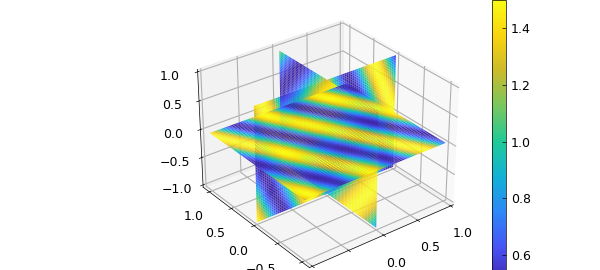

and `isosurface` renders level surfaces:

```python
f.isosurface()
```

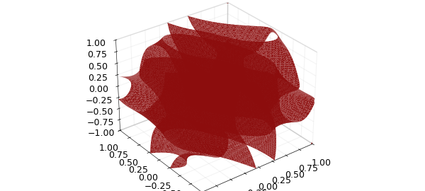

## 18.2 Anatomy of a chebfun3

The representation is a Tucker decomposition: a small `core` tensor multiplied along each dimension by quasimatrices of 1D chebfuns (`cols`, `rows`, `tubes`). For the function above the trilinear rank is $(10, 10, 10)$ and the lengths are $(43, 43, 43)$. A univariate function like $e^x$ has rank $(1,1,1)$:

```python
f = Chebfun3.from_function(lambda x, y, z: jnp.exp(x))
f.length()   # (15, 1, 1)
```

Coefficient decay in all three variables is shown by `plotcoeffs`:

```python
f = Chebfun3.from_function(
    lambda x, y, z: jnp.exp(x) * (jnp.log(2 + y) * jnp.exp(z))
    + jnp.sin(y) / 1e6)
f.plotcoeffs()
```

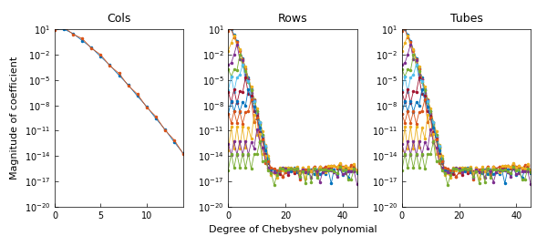

## 18.3 Computing with chebfun3 objects

Arithmetic, composition, and global optimization compose naturally:

```python
f = Chebfun3.from_function(lambda x, y, z: jnp.sin(x + y * z))
g = Chebfun3.from_function(
    lambda x, y, z: jnp.cos(15 * jnp.exp(z)) / (5 + x**3 + 2*y**2 + z))
f.max3()          # 1
g.max3()          # 0.319924161452828
(f * g).max3()    # 0.245859621598817
(f * g.exp()).sum3()   # -0.009190066018142
```

Partial integration produces lower-dimensional objects — `sum` gives a chebfun2, `sum2` a chebfun:

```python
f.sum(3).contour(levels=20, filled=True)
```

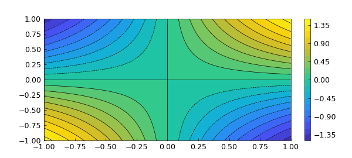

```python
(g + 2*f).exp().sum2().plot()
```

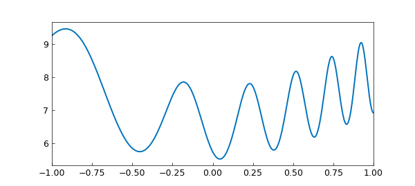

Line integrals over 3D curves use `integral` — here $\int_C (x + yz)\,ds$ over a helix, exact to 13 digits:

```python
import chebfunjax as cj
curve = [cj.chebfun(jnp.cos, domain=(0.0, 8*jnp.pi)),
         cj.chebfun(jnp.sin, domain=(0.0, 8*jnp.pi)),
         cj.chebfun(lambda t: t/(8*jnp.pi), domain=(0.0, 8*jnp.pi))]
f = Chebfun3.from_function(lambda x, y, z: x + y * z)
f.integral(curve)   # -1.000791258702030 (exact -1.000791258702039)
```

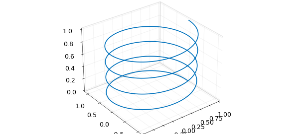

## 18.4 Getting inside a chebfun3

The factor quasimatrices are ordinary chebfuns and can be plotted directly:

```python
g.cols          # 8 column chebfuns
```

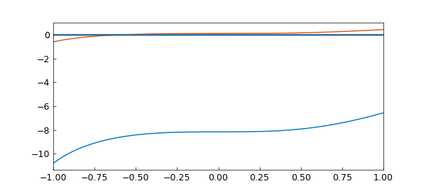

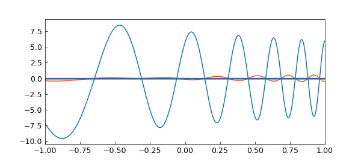

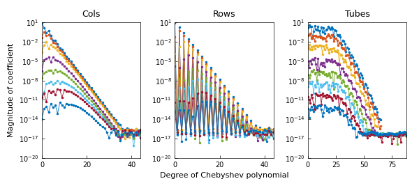

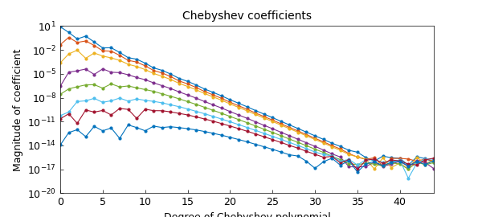

## 18.5 Periodic chebfun3 objects

With `trig=True`, periodic functions use Fourier instead of Chebyshev representations — dramatically shorter for band-limited data (lengths $(143, 5, 13)$ vs the Chebyshev $(226, 28, 49)$):

```python
ff = lambda x, y, z: (jnp.tanh(3*jnp.sin(x)) - jnp.sin(y + 0.5)**2
                      + jnp.cos(6*z))
dom = (-jnp.pi, jnp.pi, -jnp.pi, jnp.pi, -jnp.pi, jnp.pi)
f = Chebfun3.from_function(ff, domain=dom, trig=True)
f.plotcoeffs()
```

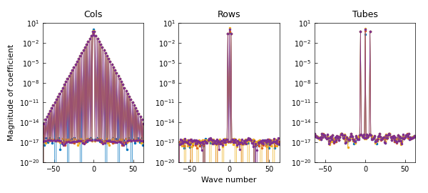

## 18.6 Derivative and Laplacian

For the harmonic function $1/\sqrt{x^2+y^2+(2-z)^2}$ the Laplacian vanishes identically, and `lap(f) == div(grad(f))`:

```python
f = Chebfun3.from_function(
    lambda x, y, z: 1.0 / jnp.sqrt(x**2 + y**2 + (2 - z)**2))
Lf = f.laplacian()
(Lf - f.grad().div()).norm()   # ~0
```

## 18.7 3D vector fields

A `Chebfun3v` holds three components. The rigid-rotation field $(-y, x, z)$:

```python
from chebfunjax.chebfun3d.chebfun3v import Chebfun3v
F = Chebfun3v.from_functions(lambda x, y, z: -y,
                             lambda x, y, z: x,
                             lambda x, y, z: z)
F.quiver3()
```

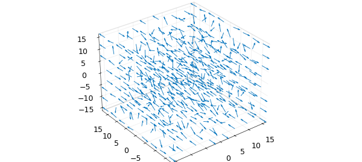

Gradient fields are conservative: the line integral over a conical spiral equals the difference of endpoint values ($-0.049398074616857$), and reduces to the straight chord between the same endpoints:

```python
f = Chebfun3.from_function(
    lambda x, y, z: jnp.sin(x + 20*y + z**2) * jnp.exp(-(3 + y**2)),
    domain=(-5*jnp.pi, 5*jnp.pi) * 3)
F = f.grad()
F.curl().norm()   # ~0
```

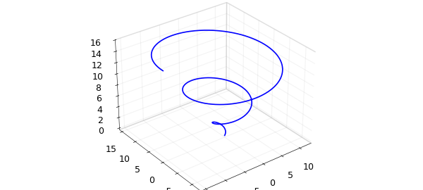

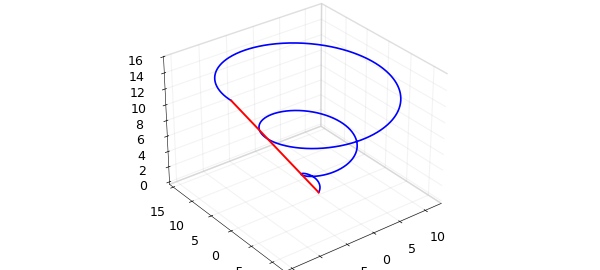

## 18.8 Higher-order SVD

`hosvd` computes the higher-order singular value decomposition: mode singular values plus an all-orthogonal core with orthonormal factors:

```python
f = Chebfun3.from_function(lambda x, y, z: jnp.sin(x + 2*y + 3*z))
sv, S_core, S_cols, S_rows, S_tubes = f.hosvd()
sv[0]   # [1.698135391441130, 1.048957901152853]
```

## 18.9 Rootfinding

`root` finds a common zero of three chebfun3 objects. The zero sets of $y - x^2$ and $z - x^3$ (two surfaces) intersect the third in isolated points:

```python
f = Chebfun3.from_function(lambda x, y, z: y - x**2)
g = Chebfun3.from_function(lambda x, y, z: z - x**3)
h = Chebfun3.from_function(
    lambda x, y, z: jnp.cos(jnp.exp(x * jnp.sin(-2 + y + z))))
f.isosurface([0.0])
g.isosurface([0.0])
```

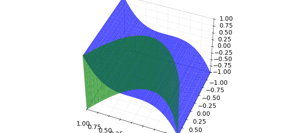

```python
r = Chebfun3.root(f, g, h)
# r = (-0.474327609954061, 0.224986681564732, -0.106717394938095)
# residuals of f, g, h at r are all ~1e-16
```

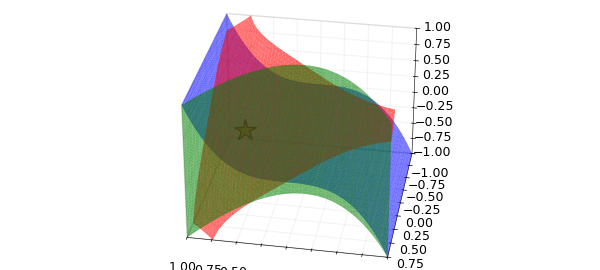

## 18.10 Changing the accuracy with chebfun3eps

Loosening the constructor tolerance trades accuracy for speed and rank — passing `tol=1e-12`, `1e-8`, ... to `from_function` mirrors MATLAB's `chebfun3eps` (rank 19 at machine precision down to rank ~5 at $10^{-4}$ for the running example).

## 18.11 Chebfun3t for pure tensor product comparisons

`Chebfun3t` is the plain (full tensor-product) counterpart used for comparisons. Low-rank wins when the function has low trilinear rank (e.g. $\sin(120(x+y+z))$, rank 2); the tensor approach can win when the rank is high (e.g. $\tanh(6(x+y+z))$, rank 89).

## 18.12 References

- B. Hashemi and L. N. Trefethen, *Chebfun in three dimensions*, SIAM J. Sci. Comput. 39 (2017), C341–C363.
- Chebfun Guide, [Chapter 18](https://www.chebfun.org/docs/guide/guide18.html).
