# Chapter 19: SPIN, SPIN2, SPIN3 and SPINSPHERE for Stiff PDEs

*Based on [Chebfun Guide Chapter 19](https://www.chebfun.org/docs/guide/guide19.html) by Hadrien Montanelli.*

## 19.1 Introduction

The `spin` family solves stiff, periodic, time-dependent PDEs
$u_t = \mathcal{L}u + \mathcal{N}(u)$ — a linear (stiff, constant-coefficient) part $\mathcal{L}$ plus a nonlinear part $\mathcal{N}$ — with Fourier spectral discretization in space and exponential integrators (ETDRK4) in time. `spin` works in 1D, `spin2`/`spin3` in 2D/3D, and `spinsphere` on the sphere.

## 19.2 Computations in 1D with spin

Well-known equations are available as presets. The KdV equation
$u_t = -u u_x - u_{xxx}$ with two-soliton initial data:

```python
from chebfunjax.spin import SpinOp, spin

S = SpinOp("kdv")
u = spin(S, 256, 1e-6)
u.plot()
```

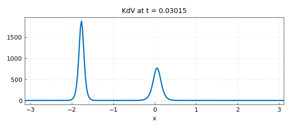

The preset carries the domain, the initial condition, and the two
operator parts (`lin`, `nonlin`). The Allen–Cahn equation
$u_t = 5\times 10^{-3}u_{xx} + u - u^3$ over its default time span:

```python
S = SpinOp("ac")
u = spin(S, 256, 1e-1)
u.plot()
```

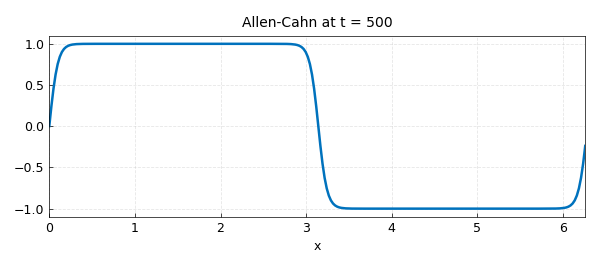

Extending the time interval to $t=100$ shows the metastable fronts:

```python
S.tspan = (0.0, 100.0)
u = spin(S, 256, 1e-1)
u.plot()
```

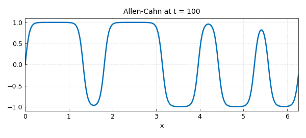

The initial condition can be replaced by any (periodic) chebfun:

```python
import jax.numpy as jnp
import chebfunjax as cj
S.init = cj.chebfun(lambda x: -1 + 4*jnp.exp(-19*(x - jnp.pi)**2),
                    domain=(0.0, 2*jnp.pi), trig=True)
u = spin(S, 256, 1e-1)
u.plot()
```

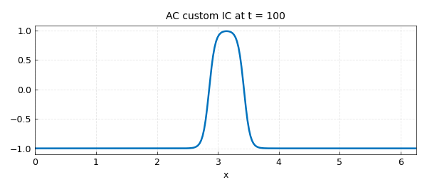

A vector `tspan` returns the solution at each of those times:

```python
S.tspan = tuple(range(0, 31))
U = spin(S, 256, 1e-1)
U[1].plot()
```

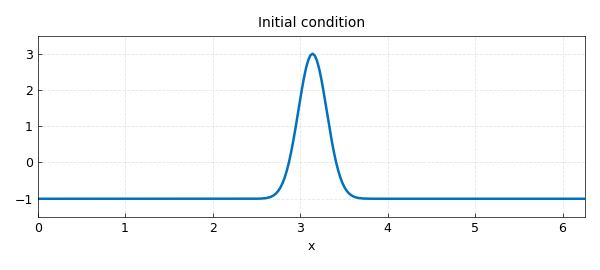

and `waterfall` shows the whole evolution:

```python
from chebfunjax.plotting import waterfall
waterfall(U)
```

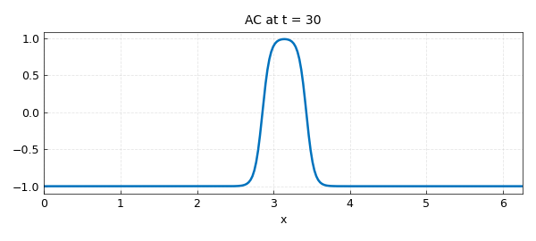

A custom operator is set up by giving the domain, time span, and the
two parts directly:

```python
S = SpinOp(domain=(0.0, 5.0), tspan=(0.0, 10.0))
S.lin = lambda u: 0.3 * u.diff(2)
S.nonlin = lambda u: u**2 - 1
S.init = cj.chebfun(jnp.cos, domain=(0.0, 5.0))
```

## 19.3 Computations in 2D and 3D with spin2 and spin3

The 2D Ginzburg–Landau equation
$u_t = \Delta u + u - (1+1.5i)u|u|^2$ develops spiral waves; four
snapshots at $t = 0, 10, 20, 30$:

```python
from chebfunjax.spin import SpinOp2, spin2

S = SpinOp2("gl")
S.tspan = (0.0, 10.0, 20.0, 30.0)
U = spin2(S, 100, 2e-1)
for u in U:
    u.real().plot()
```

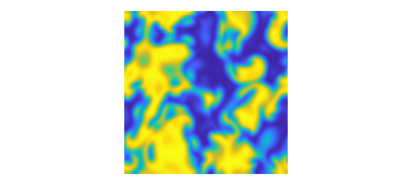

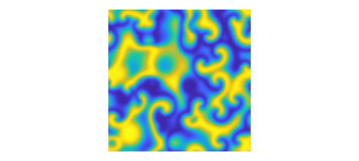

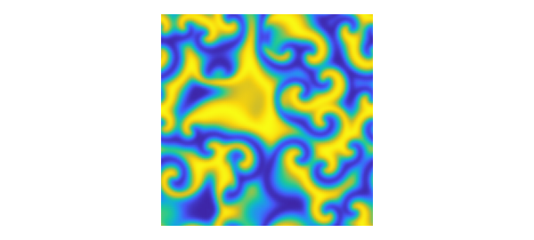

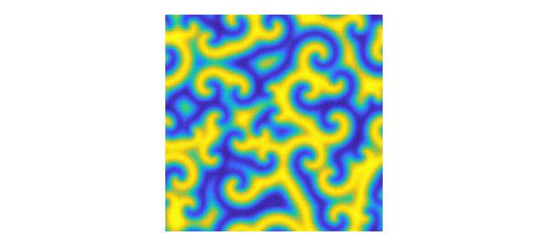

## 19.4 Computations on the sphere with spinsphere

`spinsphere` uses the double-Fourier-sphere method with implicit-explicit
time-stepping. The Allen–Cahn preset's initial condition:

```python
from chebfunjax.operators.spinopsphere import Spinopsphere, spinsphere

S = Spinopsphere("ac")
S.init.plot()
```

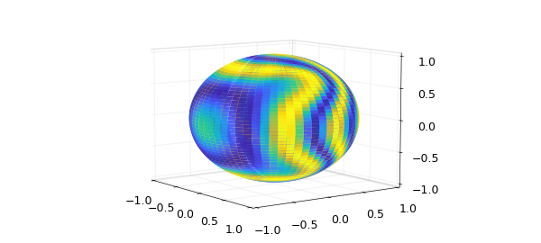

and the solution at $t = 2, 5, 10$:

```python
S.tspan = (0.0, 2.0, 5.0, 10.0)
U = spinsphere(S, 128, 1e-1)
```

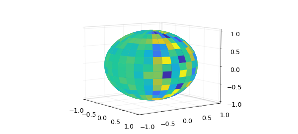

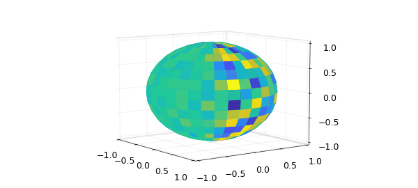

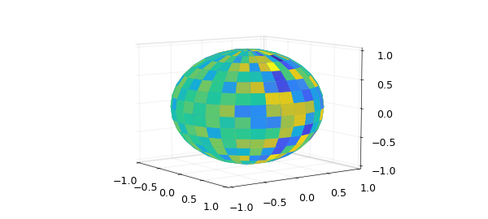

The Ginzburg–Landau equation on the sphere at $t = 0, 10, 20, 30$:

```python
S = Spinopsphere("gl")
S.tspan = (0.0, 10.0, 20.0, 30.0)
U = spinsphere(S, 128, 1e-1)
```

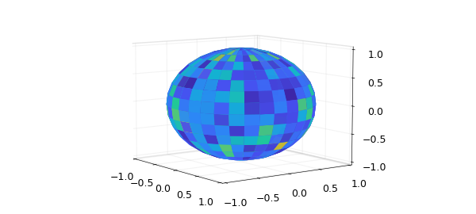

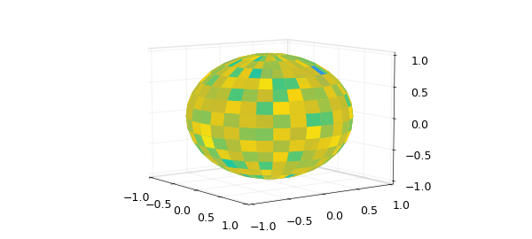

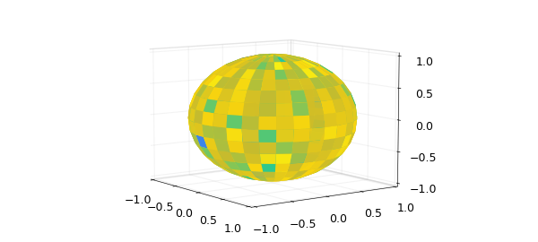

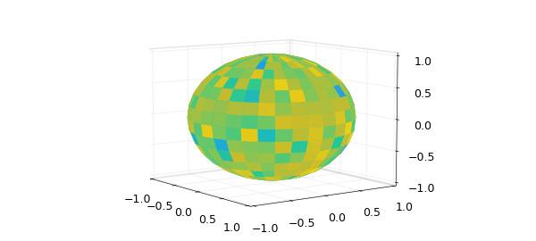

## 19.5 Managing preferences

Time-stepping options are passed as keyword arguments (MATLAB's
`spinpref` objects map to keywords):

```python
u = spin(S, 256, 1e-2)          # defaults: ETDRK4, no live plotting
u = spin2(S, 128, 1e-1)
```

Chebfun additionally offers alternative schemes (`'exprk5s8'`,
multistep starters, ...) through `spinpref`; chebfunjax's spin family
uses ETDRK4 (1D/2D/3D) and IMEX-BDF4/LIRK4 (sphere), chosen from the
linear part.

## 19.6 A quick note on history

Exponential integrators for stiff PDEs have a long history — see the
references in the Chebfun guide chapter, and Montanelli & Bootland
(2020) for the comparison study underlying `spin`'s defaults.

## References

- H. Montanelli and N. Bootland, *Solving periodic semilinear stiff PDEs in 1D, 2D and 3D with exponential integrators*, Math. Comput. Simul. 178 (2020).
- Chebfun Guide, [Chapter 19](https://www.chebfun.org/docs/guide/guide19.html).
