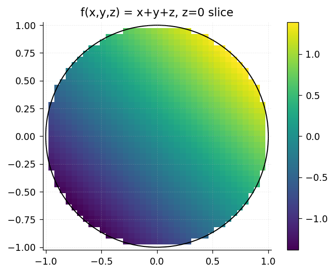
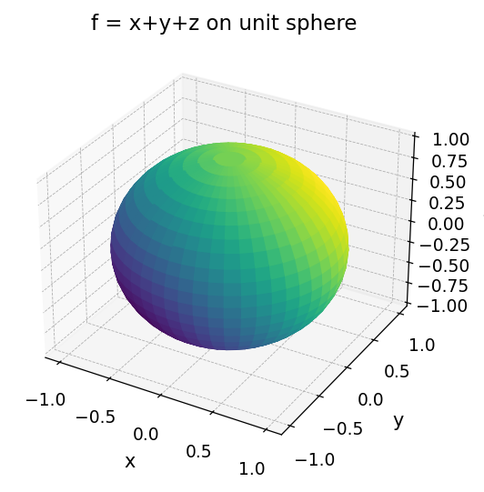
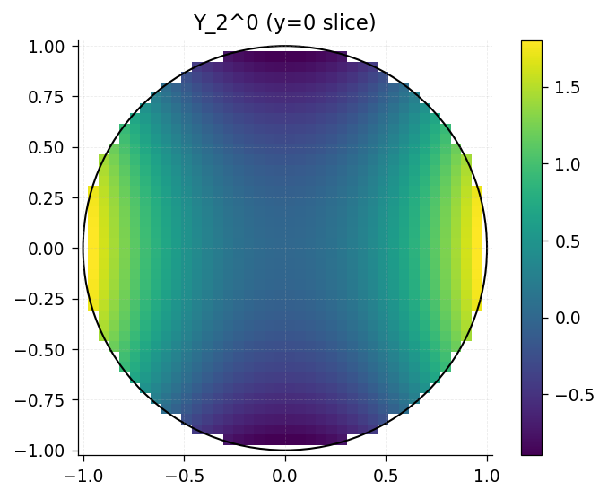

# Chapter 20: Ballfun

*Based on [Chebfun Guide Chapter 20](https://www.chebfun.org/docs/guide/guide20.html)*

Ballfun is the chebfunjax module for computing with functions on the unit ball $B = \{(x,y,z) : x^2 + y^2 + z^2 \le 1\}$. It uses a Chebyshev-Fourier-Fourier (CFF) spectral expansion with the BMC-III structure to handle the coordinate singularities at the origin and the poles.

## 20.1 Introduction

A `Ballfun` represents a smooth function on the unit ball using spherical coordinates $(r, \lambda, \theta)$:
- $r \in [0, 1]$: radial variable
- $\lambda \in [-\pi, \pi]$: azimuthal angle (longitude)
- $\theta \in [0, \pi]$: polar angle (colatitude)

The Cartesian coordinates are:
$$x = r\cos\lambda\sin\theta, \quad y = r\sin\lambda\sin\theta, \quad z = r\cos\theta$$

```python
import jax.numpy as jnp
import numpy as np
from chebfunjax.ballfun.ballfun import Ballfun

# A function in Cartesian coordinates
f = Ballfun.from_function(lambda x, y, z: x**2 + y**2 + z**2)
print(f)  # Ballfun(shape=(m, n, p), ...)
```




### Spherical coordinate input

Set `spherical=True` to pass a function of $(r, \lambda, \theta)$:

```python
g = Ballfun.from_function(
    lambda r, lam, th: r**2,
    spherical=True,
)
print(g)
```




## 20.2 The CFF Representation

Internally, `Ballfun` stores a 3D tensor of Chebyshev-Fourier-Fourier coefficients:

$$f(r, \lambda, \theta) = \sum_{j,k,l} c_{j,k,l}\, T_j(r)\, e^{ik\lambda}\, e^{il\theta}$$

The coefficient tensor `coeffs` has shape $(m, n, p)$:
- Axis 0 (size $m$, odd): Chebyshev coefficients in $r$ on the doubled-up interval $[-1, 1]$
- Axis 1 (size $n$, even): Fourier coefficients in $\lambda$
- Axis 2 (size $p$, even $\ge 4$): Fourier coefficients in $\theta$

```python
print(f"Coefficient shape: {f.shape}")
print(f"Is real-valued: {f.is_real}")
```




### BMC-III structure

The function is "doubled up" in both $r$ and $\theta$ to maintain smoothness:
- $r$ is extended from $[0, 1]$ to $[-1, 1]$ via an odd extension
- $\theta$ is extended from $[0, \pi]$ to $[-\pi, \pi]$ via an even extension

The resulting tensor has Block Mirror-Centrosymmetric (BMC-III) structure that encodes regularity conditions:
- $f(r=0, \ldots)$ is constant (no angular dependence at the origin)
- $f(\ldots, \theta=0)$ and $f(\ldots, \theta=\pi)$ are constant in $\lambda$ (poles are regular)

## 20.3 Evaluation

`Ballfun` provides two evaluation modes.

### Tensor-product evaluation: fevalm

The `fevalm` method evaluates on a tensor-product grid in spherical coordinates:

```python
# Evaluate on a grid of (r, lambda, theta) values
rs = jnp.linspace(0, 1, 10)
lams = jnp.linspace(-jnp.pi, jnp.pi, 20)
ths = jnp.linspace(0, jnp.pi, 15)

vals = f.fevalm(rs, lams, ths)  # shape (10, 20, 15)
```

### Pointwise evaluation

The `__call__` method evaluates at individual Cartesian coordinate points:

```python
# Evaluate at a single Cartesian point
val = f(0.5, 0.3, 0.1)
print(val)  # x^2 + y^2 + z^2 = 0.25 + 0.09 + 0.01 = 0.35
```

Both evaluation modes are JIT-compiled and compatible with `jax.vmap` and `jax.grad`.

## 20.4 Construction

### Adaptive construction

By default, `Ballfun.from_function` adaptively refines the grid until the spectral coefficients decay below machine precision:

```python
# Adaptive construction (default)
f = Ballfun.from_function(lambda x, y, z: jnp.exp(-(x**2 + y**2 + z**2)))
print(f"Shape: {f.shape}")
```

### Fixed-size construction

You can specify the grid size directly:

```python
# Fixed grid size
f = Ballfun.from_function(
    lambda x, y, z: x**2 + y**2,
    fixed_size=(11, 8, 8),
)
print(f"Shape: {f.shape}")  # (11, 8, 8) after parity adjustment
```

### From coefficients

You can also construct a `Ballfun` directly from CFF coefficients:

```python
# Create from known coefficients
coeffs = jnp.zeros((5, 4, 4), dtype=jnp.complex128)
coeffs = coeffs.at[0, 2, 2].set(1.0)  # a specific harmonic mode
f = Ballfun.from_coeffs(coeffs, is_real=True)
```

## 20.5 Integration

The `sum()` (or equivalently `integral()`) method computes the volume integral over the unit ball with the appropriate Jacobian:

$$\texttt{f.sum()} = \int_0^1 \int_{-\pi}^{\pi} \int_0^{\pi} f(r, \lambda, \theta)\, r^2 \sin\theta\, d\theta\, d\lambda\, dr$$

```python
# Integral of 1 over the unit ball = 4*pi/3
one = Ballfun.from_function(lambda x, y, z: jnp.ones_like(x))
print(one.sum())  # ~ 4.18879... = 4*pi/3

# Integral of r^2 = x^2 + y^2 + z^2
r2 = Ballfun.from_function(lambda x, y, z: x**2 + y**2 + z**2)
print(r2.sum())  # = 4*pi/5 * integral_0^1 r^4 dr = 4*pi/5
```

The integration algorithm works by:
1. Extracting the DC (zeroth) Fourier mode in $\lambda$
2. Multiplying by the Jacobian factors ($r^2$ in Chebyshev space, $\sin\theta$ in Fourier space) via spectral multiplication matrices
3. Integrating the resulting Chebyshev and Fourier coefficients analytically

## 20.6 Arithmetic

`Ballfun` supports standard arithmetic operations:

```python
f = Ballfun.from_function(lambda x, y, z: x**2)
g = Ballfun.from_function(lambda x, y, z: y**2)

# Addition and subtraction
h = f + g  # x^2 + y^2
h = f - g  # x^2 - y^2

# Scalar multiplication and division
h = 2.0 * f      # 2*x^2
h = f / 3.0       # x^2/3

# Negation
h = -f            # -x^2
```

When adding or multiplying two `Ballfun` objects, the coefficient tensors are padded to compatible sizes.

## 20.7 Simplification

The `simplify()` method removes negligible coefficients:

```python
f = Ballfun.from_function(lambda x, y, z: x**2 + y**2 + z**2)
print(f"Before: {f.shape}")

f_simple = f.simplify()
print(f"After:  {f_simple.shape}")

# With custom tolerance
f_coarse = f.simplify(tol=1e-8)
print(f"Coarse: {f_coarse.shape}")
```

## 20.8 Vector-Valued Functions: Ballfunv

The `Ballfunv` class represents 3-component vector fields on the ball:

```python
from chebfunjax.ballfun.ballfunv import Ballfunv

# A vector field F = (f, g, h)
F = Ballfunv.from_functions(
    lambda x, y, z: -y,    # f component
    lambda x, y, z: x,     # g component
    lambda x, y, z: jnp.zeros_like(x),  # h component
)
print(F)
```

### Evaluation

```python
vals = F(0.5, 0.3, 0.1)  # returns (f_val, g_val, h_val)
```

### Operations

`Ballfunv` supports:

- **Dot product**: `F.dot(G)` returns a `Ballfun` (scalar)
- **Cross product**: `F.cross(G)` returns a `Ballfunv`
- **Norm**: `F.norm()` returns a `Ballfun` (pointwise magnitude)
- **Arithmetic**: `F + G`, `F - G`, `c * F`, `-F`

```python
# Verify F dot F = x^2 + y^2
F_dot_F = F.dot(F)
# At (0.5, 0.3, 0.1): (-0.3)^2 + (0.5)^2 = 0.34
print(F_dot_F(0.5, 0.3, 0.1))
```

### Cross product

```python
G = Ballfunv.from_functions(
    lambda x, y, z: jnp.zeros_like(x),
    lambda x, y, z: jnp.zeros_like(x),
    lambda x, y, z: jnp.ones_like(x),
)

# F x G where F = (-y, x, 0), G = (0, 0, 1)
# = (x*1 - 0, 0 - (-y)*1, 0) = (x, y, 0)
H = F.cross(G)
print(H(0.5, 0.3, 0.1))
```

## 20.9 Solid Harmonics

The solid harmonics are polynomial solutions to Laplace's equation on the ball. They have the form $r^l Y_l^m(\lambda, \theta)$ where $Y_l^m$ are the spherical harmonics. These can be constructed as `Ballfun` objects:

```python
from scipy.special import sph_harm

# Solid harmonic: r^2 * Y_2^0(lambda, theta)
# Y_2^0 = (1/4)*sqrt(5/pi) * (3*cos^2(theta) - 1)
f = Ballfun.from_function(
    lambda r, lam, th: r**2 * jnp.real(sph_harm(0, 2, lam, th)),
    spherical=True,
)
```

## 20.10 Adaptive Construction Details

The adaptive construction algorithm starts with a small grid $(m, n, p) = (9, 4, 4)$ and doubles the grid sizes until the spectral coefficients in all three directions are resolved:

1. **Evaluate** the function on the BMC-III doubled-up grid
2. **Transform** to CFF coefficient space via DCT (radial) and FFT (angular)
3. **Check resolution** in each direction using `standard_chop` on the projected coefficient magnitudes
4. **Refine** any unresolved direction by doubling its grid size
5. **Repeat** until all directions are resolved or `max_sample` is exceeded

The final coefficient tensor is chopped to the resolved sizes to minimize storage.

## 20.11 References

1. N. Boulle and A. Townsend, "Computing with functions on the ball", *SIAM J. Sci. Comput.*, 2019.

2. A. Townsend, H. Wilber, and G. Wright, "Computing with functions on spherical and polar geometries I: The sphere", *SIAM J. Sci. Comput.*, 38(4), C403--C425, 2016.

3. A. Townsend, H. Wilber, and G. Wright, "Computing with functions on spherical and polar geometries II: The disk", *SIAM J. Sci. Comput.*, 39(5), C238--C262, 2017.