# Chapter 20: Ballfun

*Based on [Chebfun Guide Chapter 20](https://www.chebfun.org/docs/guide/guide20.html) by Nicolas Boulle and Alex Townsend (May 2019).*

## 20.1 Introduction

Ballfun is the chebfunjax module for computing with functions on the unit ball $B = \{(x,y,z) : x^2 + y^2 + z^2 \le 1\}$. A `Ballfun` uses a Chebyshev–Fourier–Fourier (CFF) spectral expansion in spherical coordinates $(r, \lambda, \theta)$ — radius $r\in[0,1]$, azimuth $\lambda\in[-\pi,\pi]$, colatitude $\theta\in[0,\pi]$ — with the BMC-III "double Fourier sphere" structure handling the coordinate singularities at the origin and the poles. The Cartesian coordinates are
$$x = r\cos\lambda\sin\theta, \quad y = r\sin\lambda\sin\theta, \quad z = r\cos\theta.$$

A ballfun is constructed from a function of Cartesian variables:

```python
import jax.numpy as jnp
from chebfunjax.ballfun import Ballfun, Ballfunv

f = Ballfun.from_function(lambda x, y, z: jnp.cos(x * y))
f.plot()
```

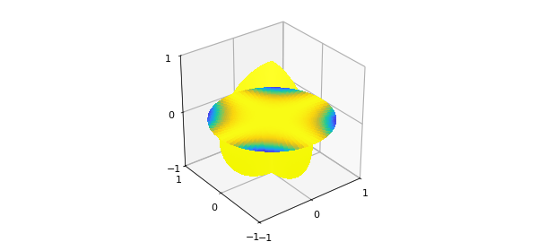

The same function can be supplied in spherical coordinates with `spherical=True`:

```python
g = Ballfun.from_function(
    lambda r, lam, th: jnp.cos(r**2 * jnp.cos(lam) * jnp.sin(lam)
                               * jnp.sin(th)**2),
    spherical=True)
(f - g).norm()   # 0
```

The size of the coefficient tensor is `f.size` — for this function
$(21, 41, 37)$ coefficients in $(r, \lambda, \theta)$, exactly MATLAB's
display. `plotcoeffs` shows the decay of the CFF coefficients:

```python
from chebfunjax.plotting import plotcoeffs_ballfun
plotcoeffs_ballfun(f)
```

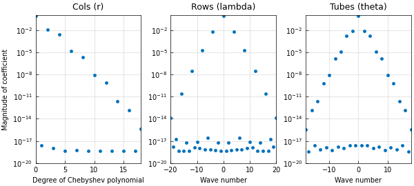

## 20.2 Visualizing ballfuns

`plot` renders the standard MATLAB ballfun view: the equatorial disk, an
inner $r=\tfrac12$ sphere, and two meridian half-planes:

```python
f = cheb.galleryball("moire")
f.plot()
```

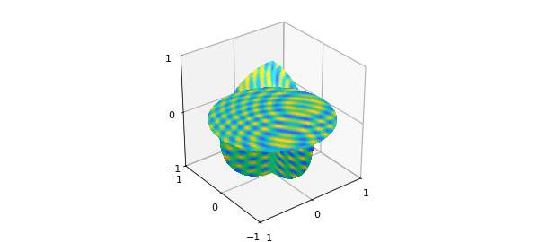

Slices are themselves objects from the other chebfunjax geometries. The
$z=0$ slice `f(:, :, 0)` is a **diskfun** (rank 41 in MATLAB's display):

```python
fdisk = f.diskfun(z=0.0)
fdisk.plot()
```

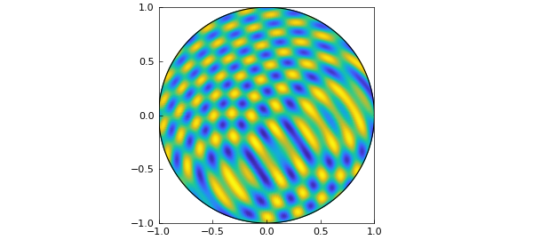

and the restriction to the unit sphere `f(1, :, :)` is a **spherefun**
(rank 87):

```python
fsphere = f.to_spherefun(1.0)
fsphere.plot()
```

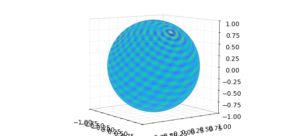

## 20.3 Basic operations

Ballfuns support the usual pointwise arithmetic:

```python
f = Ballfun.from_function(lambda x, y, z: jnp.sin(x**2 + z**2) + jnp.cos(y)**2)
g = Ballfun.from_function(lambda x, y, z: jnp.sin(x * z) + jnp.cos(z)**3)
# 2x2 panel: f, g, f + g, f .* g
```

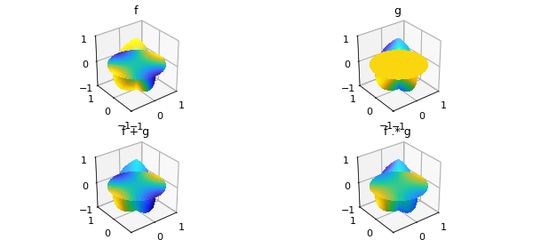

`sum3` integrates over the ball. For $f = x^2$, $\iiint_B x^2\,dV = 4\pi/15$
to machine precision:

```python
f = Ballfun.from_function(lambda x, y, z: x**2)
f.sum3()            # 0.837758040957278
f.sum3() - 4 * jnp.pi / 15   # 0
```

`sum(f, dim)` integrates over one variable. Integrating $x^2$ over $r$
gives a **spherefun** (rank 1):

```python
sumf = f.sum(1)
sumf.plot()
```

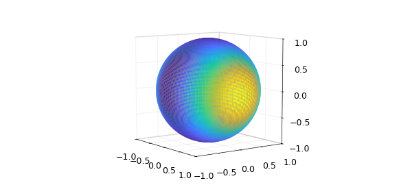

while integrating over $\lambda$ gives a **diskfun** on the meridional
half-plane:

```python
sumf = f.sum(2)
sumf.plot()
```

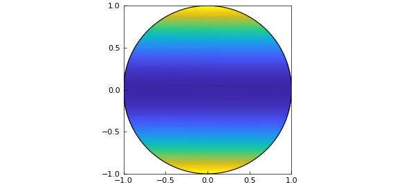

`sum2` integrates over two variables and returns a 1-D chebfun. For
$f = y$, integrating over $(r, \theta)$ leaves a trig chebfun in
$\lambda$:

```python
f = Ballfun.from_function(lambda x, y, z: y)
sum2f = f.sum2((1, 3))
sum2f.plot()
```

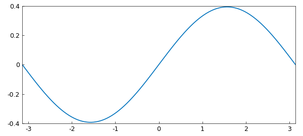

`rotate` applies a rigid rotation in the ZYZ Euler convention:

```python
f = Ballfun.from_function(lambda x, y, z: jnp.sin(50 * z) - x**2)
g = f.rotate(-jnp.pi / 4, jnp.pi / 2, jnp.pi / 8)
```

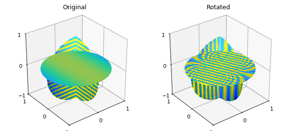

Cartesian derivatives are computed with `diff` — here
$\partial_x \cos(xy) = -y\sin(xy)$ to $3.2\times 10^{-14}$:

```python
f = Ballfun.from_function(lambda x, y, z: jnp.cos(x * y))
g = f.diff(1)
exact = Ballfun.from_function(lambda x, y, z: -y * jnp.sin(x * y))
(g - exact).norm()   # 3.2e-14
g.plot()
```

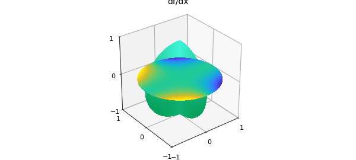

and `laplacian` gives $\nabla^2 f$:

```python
f = Ballfun.from_function(lambda x, y, z: jnp.cos(x * y) + jnp.sin(z))
f.laplacian().plot()
```

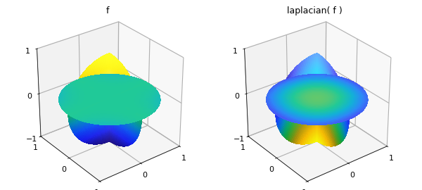

## 20.4 Helmholtz solver

`helmholtz` solves $\nabla^2 u + K^2 u = f$ with Dirichlet boundary
data. With $u_{\rm exact} = \cos(x^2)$ and $K = 2$ the solver reaches
$1.5\times 10^{-13}$:

```python
f = Ballfun.from_function(
    lambda x, y, z: -2 * (2 * x**2 * jnp.cos(x**2) + jnp.sin(x**2))
    + 4 * jnp.cos(x**2))
bc = lambda lam, th: jnp.cos(jnp.sin(th)**2 * jnp.cos(lam)**2)
u = Ballfun.helmholtz(f, 2.0, bc, 50, 50, 50)
u.plot()
```

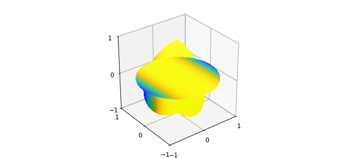

Neumann conditions are also supported ($u_{\rm exact} = \sin(y^2)$,
$K = 0$; the three Cartesian derivatives match to
$3.5\times 10^{-14}$):

```python
f = Ballfun.from_function(
    lambda x, y, z: 2 * jnp.cos(y**2) - 4 * y**2 * jnp.sin(y**2))
bc = lambda lam, th: (2 * (jnp.sin(th) * jnp.sin(lam))**2
                      * jnp.cos((jnp.sin(th) * jnp.sin(lam))**2))
u = Ballfun.helmholtz(f, 0.0, bc, 50, 50, 50, "neumann")
u.plot()
```

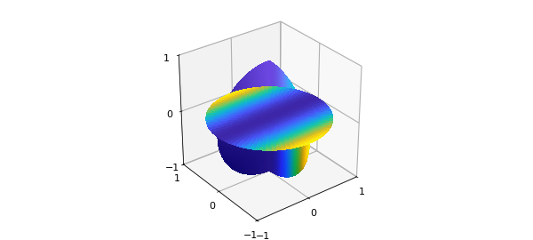

## 20.5 Solid harmonics

The solid harmonics $R_\ell^m = r^\ell Y_\ell^m$ are harmonic
polynomials — `Ballfun.solharm(4, -2)` satisfies
$\|\nabla^2 R_4^{-2}\| \approx 1.9\times 10^{-14}$ and the family is
orthonormal over the ball:

```python
R = Ballfun.solharm(4, -2)
R.plot()
```

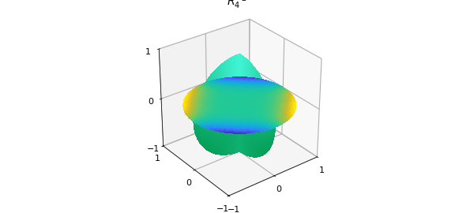

```python
R40 = Ballfun.solharm(4, 0)
(R * R.conj()).sum3()     # 1
(R40 * R40.conj()).sum3() # 1
(R * R40.conj()).sum3()   # ~1e-17
```

The first few solid harmonics, $\ell = 0{:}3$, $m = 0{:}\ell$:

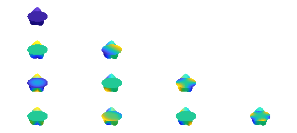

## 20.6 Vector calculus with Ballfunv

A `Ballfunv` is a vector field on the ball with three ballfun
components:

```python
Vx = Ballfun.from_function(lambda x, y, z: x * y)
Vy = Ballfun.from_function(lambda x, y, z: jnp.sin(x * z))
Vz = Ballfun.from_function(lambda x, y, z: jnp.sin(y))
V = Ballfunv(Vx, Vy, Vz)
V.quiver()
```

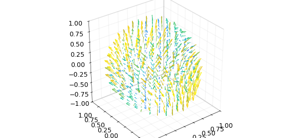

`curl` and `div` behave as expected:

```python
W = V.curl()
W.quiver()
f = V.div()
f.plot()
```

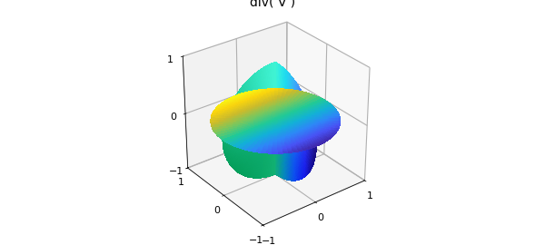

The classical identities hold to rounding:
$\|\nabla\times\nabla f\| \approx 1.5\times 10^{-12}$ and
$\nabla\cdot(\nabla\times V) \approx 10^{-8}$:

```python
f = Ballfun.from_function(lambda x, y, z: jnp.cos(x * z))
Ballfunv(*f.grad()).curl().norm()   # ~1.5e-12
V.curl().div().norm()               # ~1.1e-8
```

## 20.7 Poloidal-toroidal decomposition

Any divergence-free field can be written as
$w = \nabla\times\nabla\times(\mathbf r P) + \nabla\times(\mathbf r T)$.
`PT2ballfunv` builds such a field from its scalars:

```python
Pw = Ballfun.from_function(lambda x, y, z: jnp.cos(x * y))
Tw = Ballfun.from_function(lambda x, y, z: jnp.sin(y * z))
w = Ballfunv.PT2ballfunv(Pw, Tw)
w.quiver()
w.div().norm()   # ~4e-10
```

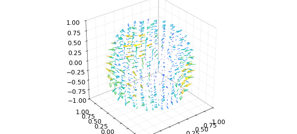

and `PTdecomposition` recovers the scalars:

```python
Pw2, Tw2 = w.PTdecomposition()
```

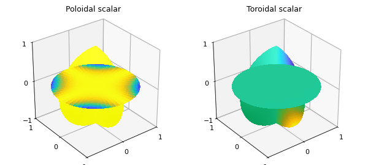

The poloidal and toroidal components themselves:

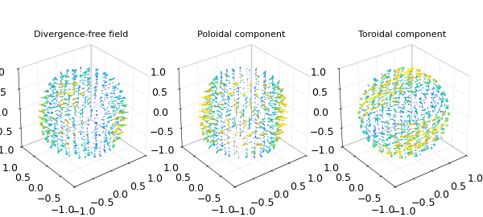

Reconstruction round-trips to $1.3\times 10^{-12}$:

```python
v = Ballfunv.PT2ballfunv(Pw2, Tw2)
(w - v).norm()   # ~1.3e-12
```

## 20.8 Helmholtz-Hodge decomposition

Every vector field on the ball splits as
$v = \nabla f + \nabla\times\psi + \nabla\varphi$ with $f$ vanishing on
the boundary, $\psi$ divergence-free, and $\varphi$ harmonic:

```python
v = Ballfunv.from_functions(
    lambda x, y, z: jnp.cos(x * y) * z,
    lambda x, y, z: jnp.sin(x * z),
    lambda x, y, z: y * z)
v.quiver()
```

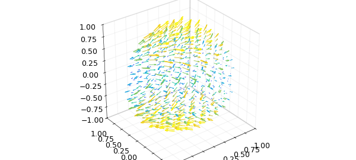

```python
f, Ppsi, Tpsi, phi = v.HelmholtzDecomposition(nargout=4)
```

The curl-free component $\nabla f$ (with
$\|\nabla\times\nabla f\| \approx 2\times 10^{-13}$):

```python
Ballfunv(*f.grad()).quiver()
```

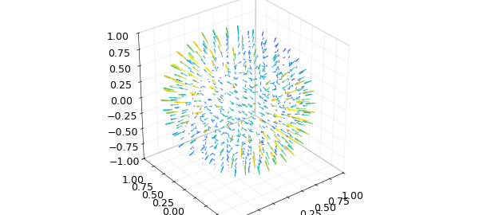

The harmonic component $\nabla\varphi$ (with
$\|\nabla^2 \nabla\varphi\| \approx 2\times 10^{-9}$):

```python
Ballfunv(*phi.grad()).quiver()
```

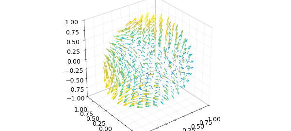

The divergence-free component $\nabla\times\psi$ (with
$\|\nabla\cdot\nabla\times\psi\| \approx 4\times 10^{-11}$):

```python
psi = Ballfunv.PT2ballfunv(Ppsi, Tpsi)
psi.curl().quiver()
```

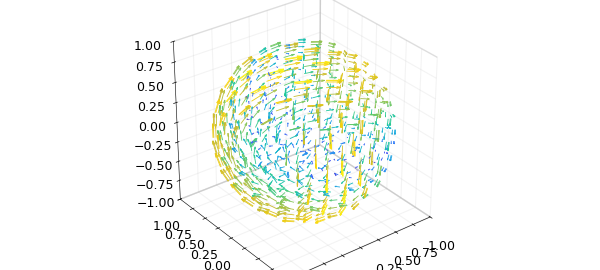

All four fields together — the decomposition reassembles the input to
$4.5\times 10^{-12}$:

```python
w = Ballfunv(*f.grad()) + psi.curl() + Ballfunv(*phi.grad())
(v - w).norm()   # ~4.5e-12
```

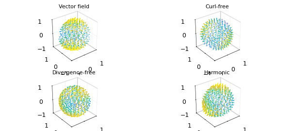

## References

- N. Boulle and A. Townsend, *Computing with functions in the ball*, SIAM J. Sci. Comput. 42 (2020), C169–C191.
- Chebfun Guide, [Chapter 20: Ballfun](https://www.chebfun.org/docs/guide/guide20.html).
